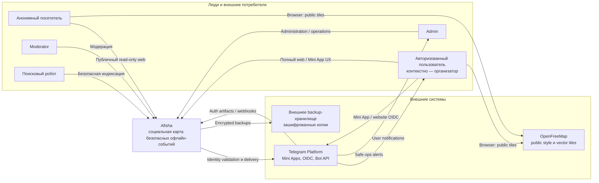
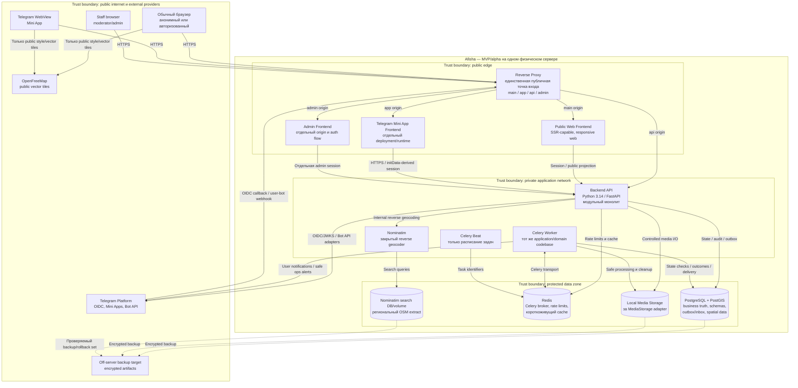

# G4.1 — C4 System Context и Container

## Статус и назначение

- Статус: `DRAFT — ожидает подтверждения владельца`
- Горизонт: MVP/alpha на одном физическом сервере
- Уровни C4: System Context и Container

Этот документ фиксирует внешние границы Afisha и логические containers первого
развёртывания. Диаграммы помогают читать архитектуру, но нормативными являются
также каталоги, связи и инварианты ниже.

Здесь я не определяю component-level устройство семи доменных модулей, ER-модель,
API-контракты, state machines, точные production domains, frontend framework,
полный security DFD или физические схемы роста на несколько серверов.

## Источники и приоритет

Я применяю источники в следующем порядке:

1. [PRODUCT_DECISIONS.md](../../PRODUCT_DECISIONS.md) — актуальные продуктовые
   правила `PD-001…PD-019`.
2. [DECISIONS.md](../../DECISIONS.md) — актуальные архитектурные решения.
3. [SOURCE_SPECIFICATION.md](../../SOURCE_SPECIFICATION.md) — только части,
   которые не заменены более новыми решениями.

[REQUIREMENTS_TRACEABILITY.md](../../REQUIREMENTS_TRACEABILITY.md) используется
для проверки покрытия, а
[CURRENT_SPECIFICATION_V1.md](../../CURRENT_SPECIFICATION_V1.md) — как читаемая
сводка, но не как самостоятельный источник новых правил.

Если два решения со статусом `ACCEPTED` противоречат друг другу, затронутая часть
G4 останавливается до отдельного решения владельца.

## C4 System Context

### Текстовая альтернатива

Afisha предоставляет анонимный публичный просмотр, полный пользовательский
интерфейс после Telegram-аутентификации и отдельную закрытую панель для
`moderator`/`admin`. Telegram является внешним identity и delivery provider, но
не доменной моделью. Браузер запрашивает у OpenFreeMap только публичную
картографическую подложку; event markers приходят из Afisha. Зашифрованные
резервные копии покидают первый сервер и хранятся отдельно от него.

### Каталог actors

| Actor | Доступ и ответственность | Ограничения | Источники |
|---|---|---|---|
| Анонимный посетитель | Карта, публичные активные/итоговые карточки и профиль организатора | Любое действие требует Telegram-аутентификации; закрытые координаты, участники и chat content недоступны | `PD-002`, `PD-015`, `PD-016`, `PD-017` |
| Авторизованный пользователь | Полный website/Mini App UX; интерес, участие, создание и управление собственными объектами | Identity и права определяет сервер; организатор является контекстом пользователя, а не глобальной ролью | `PD-013`, `PD-015`, `ADR-011`, `ADR-020` |
| `moderator` | Премодерация, жалобы, media/events review и временные меры в пределах permissions | Отдельная staff identity и admin session; нет неограниченного доступа по одному названию роли | `PD-008`, `ADR-011`, `ADR-020` |
| `admin` | Permissions, configuration, постоянные ограничения, апелляции, emergency escalation и audited override | Отдельная staff identity, повторная проверка опасных операций и privileged audit | `PD-013`, `ADR-011`, `ADR-015`, `ADR-020` |
| Поисковый робот | Индексирует безопасные публичные event/profile projections | Не получает закрытые поля, участников, chat content или точный итоговый адрес | `PD-015`, `PD-016`, `ADR-016` |

### Каталог внешних систем

| Система | Назначение | Передаваемые данные | Запрещённые данные/сценарии | Источники |
|---|---|---|---|---|
| Telegram Platform | Mini App runtime, website OIDC, webhook updates, пользовательские уведомления и operations alerts | Подписанные auth artifacts на adapter boundary, opaque IDs, безопасные notification DTO | Raw tokens в логах, Telegram-профиль как доменная identity, общие credentials двух ботов, административные команды через operations bot | `PD-010`, `PD-015`, `ADR-015`, `ADR-020` |
| OpenFreeMap | Публичные style и vector tiles, загружаемые браузером | Стандартные browser tile/style requests | Event payload, приватный контент, скрытые event coordinates, geocoding и routing | `ADR-019`, `PD-017` |
| Внешнее backup-хранилище | Зашифрованные off-server backups основной БД, media и необходимых внутренних volumes | Только зашифрованные backup artifacts по отдельному operational flow | Application traffic, открытые credentials и незашифрованные копии | `PD-014`, `ADR-018` |

## C4 Container — MVP/alpha

### Текстовая альтернатива

Все публичные запросы Afisha входят через reverse proxy. Public Web, Mini App и
Admin Frontend развёртываются отдельно и используют один Backend API. API,
Celery Worker и Celery Beat являются разными runtime-процессами одного
модульного монолита. PostgreSQL/PostGIS хранит бизнес-истину; Redis обслуживает
только Celery, rate limits и cache. Media находится в закрытом локальном
хранилище за adapter. Backend обращается к закрытому Nominatim, использующему
собственный поисковый набор данных. Браузеры получают OpenFreeMap tiles напрямую,
а защищённые данные резервируются за пределы первого сервера.

## Каталог containers и data stores

| Container / store | Ответственность | Runtime / технология | Сетевая доступность | Владение данными | Источники |
|---|---|---|---|---|---|
| Reverse Proxy | TLS termination, routing main/app/api/admin и единственная публичная точка входа | Конкретная технология определяется перед deployment | Public `80/443`; остальные containers напрямую не публикуются | Durable business data отсутствуют | `PD-015`, `ADR-018` |
| Public Web Frontend | SSR безопасных индексируемых страниц и полный responsive UX после OIDC | SSR-capable frontend; framework пока не выбран | Только через reverse proxy | Не владеет бизнес-истиной; допустим только безопасный presentation cache | `PD-015`, `PD-016`, `ADR-018`, `ADR-020` |
| Telegram Mini App Frontend | Полный пользовательский UX внутри Telegram WebView | Отдельный browser deployment; framework пока не выбран | Только через reverse proxy | Не владеет business/auth truth и не доверяет `initDataUnsafe` | `PD-015`, `ADR-018`, `ADR-020` |
| Admin Frontend | Закрытый UI для разрешённых use cases модулей | Отдельный browser deployment | Отдельный origin через reverse proxy | Не владеет бизнес-логикой; cookies/session namespace отделены | `ADR-011`, `ADR-018`, `ADR-020` |
| Backend API | Transport validation, server-side identity/authorization и вызов application use cases семи модулей | CPython 3.14, FastAPI, Pydantic 2, SQLAlchemy 2 | Публично только через API route reverse proxy; data services доступны по private network | Доменные модули владеют своими PostgreSQL schemas; API не создаёт общий слой бизнес-моделей | `PD-012`, `PD-013`, `ADR-010`, `ADR-011`, `ADR-020` |
| Celery Worker | Notifications, media processing, cleanup и background use cases после проверки актуального состояния | Celery 5.6; CPython 3.14, а 3.13 только как проверенный fallback worker runtime | Private network; не имеет public ingress | Не создаёт отдельной истины; фиксирует результаты через application use cases/PostgreSQL | `PD-012`, `ADR-010`, `ADR-015`, `ADR-017` |
| Celery Beat | Планирование тонких задач по ID без бизнес-правил | Celery Beat | Private network | Durable state не является business truth | `PD-012`, `ADR-015`, `ADR-018` |
| PostgreSQL/PostGIS | Бизнес-истина, отдельные module schemas/migrations, spatial data, outbox/inbox и audit facts | PostgreSQL + PostGIS | Только protected data zone | Каждый доменный модуль владеет своей schema; межмодульное чтение таблиц запрещено | `PD-012`, `PD-018`, `ADR-010`, `ADR-014`, `ADR-015` |
| Redis | Celery broker, rate limits и короткоживущий cache | Redis | Только private application/data network | Бизнес-факты, права, capacity, waitlist и reputation здесь не определяются | `PD-012`, `PD-013`, `ADR-015`, `ADR-018` |
| Local Media Storage | Закрытое хранение обработанных файлов за заменяемым adapter | Защищённая локальная директория | Не публикуется; доступ только через API/worker adapter | `media` владеет lifecycle файла; объектные модули хранят attachment IDs и роли | `PD-014`, `PD-016`, `ADR-011`, `ADR-018` |
| Nominatim | Reverse geocoding выбранной event marker | Nominatim 5.3.x в отдельном container с healthcheck/resource limits | Только backend по private network | Не владеет event coordinate или бизнес-состоянием | `PD-017`, `ADR-014`, `ADR-018`, `ADR-019` |
| Nominatim Search DB/Volume | Региональный OSM extract и поисковые индексы геокодера | Отдельная Nominatim database/volume | Только Nominatim container и controlled maintenance flow | Отделена от основной бизнес-БД; обновляется и откатывается по операционному регламенту | `ADR-018`, `ADR-019` |

## Логические связи и допустимые данные

| Инициатор → получатель | Назначение | Логический протокол | Допустимые данные | Запреты / контроль | Источники |
|---|---|---|---|---|---|
| Browser/WebView/Staff Browser → Reverse Proxy | Загрузка UI и API-запросы | HTTPS | Публичные запросы либо данные соответствующей server session | Прямого доступа к внутренним containers нет | `PD-013`, `PD-015`, `ADR-018`, `ADR-020` |
| Reverse Proxy → frontends/API | Routing по origin/path | Внутренний application transport | Только запрос назначенного origin/container | Admin cookies и user sessions не смешиваются | `PD-015`, `ADR-018`, `ADR-020` |
| Public Web → Backend API | SSR/public projections и authenticated website actions | HTTPS/session boundary | Публичные projections либо команды текущего server-side user | Закрытые поля не попадают в HTML/metadata | `PD-015`, `PD-016`, `PD-017`, `ADR-016` |
| Mini App → Backend API | Пользовательские действия после Telegram auth | HTTPS/initData-derived session | Команды текущего внутреннего `user_id` | `initDataUnsafe` и Telegram ID с клиента не являются identity | `PD-013`, `PD-015`, `ADR-020` |
| Admin Frontend → Backend API | Moderation/administration use cases | HTTPS/separate admin session | Только команды, разрешённые granular permission | CSRF, re-auth, rate limit и privileged audit | `ADR-011`, `ADR-020` |
| Browser/WebView → OpenFreeMap | Basemap rendering | HTTPS | Public style/vector tile request | Event payload, скрытые координаты и geocoding отсутствуют | `ADR-019` |
| Telegram Platform ↔ Backend API | Website OIDC/JWKS, Mini App identity context и user-bot webhook | Telegram OIDC/Bot API over HTTPS | Минимальные auth claims, подписанные artifacts и allowlisted update types | Raw tokens/initData не логируются; webhook secret и dedup обязательны | `PD-013`, `PD-015`, `ADR-020` |
| Celery Worker → Telegram Bot API | User notifications и operations alerts | Bot API over HTTPS | Notification DTO либо safe ops alert DTO | Раздельные tokens/secrets; ops bot не выполняет команды; PII/full payload запрещены | `PD-010`, `ADR-015`, `ADR-020` |
| Backend/Worker → PostgreSQL | Business transaction, state validation, outbox, audit и delivery outcome | PostgreSQL protocol | Типизированное состояние и versioned facts | Межмодульное чтение чужих tables/ORM запрещено | `PD-018`, `ADR-010`, `ADR-015`, `ADR-017` |
| Backend/Worker/Beat ↔ Redis | Rate limits, cache и Celery transport | Redis protocol | Короткоживущие keys и task identifiers | Redis не определяет business outcome и не хранит обязательный audit | `PD-012`, `PD-013`, `ADR-015` |
| Backend → Nominatim | Reverse geocoding event marker | Internal HTTP | Координата выбранной event marker и canonical response DTO | Браузер не вызывает Nominatim; raw provider payload имеет короткий retention | `PD-017`, `ADR-014`, `ADR-019` |
| Backend/Worker → MediaStorage | Upload, controlled read, safe processing и cleanup | Internal filesystem adapter | Ограниченный binary и безопасные metadata/attachment ID | Нет arbitrary URL fetch; оригинал/EXIF не публикуются | `PD-013`, `PD-014`, `PD-016`, `ADR-011`, `ADR-018` |
| Protected data volumes → backup target | Disaster recovery | Отдельный encrypted backup transport | Зашифрованные backup artifacts | Credentials вне Git; restore drill и expiry обязательны | `PD-014`, `ADR-018` |

Точные внутренние transport settings, service identities, certificates и
production endpoints будут определены в deployment/security частях G4.

## Trust boundaries

| Граница | Что находится внутри | Основной контроль |
|---|---|---|
| Public internet и external providers | Браузеры, Telegram Platform, OpenFreeMap и off-server backup target | Недоверенный ввод, HTTPS, signature/JWKS/webhook-secret validation, timeouts, bounded retry |
| Public edge | Reverse proxy и публичные frontend entrypoints | Наружу только `80/443`, routing allowlist, security headers, request limits |
| Private application network | Backend API, Worker, Beat и Nominatim | Отсутствие прямого public ingress, минимальные service permissions, timeout/retry policy |
| Protected data zone | PostgreSQL/PostGIS, Redis, media и Nominatim data | Закрытая сеть, отдельные DB/filesystem permissions, encrypted disk/backups, redacted logs |
| Staff authentication boundary | Admin origin, cookies и session namespace | Отдельные credentials, Argon2id, CSRF, 8-hour absolute/30-minute idle timeout, re-auth и privileged audit |

Это минимальный overlay. Полные data-flow diagrams, STRIDE-проверка и каталог
security controls оформляются отдельным пунктом G4.

## Архитектурные инварианты

1. API, Worker и Beat являются процессами одного модульного монолита, а не
   независимыми микросервисами.
2. `admin` является закрытым adapter и не становится восьмым доменным модулем.
3. Все бизнес-сущности ссылаются на внутренний immutable `user_id`, а не на
   Telegram ID.
4. Пользовательский и operations bots имеют отдельные credentials, webhook
   secrets, adapter namespaces и разрешённые сценарии.
5. Скрытые event coordinates выдаются только разрешённой projection и не
   покидают backend/protected data boundaries через карты, логи или аналитику.
6. Nominatim недоступен браузеру и не является источником координаты события:
   источником истины остаётся выбранная event marker в PostgreSQL/PostGIS.
7. OpenFreeMap получает только обычные browser requests к публичным style/tiles
   и не получает event payload.
8. PostgreSQL/PostGIS остаётся единственным источником бизнес-истины. Redis,
   Celery и внешние providers не определяют participation, capacity, права или
   reputation.
9. Успешная PostgreSQL-транзакция и outbox fact не откатываются из-за временной
   недоступности Redis, Celery или Telegram.
10. Публичное скрытие/блокировка по safety-причине применяется fail-closed и не
    ожидает обычного eventual обновления discovery projection.
11. Точные production domains и frontend framework намеренно не выбираются на
    уровне этого документа.

## Исключено из MVP/alpha Container

Следующие элементы не являются containers этой диаграммы:

- Kafka;
- Kubernetes;
- WebSocket или отдельный chat service;
- AI/embedding service;
- achievements/challenges service;
- собственный vector tile server;
- Photon, Pelias и внешний geocoding provider;
- S3/object storage;
- map clustering;
- несколько API instances;
- физическое разделение на два или три сервера.

Kafka, собственные vector tiles, достижения, челленджи, AI и map clustering
возвращаются только по уже принятым post-MVP triggers. Физические схемы роста
будут показаны в отдельных deployment diagrams G4.

## Traceability

| Архитектурная область | Основные действующие решения |
|---|---|
| Анонимный и авторизованный web, Mini App, origins | `PD-015`, `ADR-018`, `ADR-020` |
| Публичный профиль и безопасная индексация | `PD-002`, `PD-016`, `ADR-016` |
| Семь модулей и admin adapter | `ADR-010`, `ADR-011` |
| PostgreSQL/PostGIS и географическая истина | `PD-012`, `ADR-014` |
| Celery, Redis, outbox и delivery | `PD-010`, `PD-012`, `ADR-015`, `ADR-017` |
| Media ownership и локальное хранение | `PD-014`, `PD-016`, `ADR-011`, `ADR-018` |
| Exact-location projections | `PD-002`, `PD-017`, `ADR-014`, `ADR-016` |
| OpenFreeMap и Nominatim | `ADR-018`, `ADR-019` |
| Telegram identity, sessions и два бота | `PD-013`, `PD-015`, `ADR-015`, `ADR-020` |
| Admin authentication boundary | `ADR-011`, `ADR-020` |
| Один сервер, закрытые data services и backups | `PD-014`, `ADR-018` |
| Deferred scope | `PD-011`, `PD-012`, `ADR-017`, `ADR-018`, `ADR-019` |

## Acceptance checklist

- [x] Обе Mermaid-диаграммы проходят синтаксическую и визуальную проверку.
- [x] У каждой диаграммы есть достаточная текстовая альтернатива.
- [x] Public Web и Mini App показаны разными deployment containers.
- [x] Public Web явно отвечает за SSR безопасных индексируемых projections.
- [x] Весь публичный ingress Afisha проходит через reverse proxy.
- [x] Nominatim доступен только Backend API и использует отдельный search store.
- [x] OpenFreeMap вызывается браузером и не получает event payload.
- [x] Admin origin/session/authentication отделены от пользовательских.
- [x] PostgreSQL/PostGIS показан единственным источником бизнес-истины.
- [x] User bot и operations bot разделены при общем API/Worker codebase.
- [x] Post-MVP элементы не показаны активными MVP containers.
- [x] Все основные узлы и связи имеют traceability к действующим PD/ADR.
- [x] Документ не содержит secrets, PII, production domains, закрытых
      reputation weights или anti-fraud rules.
- [x] `IMPLEMENTATION_PLAN.md` и `CHANGELOG_ARCHITECTURE.md` не изменены до
      отдельного подтверждения владельца.
