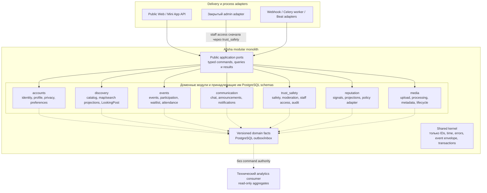
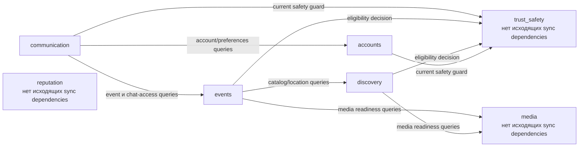

# G4.2 — Модульные границы, публичные порты и dependency rules

## Статус, цель и границы

- Статус: `ACCEPTED`
- Горизонт: MVP/alpha, модульный монолит
- Уровень: логические component boundaries внутри Backend API, Worker и Beat

Документ определяет владельцев бизнес-состояния, публичные application ports,
разрешённые синхронные зависимости и направления асинхронных facts. Диаграммы
являются навигацией; нормативными остаются таблицы и правила ниже.

Здесь не определяются ER-модель, состояния агрегатов, HTTP API, permission
catalogue, точные payload domain facts, retry/replay policy, retention,
compaction или production-код. Эти решения остаются отдельными пунктами G4.

## Источники и приоритет

Источники применяются в порядке:

1. [PRODUCT_DECISIONS.md](../../PRODUCT_DECISIONS.md) — `PD-001…PD-019`;
2. [DECISIONS.md](../../DECISIONS.md) — принятые ADR;
3. [SOURCE_SPECIFICATION.md](../../SOURCE_SPECIFICATION.md) — только
   незаменённые части исходной спецификации.

[REQUIREMENTS_TRACEABILITY.md](../../REQUIREMENTS_TRACEABILITY.md) используется
для проверки покрытия, а
[CURRENT_SPECIFICATION_V1.md](../../CURRENT_SPECIFICATION_V1.md) — как читаемая
сводка. При новом конфликте двух `ACCEPTED` решений затронутая часть G4
останавливается до решения владельца.

## Нормативная терминология

| Термин | Значение |
|---|---|
| Owner | Единственный модуль, который определяет правила и изменяет указанный бизнес-факт |
| Entry port | Публичный application-контракт, через который adapter или другой модуль запускает use case/query |
| Query port | Синхронный read-only контракт без изменения бизнес-состояния |
| Command port | Контракт, запускающий use case владельца и его транзакцию |
| Outbound port | Контракт доменного/application-кода к техническому provider adapter |
| Domain fact | Версионируемое сообщение о уже совершившемся факте, записанное вместе с owner-state |
| Projection | Производная read model, которую можно восстановить из авторитетного состояния/facts |
| Leading use case | Единственный владелец межмодульного действия и его начальной транзакции |

Слово `public` означает доступность для разрешённых adapters или модулей внутри
одного backend codebase. Оно не означает публичный HTTP endpoint.

## Карта владения модулями

Исходник:
[02-module-ownership.mmd](diagrams/02-module-ownership.mmd).

### Текстовая альтернатива

Public API, admin и background adapters входят в один backend, но обращаются
только к публичным портам семи модулей. Каждый модуль владеет отдельной
PostgreSQL schema. Shared kernel предоставляет только технические типы. Модули
публикуют facts через PostgreSQL outbox; идемпотентные handlers и технический
analytics consumer читают их после commit. Analytics не имеет command authority.

## Каталог модулей и данных

| Модуль | Авторитетное состояние | Не владеет |
|---|---|---|
| `accounts` | Telegram/OIDC identity binding, внутренний `user_id`, публичный Profile, privacy, preferences, выбранный город, user-session domain state | bans, reputation policy, события, staff identity |
| `discovery` | города/полигоны, улицы, категории, map/search read models, LookingPost и связь conversion | Event aggregate, точные owner-правила участия, media bytes |
| `events` | Event, location visibility, revisions, interest, participation, capacity, waitlist, attendance и final event outcome | safety restrictions, chat content, reputation score |
| `communication` | chat messages, announcements, notification center, delivery/reminder state | event access policy, Telegram identity binding, bans |
| `trust_safety` | bans/restrictions, moderation cases, complaints/appeals, eligibility decision, staff identity/session/permissions, privileged audit | reputation calculation, event aggregate, media lifecycle |
| `reputation` | signal ledger, materialized projections, public level/status, private policy result | bans, permissions, participation truth |
| `media` | attachment metadata, upload/processing state, controlled storage lifecycle | связь файла с бизнес-объектом и решение safety moderation |

`events` или `accounts` хранят только `attachment_id`, роль и порядок файла.
Техническая готовность принадлежит `media`; решение о разрешённости содержимого
принадлежит `trust_safety`.

## Единый минимальный каркас

| Область | Содержимое | Правило зависимости |
|---|---|---|
| `public` | Immutable command/query/result/error DTO, capability protocols, domain-fact schemas | Единственная часть модуля, которую могут импортировать adapters и разрешённые caller-модули |
| `application` | Use cases, authorization orchestration, transaction boundary, outbox recording | Зависит от собственного `domain`, собственных и разрешённых чужих `public` contracts |
| `domain` | Aggregates, value objects, domain services/policies | Не зависит от HTTP, Celery, ORM, Telegram или чужих модулей |
| `infrastructure` | Repository implementations, migrations, outbox/inbox, provider adapters | Реализует собственные application/domain ports; не экспортирует ORM наружу |
| `adapters` | HTTP/webhook/Celery/admin mapping в public DTO | Не содержит бизнес-правил и не обращается к repository в обход application port |

Синхронные внутренние ports изменяются атомарно с одним codebase. Runtime
versioning требуется для domain facts, которые могут пережить deployment и
обрабатываться повторно.

## Публичные application ports

### Общий контракт

Все строки ниже описывают capability-port, а не один метод. Реальная сигнатура
разделяется на небольшие typed commands/queries внутри capability.

Обязательные поля boundary-команды: actor/staff context, request/correlation ID,
ожидаемая aggregate version при конкурентном изменении и idempotency key для
повторяемого внешнего запроса. DTO используют только внутренние IDs и безопасные
канонические значения, а не ORM/provider payload.

Базовые typed errors: `validation_failed`, `not_found`, `forbidden`,
`conflict`, `stale_version`, `policy_denied`, `policy_hold` и
`dependency_unavailable`. Они не являются HTTP status codes; HTTP mapping
определяется в последующем API-контракте.

### `accounts`

| Capability port | Callers | Вход → результат | Consistency / idempotency | Authorization и side effects |
|---|---|---|---|---|
| `IdentityCommands` | Public/Mini App auth adapters, Telegram webhook adapter | Проверенный canonical auth context → internal `user_id` и session subject | Owner transaction; auth replay/dedup key обязателен | Adapter проверяет Telegram artifact; port связывает identity, пишет audit-safe fact |
| `ProfileCommands` | Public API, разрешённый admin adapter | `user_id`, profile patch, expected version → безопасный Profile DTO | Owner transaction; optimistic concurrency; idempotent retry | Пользователь меняет себя; staff permission проверяется через `trust_safety`; публикуется profile fact |
| `PrivacyPreferenceCommands` | Public API | `user_id`, privacy/preferences patch → current preferences | Owner transaction; optimistic concurrency | Только владелец; публикуются минимальные preference facts без private payload |
| `AccountLifecycleCommands` | Public API, admin adapter, cleanup worker | `user_id`, lifecycle request/reason → accepted/current lifecycle | Owner transaction; повтор команды безопасен | Проверяет actor/staff authority; retention/legal-hold guards определяются позднее; lifecycle facts запускают реакции после commit |
| `AccountQueries` | Public API, `communication`, admin adapter | `user_id`/actor context → account state, safe delivery/preferences DTO | Current owner-state read; read-only | Возвращает caller-specific минимум; Telegram identifiers не выходят в бизнес-модули |
| `PublicProfileQueries` | Public API, discovery/admin adapters | `user_id` → безопасная owner projection | Projection read; может быть stale для обычных summaries | Safety-hidden profile закрывается fail-closed, private fields отсутствуют |

### `discovery`

| Capability port | Callers | Вход → результат | Consistency / idempotency | Authorization и side effects |
|---|---|---|---|---|
| `CatalogCommands` | Admin adapter | city/category/street change + staff context → current catalog version | Owner transaction; optimistic version/idempotency | Permission через `trust_safety`; пишет catalog facts |
| `CatalogQueries` | Public API, `events`, admin adapter | city/category/street IDs или filters → canonical catalog DTO | Current owner-state read | Public получает только active catalog; internal caller получает validation result |
| `LocationResolutionQueries` | Public API, `events` | city ID + point → canonical location/address result | Read plus replaceable provider call; no business mutation | Nominatim вызывается только backend; provider failure typed; private event payload не передаётся |
| `DiscoveryQueries` | Public API/crawler/admin adapters | map bounds/search/filter/visibility context → safe markers/cards | Owner projection read | Current safety tombstone проверяется fail-closed; точность координат зависит от authorization context |
| `LookingPostCommands` | Public API | actor, post/change/conversion command → current LookingPost/conversion state | Owner transaction; conversion reservation уникальна и идемпотентна | Current safety eligibility; conversion публикует fact, но не создаёт Event в той же транзакции |
| `LookingPostQueries` | Public API/admin adapters | actor/filter/post ID → safe LookingPost DTO | Current state/projection read | Privacy и safety filtering обязательны |
| `DiscoveryProjectionCommands` | Inbox/repair worker adapters | source fact ID/version или rebuild range → projection checkpoint | Idempotent inbox/repair transaction | Не принимает пользовательские решения; safety hide/tombstone имеет приоритет |

`ReverseGeocodingProvider` является outbound port `discovery`: принимает точку и
locale, возвращает canonical address/precision или typed provider error.
Provider-specific DTO не покидает infrastructure.

### `events`

| Capability port | Callers | Вход → результат | Consistency / idempotency | Authorization и side effects |
|---|---|---|---|---|
| `EventLifecycleCommands` | Public API, admin adapter, LookingPost fact handler | actor, create/edit/publish/cancel command, expected version → Event DTO | Owner transaction; optimistic concurrency; retry key для create/publish | Publication синхронно проверяет catalog/location, media readiness и safety eligibility; пишет event fact |
| `ParticipationCommands` | Public API/admin adapter | actor, event ID, interest/join/leave/exclude command → participation/capacity result | Serializable owner rules; один active episode; idempotent command | Current event/safety guards; capacity и FIFO определяет только `events`; пишет outcome fact |
| `WaitlistCommands` | Public API, expiry worker adapter | actor/event/offer command → queue/offer result | Owner transaction; uniqueness/FIFO; stale offer отклоняется | Права определяет Event; notification создаётся после commit через fact |
| `AttendanceCommands` | Public API, worker/admin adapters | event/user episode, code/dispute/decision → attendance result | Owner transaction; dedup; expected state/version | Actor/organizer/moderator authority; final outcome публикуется один раз |
| `EventQueries` | Public API, `communication`, admin adapter | event ID/filter + visibility context → caller-safe Event DTO | Current owner-state read | Точные location fields выдаются только при разрешённой visibility |
| `ChatAccessQueries` | `communication` | actor + event/thread action → current allow/deny with reason/version | Current authoritative read; no cache as authority | Проверяет актуальные participation/event conditions; failure означает deny |
| `EventProjectionCommands` | Inbox/repair/cleanup worker adapters | source fact/checkpoint/owner IDs → repaired/finalized projection status | Idempotent owner transaction | Не обходит lifecycle guards; пишет только принадлежащее `events` состояние |

### `communication`

| Capability port | Callers | Вход → результат | Consistency / idempotency | Authorization и side effects |
|---|---|---|---|---|
| `ChatCommands` | Public API, cleanup worker | actor, event/thread/message command → message/current thread result | Owner transaction; client message dedup key; deletion retry-safe | Каждый read/write синхронно проверяет `events.ChatAccessQueries` и current safety guard |
| `ChatQueries` | Public API/admin adapter | actor + event/thread cursor → safe messages/page | Current communication read plus current access check | При недоступности access/safety dependency выдача закрывается |
| `AnnouncementCommands` | Public API/admin adapter | organizer/staff, event, text/action → announcement result | Owner transaction; idempotent publish | Event authority и safety guard проверяются синхронно; delivery facts после commit |
| `NotificationCenterCommands` | Owner fact handlers, Public API | source fact/user IDs или read/ack command → notification status | Inbox dedup для create; owner transaction для ack | Payload минимизируется; недоставка Telegram не удаляет внутреннее уведомление |
| `NotificationQueries` | Public API/admin adapter | user/staff context + cursor → safe notification/dead-letter view | Current owner read | Пользователь видит только свои записи; staff требует permission |
| `DeliveryCommands` | Worker/webhook adapters | notification ID/current version или provider receipt → delivery status | Повторяемая delivery state machine; provider dedup | User-bot и operations-bot credentials/scenarios разделены; stale delivery не отправляется |
| `ReminderCommands` | Beat/worker adapters | owner IDs + scheduled version → planned/skipped status | Повторная проверка PostgreSQL; idempotent schedule key | Beat не содержит правил; worker вызывает application port по ID |

### `trust_safety`

| Capability port | Callers | Вход → результат | Consistency / idempotency | Authorization и side effects |
|---|---|---|---|---|
| `EligibilityQueries` | `accounts`, `discovery`, `events`, adapters | actor/subject/action/resource context → `allow`, `deny` или `hold` + safe reason/version | Current authoritative restriction state + local reputation projection | Единственный итоговый safety gate; dependency failure для sensitive command трактуется fail-closed |
| `RestrictionCommands` | Admin adapter, automated owner fact handlers | staff/system context, subject, normalized measure/reason → restriction result | Owner transaction; expected version/idempotency | Granular permission; пишет enforcement fact и privileged audit |
| `ModerationCommands` | Admin adapter, fallback/expiry workers | case/resource/revision decision → moderation result | Owner transaction; один current decision; retry-safe | Permission и re-auth для опасных действий; owner modules реагируют после commit |
| `ComplaintAppealCommands` | Public/admin adapters | actor/staff, subject, evidence references, decision → case status | Owner transaction; dedup/expected state | PII/private content не копируется в facts; final decision audited |
| `SafetyQueries` | Public/admin adapters | caller context + subject/case → safe visibility/current measure | Current authoritative read | Public reason нормализован; internal details требуют permission |
| `StaffAccessCommands` | Admin auth adapter | invite/login/session/re-auth/permission command → staff/session result | Owner transaction; replay-resistant tokens; optimistic permission version | Password/Argon2id flow отделён от user identity; privileged changes audited |
| `StaffAccessQueries` | Admin adapter | staff session + required permissions → current authorization result | Current authoritative read; cache не является authority | Любое admin действие сначала проверяет session и granular permission |
| `PrivilegedAuditCommands` | Admin adapter и privileged use cases | actor/action/target/outcome/correlation → audit receipt | Append-only owner transaction; dedup by action ID | Не принимает бизнес-решение; фиксирует разрешённый безопасный минимум |

### `reputation`

| Capability port | Callers | Вход → результат | Consistency / idempotency | Authorization и side effects |
|---|---|---|---|---|
| `ReputationProjectionCommands` | Inbox/reconciliation worker adapters | finalized source fact ID/version → projection checkpoint | Owner transaction; inbox dedup; compensating correction | Принимает только утверждённые факты владельцев; не блокирует субъект |
| `PublicReputationQueries` | Public API/accounts projection adapter | `user_id` → safe public status/level/confidence | Materialized projection read | Не возвращает weights, thresholds, raw signals или anti-fraud details |
| `PrivateReputationQueries` | Public/admin adapters | subject + authorized viewer → permitted explanation/summary | Materialized projection read | Self/staff scope проверяется; закрытая policy не раскрывается |
| `ReputationReconciliationCommands` | Worker/admin adapter | subject/range/policy version → reconciliation outcome | Idempotent rebuild with calculation version | Исправления компенсируют ledger; не изменяют foreign owner-state |

`ReputationPolicy` является outbound policy port: получает минимальный
типизированный component vector и возвращает projection result с policy version.
Публичный репозиторий содержит только безопасный demo adapter; production
weights/thresholds находятся вне Git.

### `media`

| Capability port | Callers | Вход → результат | Consistency / idempotency | Authorization и side effects |
|---|---|---|---|---|
| `MediaUploadCommands` | Public/admin adapters | actor, purpose, declared metadata → upload/attachment ID | Owner transaction; upload token/idempotency key | Authorization context ограничивает purpose/size/type; bytes не входят в DTO |
| `MediaProcessingCommands` | Worker adapter | attachment ID/source version → technical processing result | Idempotent processing version; owner transaction | Выполняет validation/transform/metadata; публикует readiness fact |
| `MediaReadinessQueries` | `discovery`, `events`, Public/admin adapters | attachment IDs + required variant → technical ready/not-ready/rejected | Current authoritative media-state read | Не заменяет safety moderation; controlled URL/stream выдаётся отдельно |
| `MediaAccessQueries` | Public/admin delivery adapters | actor/resource/attachment context → controlled read descriptor | Current state plus caller authorization context | Storage path не раскрывается; local directory не раздаётся напрямую |
| `MediaLifecycleCommands` | Owner fact handlers, cleanup/admin adapters | attachment ID + retain/delete reason/version → lifecycle result | Owner transaction; retry-safe deletion intent | Legal/dispute hold учитывается последующим retention design; пишет lifecycle fact |

`MediaStorage` является outbound port: controlled read/write/delete по
`attachment_id`, без публичных filesystem paths. Local Media Storage — первый
adapter; S3/object storage не вводится этим документом.

## Строгий DAG синхронных зависимостей

Исходник:
[02-sync-dependency-dag.mmd](diagrams/02-sync-dependency-dag.mmd).

### Текстовая альтернатива

`communication` может синхронно читать `accounts`, `events` и `trust_safety`.
`events` может читать `discovery`, `media` и `trust_safety`. `discovery` может
читать `media` и `trust_safety`. `accounts` может читать `trust_safety`.
`reputation`, `media` и `trust_safety` не имеют исходящих синхронных доменных
зависимостей. Других рёбер нет.

### Нормативная матрица

| Caller \ Callee | accounts | discovery | events | communication | trust_safety | reputation | media |
|---|---:|---:|---:|---:|---:|---:|---:|
| `accounts` | — | запрещено | запрещено | запрещено | query | запрещено | запрещено |
| `discovery` | запрещено | — | запрещено | запрещено | query | запрещено | query |
| `events` | запрещено | query | — | запрещено | query | запрещено | query |
| `communication` | query | запрещено | query | — | query | запрещено | запрещено |
| `trust_safety` | запрещено | запрещено | запрещено | запрещено | — | запрещено | запрещено |
| `reputation` | запрещено | запрещено | запрещено | запрещено | запрещено | — | запрещено |
| `media` | запрещено | запрещено | запрещено | запрещено | запрещено | запрещено | — |

Матрица относится к runtime-вызовам и импортам public contracts. API/admin
adapters могут выполнить несколько независимых query-вызовов для композиции
ответа, но не создают общую транзакцию и не объединяют доменные policy decisions.

## Семейства асинхронных domain facts

Точные имена, payload, ordering, retries и compatibility будут определены в
domain-event catalogue. Здесь нормативны producer, допустимые consumers и цель.

| Семейство | Producer | Consumers | Назначение |
|---|---|---|---|
| Identity/profile/lifecycle | `accounts` | `communication`, `trust_safety`, `accounts` public projection, analytics | Минимальные изменения доступности, безопасного профиля и lifecycle без Telegram identifiers |
| Catalog/LookingPost/conversion | `discovery` | `events`, `communication`, analytics | Идемпотентно создать draft Event после reservation conversion и вернуть связь созданного Event |
| Event lifecycle/revisions | `events` | `discovery`, `communication`, `trust_safety`, `accounts`, analytics | Обновить безопасную выдачу, уведомления, moderation context и profile summaries |
| Participation/waitlist/attendance | `events` | `communication`, `reputation`, analytics | Уведомления и только finalized reputation signals/outcomes |
| Chat/notification delivery | `communication` | `trust_safety`, analytics | Moderation evidence references, safe delivery outcomes и quality aggregates |
| Restriction/moderation/safety | `trust_safety` | `accounts`, `discovery`, `events`, `communication`, `reputation`, analytics | Немедленное enforcement/safety tombstone и последующая owner reconciliation |
| Reputation projection | `reputation` | `accounts`, `trust_safety`, analytics | Безопасный публичный summary и локальная safety-policy projection |
| Media readiness/lifecycle | `media` | `accounts`, `discovery`, `events`, `trust_safety`, analytics | Техническая готовность, отказ обработки и согласованное удаление attachment |

Каждый fact имеет как минимум `fact_id`, schema version, occurred time,
producer, aggregate ID/version, correlation/causation IDs и безопасный payload.
Consumer фиксирует inbox/dedup до применения реакции. Несовместимый факт не
угадывается и не пропускается молча: он переводится в наблюдаемую ошибку
обработки согласно будущему outbox/inbox design.

## Транзакции, projections и технические consumers

1. Leading use case изменяет только owner-state и outbox в одной PostgreSQL
   транзакции.
2. Он может до записи синхронно получить обязательные query-decisions по
   разрешённым рёбрам DAG, но не изменяет foreign state.
3. После commit другие модули применяют fact в собственных транзакциях и
   обязаны поддерживать deduplication.
4. Обычная задержка projection допустима; safety hide/removal записывает
   fail-closed tombstone или синхронный enforcement guard до публичной выдачи.
5. Публичные map/cards читаются только из `discovery` projection. Публичный
   Profile читается из `accounts` projection, получающей безопасные event и
   reputation summaries через facts.
6. API/admin adapters могут компоновать typed query DTO. Cross-schema SQL JOIN,
   foreign ORM и общий «универсальный repository» запрещены.
7. Analytics consumer строит first-party aggregates из versioned facts. Он не
   является восьмым доменным модулем, не имеет command ports и не участвует в
   authorization или policy decisions.
8. Redis, Celery transport и cache не определяют права, capacity, participation,
   safety или reputation. Актуальное состояние повторно читается из PostgreSQL.

## Shared kernel

Разрешены:

- nominal typed IDs без доменного поведения;
- clock/time abstractions;
- базовая иерархия безопасных ошибок;
- event envelope и correlation/causation metadata;
- transaction/unit-of-work abstractions.

Запрещены:

- Profile, Event, Participation, ModerationCase и другие доменные модели;
- общие enums, скрывающие владельца policy;
- permission, reputation, capacity или visibility rules;
- ORM base с межмодульными relationships;
- provider DTO, HTTP schemas и Celery tasks.

## Архитектурные инварианты и запрещённые зависимости

| ID | Нормативное правило |
|---|---|
| `MOD-01` | Существует ровно семь MVP domain modules; `admin` и analytics не становятся доменными модулями |
| `MOD-02` | Импортируется только `public` другого модуля и только по разрешённому ребру DAG |
| `MOD-03` | Domain-код не зависит от adapters, infrastructure, ORM, Celery, HTTP или provider SDK |
| `MOD-04` | Модуль не читает чужую schema/ORM и не создаёт cross-schema JOIN |
| `MOD-05` | Межмодульная команда имеет одного leading owner и не открывает распределённую транзакцию |
| `MOD-06` | Reverse reactions выполняются через versioned facts и идемпотентный inbox |
| `MOD-07` | `trust_safety` единолично выдаёт итоговый safety `allow/deny/hold`; `reputation` не блокирует |
| `MOD-08` | Chat read/write всегда использует текущий `events` access decision; eventual revoke window запрещено |
| `MOD-09` | Safety hide работает fail-closed даже при stale обычной projection |
| `MOD-10` | Media technical readiness не считается moderation approval |
| `MOD-11` | Telegram ID не является primary identity и не передаётся доменным владельцам вместо `user_id` |
| `MOD-12` | Beat только передаёт IDs/versions; бизнес-правила повторно исполняются application port |
| `MOD-13` | Временная недоступность Redis/Celery/Telegram не откатывает committed owner transaction |
| `MOD-14` | Скрытые weights, thresholds, anti-fraud rules, PII и secrets не входят в contracts или публичный Git |

Будущие architecture tests должны проверять import DAG, отсутствие импорта
чужих `domain/application/infrastructure`, отсутствие foreign ORM/table access,
минимальный shared kernel и отсутствие циклов.

## Сквозные сценарии и failure semantics

### Публикация события

1. API вызывает `events.EventLifecycleCommands`.
2. `events` синхронно получает canonical catalog/location decision у
   `discovery`, technical readiness у `media` и итоговый `allow/deny/hold` у
   `trust_safety`.
3. Любой deny/hold либо недоступный обязательный safety dependency не допускает
   публикацию; owner-state не изменяется частично.
4. При успехе `events` атомарно сохраняет Event/revision и outbox fact.
5. `discovery`, `communication`, `accounts` и analytics реагируют после commit.

### Fail-closed safety hide

`trust_safety` фиксирует ограничение и enforcement fact в своей транзакции.
Публичный adapter/discovery проверяет current safety tombstone/guard до выдачи.
Обычная projection затем идемпотентно reconciles состояние. Недоступность
projection consumer не делает скрытый объект публичным.

### LookingPost → draft Event

`discovery` атомарно резервирует единственную conversion и публикует fact.
`events` по `fact_id` идемпотентно создаёт draft и публикует результат.
`discovery` сохраняет `event_id`; лайки/полезные действия переносятся отдельными
facts. Повторная доставка не создаёт второй Event.

### Chat access

Для каждого чтения и записи `communication` получает current decision через
`events.ChatAccessQueries` и safety guard `trust_safety`. Cache может ускорять
только положительный hint, но не является authority. Timeout/error закрывает
доступ, поэтому после revoke отсутствует eventual access window.

### Media readiness и moderation

`media` сообщает только техническую готовность/отказ. `trust_safety` принимает
moderation decision. `events`/`discovery` публикуют объект только при одновременно
достаточной technical readiness и safety eligibility; ни один результат не
подменяет другой.

### Публичный профиль

`accounts` хранит owner projection. Event/reputation summaries поступают
versioned facts и могут быть обычно stale. Safety restriction применяется
fail-closed. `discovery` ссылается на `user_id`, но не строит собственную копию
Profile и не читает accounts tables.

### Admin action

Admin adapter сначала проверяет отдельную staff session и granular permission
через `trust_safety` и получает типизированный `StaffAuthorizationContext` с
decision ID. Затем он вызывает command port владельца, а owner port проверяет
наличие требуемого permission в этом доверенном внутреннем контексте. Бизнес-
решение остаётся у owner module; его outbox fact связывает outcome с decision ID,
а `trust_safety` идемпотентно завершает privileged audit. Adapter не выполняет
SQL и не копирует правила. Точные permission names и срок контекста определяются
в следующем пункте G4.

### Недоступность Redis/Celery/Telegram

Owner transaction и outbox остаются committed. Worker позже повторно читает
актуальное PostgreSQL-состояние по ID/version, отбрасывает stale effect и
применяет ограниченную retry/dead-letter policy. Ошибка внешней доставки не
возвращает бизнес-агрегат в прежнее состояние.

## Явно вне G4.2

- ER/data model и cross-module reference constraints;
- state machines и переходы;
- полный permission catalogue `moderator`/`admin`;
- HTTP routes, request/response schemas и status-code mapping;
- точные domain-event payload/order/retry/replay contracts;
- retention, legal hold, compaction и cleanup algorithms;
- Kafka, Kubernetes, микросервисы, WebSocket/chat service, AI/embeddings;
- production domains, secrets и закрытая reputation/anti-fraud policy.

## Traceability

| Решение G4.2 | Источник |
|---|---|
| Один backend, schema ownership, public ports, leading transaction, outbox и минимальный shared kernel | `ADR-010`, `ADR-015`, `ADR-017` |
| Семь модулей, admin как adapter, safe discovery projection, trust/media ownership | `ADR-011` |
| Participation/waitlist/attendance ownership | `PD-004`, `PD-006`, `PD-009`, `ADR-012` |
| Event lifecycle/revisions и optimistic concurrency | `PD-005`, `ADR-013`, `ADR-016` |
| PostgreSQL/PostGIS, location authority и visibility | `PD-017`, `ADR-014` |
| Chat, announcements, notification delivery | `PD-007`, `PD-010`, `ADR-015` |
| Moderation, fail-closed restrictions и privileged access | `PD-008`, `PD-013`, `ADR-011` |
| Reputation как отдельный non-blocking owner | `PD-009`, `PD-016`, `ADR-011` |
| Public profile projection и privacy | `PD-002`, `PD-016` |
| LookingPost и холодный старт | `PD-019`, `ADR-016` |
| Versioned business facts и technical analytics consumer | `PD-018`, `ADR-015`, `ADR-017` |
| Reverse geocoding только backend и заменяемый provider | `PD-017`, `ADR-014`, `ADR-019` |
| Internal user identity вместо Telegram ID | `PD-015`, `ADR-020` |
| Один physical server не отменяет logical boundaries | `PD-012`, `ADR-018` |

## Acceptance checklist

- [x] Статус переведён в `ACCEPTED` после отдельного owner review.
- [x] Показаны ровно семь domain modules; admin и analytics не являются модулями.
- [x] Для каждого модуля зафиксированы owned state и отрицательные границы.
- [x] Описан единый минимальный внутренний каркас.
- [x] Все adapter и межмодульные capability ports имеют caller, typed I/O,
      errors, consistency/idempotency, authorization и side effects.
- [x] Нормативная sync-матрица совпадает с Mermaid DAG и не содержит циклов.
- [x] `trust_safety` выдаёт единый safety decision без sync-вызова reputation.
- [x] Chat access проверяется синхронно через `events`.
- [x] Cross-schema JOIN, foreign ORM и domain rules в shared kernel запрещены.
- [x] Описаны producer/consumer/direction всех требуемых семейств facts.
- [x] Обе диаграммы имеют текстовую альтернативу.
- [x] Встроенный Mermaid совпадает с отдельными `.mmd` и рендерится в светлой и
      тёмной теме.
- [x] Каждое ключевое правило связано с конкретным PD/ADR.
- [x] Нет secrets, PII, production domains, скрытых weights или anti-fraud rules.
- [x] Не созданы ER-модель, state machines, HTTP API или production-код.
- [x] G4.2 checkbox и changelog принятия не изменялись до отдельного
      подтверждения владельца.
