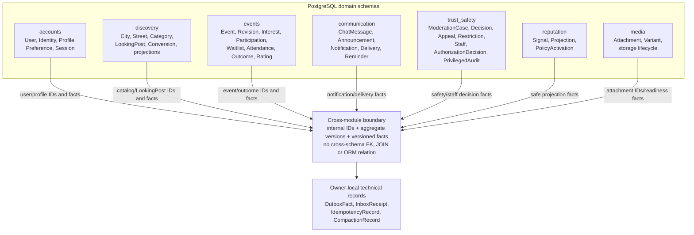
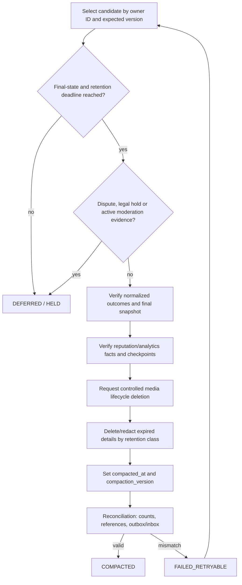

# G4.4A — Data model, retention и compaction

## Статус и границы

- Статус: `ACCEPTED — подтверждено владельцем 2026-07-29`
- Горизонт: MVP/alpha
- Хранилище бизнес-истины: PostgreSQL/PostGIS
- Связанный документ:
  [G4.4B — state machines](04-state-machines.md)

Документ задаёт логическую ER-модель, владельцев данных, ключи/ограничения,
final snapshots, normalized outcomes, deletion/retention classes и повторяемый
compaction flow. Он не является SQL/Alembic migration и не фиксирует физические
имена индексов, partitioning или HTTP schemas.

## Источники

Приоритет: [PD](../../PRODUCT_DECISIONS.md) →
[ADR](../../DECISIONS.md) →
[незаменённая исходная спецификация](../../SOURCE_SPECIFICATION.md).

Дополнительно используются принятые
[G4.2](02-module-boundaries-and-public-ports.md) и
[G4.3](03-permission-catalogue.md). При конфликте `ACCEPTED` решений работа над
затронутой частью останавливается.

## Общие data conventions

| Правило | Нормативное решение |
|---|---|
| Internal IDs | UUIDv7 для новых агрегатов/facts; внешний Telegram ID и public profile ID не заменяют internal ID |
| Time | `timestamptz`, запись в UTC; продуктовые окна вычисляются с явной timezone |
| Optimistic concurrency | Каждый изменяемый aggregate имеет monotonic `version bigint`; command передаёт expected version |
| Enum/state | Типизированное значение из закрытого catalogue; неизвестное значение не угадывается |
| Cross-module reference | Только internal ID + при необходимости version; cross-schema foreign keys и ORM relations запрещены |
| Owner relation | Foreign key разрешён только внутри schema владельца |
| Delete | Generic soft-delete для всех таблиц запрещён; lifecycle/retention определяются типом сущности |
| Audit/facts | Исправление создаёт compensating fact/entry; immutable ledger не переписывается |
| Sensitive data | Классификация и purpose ограничивают query/projection; Redis/cache не становится authority |
| JSON | Только versioned typed payload/metadata; произвольный business `dict` запрещён |

UUIDv7 выбран как sortable opaque ID без раскрытия Telegram identity. Public
Profile использует отдельный случайный неизменяемый восьмизначный public ID.

## Schema ownership

| Schema | Владеет | Не может хранить как копию |
|---|---|---|
| `accounts` | User, Telegram/OIDC binding, Profile, preferences, age acceptance, user sessions | bans, reputation score, event participation |
| `discovery` | cities/polygons, streets, categories, LookingPost, safe map/search projections | Event aggregate, exact participant list |
| `events` | Event/location/revisions, interest, participation, waitlist, attendance, ratings/outcomes | safety restriction, chat text, reputation calculation |
| `communication` | chat, announcements, notification center, Telegram delivery/reminders | event-access authority, Telegram identity binding |
| `trust_safety` | staff auth, permissions/audit, moderation cases/decisions, restrictions/appeals/tombstones | Event/Profile aggregate, reputation formula |
| `reputation` | signal ledger, policy activation, materialized projections | bans, participation truth |
| `media` | attachment/variant/storage lifecycle metadata | attachment role/order in Profile/Event |

Каждая schema имеет собственные Alembic revisions. Миграция одного модуля не
добавляет constraint/trigger/table в чужую schema.

## ER/domain ownership overview

Исходник:
[04-domain-er-overview.mmd](diagrams/04-domain-er-overview.mmd).

### Текстовая альтернатива

Семь schemas владеют перечисленными агрегатами и owner-local technical records.
Между schemas передаются только internal IDs, aggregate versions и versioned
facts. Точные entity relations, cardinality и constraints нормативно заданы
каталогами сущностей ниже; cross-schema FK/JOIN/ORM отсутствуют.

## Entity catalogue

### `accounts`

| Entity | Ключевые данные | Constraints и lifecycle |
|---|---|---|
| `User` | `user_id`, lifecycle, age-policy version/time, version | Telegram ID отсутствует; `ACTIVE → DELETION_REQUESTED → ERASED` |
| `ExternalIdentity` | `identity_id`, `user_id`, provider, verified issuer/subject/telegram ID, first/last auth | Unique provider subject/Telegram identity; encrypted/minimal access |
| `Profile` | `user_id`, random public ID, nickname, bio, avatar attachment ID, version | Public ID unique/immutable; avatar output 256×256 WebP без EXIF; no Telegram profile overwrite |
| `UserPreference` | privacy/notification settings, selected city, version | Private; only safe facts leave schema |
| `UserSession` | opaque session hash/reference, kind, issued/last/absolute expiry, revoked/version | Website 30/90d, Mini App 24h; raw cookie/token not stored |

### `discovery`

| Entity | Ключевые данные | Constraints и lifecycle |
|---|---|---|
| `City` | `city_id`, name/locale, approved polygon, active, data version | Publication only inside active polygon; admin managed |
| `Street` | `street_id`, `city_id`, canonical name, geometry/reference point | Reference point stable and independent of events |
| `Category` | `category_id`, name, display order, active, version | One category per Event; published category immutable |
| `LookingPost` | ID, author/city/category, text, desired time, lifecycle, expires, counts, compacted metadata/version | Active TTL 72h; no exact private contact; one conversion |
| `LookingPostInterest` | post/user IDs, active/created/removed | Unique active interest; no duplicate count |
| `LookingPostConversion` | post ID, reservation fact, event ID, state/version | Unique by post; idempotent draft creation/link |
| `DiscoveryEventProjection` | event ID/version, safe card/marker fields, safety tombstone/version | Rebuildable; never authoritative for lifecycle/access |

### `events`

| Entity | Ключевые данные | Constraints и lifecycle |
|---|---|---|
| `Event` | ID, organizer/type/city/category, approved content, starts/ends, location, lifecycle, moderation visibility, capacity, reschedule counters, final/compaction fields, version | Canonical current and final snapshot; duration ≤7d |
| `EventLocation` | selected/provider point, normalized address, city/street IDs, provider metadata, precision, visibility, landmark | Selected point authoritative; `geography(Point,4326)` + GiST; location immutable after publish |
| `EventRevision` | revision ID, event/version, proposed fields, change category, old/new safe details, moderation status | Immutable submitted revision; at most one pending; detailed fields 90d |
| `EventInterest` | event/user, active/historical timestamps | Unique per user/event; unlike only before start |
| `EventParticipation` | episode ID, event/user, joined/ended timestamps, terminal reason, version | At most one active episode per user/event; organizer excluded from capacity |
| `WaitlistEntry` | entry ID, event/user, monotonic queue position, state/timestamps | At most one active entry; rejoin creates new tail position |
| `WaitlistOffer` | offer ID, entry/event/user, reserved slot, expires/state/version | One active offer per reserved slot/user; timeout 30/10/5m |
| `AttendanceCode` | event ID, code hash, active window, attempt policy/version | One code per event; plaintext never persisted |
| `AttendanceRedemption` | event/user/episode, attempted time, result/reason, dedup key | Max five attempts, max one success; audit-safe data only |
| `AttendanceDecision` | event/user, state, provisional/final times, reason, version | Unique per user/event; reputation only from final state |
| `AttendanceDispute` | decision ID, normalized reason, short explanation, response, reviewer/result | At most one active dispute; 24h opening window |
| `ParticipationOutcome` | event/user, episode count, joined/left/excluded/waitlist/attendance final summaries, final reason/version | Unique `(event_id,user_id)`; exactly one final reputation outcome |
| `EventRating` | event/user, stars, eligibility source, created | Unique `(event_id,user_id)`; 1–5, no text/tags; organizer forbidden |

### `communication`

| Entity | Ключевые данные | Constraints и lifecycle |
|---|---|---|
| `ChatMessage` | message/event/author IDs, plain text, created, moderation reference | 500 chars, immutable, no files/HTML; delete end/cancel +24h |
| `Announcement` | announcement/event/organizer IDs, text, created | Public before start; delete end/cancel +24h |
| `Notification` | ID, user, source fact/type/version, safe payload reference, read/expiry | Unique source business key; internal center is durable until retention |
| `TelegramDelivery` | notification/bot kind, state, attempts, next/expiry/provider-safe reference | User/ops bot isolated; current-state check before delivery |
| `ReminderSchedule` | owner ID/version, kind, due/expiry, state | Beat passes IDs only; stale schedule skipped |

### `trust_safety`

| Entity | Ключевые данные | Constraints и lifecycle |
|---|---|---|
| `ModerationCase` | case ID, subject type/ID/version, source, severity, state, assigned staff, SLA target | One active case per normalized source/subject key where applicable |
| `ModerationDecision` | case/decision IDs, reviewer, outcome/reason, measure, created | Immutable; correction/appeal creates new linked decision |
| `Complaint` | reporter/subject IDs, normalized category, evidence refs, created | No copied private payload; duplicate/business key guarded |
| `Appeal` | original decision, applicant, created/deadline, reviewer/result | Within 7d; other reviewer when possible |
| `Restriction` | subject, action scope, temporary/permanent window, reason, state/version | `trust_safety` authority; current active uniqueness by policy |
| `SafetyTombstone` | subject type/ID/version, hidden since/reason/version | Fail-closed input for public projections |
| `StaffAccount/Session/Grant` | G4.3 staff identity, sessions, role template, grants/revokes/scopes | Separate from User; permission changes revoke sessions |
| `AuthorizationDecision` | decision ID, staff/session/permission/scope/target/outcome | Links owner outcome to privileged audit |
| `PrivilegedAudit` | immutable normalized action/outcome/trace fields | Append-only; 90d evidence retention, no secrets |

### `reputation`, `media` и technical records

| Entity | Ключевые данные | Constraints и lifecycle |
|---|---|---|
| `ReputationSignal` | signal ID/type, subject, source fact/outcome, component delta, policy version | Immutable/dedup; correction is compensating signal |
| `ReputationProjection` | subject/role components, score, public level/status, confidence, calculation version | Rebuildable; production weights absent from public repo/client |
| `PolicyActivation` | opaque policy version, activated by/at | Does not expose weights/thresholds |
| `Attachment` | attachment ID, owner user, purpose, technical state, created/deletion/hold metadata | File owner modules reference by ID/role/order |
| `MediaVariant` | attachment/variant IDs, type/dimensions/checksum/storage reference | No public filesystem path; safe processed derivative |
| `OutboxFact` | envelope, typed payload, owner aggregate/version, delivery/dead-letter metadata | Written with owner state; immutable fact payload |
| `InboxReceipt` | consumer/fact/schema version, processed/result/checkpoint | Unique consumer+fact; dedup authority |
| `IdempotencyRecord` | actor/command/key, request fingerprint, outcome reference/expiry | Reuse with different fingerprint is conflict |
| `CompactionRecord` | owner ID/version, class, state, attempts, compacted/version/checks | Unique owner+compaction version |

## Event final snapshot

`Event` не копируется в отдельную архивную таблицу. При завершении/cancellation:

1. lifecycle и moderation visibility финализируются;
2. approved title/description/category/time/location remain canonical;
3. exact location остаётся в защищённой записи с прежней классификацией;
4. публичная итоговая projection показывает место максимум до street;
5. сохраняются organizer ID, event type, city/category, final times,
   participation counts/outcomes, cancellation/completion reason;
6. reschedule summary хранит count, суммарный shift, critical/late flags и
   normalized reason categories;
7. heavy media, temporary revision text, chat и evidence удаляются по retention;
8. rejected/blocked объект сохраняет факт, city/category/lifecycle/normalized
   reason и необходимые links, но не heavy content.

`PUBLIC_OFFICIAL` event имеет отдельный invariant: нет participation, capacity,
waitlist, chat, attendance или organizer reputation effects.

## Normalized participation outcome

`ParticipationOutcome` создаётся/обновляется одним owner use case в `events`:

- unique `(event_id,user_id)`;
- агрегирует все rejoin episodes, но хранит `episode_count`;
- различает interest, joined, voluntary/late leave, exclusion, waitlist result,
  cancellation и final attendance;
- содержит только normalized timestamps/categories, не копирует Profile;
- становится `FINAL` только после event final state и attendance/dispute closure;
- порождает максимум один final reputation fact на user/event;
- повторный finalization с той же version возвращает прежний outcome;
- correction создаёт новую outcome version и compensating reputation fact.

Episode records могут быть compacted после сохранения outcome и истечения
dispute/evidence windows; долгосрочный outcome не теряет доказуемый итог.

## Constraints и concurrency

| Invariant | Enforcement |
|---|---|
| Один active participation episode | Partial unique `(event_id,user_id)` where active |
| Один active waitlist entry | Partial unique `(event_id,user_id)` where waiting/offered |
| FIFO | Monotonic position allocated transactionally; order by position then ID |
| Capacity | Event row lock/version + active participation/offer constraints |
| Несколько свободных мест | В одной transaction резервируются первые `N` eligible entries |
| Один pending EventRevision | Partial unique event where moderation pending |
| Не более двух переносов | Event counter/version guard; rejected revision не увеличивает |
| Event place/category immutable | Owner state guard after first publish |
| Attendance attempts/success | Counter/unique successful redemption under event/user lock |
| One final attendance/outcome/rating | Unique event/user + state/version guards |
| Conversion | Unique LookingPost conversion; event create idempotency by source fact |
| Outbox/inbox | Unique fact ID and consumer/fact receipt |

## Retention classes

| Class | Данные | Deadline/trigger | После deadline |
|---|---|---|---|
| `R0_EPHEMERAL` | cache, rate-limit counters, transient leases | Seconds/hours by technical policy | Delete; never source of truth |
| `R1_AUTH` | user/staff sessions, invite/re-auth proof | Session expiry/revoke; invite ≤24h; re-auth ≤5m | Delete/irreversibly invalidate metadata |
| `R2_LOOKING_POST` | closed/expired LookingPost text | 24h after close/expiry/conversion | Delete text/contact-like details; keep outcome/counts/link |
| `R3_CHAT` | chat and announcements | Event end/cancel +24h | Hard delete text; keep normalized complaint/decision facts |
| `R4_DRAFT` | inactive Event draft | 7d without activity | Delete draft content/media refs after owner notification policy |
| `R5_EVENT_MEDIA` | event processed photos | Event end/cancel +7d | Delete bytes/variants through MediaStorage; keep attachment tombstone/metadata minimum |
| `R5_PROFILE_MEDIA` | current/previous Profile avatar variants | Current while Profile active; replaced variants/original ≤24h; account erasure | Delete replaced/original bytes through MediaStorage; keep only current attachment ID |
| `R6_REVISION` | detailed old/new revision fields/free text | Applied/rejected +90d | Compact to counts/shift/critical/late/reason |
| `R6_NOTIFICATION` | internal notification and safe non-ledger delivery detail | 90d after creation | Delete notification/delivery detail; source business fact remains authoritative |
| `R7_ATTENDANCE` | attempts, dispute explanation/evidence | 30d after dispute finalization; undisputed after final deadline | Delete detail; keep final decision/outcome |
| `R7_PARTICIPANT_ACCESS` | Organizer access to named completed-event participant list | Event end +30d | Query returns only anonymized aggregates; protected owner outcomes remain |
| `R8_MODERATION` | moderation evidence and privileged audit detail | 90d after final decision/action | Delete evidence/detail unless legal hold; keep normalized final facts |
| `R9_DEAD_LETTER` | resolved safe technical payload | 30d after resolution | Delete payload; keep normalized result/audit 90d |
| `R10_PROVIDER` | raw reverse-geocoder diagnostic payload | ≤24h after successful canonicalization | Delete raw payload; keep canonical address/provider ID/precision |
| `R11_BACKUP` | encrypted backups | 14d | Expire automatically and verify deletion |
| `R12_LONG_TERM` | final Event, protected final location, ParticipationOutcome, ratings, reputation/analytics links, normalized decisions | Product history/account lifecycle | Retain until specific erasure/legal rule; never make private data public |

Processed outbox/inbox/idempotency technical durations are finalized in the
dedicated outbox/API G4 documents. Они не могут быть короче максимального окна
повтора соответствующего command/fact и не заменяют long-term business facts.

## Account deletion и anonymization

1. `accounts` фиксирует `DELETION_REQUESTED`, revoke sessions и outbox fact.
2. Новые user commands закрываются, кроме статуса/отмены в разрешённом окне,
   которое будет определено API/state contract.
3. Открытые disputes, safety cases и legal holds фиксируют ограниченные
   retention holds; ban нельзя обойти удалением аккаунта.
4. Telegram/OIDC bindings, public Profile и ненужные preferences удаляются.
5. Owner modules заменяют `user_id` в долгосрочных outcomes на локальный
   irreversible `erased_subject_id`, если identity больше не нужна.
6. Публичные projections/tombstones обновляются fail-closed.
7. Media deletion выполняется через `MediaStorage`; отсутствие файла трактуется
   как идемпотентный успех после checksum/reference reconciliation.
8. Backups не редактируются хирургически; erased data исчезает по 14-дневному
   expiry, а restore procedure повторно применяет erasure ledger.

Точная отмена deletion request и legal basis не вводятся этим документом; до их
утверждения необратимое стирание выполняется только после owner-confirmed
retention guard.

## Compaction flow

Исходник: [04-compaction-flow.mmd](diagrams/04-compaction-flow.mmd).

### Нормативный алгоритм

1. Worker получает owner ID, retention class и expected aggregate version.
2. Owner application port повторно читает PostgreSQL и проверяет final state,
   deadline, active dispute, appeal, legal hold и moderation evidence.
3. Проверяются final Event/LookingPost snapshot, normalized outcomes и
   обязательные outbox facts.
4. Проверяются reputation/analytics checkpoints; missing outcome создаёт repair,
   но не удаление detail.
5. Media owner получает lifecycle fact/command по attachment ID; прямое удаление
   filesystem из чужого модуля запрещено.
6. Owner transaction удаляет/redacts только поля своей schema и фиксирует
   `compacted_at`, `compaction_version`, counts/checksums и outbox fact.
7. Reconciliation сравнивает retained aggregates, references, media tombstones,
   inbox/outbox и public projection.
8. Повтор того же version возвращает `already_compacted`; partial external media
   result безопасно продолжается по idempotency key.

### Recovery

| Failure | Recovery |
|---|---|
| Candidate ещё не final/deadline не наступил | `DEFERRED`, новая due time |
| Active dispute/legal hold | `HELD`, reevaluate после hold change |
| Missing normalized outcome/fact | Не удалять detail; repair/reconciliation |
| Media adapter unavailable | Owner detail остаётся; retry from outbox |
| File already absent | Verify metadata/checksum, record idempotent deletion |
| Projection stale | Rebuild from owner snapshot/facts before marking complete |
| Version conflict | Abort current attempt and reschedule with new version |
| Reconciliation mismatch | `FAILED_RETRYABLE`, safe alert after retry policy |

## Scenario analytics/quality contract

Это минимальный data-quality слой G4.4; точные event payloads остаются
domain-event catalogue.

| Scenario | Source/owner | Outcome/reason | Retention | Quality checks |
|---|---|---|---|---|
| LookingPost publish/convert | `discovery` | active/expired/converted/blocked | R2 + long-term outcome | Unique post/conversion, event link consistency |
| Event publish/change/finalize | `events` | lifecycle/moderation + normalized reason | R6/R12 | Version monotonic, ≤2 shifts, immutable place/category |
| Interest/join/waitlist | `events` | current episode/queue/offer result | operational → R12 outcome | Capacity, active uniqueness, FIFO/order |
| Attendance/dispute | `events` | final attended/neutral/no-show | R7/R12 | ≤5 attempts, one success/final decision |
| Moderation/appeal | `trust_safety` | upheld/dismissed/reversed + severity | R8/R12 | Reviewer/separation, decision chain, tombstone parity |
| Notification delivery | `communication` | delivered/expired/dead-letter/skipped | technical/dead-letter classes | Source dedup, stale-version skip, expiry |
| Compaction | each owner | compacted/held/failed + reason | Compaction record long enough for reconciliation | Final guard, counts, checksums, no orphan refs |

Анонимный page view увеличивает только aggregate count без долгоживущего visitor
ID. Analytics не получает exact location, private text, media, tokens или
production anti-fraud/reputation policy.

## Traceability

| Решение | Источник |
|---|---|
| Schema ownership и cross-module IDs | `ADR-010`, G4.2 |
| Event/participation/waitlist/attendance model | `PD-004`, `PD-006`, `PD-009`, `ADR-012` |
| EventRevision и optimistic concurrency | `PD-005`, `ADR-013` |
| PostGIS location и protected final address | `PD-002`, `PD-017`, `ADR-014`, `ADR-016` |
| Final Event snapshot и normalized outcomes | `PD-014`, `ADR-016` |
| LookingPost conversion/retention | `PD-011`, `PD-014`, `PD-019`, `ADR-016` |
| Chat/media/evidence retention | `PD-007`, `PD-014`, `ADR-016` |
| Moderation/appeal/restriction data | `PD-008`, `PD-014`, `ADR-011` |
| Reputation ledger/projection | `PD-009`, `PD-016`, `ADR-011` |
| Outbox/inbox/idempotency | `PD-012`, `PD-018`, `ADR-015`, `ADR-017` |
| Identity/session separation | `PD-015`, `ADR-020`, G4.3 |
| Analytics minimization/quality | `PD-018` |

## Acceptance checklist

- [x] Документ остаётся `DRAFT` до owner review.
- [x] Каждая сущность имеет одного schema owner.
- [x] Cross-schema FK/ORM и generic soft-delete запрещены.
- [x] Event является canonical final snapshot без archive copy.
- [x] ParticipationOutcome unique per event/user и не умножает reputation.
- [x] Exact final location сохраняет прежнюю классификацию.
- [x] Все принятые retention deadlines отражены в classes.
- [x] Account erasure учитывает disputes/legal hold/backups.
- [x] Compaction fail-safe, idempotent и проверяет outcomes/aggregates/media.
- [x] ER и compaction diagrams имеют отдельные `.mmd` и текстовые альтернативы.
- [x] Нет secrets, PII examples, production domains или закрытых policy values.
- [x] Не созданы SQL migrations, API schemas или production-код.
- [x] Связанные G4 checkboxes/changelog принятия не изменены.
