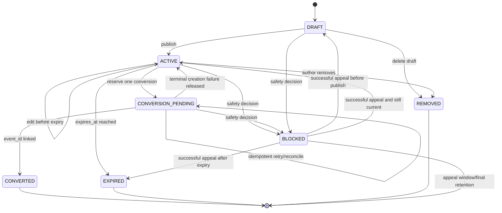
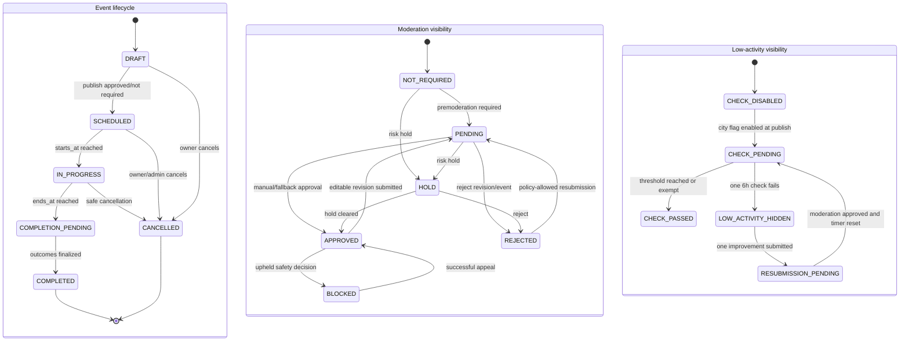
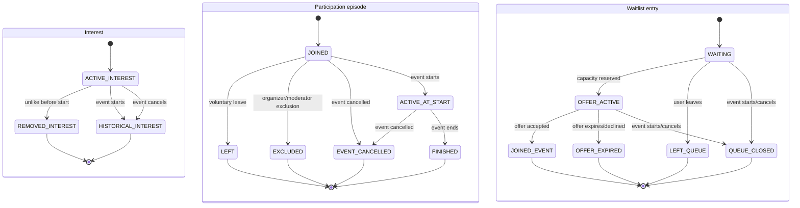
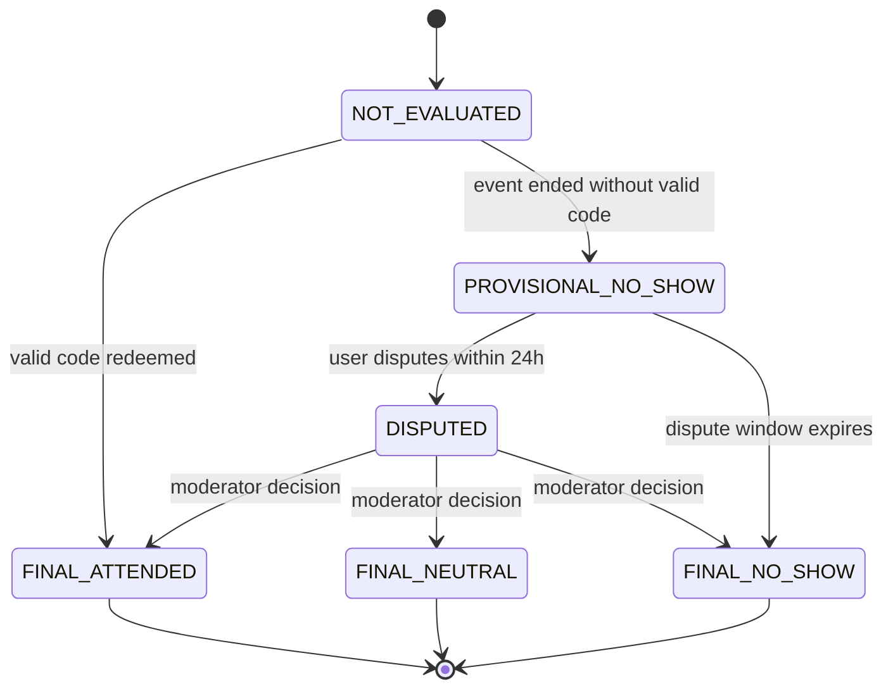
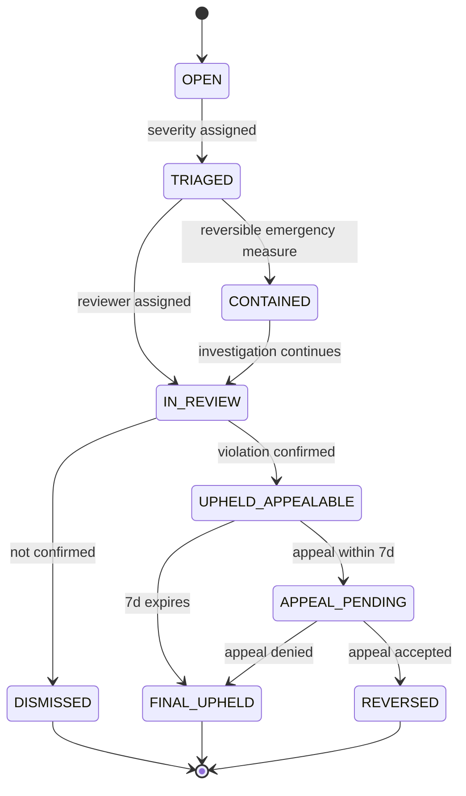
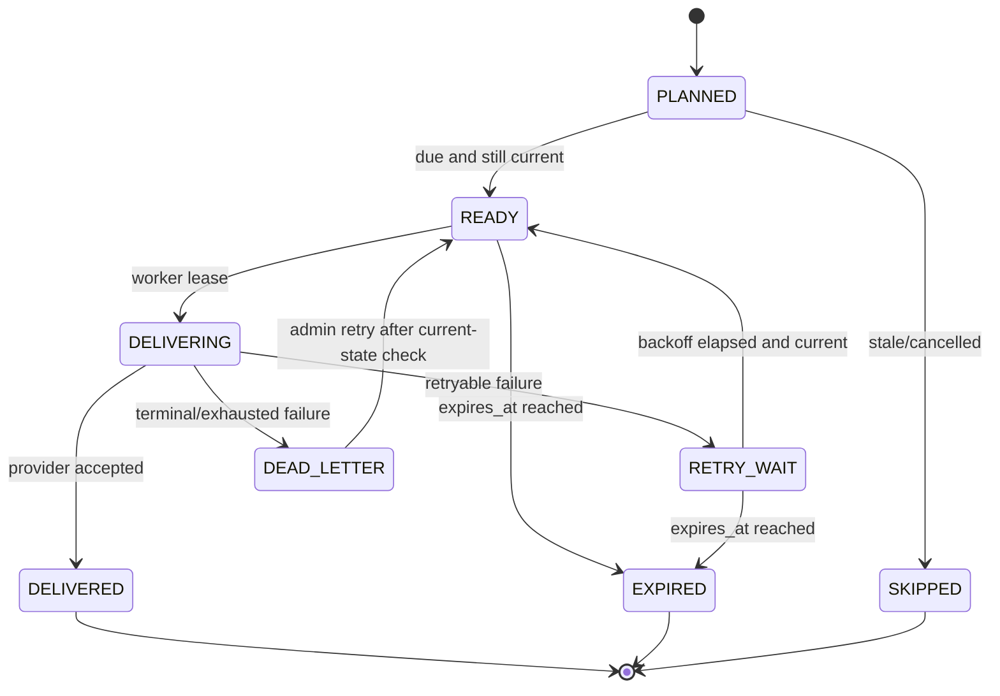

# G4.4B — State machines MVP

## Статус и границы

- Статус: `ACCEPTED — подтверждено владельцем 2026-07-29`
- Связанный документ:
  [G4.4A — data model, retention и compaction](04-data-model-retention-compaction.md)

Документ фиксирует исчерпывающие MVP lifecycle states и переходы для
LookingPost, Event/moderation visibility, interest/participation/waitlist,
attendance, moderation report и Telegram delivery.

Для каждого перехода нормативны actor, guard, side effects/audit и recovery.
HTTP/API mapping и точные domain-event payloads определяются позже.

## Общие правила переходов

1. Command содержит actor/service identity, expected aggregate version,
   idempotency key, request/correlation/causation IDs.
2. Owner module проверяет current PostgreSQL state; frontend/Redis/Celery state
   не является guard authority.
3. State change и outbox fact записываются одной transaction.
4. Повтор той же команды возвращает прежний result; тот же key с другим
   fingerprint даёт conflict.
5. Неуказанный переход запрещён. Unknown enum не маппится в ближайший state.
6. Worker/Beat передают IDs/versions и повторно запускают application guard.
7. Safety hide/revoke работает fail-closed.
8. Audit/domain fact содержит actor/source/outcome/normalized reason, но не
   secrets, private text или exact location без отдельной необходимости.

Базовые ошибки: `forbidden_transition`, `stale_version`, `not_found`,
`policy_denied`, `policy_hold`, `deadline_passed`, `conflict`,
`dependency_unavailable`.

## LookingPost



Исходник:
[04-looking-post-state.mmd](diagrams/04-looking-post-state.mmd).

| Переход | Actor | Guard | Side effects/audit | Recovery и forbidden |
|---|---|---|---|---|
| create → `DRAFT` | User | 14+, supported city for publication intent, safety allow | Owner row/version; no public projection | Duplicate create by idempotency returns same ID |
| `DRAFT → ACTIVE` | Author | Required fields, future desired time, expires ≤72h, city/category valid, safety allow | Publish fact, projection, analytics outcome | Unsupported city/hold deny; no partial publish |
| `ACTIVE → ACTIVE` | Author | Before expiry, expected version, editable fields only | Revision/update fact; expiry task version replaced | Edit expired/blocked/converted forbidden |
| `ACTIVE → CONVERSION_PENDING` | Author | One conversion, not expired/blocked, event eligibility | Atomic reservation + fact to `events` | Repeated command returns same reservation |
| pending → `CONVERTED` | Events-result handler | Matching source fact/event draft, no conflicting link | Save `event_id`; transfer interests through separate facts | Missing event triggers reconcile, never second draft |
| pending → `ACTIVE` | Reconciliation | Absence of created Event is proven and failure terminal | Release reservation with reason | Timeout alone does not prove absence |
| `ACTIVE → EXPIRED` | Worker | `expires_at ≤ now`, current version | Remove active projection, safe final status | Stale task skipped |
| draft/active → `REMOVED` | Author | Own object, not converted, expected version | Hide projection, lifecycle fact | Hard-delete waits for retention |
| draft/active/pending → `BLOCKED` | Trust & Safety | Upheld safety decision/current tombstone | Immediate fail-closed hide | One complaint alone does not auto-block |
| blocked → previous safe state/expired | Appeal handler | Reversed decision; original state/version and TTL still valid | Compensating fact, rebuild projection | Expired content is not republished |

Final states reject publish/edit/convert. Closed text is removed after 24 hours;
outcome, useful counts and event link remain.

## Event lifecycle и moderation visibility



Исходник: [04-event-state.mmd](diagrams/04-event-state.mmd).

Lifecycle и moderation visibility ортогональны. Public visibility вычисляется:

```text
lifecycle == SCHEDULED
and moderation_visibility in {NOT_REQUIRED, APPROVED}
and no current safety tombstone
and low_activity_visibility
    in {CHECK_DISABLED, CHECK_PENDING, CHECK_PASSED}
```

Во время `APPROVED → PENDING` для новой editable revision публичной остаётся
последняя approved revision. `HOLD/BLOCKED` закрывают выдачу fail-closed.

### Lifecycle transitions

| Переход | Actor | Guard | Side effects/audit | Recovery и forbidden |
|---|---|---|---|---|
| create → `DRAFT` | User/admin | Valid type; normal event requires organizer; official requires permission | Event/version and location draft | No public projection |
| `DRAFT → SCHEDULED` | Events use case | Moderation approved/not required; starts future; duration ≤7d; city polygon/category/media/safety valid | Publish fact, tasks, discovery update | Exact point/category become immutable |
| `DRAFT → CANCELLED` | Owner/admin | Expected version, normalized reason | Final safe card where applicable | Cannot restore same aggregate |
| `SCHEDULED → SCHEDULED` revision | Owner | Before start; place/category immutable; ≤2 applied time changes | EventRevision, increment on applied reschedule, replace tasks, notifications | Rejected revision does not consume limit |
| `SCHEDULED → IN_PROGRESS` | Worker | `starts_at ≤ now`, current version, still scheduled | Close joins/waitlist/offers; create attendance window | Stale task skipped |
| scheduled/in-progress → `CANCELLED` | Owner/admin/system | Allowed cancellation action, normalized reason | Close queue/access/tasks; notify; initialize cancellation outcomes | Cannot edit/reopen; new event required |
| `IN_PROGRESS → COMPLETION_PENDING` | Worker | `ends_at ≤ now`, current version | Close code window; initialize provisional attendance/outcomes | Missing participant handled by reconciliation |
| pending → `COMPLETED` | Worker | All attendance decisions final or neutralized; normalized outcomes/checkpoints exist | Canonical final snapshot, final facts, retention schedules | Missing outcome blocks completion/compaction |

After start free editing/arbitrary text is forbidden. Location/category changes
after first publish are always forbidden; a new Event is required.

### Moderation transitions

| Переход | Actor | Guard | Side effects/audit | Recovery и forbidden |
|---|---|---|---|---|
| `NOT_REQUIRED → PENDING` | Events/trust policy | New organizer or returned premoderation; ≥24h before start | Case + fallback due in 3h | No publish until decision |
| pending → `APPROVED` | Moderator | Permission/case scope, valid current revision | Immutable decision, publish/apply revision fact | Other revision IDs unaffected |
| pending → `APPROVED` | Fallback service | Waited ≥3h; text list passes; author unblocked; exact allowed use case | System decision with policy version | Any uncertainty/blocked author remains pending/hold |
| pending/hold → `REJECTED` | Moderator | Current case/revision, normalized reason | Rejection fact; public keeps prior approved revision if edit | Rejected new event stays non-public |
| pending/not-required → `HOLD` | Trust & Safety | High-confidence risk or staff decision | Immediate tombstone, cancel fallback delivery | One Emergency complaint alone is priority, not automatic hide |
| `HOLD → APPROVED` | Moderator/system | Risk cleared, all current guards pass | Compensating decision and projection rebuild | Expired/started invalid proposal cannot apply |
| `APPROVED → PENDING` | Owner | Editable title/description/rules/landmark/photos; one pending revision | Pending revision replaces older unreviewed proposal | Current approved content remains |
| `APPROVED → BLOCKED` | Trust & Safety | Upheld safety decision | Fail-closed hide/restriction facts | Lifecycle retained for evidence/outcomes |
| rejected → pending | Owner | Rejection reason/policy explicitly permits resubmission; PD-004 guarantees one low-activity improvement; still before start | New revision/case/version | Other rejection requires appeal/new Event; unlimited resubmission forbidden |
| blocked → approved | Appeal handler | Successful appeal, event still temporally valid and safety guards pass | Compensating decision, rebuild tasks/projection | Completed/expired content returns only safe final card |

### Low-activity visibility transitions

| Переход | Actor | Guard | Side effects/audit | Recovery и forbidden |
|---|---|---|---|---|
| disabled → check-pending | Publish use case | Per-city flag enabled; Event published ≥6h before start | One due check tied to event version | Flag disabled before due marks check passed/skipped |
| pending → check-passed | Worker | At least one join or three distinct eligible interests; or event published <6h before start | Store normalized outcome/counts; no later re-hide when likes removed | Only one check per publication attempt |
| pending → low-activity-hidden | Worker | At due time threshold absent and flag still enabled | Remove discovery projection, notify organizer, audit outcome | Event aggregate retained |
| hidden → resubmission-pending | Organizer | One improvement/resubmission not yet used; before start | New moderation revision; increment one-time resubmission counter | Second resubmission forbidden |
| resubmission → check-pending | Moderator/fallback | Revision approved and all current publish guards pass | Restore projection and schedule a new single 6h check | Rejection leaves hidden |

## Interest, participation и waitlist



Исходник:
[04-participation-waitlist-state.mmd](diagrams/04-participation-waitlist-state.mmd).

### Interest

| Переход | Actor/guard | Side effects/audit | Forbidden/recovery |
|---|---|---|---|
| create `ACTIVE_INTEREST` | User; published safe Event, not organizer | Unique interest + count/fact | Does not reserve capacity |
| active → removed | User; strictly before start | Remove from active count; fact | After start unlike forbidden |
| active → historical | Start worker; current event version | Freeze historical interest | Repeated transition idempotent |

Official public events permit interest but no participation/waitlist.

### Participation

| Переход | Actor | Guard | Side effects/audit | Forbidden/recovery |
|---|---|---|---|---|
| create `JOINED` | User | Before start, safe/current event, not organizer, capacity free, no active episode/exclusion | Lock event/capacity, create episode, fact/notification | No confirmation/application state |
| `JOINED → LEFT` | User | Before start; expected episode version | Release capacity; late flag if `<3h`; offer next FIFO | Rejoin creates new episode/queue tail |
| `JOINED → EXCLUDED` | Organizer/moderator | Permission/ownership, allowed reason/current state | Immediate chat revoke, release capacity, outcome fact | Excluded user cannot rejoin until reversal |
| joined → event-cancelled | Event cancellation handler | Matching event version | Release/close, neutral outcome | No reputation penalty |
| joined → active-at-start | Start worker | Joined at exact start, current version | Freeze capacity cohort/attendance eligibility | Join/leave after start forbidden |
| active-at-start → finished | End worker | Event ended | Initialize attendance decision/outcome | Reputation waits for final attendance |

Critical reschedule keeps `JOINED`; no reconfirmation. It only opens a no-penalty
exit window until the new start.

### Waitlist/offer

| Переход | Actor | Guard | Side effects/audit | Forbidden/recovery |
|---|---|---|---|---|
| create `WAITING` | User | Before start, capacity full, no active episode/entry/exclusion | Allocate monotonic tail position | Duplicate returns existing entry |
| waiting → offer-active | Capacity use case | One/more slots available; first `N` eligible FIFO | Reserve each slot atomically; expiry 30/10/5m | Cannot skip eligible earlier entry |
| waiting → left-queue | User | Own active entry | Close entry | Rejoin creates new tail position |
| offer → joined-event | User | Before expiry/start; slot reservation current | Atomically accept, create Participation, close offer/entry | Late/replayed accept returns conflict |
| offer → offer-expired | Worker/user decline | Expired or explicit decline, current version | Release slot, offer next FIFO | Return requires manual new entry |
| waiting/offer → queue-closed | Start/cancel worker | Event starts/cancels | Release offers and neutral close | New waitlist transitions forbidden |

Capacity decrease cannot go below active participation plus active reservations.

## Attendance redemption, decision и dispute



Исходник: [04-attendance-state.mmd](diagrams/04-attendance-state.mmd).

| Переход/действие | Actor | Guard | Side effects/audit | Recovery и forbidden |
|---|---|---|---|---|
| Generate code | Start worker | Normal event starts; one code absent | Cryptographic six digits, persist hash/window only | Official event has no code |
| Redemption attempt | Joined-at-start user | Start≤now≤end, ≤5 attempts, no success | Immutable attempt result, rate/attempt counter | Plain code never logged |
| not-evaluated → final-attended | Redemption use case | Hash matches, eligible episode, first success | Final decision/fact; one rating eligibility | Further attempts return existing success |
| not-evaluated → provisional-no-show | End worker | No successful redemption | Notify, set dispute deadline +24h; no reputation signal | Stale/missing participant repaired |
| provisional → disputed | User | Own decision, before deadline, one dispute | Normalized reason + short explanation, moderation queue | Second dispute forbidden |
| provisional → final-no-show | Worker | Deadline passed, no dispute | Final outcome/reputation fact | Worker rechecks current state |
| disputed → final-* | Moderator | Permission/case, expected version, evidence minimized | Final reason, participant outcome, reputation fact | Organizer response is evidence, not final authority |

Rating is separate: only successful-code user, once, 1–5, no text/tags, not
organizer. Final/compensated attendance controls reputation eligibility.

## Moderation report/appeal



Исходник:
[04-moderation-report-state.mmd](diagrams/04-moderation-report-state.mmd).

| Переход | Actor | Guard | Side effects/audit | Recovery и forbidden |
|---|---|---|---|---|
| create `OPEN` | User/system | Valid subject/category; dedup business key | Case + evidence references, not copied payload | Abuse rate limited |
| open → triaged | System/moderator | Current case, severity Emergency/High/Normal/Low | SLA target 15m/2h/24h/72h | SLA is target, not auto-decision |
| triaged → contained | Moderator/system high-confidence signal | Reversible measure allowed | Fail-closed hide/temp restriction, privileged audit | One Emergency complaint alone cannot auto-hide |
| triaged/contained → in-review | Moderator | Assigned permission/scope | Reviewer/time fact | Conflict/separation guard |
| review → dismissed | Moderator | Evidence not sufficient, normalized reason | Close case, lift temporary containment if safe | Complaint alone never reputation penalty |
| review → upheld-appealable | Moderator | Violation confirmed/severity | Decision, sanction ladder, final normalized fact | Permanent measure admin/re-auth per G4.3 |
| upheld → appeal-pending | Subject | Within 7d, one appeal/current decision | Assign other reviewer where possible | Expired/duplicate appeal forbidden |
| appeal → final-upheld/reversed | Eligible reviewer/admin fallback | Separation/re-auth/expected decision version | Compensating safety/reputation facts on reversal | Original immutable decision retained |

Evidence text still expires by its retention class; a complaint does not extend
chat retention. Normalized report/decision fact remains.

## Telegram notification delivery

Internal `Notification` and external `TelegramDelivery` are separate. Internal
notification is created from source fact even when user bot is unavailable.



Исходник:
[04-notification-delivery-state.mmd](diagrams/04-notification-delivery-state.mmd).

| Переход | Actor | Guard | Side effects/audit | Recovery и forbidden |
|---|---|---|---|---|
| source fact → planned | Inbox handler | Unique source business key, recipient internal user | Internal notification + delivery intent | Duplicate fact returns existing IDs |
| planned → ready | Worker | Due, source aggregate/version current, not expired | Lease-ready state | Stale task → skipped |
| ready → delivering | Worker | Lease acquired, bot kind/credentials isolated | Attempt count/started | No business rules in Celery task |
| delivering → delivered | User-bot adapter | Provider accepted/dedup safe | Receipt metadata, delivered time | Does not mean user read |
| delivering → retry-wait | Adapter | Retryable typed error, attempts/time remain | Type-specific backoff+jitter | No infinite retry |
| delivering → dead-letter | Adapter | Terminal or attempts exhausted and still relevant | Safe dead-letter + ops alert/digest | No full payload/PII in alert |
| retry/planned/ready → expired/skipped | Worker | `expires_at` passed or source version stale | Normalized reason; internal notification remains if applicable | Never send obsolete message |
| dead-letter → ready | Admin | Permission/re-auth, current-state check, unchanged payload/recipient/IDs | Privileged audit, new bounded attempt | Bulk/edit forbidden |

User bot и operations bot не разделяют credentials, webhook secrets,
deduplication namespace или scenarios. Operations bot не выполняет commands.

## Challenge — deferred automaton

Challenge не входит в MVP (`PD-011`, `Q-019`). Его state machine нельзя
додумывать до решения правил прогресса, доказательств, tie-breaking, corrections
и rewards.

В G4.4 нормативно только:

- отсутствуют Challenge tables/commands/tasks/permissions в MVP;
- никакой MVP transition не создаёт challenge progress/award;
- будущий автомат получает отдельный module `achievements`, ADR и owner review;
- финальный G4 checklist помечает Challenge как сознательно `DEFERRED`, а не
  ошибочно `COMPLETED`.

## Cross-machine ordering

| Trigger | Обязательный порядок |
|---|---|
| Event start | Event→IN_PROGRESS; close join/waitlist/offers; freeze cohort; create code; stop arbitrary chat |
| Event end | Event→COMPLETION_PENDING; close code; provisional attendance; retention schedules |
| Event cancellation | Close participation/queue/chat/tasks; neutral outcomes; safe final card |
| Safety block | Trust decision/tombstone first; public/chat access fail-closed; projections reconcile later |
| Appeal reversal | Compensating safety/reputation facts; restore only if lifecycle/TTL still valid |
| Final attendance | ParticipationOutcome version; one reputation fact; notification |
| Compaction | Only after final machine states and holds/deadlines from G4.4A |

No cross-machine transition is implemented as a multi-schema transaction.
Leading owner commits state+outbox; other owners react idempotently.

## Transition audit/analytics minimum

Каждый accepted/rejected transition records:

- machine/aggregate ID and version;
- from/to state;
- actor/service identity and source;
- result and normalized reason;
- request/correlation/causation/idempotency IDs;
- rule/schema version and UTC time;
- safe previous/new significant values only when required;
- retention class/data owner/quality checkpoint.

Forbidden transition is observable as normalized outcome, but must not expose
target existence/private state to unauthorized caller.

## Traceability

| Machine | Источник |
|---|---|
| LookingPost TTL/conversion/final projection | `PD-011`, `PD-014`, `PD-019`, `ADR-016` |
| Event lifecycle/change/final snapshot | `PD-004`, `PD-005`, `ADR-013`, `ADR-016` |
| Moderation visibility/fallback/appeal | `PD-008`, `ADR-011` |
| Interest/participation/waitlist | `PD-004`, `PD-006`, `ADR-012` |
| Attendance/dispute/rating | `PD-006`, `PD-009`, `ADR-012` |
| Chat start/revoke/retention | `PD-007`, `PD-014` |
| Notification delivery/dead-letter | `PD-010`, `PD-012`, `ADR-015` |
| Facts/idempotency/ordering | `PD-018`, `ADR-015`, `ADR-017` |
| Deferred Challenge | `PD-011`, `Q-019` |

## Acceptance checklist

- [x] Документ остаётся `DRAFT` до owner review.
- [x] Каждый MVP machine имеет диаграмму и текстовую transition table.
- [x] У каждого перехода есть actor, guard, side effects/audit и recovery.
- [x] Неуказанные и stale transitions запрещены.
- [x] Event lifecycle отделён от moderation visibility.
- [x] Нет participation confirmation/reconfirmation.
- [x] FIFO offer expiry не возвращает пользователя автоматически в очередь.
- [x] Attendance reputation меняется только после final decision.
- [x] Одна Emergency complaint не скрывает контент автоматически.
- [x] Notification expiry/stale version предотвращают obsolete delivery.
- [x] Challenge явно `DEFERRED`, без выдуманных MVP states.
- [x] Mermaid blocks совпадают с отдельными `.mmd`.
- [x] Нет secrets, PII examples, production domains или закрытых policy rules.
- [x] Не созданы production-code/API/event payload schemas.
- [x] Связанные G4 checkboxes/changelog принятия не изменены.
