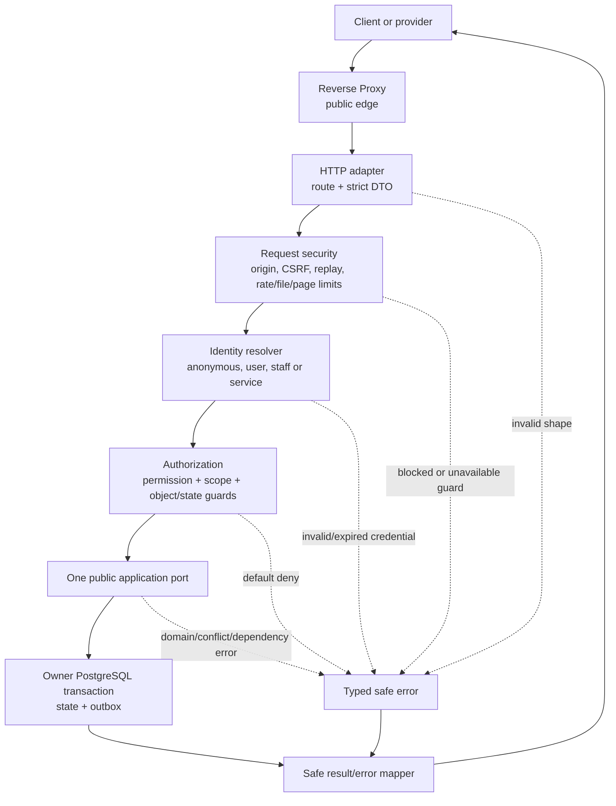
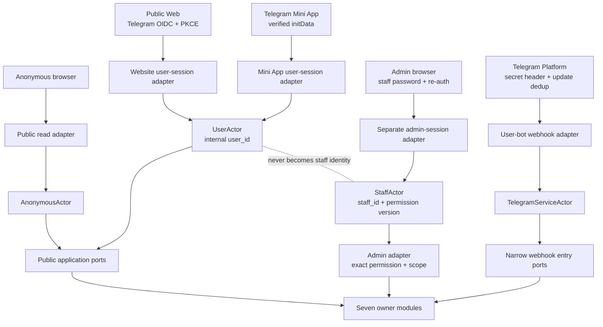

# G4.5 — API contracts, error model и request-security matrix

## Статус, цель и границы

- Статус: `DRAFT — ожидает подтверждения владельца`
- Горизонт: MVP/alpha
- Стиль: JSON over HTTPS для логических API; controlled binary streaming для media
- Версия контракта: `v1`

Документ задаёт логические HTTP route families, transport DTO conventions,
error model, idempotency, optimistic concurrency, authentication/authorization
mapping и обязательные request-security controls. Таблицы нормативны; диаграммы
являются наглядным представлением.

Это не OpenAPI-файл, не FastAPI-код и не окончательный выбор production domains.
Точные JSON-поля каждого business DTO проектируются при реализации из
типизированных public application contracts, без расширения описанных здесь
capabilities.

## Источники и приоритет

Приоритет: [PD](../../PRODUCT_DECISIONS.md) →
[ADR](../../DECISIONS.md) →
[незаменённая исходная спецификация](../../SOURCE_SPECIFICATION.md).

Документ развивает принятые:

- [G4.2 — module boundaries и public ports](02-module-boundaries-and-public-ports.md);
- [G4.3 — permission catalogue](03-permission-catalogue.md);
- [G4.4A — data model/retention](04-data-model-retention-compaction.md);
- [G4.4B — state machines](04-state-machines.md).

При конфликте с `ACCEPTED` решением соответствующий контракт не реализуется до
отдельного owner decision.

## Нормативные соглашения API

| Тема | Решение |
|---|---|
| Logical prefixes | User/public API — `/v1`; закрытая панель — `/admin/v1`; provider ingress — `/webhooks/v1` |
| Versioning | Breaking transport change создаёт новый major prefix; additive optional fields разрешены в `v1` |
| Content type | JSON requests требуют `application/json`; неизвестный/неподдерживаемый media type отклоняется |
| Field policy | Strict schema, allowlist полей, запрет unknown fields для commands; server-derived IDs нельзя присылать вместо actor |
| Identity | `user_id`/`staff_id` берутся только из проверенной session; path/body subject не заменяет actor |
| IDs | Opaque UUID/public ID; клиент не выводит время, права или identity из значения |
| Time | RFC 3339 с timezone; сервер хранит UTC; локальная timezone передаётся только как явно типизированное поле |
| Mutation | Один HTTP handler вызывает ровно один leading application use case |
| Read composition | Adapter может компоновать безопасные query DTO, но не принимает business decision |
| Lists | Только cursor pagination с bounded `limit`; cursor opaque, scoped to identity/filter/version |
| Map | Обязательны валидный city/bbox/zoom context и bounded limit; скрытые event coordinates не попадают в response |
| Logging | Только request ID, route template, actor class/opaque ID, outcome/error code и latency; raw credentials/private payload запрещены |
| Domains | Точные domains/origins задаются deployment configuration и не фиксируются здесь |

Обычные resource `GET`/`HEAD` безопасны и не изменяют бизнес-состояние. Узкий
OIDC redirect callback является protocol endpoint: после single-use
state/nonce/code проверки он может создать identity/session и не используется
для crawler/prefetch. Business command не маскируется под resource `GET`.
Успешный command возвращает current owner result или accepted workflow
reference, а не обещание выполнения недолговечного внешнего эффекта.

## Request-processing diagram



Текстовая альтернатива: Reverse Proxy передаёт запрос HTTP adapter. Adapter
строго валидирует transport DTO, применяет boundary-specific security controls,
получает server-side actor и проверяет permission, scope, object и state guards.
После этого вызывается один public application port. Owner module атомарно
фиксирует state и outbox в PostgreSQL. Любая ошибка проходит через единый
безопасный mapper; route не обращается напрямую к SQL, Redis, Telegram SDK или
чужому internal package.

## Authentication boundaries



Текстовая альтернатива: анонимный browser получает только безопасные public
reads. Website OIDC и Mini App `initData` создают разные session types, но обе
разрешаются в один internal `UserActor`. Admin использует отдельную password
identity, cookie namespace и `StaffActor`; пользовательская Telegram session
никогда не повышается до staff. Telegram webhook создаёт узкий service actor,
который не получает user/admin permissions.

## Session и credential contracts

| Boundary | Credential/flow | Lifetime и replay | CSRF/origin | Результат |
|---|---|---|---|---|
| Anonymous | Нет credential | Short-lived HMAC IP fingerprint допустим только для abuse rate limit | Разрешённые public methods/origins; mutations отсутствуют | `AnonymousActor` |
| Public Web | OIDC Authorization Code + PKCE; backend проверяет JWKS, `iss/aud/exp`, state и nonce | Rolling 30d, absolute 90d; code/state/nonce single-use | Host-only `Secure`, `HttpOnly`, подходящий `SameSite` cookie; state-changing request требует CSRF и allowed Origin | `UserActor(user_id, session_id)` |
| Mini App | Raw signed `initData` принимается только session-exchange endpoint; проверяются signature, `auth_date`, freshness, nonce/session binding | Server session 24h; refresh только через новое valid `initData`; replay artifact отклоняется | Отдельная cookie/session namespace и exact Mini App deployment origin; сам WebView не является trust proof; mutations защищены session-bound CSRF либо эквивалентным double-submit proof | Тот же `UserActor`, отдельный session type |
| Admin | Login/password; Argon2id verification; invite/reset separate | Absolute 8h, idle 30m; revoke/permission change действует fail-closed | Отдельный origin/cookie; CSRF обязателен для всех mutations | `StaffActor(staff_id, session_id, permission_version)` |
| Admin re-auth | Password поверх active admin session | Proof ≤5m, привязан к action family/target и single-use для опасного command | Session + CSRF + allowed Origin остаются обязательными | Opaque re-auth proof reference |
| Telegram webhook | `X-Telegram-Bot-Api-Secret-Token` + accepted source network policy where operationally available | `update_id` dedup; secret rotation поддерживает bounded overlap | Browser CORS/CSRF неприменимы; только POST, strict content/size | `TelegramServiceActor` |

Raw `initData`, authorization code, ID/access token, password, session cookie,
CSRF secret, webhook secret и invite/reset/re-auth token запрещены в URL, logs,
analytics, audit и error details. Operations bot credentials не принимаются на
user-bot webhook.

## Common request metadata

| Metadata | Обязательность | Семантика |
|---|---|---|
| `X-Request-ID` | Клиент может прислать safe UUID; иначе генерирует edge/API | Correlation only; не даёт idempotency |
| `Idempotency-Key` | Все external mutation commands | Opaque high-entropy value, scoped by actor + route family; не содержит PII |
| `If-Match` | Изменение versioned aggregate | Expected owner version; отсутствие на обязательной операции даёт precondition error |
| CSRF header | Cookie-authenticated mutations | Должен соответствовать active session proof и allowed Origin |
| `Content-Length` | Обязателен для uploads и bounded bodies | Missing/oversized body отклоняется до expensive parsing |
| `Accept-Language` | Необязателен | Только presentation; не меняет policy/reason code |

Нельзя использовать client-supplied `X-Forwarded-*` без перезаписи trusted
Reverse Proxy. Сырой IP не входит в application DTO; edge передаёт только
короткоживущий abuse context/fingerprint.

## Response и DTO envelope

Одиночный успешный JSON response:

```json
{
  "data": {},
  "meta": {
    "request_id": "opaque-request-id",
    "resource_version": 12
  }
}
```

Paginated response добавляет только opaque `next_cursor`; total count
возвращается лишь когда owner projection безопасно и дёшево его предоставляет.
Отсутствие cursor означает конец выборки.

Response не отражает неизвестные input fields, credential fragments, internal
policy trace, filesystem path, provider payload, SQL error или stack trace.
Private/exact-location/admin responses получают `Cache-Control: no-store`;
public cards могут cache-ироваться только по явно безопасной projection и
инвалидируются safety tombstone.

## Error model

Единый безопасный envelope:

```json
{
  "error": {
    "code": "stale_version",
    "message": "Request cannot be applied to the current resource state.",
    "request_id": "opaque-request-id",
    "details": {
      "current_version": 12
    }
  }
}
```

`message` локализуем и не является машинным контрактом. Клиент ветвится только
по stable `code`. `details` имеет code-specific allowlist; private reason,
существование скрытого объекта и security policy не раскрываются.

| HTTP | Stable codes | Семантика и disclosure |
|---:|---|---|
| `400` | `malformed_request`, `invalid_cursor` | Невалидный transport/syntax; без echo сырого значения |
| `401` | `authentication_required`, `session_expired`, `reauth_required` | Нет valid actor/proof; admin login не раскрывает существование account |
| `403` | `forbidden`, `policy_denied`, `policy_hold` | Actor известен, действие запрещено; safe normalized reason only |
| `404` | `not_found` | Также используется для concealed private/foreign object |
| `409` | `conflict`, `forbidden_transition`, `idempotency_conflict` | Конфликт current business state или key fingerprint |
| `412` | `stale_version`, `precondition_required` | `If-Match` отсутствует/устарел; разрешён current version без private fields |
| `413` | `payload_too_large` | Body/file/pixel/page bound превышен |
| `415` | `unsupported_media_type` | Неподдерживаемый content/file type |
| `422` | `validation_failed`, `deadline_passed` | Строгая field/domain validation; bounded field path/reason |
| `429` | `rate_limited` | Safe `Retry-After`; policy thresholds не раскрываются |
| `503` | `dependency_unavailable`, `safety_check_unavailable` | Временный отказ; sensitive action/read закрывается fail-closed |

Unexpected exception становится generic `internal_error`/`500` с request ID.
Нельзя выдавать разные external login errors, по которым определяется
существование user/staff identity.

## Idempotency, concurrency и retry

1. Каждый внешний mutation command имеет `Idempotency-Key`; исключение —
   одноразовые protocol callbacks, где accepted state/update ID является
   эквивалентным dedup key.
2. Scope key: authenticated actor/session class + route family + key. Для
   webhook: bot identity + `update_id`.
3. До use case сохраняется canonical request fingerprint. Тот же key и тот же
   fingerprint возвращают прежний status/body reference; другой fingerprint
   даёт `idempotency_conflict`.
4. Idempotency не заменяет optimistic concurrency. Versioned command также
   передаёт `If-Match`.
5. Запись result и owner transaction согласованы через owner idempotency record;
   сетевой timeout после commit безопасен для повтора.
6. `5xx` до начала owner transaction допускает retry с bounded backoff/jitter.
   Клиент не повторяет non-idempotent mutation под новым key автоматически.
7. Join, exit, waitlist accept/decline, LookingPost conversion, attendance code,
   deep-link consume и Telegram webhook имеют отдельные domain uniqueness/dedup
   guards поверх transport idempotency.
8. Retention idempotency records относится к короткому техническому классу, но
   не удаляется раньше максимального supported retry window соответствующего
   command.

## Public и user API catalogue

`Auth` обозначает минимальную identity. `Object guard` всегда проверяется owner
module; frontend ownership flag не является доказательством.

### Authentication, sessions и account

| Method/path family | Application port | Auth | Idempotency/version | Authorization/object guard |
|---|---|---|---|---|
| `GET /v1/auth/telegram/oidc/start` | auth adapter → `IdentityCommands` preparation | anonymous | state/nonce transaction single-use | Allowed return target только из registered allowlist |
| `GET /v1/auth/telegram/oidc/callback` | `IdentityCommands` | OIDC callback artifact | code/state/nonce dedup | Verify provider claims; создать/найти только server-derived `user_id` |
| `POST /v1/auth/telegram/mini-app/session` | `IdentityCommands` | valid raw `initData` | artifact replay dedup | Raw artifact разрешён только здесь и немедленно redacted |
| `POST /v1/auth/logout` | `AccountLifecycleCommands`/session adapter | user session | key | Только current session |
| `GET /v1/account/sessions` | `AccountQueries` | user | — | Только sessions current user, без token/cookie |
| `DELETE /v1/account/sessions/{session_id}` | `AccountLifecycleCommands` | user | key | Session принадлежит current user |
| `GET /v1/account` | `AccountQueries` | user | — | Self |
| `PATCH /v1/account/profile` | `ProfileCommands` | user | key + `If-Match` | Self; allowlist profile fields/name cooldown |
| `PATCH /v1/account/preferences` | `PrivacyPreferenceCommands` | user | key + `If-Match` | Self |
| `DELETE /v1/account` | `AccountLifecycleCommands` | user | key + confirmation acknowledgement | Self; dispute/legal-hold guards; irreversible confirmation |

### Catalog, discovery, profiles и LookingPost

| Method/path family | Application port | Auth | Idempotency/version | Authorization/object guard |
|---|---|---|---|---|
| `GET /v1/catalog/cities` | `CatalogQueries` | anonymous | — | Только active safe catalog |
| `GET /v1/catalog/categories` | `CatalogQueries` | anonymous | — | Только active safe catalog |
| `GET /v1/discovery/events` | `DiscoveryQueries` | anonymous/user | — | city+bbox/filter limits; safety-hidden fail-closed |
| `GET /v1/discovery/looking-posts` | `LookingPostQueries` | anonymous/user | — | Только safe active projection; private text rules |
| `POST /v1/locations/resolve` | `LocationResolutionQueries` | user | —; strict rate limit | Supported city; backend-only Nominatim; no user geolocation |
| `GET /v1/profiles/{public_id}` | `PublicProfileQueries` | anonymous/user | — | Anonymous только profile reached by safe organizer link; ID search requires auth/rate limit |
| `GET /v1/profiles:lookup` | `PublicProfileQueries` | user | — | Exact public ID, enumeration limit, no participant disclosure |
| `POST /v1/looking-posts` | `LookingPostCommands` | user | key | Self, age/city/safety eligibility |
| `GET /v1/looking-posts/{post_id}` | `LookingPostQueries` | anonymous/user | — | Safe viewer projection or owner |
| `PATCH /v1/looking-posts/{post_id}` | `LookingPostCommands` | user | key + `If-Match` | Author + editable state |
| `POST /v1/looking-posts/{post_id}/publish` | `LookingPostCommands` | user | key + `If-Match` | Author + publish guards |
| `DELETE /v1/looking-posts/{post_id}` | `LookingPostCommands` | user | key + `If-Match` | Author + allowed transition |
| `PUT /v1/looking-posts/{post_id}/interest` | `LookingPostCommands` | user | key | Not author; current active/safety guard |
| `DELETE /v1/looking-posts/{post_id}/interest` | `LookingPostCommands` | user | key | Existing self interest |
| `POST /v1/looking-posts/{post_id}/event-conversion` | `LookingPostCommands` | user | key + `If-Match` | Author; unique async conversion reservation |

### Events, participation и attendance

| Method/path family | Application port | Auth | Idempotency/version | Authorization/object guard |
|---|---|---|---|---|
| `POST /v1/events` | `EventLifecycleCommands` | user | key | Organizer eligibility; create draft only |
| `GET /v1/events/{event_id}` | `EventQueries` | anonymous/user | — | Caller-safe visibility; exact location projection by current right |
| `PATCH /v1/events/{event_id}` | `EventLifecycleCommands` | user | key + `If-Match` | Organizer + editable fields/state |
| `POST /v1/events/{event_id}/publish` | `EventLifecycleCommands` | user | key + `If-Match` | Organizer + catalog/media/safety/moderation guards |
| `POST /v1/events/{event_id}/cancel` | `EventLifecycleCommands` | user | key + `If-Match` + confirmation acknowledgement | Organizer + cancellable state |
| `PUT /v1/events/{event_id}/interest` | `ParticipationCommands` | user | key | Current safe event; self |
| `DELETE /v1/events/{event_id}/interest` | `ParticipationCommands` | user | key | Self current interest |
| `POST /v1/events/{event_id}/participation` | `ParticipationCommands` | user | key | Current eligibility/capacity; server picks joined/waitlisted result |
| `DELETE /v1/events/{event_id}/participation` | `ParticipationCommands` | user | key + conditional confirmation acknowledgement | Self active episode; late-exit confirmation when applicable |
| `POST /v1/events/{event_id}/waitlist-offer:accept` | `WaitlistCommands` | user | key + offer reference | Offer belongs to actor, active/unexpired, capacity transaction |
| `POST /v1/events/{event_id}/waitlist-offer:decline` | `WaitlistCommands` | user | key + offer reference | Offer belongs to actor and active |
| `DELETE /v1/events/{event_id}/participants/{user_id}` | `ParticipationCommands` | organizer | key + `If-Match` + confirmation acknowledgement | Actor is organizer, target joined, reason required; audit |
| `POST /v1/events/{event_id}/attendance:redeem` | `AttendanceCommands` | user | key | Self active episode, accepted code/window/attempt guards |
| `POST /v1/events/{event_id}/attendance-disputes` | `AttendanceCommands` | user | key + `If-Match` | Self provisional no-show within 24h |
| `POST /v1/events/{event_id}/attendance-disputes/{case_id}/organizer-response` | `AttendanceCommands` | organizer | key + `If-Match` | Event organizer, current open dispute |
| `GET /v1/events/{event_id}/participants` | `EventQueries` | organizer | — | Organizer; named list only through end+30d, then aggregates |
| `POST /v1/events/{event_id}/location-reveal` | `EventQueries` | eligible user | confirmation acknowledgement | Current participant visibility; explicit irreversible disclosure warning; no business mutation |

### Communication, safety, reputation и media

| Method/path family | Application port | Auth | Idempotency/version | Authorization/object guard |
|---|---|---|---|---|
| `GET /v1/events/{event_id}/chat/messages` | `ChatQueries` | user | — | Current `ChatAccessQueries`; dependency failure deny |
| `POST /v1/events/{event_id}/chat/messages` | `ChatCommands` | user | key/client message ID | Current send access + safety |
| `GET /v1/events/{event_id}/announcements` | `ChatQueries` | allowed viewer | — | Event visibility/access and retention |
| `POST /v1/events/{event_id}/announcements` | `AnnouncementCommands` | organizer | key + `If-Match` | Current organizer/event authority |
| `GET /v1/notifications` | `NotificationQueries` | user | — | Self, cursor bound to session/filter |
| `POST /v1/notifications/{notification_id}:ack` | `NotificationCenterCommands` | user | key + `If-Match` | Self notification |
| `POST /v1/complaints` | `ComplaintAppealCommands` | user | key | Allowed subject, normalized category, bounded evidence refs |
| `GET /v1/complaints/{case_id}` | `SafetyQueries` | user | — | Reporter/subject receives caller-safe state only |
| `POST /v1/complaints/{case_id}/appeal` | `ComplaintAppealCommands` | user | key + `If-Match` | Appealable subject, deadline/current state |
| `GET /v1/account/reputation` | `PrivateReputationQueries` | user | — | Self safe explanation; no weights/raw signals |
| `POST /v1/media/uploads` | `MediaUploadCommands` | user | key | Purpose/type/size/pixel limits; returns opaque attachment/upload reference |
| `PUT /v1/media/uploads/{upload_id}/content` | controlled media adapter | user | upload key + exact length | Upload belongs to actor, single bounded binary object |
| `POST /v1/media/uploads/{upload_id}:complete` | `MediaUploadCommands` | user | key + `If-Match` | Owner/purpose; enqueue processing after commit |
| `GET /v1/media/{attachment_id}` | `MediaAccessQueries` | anonymous/user | — | Current resource relation, readiness, safety and caller projection |
| `DELETE /v1/media/{attachment_id}` | `MediaLifecycleCommands` | user | key + `If-Match` | Owner relation + lifecycle/legal-hold guard |

## User authorization matrix

| Actor/action family | Identity | Mandatory owner checks | Audit |
|---|---|---|---|
| Anonymous public reads | `AnonymousActor` | Public projection, safety tombstone, field/coordinate minimization, rate limit | Aggregate security metric only; no visitor profile |
| Authenticated self | `UserActor` | Resource self ownership, current state/version, safety eligibility | Security/account lifecycle and selected sensitive actions |
| Organizer | `UserActor` + current Event owner relation | Event state, target relation, capacity/retention/privacy; organizer is contextual, not global role | All organizer mutations per `PD-013` |
| Participant | `UserActor` + current participation episode | Current access projection; exact location/chat checked at request time | Location reveal and sensitive transitions |
| Reporter/appellant | `UserActor` + case relation | Case state/deadline and caller-safe projection | Case mutation |
| Service principal | Exact adapter-issued service identity | Allowlisted port/action, source task/update ID and current state; no staff permission | Technical/security audit with safe IDs |

Authentication alone never grants object access. `404` conceals foreign/private
resources where `403` would reveal their existence.

## Admin API mapping

Каждый admin route сначала вызывает `StaffAccessQueries` для current active
session, exact permission, permission version, scope и object guards. Затем
admin adapter вызывает ровно один owner command/query port. `role == admin`
никогда не заменяет permission check.

### Staff/self

| Method/path family | Exact permission | Re-auth | Owner/guard |
|---|---|---:|---|
| `GET /admin/v1/me/sessions` | `staff.session.read_self` | нет | `trust_safety`, self |
| `DELETE /admin/v1/me/sessions/{session_id}` | `staff.session.revoke_self` | нет | `trust_safety`, self |
| `POST /admin/v1/me/password:change` | `staff.credentials.change_self` | да | `trust_safety`, revoke all sessions |
| `GET /admin/v1/staff-directory:safe` | `staff.directory.safe_read` | нет | Minimal assignment directory |
| `GET /admin/v1/me/audit` | `staff.audit.read_self` | нет | Self entries only |
| `GET /admin/v1/staff` | `staff.account.list` | нет | Paginated safe list |
| `POST /admin/v1/staff/invitations` | `staff.account.invite` | да | Other/new staff, ≤24h single-use invite |
| `POST /admin/v1/staff/{staff_id}:suspend` | `staff.account.suspend` | да | Other staff, last-admin guard |
| `POST /admin/v1/staff/{staff_id}/password:reset` | `staff.password.reset` | да | Self-target deny; revoke target sessions |
| `DELETE /admin/v1/staff/{staff_id}/sessions` | `staff.session.revoke_any` | да | Other staff |
| `PUT /admin/v1/staff/{staff_id}/permissions` | `staff.permissions.manage` | да | Other staff, no wildcard/unknown permission |
| `GET /admin/v1/audit` | `staff.audit.read_all` | да | Paginated minimized security/privileged audit |

Admin login, logout, invite acceptance and re-auth protocol endpoints execute
`StaffAccessCommands` before a permission-bearing session exists. They remain
rate-limited, CSRF/origin-bound where applicable and security-audited:
`POST /admin/v1/auth/login`, `POST /admin/v1/auth/logout`,
`POST /admin/v1/auth/invitations:accept`, `POST /admin/v1/auth/reauth`.
Bootstrap first-admin creation is server command only and has no HTTP route.

### Moderation, appeals и sensitive reads

| Method/path family | Exact permission | Re-auth | Owner/guard |
|---|---|---:|---|
| `GET /admin/v1/moderation/queue` | `moderation.queue.read` | нет | Assigned case + city scope |
| `GET /admin/v1/moderation/cases/{case_id}/event` | `moderation.event.read_sensitive` | нет | Case-bound minimal event revision |
| `POST /admin/v1/moderation/cases/{case_id}/event:decide` | `moderation.event.decide` | нет | Current case/revision, normalized reason |
| `GET /admin/v1/moderation/cases/{case_id}/media` | `moderation.media.read` | нет | Processed case-bound variant |
| `POST /admin/v1/moderation/cases/{case_id}/media:decide` | `moderation.media.decide` | нет | Safety decision separate from readiness |
| `GET /admin/v1/moderation/complaints/{case_id}` | `moderation.complaint.read` | нет | Assigned case/evidence refs |
| `POST /admin/v1/moderation/complaints/{case_id}:decide` | `moderation.complaint.decide` | нет | Current state/severity/reason |
| `POST /admin/v1/moderation/cases/{case_id}:hide` | `moderation.content.hide` | нет | Reversible fail-closed hide |
| `POST /admin/v1/moderation/cases/{case_id}/restrictions:temporary` | `moderation.restriction.temporary` | нет | Predetermined bounded measure |
| `POST /admin/v1/moderation/cases/{case_id}:contain-emergency` | `moderation.emergency.contain` | нет | Reversible containment + escalation only |
| `POST /admin/v1/restrictions:permanent` | `moderation.restriction.permanent` | да | Admin grant/global + current state |
| `POST /admin/v1/moderation/cases/{case_id}:override` | `moderation.override` | да | Allowed override, category/reason, no forbidden transition |
| `GET /admin/v1/appeals/{case_id}` | `moderation.appeal.read` | нет | Assigned case; reviewer separation |
| `POST /admin/v1/appeals/{case_id}:decide` | `moderation.appeal.decide` | да | Not original reviewer when possible |
| `GET /admin/v1/attendance-disputes/{case_id}` | `attendance.dispute.read` | нет | Assigned case, normalized evidence |
| `POST /admin/v1/attendance-disputes/{case_id}:decide` | `attendance.dispute.decide` | нет | Current dispute + Event expected version |
| `GET /admin/v1/cases/{case_id}/subject-summary` | `accounts.subject_safe_summary.read` | нет | No Telegram identity/private preferences |
| `GET /admin/v1/cases/{case_id}/private-location` | `events.private_location.read` | да | Need-to-know case, no bulk/cache |
| `GET /admin/v1/cases/{case_id}/communication-evidence/{evidence_id}` | `communication.evidence.read` | нет | Existing retained case-bound text |
| `GET /admin/v1/cases/{case_id}/reputation-summary` | `reputation.private_summary.read` | нет | No weights/thresholds/raw signals |

### Catalog, configuration и operations

| Method/path family | Exact permission | Re-auth | Owner/guard |
|---|---|---:|---|
| `POST/PATCH /admin/v1/catalog/categories` | `catalog.category.manage` | да | `discovery`, expected catalog version |
| `POST/PATCH /admin/v1/catalog/cities` | `catalog.city.manage` | да | `discovery`, geometry/config validation |
| `POST /admin/v1/catalog/cities/{city_id}/geodata-verifications` | `catalog.geodata.verify` | нет | City scope, normalized result |
| `POST/PATCH /admin/v1/public-events` | `events.public_event.manage` | да | `events`, city scope/current lifecycle |
| `PUT /admin/v1/cities/{city_id}/low-activity-flag` | `events.low_activity_flag.manage` | да | `events`, city scope/version |
| `POST /admin/v1/reputation/reconciliations` | `reputation.reconcile` | да | Subject/range/policy version, idempotent |
| `POST /admin/v1/reputation/policies/{opaque_version}:activate` | `reputation.policy.activate` | да | Preloaded version ID only |
| `GET /admin/v1/operations/dead-letters` | `ops.dead_letter.read` | нет | Safe metadata, no full payload/PII |
| `POST /admin/v1/operations/dead-letters/{record_id}:retry` | `ops.dead_letter.retry` | да | Owner ID/version recheck |
| `POST /admin/v1/operations/cleanup/{owner_id}:retry` | `ops.cleanup.retry` | да | Idempotent final-state/legal-hold guards |
| `POST /admin/v1/operations/nominatim/{city_id}:update` | `ops.nominatim.update` | да | City scope, checked update/rollback workflow |
| `GET /admin/v1/operations/backup-status` | `ops.backup_status.read` | нет | Status/age/result only |
| `PUT /admin/v1/me/operations-alerts` | `ops_alerts.receive` | нет | Active admin with explicit grant |

Все admin mutations требуют `Idempotency-Key`, CSRF, allowed Origin и при
versioned resource — `If-Match`. Re-auth-required route дополнительно требует
action-bound proof. Успех business action и append-only privileged audit должны
быть согласованы owner use case; нельзя выполнить действие и позднее «дописать»
audit.

## Telegram webhook contract

| Route | Проверки до dispatch | Dedup | Разрешённый результат |
|---|---|---|---|
| `POST /webhooks/v1/telegram/user-bot` | Exact method/content type/body bound, user-bot secret header constant-time check, strict supported update envelope | user-bot identity + `update_id` | Narrow `IdentityCommands` bot-start/delivery state, deep-link consume или supported interaction command |

- Unknown update type подтверждается безопасно согласно adapter policy и не
  превращается в произвольную domain command.
- Webhook не принимает admin/operations commands и не использует operations-bot
  secret.
- Response Telegram не содержит internal exception/private object details.
- Duplicate update возвращает прежний safe acknowledgement без повторного
  business effect.
- Secret mismatch, malformed payload и replay фиксируются только как
  минимизированный security outcome; body/raw secret не логируются.
- Operations bot в текущем scope outbound-only. Если позже ему понадобится
  ingress, он получает отдельный route, secret, allowlist и dedup namespace.

## Request-security matrix

| Контроль | Anonymous reads | User Web | Mini App | Admin | Telegram webhook |
|---|---|---|---|---|---|
| HTTPS | обязательно | обязательно | обязательно | обязательно | обязательно |
| Strict DTO/unknown-field deny | query allowlist | да | да | да | да |
| Server-derived identity | anonymous class | web session | mini session | staff session | service identity |
| Allowed Origin | public allowlist | exact web origin | exact mini runtime origin context | exact admin origin | не browser control |
| CORS credentials | не нужны либо exact public policy | exact allowlist, no wildcard | exact allowlist, no wildcard | admin-only, no cross-origin user app | disabled |
| CSRF | no mutation | cookie mutations | session-bound mutation proof | все mutations | неприменимо |
| Replay control | cursor/rate context | session + idem/state/nonce | initData freshness/nonce + idem | session + idem/re-auth | update dedup |
| Rate limit | route + HMAC IP fingerprint | actor/session + route | actor/session + route | account/risk context + durable audit/lock | provider/bot/update context |
| Object permission | public projection | self/organizer/participant/case relation | как User Web | exact permission + scope + object/state | exact narrow entry port |
| File/body/page limits | да | да | да | да | да |
| Audit | aggregate security only | required sensitive/organizer actions | как User Web | basic/privileged/security | minimal security/technical |
| Failure mode | public safety hide fail-closed | sensitive action/read fail-closed | то же | permission/re-auth fail-closed | reject/no dispatch |
| Cache policy | safe public projection only | private `no-store` | private `no-store` | `no-store` | no response cache |

Redis ускоряет rate limiting, но не становится identity, permission, capacity
или durable lock authority. Если abuse-sensitive action нельзя безопасно
проверить при недоступном limiter/dependency, оно временно отклоняется; уже
committed PostgreSQL business transaction не откатывается из-за последующего
Telegram/Celery failure.

## Confirmation policy

UI confirmation acknowledgement требуется только для принятых `PD-013`
действий:

- отмена Event;
- поздний выход;
- раскрытие точного адреса;
- исключение участника;
- удаление account.

Acknowledgement является строгим полем соответствующего command, входит в его
idempotency fingerprint и описывает action/target/current version. Это не
credential, не дополнительный HTTP round trip и не замена authorization.
Остальные безопасные действия не получают лишний confirmation screen. Admin
password re-auth является отдельным security proof и регулируется G4.3.

## Failure и privacy semantics

1. Safety-hidden public resource немедленно становится `404`/safe tombstone;
   stale normal projection не открывает его.
2. Chat read/write при недоступном current access/safety decision закрывается;
   eventual revoke window запрещено.
3. Exact location выдаётся только current authorized projection, с `no-store`,
   без analytics/logging и без передачи OpenFreeMap.
4. Nominatim доступен только backend adapter; browser route получает canonical
   minimized result, не provider DTO.
5. Telegram/Redis/Celery failure после owner commit не меняет HTTP business
   success. Response может показать notification pending/fallback, но не
   откатывает state.
6. Provider/dependency error не раскрывает URL, credential, payload или
   infrastructure topology.
7. Search/public-ID lookup имеет enumeration limits; bulk participant/profile
   export отсутствует.
8. Media bytes проходят decode/re-encode/metadata removal pipeline и не
   становятся public только из-за technical upload success.
9. `Cache-Control: no-store` обязателен для sessions, preferences, participant
   lists, chat, cases, audit, reputation private summary и exact location.
10. Search crawler использует только anonymous public endpoints; authenticated
    URL/cookie не изменяет индексируемый HTML скрытыми полями.

## Явно вне G4.5

- Production FastAPI routes, Pydantic schemas и generated OpenAPI.
- Точные production domains, cookie names, CORS origin values и secret values.
- Численные rate-limit thresholds, password policy и закрытые abuse rules.
- Полные domain-event payloads/schema evolution/order/retry/replay.
- Outbox/inbox physical tables, dispatcher leases и reconciliation jobs.
- Детальные Telegram auth, admin auth и exact-location sequence diagrams,
  которые остаются отдельными пунктами G4.
- Kafka, WebSocket/chat service, GraphQL, gRPC, public Nominatim или direct media
  directory.
- Production reputation weights/thresholds и anti-fraud logic.

## Архитектурные инварианты

| ID | Инвариант |
|---|---|
| `API-01` | Route выполняет transport/security mapping и вызывает один leading application use case |
| `API-02` | Client не задаёт authoritative `user_id`, `staff_id`, permission, capacity, lifecycle или reputation result |
| `API-03` | Authentication, permission, object/state guard и safety decision являются разными обязательными проверками |
| `API-04` | Все external mutation commands идемпотентны; optimistic version остаётся отдельным guard |
| `API-05` | Admin user identity/session/cookie никогда не совпадает с Telegram user boundary |
| `API-06` | Unknown fields/status/permission и stale version не угадываются и не расширяют доступ |
| `API-07` | Private/sensitive/exact-location response не кэшируется и не попадает в logs/analytics |
| `API-08` | Public safety filtering и current chat access работают fail-closed |
| `API-09` | Webhook secret/update namespace двух ботов не разделяется между ними |
| `API-10` | HTTP success означает committed owner state, а не гарантированную Telegram/Celery delivery |
| `API-11` | API DTO не экспортирует ORM/provider payload, filesystem path или закрытые policy values |
| `API-12` | Exact production security values остаются configuration/secrets, а не документацией публичного Git |

## Traceability

| Решение | Источник |
|---|---|
| Endpoint strict validation, object rights, limits, idempotency, audit, HMAC IP fingerprint | `PD-013` |
| Public/authorized capabilities и Telegram auth UX | `PD-015`, `ADR-020` |
| Public profile/public ID/enumeration rules | `PD-016` |
| Exact-location disclosure/cache/privacy | `PD-002`, `PD-017`, `ADR-014` |
| Participation, waitlist, attendance и chat guards | `PD-004`, `PD-005`, `PD-006`, `PD-007` |
| Moderation/fail-closed safety | `PD-008`, `PD-009`, `G4.3` |
| Redis/Celery failure semantics | `PD-012`, `ADR-013`, `ADR-015` |
| Module ports и one-owner use case | `ADR-010`, `G4.2` |
| Error/state/version semantics | `ADR-011`, `ADR-012`, `G4.4B` |
| Retention/idempotency records/private cache | `PD-014`, `ADR-016`, `G4.4A` |
| Media upload/controlled access | `PD-010`, `ADR-019`, `G4.2` |
| Telegram webhook, OIDC, sessions, staff separation | `ADR-020` |

## Acceptance checklist

- [x] Документ остаётся `DRAFT` до owner review.
- [x] Public, Web, Mini App, admin и webhook boundaries разделены.
- [x] Route families сопоставлены public application ports.
- [x] User authorization содержит identity и object/state guards.
- [x] Все 45 staff permissions имеют admin route mapping либо protocol owner.
- [x] Error envelope и stable HTTP mapping не раскрывают sensitive state.
- [x] Mutation idempotency отделена от optimistic concurrency.
- [x] CSRF, Origin/CORS, replay, rate/file/page limits и logging описаны.
- [x] Exact location, chat и safety reads закрываются fail-closed.
- [x] User-bot webhook отделён от operations bot.
- [x] Диаграммы имеют отдельные `.mmd` и текстовые альтернативы.
- [x] Нет secrets, PII examples, production domains или закрытых policy values.
- [x] Не созданы production code/OpenAPI/domain-event payload schemas.
- [x] G4.5 checkbox и changelog принятия не изменены.
