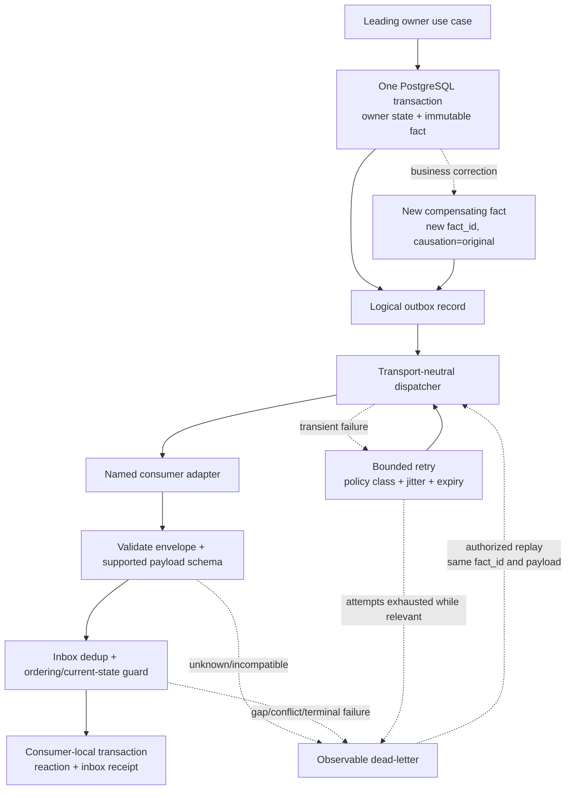
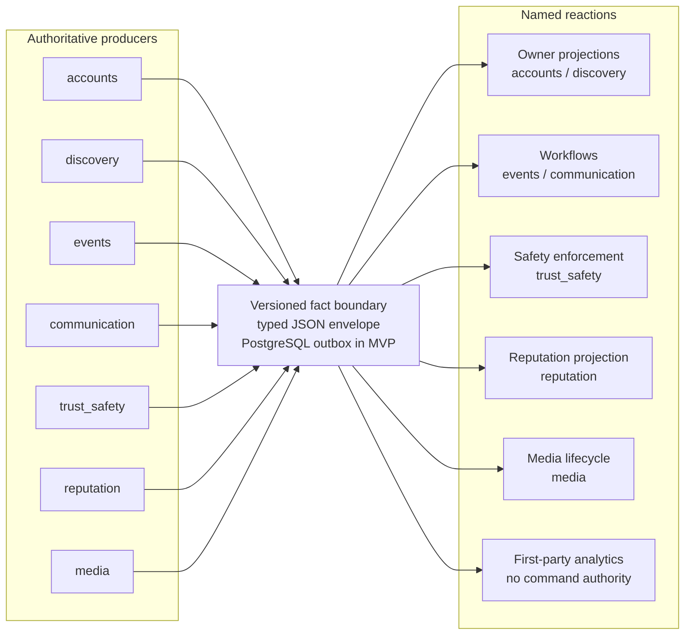

# G4.6 — Domain Event Catalogue

## Статус, цель и границы

- Статус: `DRAFT — ожидает подтверждения владельца`
- Горизонт: MVP/alpha
- Source of truth: owner state + immutable fact в одной PostgreSQL transaction
- MVP transport: PostgreSQL outbox → transport-neutral dispatcher/Celery adapter

Документ фиксирует имена значимых domain facts и analytics observations,
producer/consumer contracts, envelope, минимальные payload v1, ordering,
deduplication, retry, dead-letter, replay, compatibility, privacy и retention
classification.

Это логический catalogue, а не физический outbox/inbox design. Таблицы,
leases, polling, indexes, checkpoints, reconciliation jobs и точные технические
retention windows определяются в G4.7. Этот документ также не закрывает
отдельную Kafka-readiness matrix: Kafka отсутствует в MVP.

## Источники и приоритет

Приоритет: [PD](../../PRODUCT_DECISIONS.md) →
[ADR](../../DECISIONS.md) →
[незаменённая исходная спецификация](../../SOURCE_SPECIFICATION.md).

Документ развивает принятые:

- [G4.2 — modules/public ports/fact families](02-module-boundaries-and-public-ports.md);
- [G4.4A — data model/retention](04-data-model-retention-compaction.md);
- [G4.4B — state machines](04-state-machines.md);
- [G4.5 — API contracts/request security](05-api-contracts-and-request-security.md).

При конфликте `ACCEPTED` решений fact не публикуется и consumer не угадывает
значение.

## Терминология

| Термин | Нормативное значение |
|---|---|
| Domain fact | Immutable сообщение о уже принятом owner module бизнес-решении или изменении owner state |
| Analytics observation | Versioned immutable наблюдение read-only/отклонённого запроса; не даёт command authority и не меняет domain state |
| Producer | Ровно один owner module либо явно названный technical observation adapter |
| Consumer | Именованный module/technical projector; wildcard consumer contract запрещён |
| Delivery | At-least-once; duplicate является нормальным состоянием |
| Replay | Повторная доставка неизменённого сохранённого fact тому же/новому разрешённому consumer |
| Compensation | Новый fact с новым `fact_id`, ссылающийся causation на исправляемый fact |
| Transport task | Тонкий adapter с ID/version; не является domain fact и не содержит business rules |

Команда выражает намерение и может быть отклонена. Domain fact использует
прошедшее время и утверждает только уже committed результат. Будущее пожелание
не называется фактом.

## Envelope v1

Каждый domain fact сериализуется в JSON и валидируется общей envelope schema
плюс отдельной schema конкретного `fact_type`.

```json
{
  "fact_id": "opaque-uuidv7",
  "fact_type": "events.event_published",
  "schema_version": 1,
  "producer_module": "events",
  "aggregate_type": "event",
  "aggregate_id": "opaque-internal-id",
  "aggregate_version": 12,
  "aggregate_sequence": 18,
  "subject_event_id": "opaque-event-id-or-null",
  "occurred_at": "2026-07-29T00:00:00Z",
  "recorded_at": "2026-07-29T00:00:00Z",
  "actor": {
    "kind": "user",
    "actor_id": "opaque-internal-id-or-null"
  },
  "source": "public_web",
  "request_id": "opaque-request-id-or-null",
  "correlation_id": "opaque-correlation-id",
  "causation_id": "opaque-command-or-fact-id",
  "idempotency_key_id": "opaque-key-reference-or-null",
  "result": "applied",
  "reason_code": null,
  "rule_version": "opaque-rule-version",
  "privacy_class": "internal_minimized",
  "payload": {}
}
```

### Envelope field rules

| Field | Правило |
|---|---|
| `fact_id` | Stable UUIDv7; создаётся producer один раз и не меняется при retry/replay/смене transport |
| `fact_type` | Stable lowercase `<owner>.<past-tense-name>` для domain fact и `analytics.<past-tense-name>` для observation; routing не зависит от Python class name |
| `schema_version` | Положительное integer конкретного payload; версия envelope развивается отдельно implementation contract |
| `producer_module` | Один из семи owner modules; для observation разрешён только `api_telemetry` |
| `aggregate_type/id/version` | Owner aggregate и committed version; observation использует безопасный observed subject/version |
| `aggregate_sequence` | Strictly monotonic sequence внутри одного aggregate; разрешает несколько facts на одной state version |
| `subject_event_id` | ID пользовательского Event, если fact относится к нему; не заменяет `fact_id`/`aggregate_id` |
| `occurred_at` | Время бизнес-решения UTC; не время доставки |
| `recorded_at` | Время фиксации outbox/observation UTC; используется только для lag/quality |
| `actor` | `user`, `staff`, `service`, `system`, `anonymous`; только internal opaque ID при необходимости |
| `source` | Закрытый enum: public_web, mini_app, admin, user_bot, worker, scheduler, system, migration |
| request/correlation/causation | Correlation обязателен; request может отсутствовать у scheduler; causation у root command ссылается на command ID |
| `idempotency_key_id` | Только reference/hash ID, никогда raw client key |
| `result/reason_code` | Закрытые enums; message/free text запрещены; successful facts обычно `applied/finalized` |
| `rule_version` | Версия state/policy rules, но не закрытые weights/thresholds |
| `privacy_class` | Одно значение из каталога ниже; consumer не может повысить разрешённую детализацию |
| `payload` | Отдельный typed schema; `dict[str, Any]`, provider DTO и unknown fields запрещены |

`occurred_at`, ID и order producer определяет сервер. Actor, result,
permission, reason или aggregate version не копируются из непроверенного
client payload.

## Privacy и retention classification

| Class | Допустимо | Запрещено | Consumer boundary |
|---|---|---|---|
| `public_safe` | Поля уже разрешённой публичной projection, public IDs | Internal user ID, private state, exact location | Public projection/analytics |
| `internal_minimized` | Internal IDs, enums, counts, safe timestamps, owner versions | Profile copy, Telegram identity, raw text/media | Named internal consumers |
| `restricted_case` | Case/evidence opaque IDs, normalized decision/severity | Evidence text, exact location без отдельного case query, credentials | Case-bound trust/admin consumers |
| `security_minimized` | Staff/service opaque ID, action/outcome/reason, target ID | Password, token, session cookie, policy internals | Privileged audit/security consumers |

Envelope получает наиболее строгий class среди всех своих полей. Вложенный
`PublicProfileSummaryV1` или `EventCardSummaryV1` остаётся public-safe projection,
но наличие `user_id`, private reason или case ID делает весь fact
`internal_minimized`/`restricted_case`; consumer публикует только вложенную
allowlisted projection.

Payload никогда не содержит raw Telegram ID/username/profile, phone, IP,
`initData`, OIDC code/token, password, cookie, webhook secret, protected exact
coordinate/address, chat/complaint/dispute free text, media bytes/path, provider
raw payload, production reputation weights/thresholds или anti-fraud trace.
Public point допустим только в `EventCardSummaryV1`, когда owner уже committed
visibility `EXACT_PUBLIC`; hidden/participant-only point в fact отсутствует.

Колонка Retention в catalogue относится к нормализованному business
fact/projection из G4.4A. Технический outbox/inbox record живёт не меньше
максимального retry/replay window и получает точный срок только в G4.7.

## Ordering model

1. Global order между aggregates/modules отсутствует.
2. Logical `ordering_key` равен
   `(producer_module, aggregate_type, aggregate_id)`.
3. Для одного key consumer применяет facts по `aggregate_sequence`; sequence
   strictly monotonic, не обязана быть без пропусков до завершения delivery.
4. `aggregate_version` не уменьшается. Несколько facts одной owner transaction
   имеют одинаковую version и разные consecutive sequence.
5. Duplicate с уже принятым `fact_id` возвращает прежний inbox result.
6. Fact с меньшей/equal sequence и новым ID является conflict и не применяется
   автоматически.
7. Gap блокирует order-sensitive consumer, запускает bounded recovery/repair и
   не разрешает перепрыгнуть обязательный state/safety fact.
8. Разные aggregates могут обрабатываться параллельно.
9. Cross-aggregate saga не полагается на wall-clock order; correlation,
   causation, unique business key и current owner state определяют реакцию.
10. Safety hide сначала фиксирует authoritative restriction/tombstone и
    fail-closed guard; eventual projection fact не создаёт окно раскрытия.

## Deduplication и consumer contract

Каждый consumer имеет стабильный `consumer_name` вида
`<module>.<projection-or-use-case>.v1`.

Atomic consumer transaction:

1. валидирует envelope и exact supported payload schema;
2. пытается зарегистрировать unique `(consumer_name, fact_id)`;
3. проверяет ordering/current-state/business uniqueness;
4. применяет только принадлежащее consumer owner-state;
5. записывает inbox outcome/checkpoint и собственные follow-up facts;
6. commit выполняется один раз; crash до commit допускает повтор.

Inbox dedup не заменяет domain constraints: conversion остаётся unique by
LookingPost, participation outcome — unique by Event/user, reputation signal —
unique by source fact, notification — unique by source business key.

Consumer не:

- изменяет producer payload или envelope;
- пишет foreign schema;
- вызывает обратный synchronous command ради «подтверждения»;
- считает delivery exactly-once;
- выполняет side effect до durable dedup/current-state check;
- трактует unknown enum/version как ближайшее известное значение.

## Retry, expiry, dead-letter и replay

| Policy class | Примеры | Retry/expiry semantics | После исчерпания |
|---|---|---|---|
| `STATE_REQUIRED` | conversion, owner projection, final outcome, reputation signal | Bounded backoff+jitter; без business expiry; current-state/version recheck | Dead-letter + reconciliation/manual retry |
| `SAFETY_CRITICAL` | restriction/tombstone/revoke | Fail-closed уже действует у authority; быстрый bounded retry для consumers | Critical dead-letter/ops action; публичный доступ не открывать |
| `TIME_SENSITIVE` | waitlist/announcement/reminder/Telegram intent | Bounded retry до `expires_at`; stale source version → `skipped` | Normalized expired/skipped либо relevant dead-letter |
| `TECHNICAL_LIFECYCLE` | media processing/deletion, compaction trigger | Bounded type-specific retry; legal hold/current lifecycle recheck | Dead-letter + owner reconciliation |
| `ANALYTICS_REBUILDABLE` | page view, safe funnel/projection aggregates | Bounded low-priority retry; business path не блокируется | Drop only with observable quality gap or rebuild from retained source |

Бесконечный и один общий retry policy запрещены. Exact attempts/backoff/lease
значения являются G4.7/operations configuration.

Replay:

- сохраняет `fact_id`, payload, schema version, occurred time и ordering;
- не позволяет редактировать payload/recipient/IDs;
- разрешён только declared consumer и supported current/previous schema;
- повторно проходит current-state, privacy и expiry guards;
- privileged manual replay требует G4.3 permission/re-auth/audit;
- bulk replay отсутствует в MVP без отдельного подтверждения;
- если source fact больше не retained, owner snapshot/reconciliation создаёт
  новый repair/compensating fact, а не выдумывает старый.

## Compatibility и schema evolution

| Изменение | Разрешение |
|---|---|
| Добавить optional field с безопасным default/absence semantics | Compatible в той же `schema_version` |
| Расширить enum, если старый consumer не знает значение | Breaking; новая version либо explicit unknown-safe behavior заранее |
| Переименовать/remove field, изменить type/units/meaning/requiredness | Breaking; новая `schema_version` |
| Изменить privacy classification в более чувствительную сторону | Breaking + security review; existing consumers не получают поле автоматически |
| Разделить/объединить fact или поменять business trigger | Новый `fact_type`/version и migration plan |
| Изменить transport/outbox/Kafka adapter | Не меняет fact contract |

Producer публикует одну canonical version за transaction. В transition window
consumer поддерживает текущую и предыдущую schema version. Dual-write двух
семантически разных facts допускается только документированным migration plan,
с разными IDs и dedup/business guards. Unknown/incompatible version идёт в
observable dead-letter, не silently ignored.

## Delivery lifecycle



Текстовая альтернатива: leading owner в одной PostgreSQL transaction записывает
state и immutable fact. Dispatcher доставляет его named consumer. Consumer
валидирует schema, дедуплицирует и проверяет ordering/current state, после чего
атомарно меняет только своё состояние и пишет inbox receipt. Временный сбой
получает bounded retry; несовместимость, gap или исчерпание актуальной задачи —
dead-letter. Replay повторяет тот же fact. Исправление бизнеса создаёт новый
compensating fact.

## Fact topology



Текстовая альтернатива: семь authoritative owner modules записывают
типизированные facts через общую логическую boundary; в MVP она реализуется
PostgreSQL outbox. Только явно названные projections/workflows/safety/reputation/
media consumers и first-party analytics получают facts. Analytics не становится
восьмым доменным модулем и не влияет на business state.

## Payload type conventions

Ниже применяются alias-типы:

- `Id` — opaque internal ID;
- `PublicId` — opaque public resource identifier, never authorization proof;
- `Version`/`Sequence` — positive integer;
- `Code` — closed enum, не free text;
- `UtcTime` — RFC 3339 UTC;
- `Ref[]` — bounded список opaque IDs с declared purpose.

Если поле не перечислено в payload v1, producer его не добавляет. Common
envelope fields дублируются в payload только для self-describing business
schema; повторённые `event_id`/subject IDs обязаны точно совпадать с envelope и
проверяются quality guard.

Именованные projection payloads:

| Type | Exact fields v1 |
|---|---|
| `PublicProfileSummaryV1` | `public_profile_id:PublicId`, `nickname:str(3..32)`, `bio:str(0..150)`, `avatar_attachment_id:Id?`, `profile_version:Version` |
| `NotificationRoutingV1` | `telegram_delivery_allowed:bool`, `selected_notification_kinds:Code[]`, `routing_version:Version` |
| `EventCardSummaryV1` | `title:str`, `description:str`, `event_type:Code`, `organizer_public_profile_id:PublicId`, `city_id:Id`, `category_id:Id`, `starts_at:UtcTime`, `ends_at:UtcTime`, `lifecycle:Code`, `marker_mode:Code`, `street_id:Id?`, `public_point:{lat:decimal,lon:decimal}?`, `card_version:Version` |
| `EventFinalCardSummaryV1` | `title:str`, `description:str`, `event_type:Code`, `organizer_public_profile_id:PublicId`, `city_id:Id`, `category_id:Id`, `starts_at:UtcTime`, `ends_at:UtcTime`, `final_state:Code`, `street_id:Id?`, `card_version:Version` |
| `AttendanceWindowV1` | `opens_at:UtcTime`, `closes_at:UtcTime`, `max_attempts:int`, `window_version:Version` |
| `CapacityStateV1` | `capacity:int`, `active_participants:int`, `reserved_offers:int`, `waitlist_count:int`, `capacity_version:Version` |
| `RoleSummariesV1` | `organizer_level:Code`, `participant_level:Code`, `successful_organized_count:int`, `calculation_version:Version` |

`public_point` обязателен только при `marker_mode=EXACT_PUBLIC`; в остальных
режимах он `null`. `EventFinalCardSummaryV1` никогда не содержит point и
показывает место максимум до улицы.

## `accounts` facts

| Fact type v1 | Trigger | Payload v1 | Consumers / purpose | Order / policy / privacy / retention |
|---|---|---|---|---|
| `accounts.identity_linked` | First verified Telegram identity creates/links internal User | `user_id:Id`, `identity_kind:Code`, `is_new_user:bool` | `communication.user_routing.v1` initializes safe delivery state; `trust_safety.user_subject.v1` initializes subject | User key; STATE_REQUIRED; internal; `R12_LONG_TERM` normalized link, external identity stays protected |
| `accounts.profile_created` | Default public Profile committed | `user_id:Id`, `safe_profile:PublicProfileSummaryV1` | `accounts.public_profile.v1`, analytics | User key; STATE_REQUIRED; internal_minimized with nested public-safe summary; current projection + `R12` links |
| `accounts.profile_changed` | Approved nickname/bio/avatar relation version committed | `user_id:Id`, `changed_fields:Code[]`, `safe_profile:PublicProfileSummaryV1` | `accounts.public_profile.v1`, discovery safe organizer summaries, analytics | User key; STATE_REQUIRED; internal_minimized with nested public-safe summary; current projection, old details by owner retention |
| `accounts.preferences_changed` | Privacy/notification routing preference committed | `user_id:Id`, `changed_fields:Code[]`, `notification_routing:NotificationRoutingV1` | `communication.user_routing.v1` only; analytics receives field codes without values | User key; STATE_REQUIRED; internal; current preference |
| `accounts.bot_delivery_state_changed` | Verified `/start`, block or delivery capability change | `user_id:Id`, `delivery_state:Code`, `changed_at:UtcTime` | `communication.user_routing.v1` | User key; STATE_REQUIRED; internal; current state |
| `accounts.deletion_requested` | Account enters DELETION_REQUESTED | `user_id:Id`, `requested_at:UtcTime`, `reason_code:Code` | communication revoke/suppress; trust safety hold check; owner cleanup coordinators; analytics | User key; SAFETY_CRITICAL; internal; retain through erasure checkpoints, then apply account-erasure retention |
| `accounts.erased` | Erasure/anonymization successfully finalized | `user_id:Id`, `erasure_version:Version`, `anonymized_relations:Code[]` | All modules holding allowed user references, analytics | User key; STATE_REQUIRED; internal; identifiable routing fact expires after all checkpoints/replay window, only non-identifying normalized erasure outcome remains |

`identity_kind` не содержит issuer/subject/Telegram ID. Profile fact не копирует
Telegram name/picture и private preferences.

## `discovery` facts

| Fact type v1 | Trigger | Payload v1 | Consumers / purpose | Order / policy / privacy / retention |
|---|---|---|---|---|
| `discovery.city_changed` | Admin commits city/polygon/active config | `city_id:Id`, `state:Code`, `catalog_version:Version` | events validation cache/projection, public catalog, analytics | City key; STATE_REQUIRED; public_safe except geometry absent; current catalog/history |
| `discovery.category_changed` | Category create/update/disable committed | `category_id:Id`, `state:Code`, `display_version:Version` | events validation, public catalog, analytics | Category key; STATE_REQUIRED; public_safe; current catalog/history |
| `discovery.looking_post_published` | LookingPost enters ACTIVE | `post_id:Id`, `author_user_id:Id`, `city_id:Id`, `category_id:Id`, `expires_at:UtcTime` | communication notification planning, analytics | Post key; TIME_SENSITIVE until expiry; internal; normalized outcome `R12`, text `R2` |
| `discovery.looking_post_revised` | Allowed ACTIVE revision committed | `post_id:Id`, `changed_fields:Code[]`, `expires_at:UtcTime` | discovery projection, communication stale-intent checks, analytics | Post key; TIME_SENSITIVE; internal; details `R2` |
| `discovery.looking_post_interest_changed` | Interest added/removed | `post_id:Id`, `user_id:Id`, `state:Code`, `active_count:int` | conversion workflow, analytics | Post ordering key plus unique post/user guard; STATE_REQUIRED; internal; normalized counts/outcome |
| `discovery.looking_post_conversion_requested` | Unique conversion reservation enters pending | `post_id:Id`, `author_user_id:Id`, `city_id:Id`, `category_id:Id`, `reservation_id:Id` | `events.looking_post_conversion.v1` creates one draft; communication pending status | Post key; STATE_REQUIRED; internal; `R12` link |
| `discovery.looking_post_converted` | Matching Event draft link committed | `post_id:Id`, `event_id:Id`, `reservation_id:Id` | communication, accounts summaries, analytics | Post key; STATE_REQUIRED; internal; `R12` |
| `discovery.looking_post_interest_transfer_requested` | Converted link exists; emitted once per active interest | `post_id:Id`, `event_id:Id`, `reservation_id:Id`, `user_id:Id`, `interest_version:Version` | events creates one Event interest without capacity; analytics dedup | Post key plus unique reservation/user; STATE_REQUIRED; internal; `R12` interest outcome |
| `discovery.looking_post_closed` | Expired/removed/blocked without conversion | `post_id:Id`, `final_state:Code`, `reason_code:Code`, `closed_at:UtcTime` | communication stale notifications, analytics | Post key; STATE_REQUIRED; internal; `R2` detail → `R12` outcome |

Interest переносится отдельным fact на каждого пользователя; unbounded ID array
в conversion payload запрещён. Перенос создаёт только Event interest, не
capacity/participant. Текст LookingPost в facts отсутствует.

## `events` lifecycle и revision facts

| Fact type v1 | Trigger | Payload v1 | Consumers / purpose | Order / policy / privacy / retention |
|---|---|---|---|---|
| `events.event_draft_created` | Draft Event committed | `event_id:Id`, `organizer_user_id:Id`, `event_type:Code`, `city_id:Id`, `source_post_id:Id?` | conversion-link workflow and analytics; discovery/accounts public projections получают только после safe publication | Event key; STATE_REQUIRED; internal; `R4` draft then owner outcome |
| `events.event_published` | Event enters SCHEDULED after all guards | `event_id:Id`, `organizer_user_id:Id`, `location_visibility:Code`, `safe_card:EventCardSummaryV1` | discovery public projection, communication planning, trust_safety context, accounts organizer summary, analytics | Event key; STATE_REQUIRED; internal_minimized with nested public-safe card; `R12` |
| `events.revision_submitted` | One pending EventRevision committed | `event_id:Id`, `revision_id:Id`, `change_kind:Code`, `criticality:Code`, `changed_fields:Code[]` | trust_safety moderation case, analytics | Event key; STATE_REQUIRED; restricted_case; detail `R6` |
| `events.revision_applied` | Approved revision becomes current Event | `event_id:Id`, `revision_id:Id`, `change_kind:Code`, `criticality:Code`, `safe_card:EventCardSummaryV1`, `previous_schedule_version:Version` | discovery projection, communication replacement notifications/tasks, accounts summary, analytics | Event key; STATE_REQUIRED; internal_minimized with nested public-safe card; `R6`→`R12` result |
| `events.revision_rejected` | Revision rejected/current Event unchanged | `event_id:Id`, `revision_id:Id`, `reason_code:Code` | communication organizer notice, analytics | Event key; STATE_REQUIRED; restricted_case; `R6`→normalized decision |
| `events.event_started` | SCHEDULED → IN_PROGRESS | `event_id:Id`, `cohort_version:Version`, `attendance_window:AttendanceWindowV1` | communication chat/notification, analytics; owner workers use current state | Event key; STATE_REQUIRED; internal; `R12` lifecycle |
| `events.event_completion_pending` | Event reaches end/cancel completion workflow | `event_id:Id`, `completion_reason:Code`, `retention_anchor_at:UtcTime` | communication retention schedules, attendance worker, media lifecycle, analytics | Event key; STATE_REQUIRED/TECHNICAL_LIFECYCLE; internal; `R12` |
| `events.event_completed` | All final outcomes/checkpoints exist | `event_id:Id`, `final_state:Code`, `final_snapshot_version:Version`, `safe_final_card:EventFinalCardSummaryV1` | discovery/account final projections, reputation reconciliation, communication, analytics | Event key; STATE_REQUIRED; public_safe summary; `R12` |
| `events.event_cancelled` | Allowed cancellation committed | `event_id:Id`, `reason_code:Code`, `cancelled_at:UtcTime`, `safe_final_card:EventFinalCardSummaryV1` | discovery hide/final card, communication, media/retention, accounts, analytics | Event key; STATE_REQUIRED; public-safe summary; `R12` |
| `events.event_visibility_changed` | Owner applies moderation/low-activity/location visibility decision | `event_id:Id`, `visibility:Code`, `reason_code:Code`, `decision_version:Version`, `safe_card:EventCardSummaryV1?` | discovery fail-closed projection, communication access/notices, analytics | Event key; SAFETY_CRITICAL for hide; internal_minimized with optional public-safe card; `R12` decision |
| `events.location_visibility_changed` | Organizer commits allowed reveal/hide | `event_id:Id`, `visibility:Code`, `audience:Code`, `changed_at:UtcTime` | discovery marker mode, communication reminders, analytics | Event key; SAFETY_CRITICAL for revoke; internal; `R12` audit link; no coordinate/address |

## `events` participation, waitlist и attendance facts

| Fact type v1 | Trigger | Payload v1 | Consumers / purpose | Order / policy / privacy / retention |
|---|---|---|---|---|
| `events.interest_changed` | Event interest added/removed | `event_id:Id`, `user_id:Id`, `state:Code`, `active_count:int` | communication optional notice, analytics | Event key + unique event/user; STATE_REQUIRED; internal; `R12` aggregate/outcome |
| `events.participation_joined` | Active episode committed | `event_id:Id`, `user_id:Id`, `episode_id:Id`, `capacity_state:CapacityStateV1` | communication routing/chat, analytics | Event key; STATE_REQUIRED; internal; participation `R12` |
| `events.participation_left` | Voluntary terminal transition committed | `event_id:Id`, `user_id:Id`, `episode_id:Id`, `reason_code:Code`, `late:bool` | communication access/notice, reputation eventual final outcome, analytics | Event key; SAFETY_CRITICAL for chat revoke; internal; `R12` |
| `events.participation_excluded` | Organizer/staff exclusion committed | `event_id:Id`, `user_id:Id`, `episode_id:Id`, `reason_code:Code`, `decision_id:Id?` | communication immediate revoke, trust_safety context, analytics | Event key; SAFETY_CRITICAL; restricted/internal; `R12` |
| `events.waitlist_joined` | New FIFO tail entry committed | `event_id:Id`, `user_id:Id`, `entry_id:Id`, `queue_position:Sequence` | communication acknowledgement, analytics | Event key; STATE_REQUIRED; internal; operational → `R12` outcome |
| `events.waitlist_offer_created` | Capacity transaction reserves slot | `event_id:Id`, `user_id:Id`, `entry_id:Id`, `offer_id:Id`, `expires_at:UtcTime`, `offer_version:Version` | communication time-sensitive delivery, analytics | Event key; TIME_SENSITIVE; internal; operational/outcome |
| `events.waitlist_offer_closed` | Accepted/declined/expired/revoked | `event_id:Id`, `user_id:Id`, `offer_id:Id`, `final_state:Code`, `reason_code:Code` | communication stale-delivery suppression, analytics | Event key; STATE_REQUIRED; internal; outcome |
| `events.attendance_redeemed` | First valid code redemption finalizes attended | `event_id:Id`, `user_id:Id`, `episode_id:Id`, `decision_version:Version` | reputation via final outcome only, communication, analytics | Event key; STATE_REQUIRED; internal; detail `R7`, outcome `R12` |
| `events.attendance_provisional_no_show_created` | End worker finds no success | `event_id:Id`, `user_id:Id`, `decision_id:Id`, `dispute_deadline:UtcTime` | communication notification, analytics; reputation does not consume | Event key; TIME_SENSITIVE; internal; `R7` |
| `events.attendance_dispute_opened` | User opens valid dispute | `event_id:Id`, `user_id:Id`, `decision_id:Id`, `case_id:Id`, `reason_code:Code` | trust_safety queue, communication, analytics | Event key; STATE_REQUIRED; restricted_case; explanation omitted; `R7/R8` |
| `events.attendance_finalized` | Attended/neutral/no-show final decision committed | `event_id:Id`, `user_id:Id`, `episode_id:Id`, `final_result:Code`, `reason_code:Code`, `outcome_version:Version` | events normalized outcome updater, communication, analytics; reputation не consumer | Event key; STATE_REQUIRED; internal; `R12` |
| `events.participation_outcome_finalized` | Unique normalized Event/user outcome committed | `event_id:Id`, `user_id:Id`, `outcome_version:Version`, `summary_codes:Code[]`, `reputation_eligible:bool` | reputation, accounts safe aggregate, analytics | Event key; STATE_REQUIRED; internal; `R12` |
| `events.participation_outcome_corrected` | Approved correction after finalization | `event_id:Id`, `user_id:Id`, `previous_outcome_version:Version`, `outcome_version:Version`, `corrected_summary_codes:Code[]`, `reputation_eligible:bool`, `reason_code:Code` | reputation compensating/new signal, accounts/analytics correction | Event key; STATE_REQUIRED; internal; `R12` |
| `events.rating_recorded` | Eligible 1–5 rating committed | `event_id:Id`, `user_id:Id`, `stars:int`, `eligibility_source:Code` | reputation/analytics aggregates | Event key; STATE_REQUIRED; internal; `R12` |

Reputation не потребляет provisional attendance или raw attempts. Final
reputation signal создаётся один раз на `(event_id,user_id,outcome_version)`;
correction создаёт compensating signal.

## `communication` facts

| Fact type v1 | Trigger | Payload v1 | Consumers / purpose | Order / policy / privacy / retention |
|---|---|---|---|---|
| `communication.chat_message_created` | Allowed message committed | `event_id:Id`, `message_id:Id`, `author_user_id:Id`, `created_at:UtcTime` | analytics counts; trust_safety получает только evidence ref после complaint | Event/thread key; ANALYTICS_REBUILDABLE; internal; text `R3`, normalized count only |
| `communication.announcement_published` | Organizer announcement committed | `event_id:Id`, `announcement_id:Id`, `created_at:UtcTime`, `expires_at:UtcTime` | notification planning, analytics | Event key; TIME_SENSITIVE; internal; text `R3` |
| `communication.notification_created` | Unique source business key creates internal notification | `notification_id:Id`, `user_id:Id`, `source_fact_id:Id`, `kind:Code`, `expires_at:UtcTime?` | delivery workflow, analytics | Notification key; STATE_REQUIRED for internal center; downstream delivery is TIME_SENSITIVE; internal; `R6_NOTIFICATION` |
| `communication.notification_acknowledged` | User ack/read state committed | `notification_id:Id`, `user_id:Id`, `state:Code`, `acknowledged_at:UtcTime` | analytics | Notification key; ANALYTICS_REBUILDABLE; internal; `R6_NOTIFICATION` |
| `communication.telegram_delivery_succeeded` | Provider accepted current delivery | `notification_id:Id`, `user_id:Id`, `delivery_id:Id`, `bot_kind:Code`, `attempt:int` | accounts delivery health, analytics | Delivery key; ANALYTICS_REBUILDABLE; internal; `R6_NOTIFICATION` |
| `communication.telegram_delivery_failed` | Terminal/dead-letter/expired/skipped outcome | `notification_id:Id`, `user_id:Id`, `delivery_id:Id`, `bot_kind:Code`, `final_state:Code`, `reason_code:Code`, `attempts:int` | accounts delivery state where relevant, operations metadata, analytics | Delivery key; TIME_SENSITIVE; security/internal; `R6_NOTIFICATION/R9` |
| `communication.evidence_reference_created` | Complaint links retained message/announcement | `case_id:Id`, `evidence_ref_id:Id`, `subject_type:Code`, `subject_id:Id`, `retention_deadline:UtcTime` | trust_safety case only | Evidence key; STATE_REQUIRED; restricted_case; does not extend `R3` text |

Chat/announcement text и Telegram provider payload/message body в facts
отсутствуют. `bot_kind` distinguishes user/operations bot namespaces.

## `trust_safety` facts

| Fact type v1 | Trigger | Payload v1 | Consumers / purpose | Order / policy / privacy / retention |
|---|---|---|---|---|
| `trust_safety.moderation_case_opened` | Valid source creates unique case | `case_id:Id`, `subject_type:Code`, `subject_id:Id`, `subject_version:Version`, `severity:Code`, `sla_target_at:UtcTime` | admin queue projection, analytics | Case key; STATE_REQUIRED; restricted_case; `R8`→normalized `R12` |
| `trust_safety.moderation_decision_recorded` | Reviewer commits approve/reject/hold/dismiss/uphold | `case_id:Id`, `decision_id:Id`, `subject_type:Code`, `subject_id:Id`, `subject_version:Version`, `outcome:Code`, `reason_code:Code`, `measure_code:Code?` | subject owner applies decision, communication, analytics | Case key; SAFETY_CRITICAL where restrictive; restricted_case; `R8/R12` |
| `trust_safety.complaint_opened` | Complaint committed | `case_id:Id`, `reporter_user_id:Id`, `subject_type:Code`, `subject_id:Id`, `category:Code`, `severity:Code`, `evidence_refs:Ref[]` | admin queue, analytics | Case key; STATE_REQUIRED; restricted_case; no complaint text; `R8` |
| `trust_safety.appeal_opened` | Valid appeal committed | `case_id:Id`, `appeal_id:Id`, `decision_id:Id`, `applicant_user_id:Id`, `deadline:UtcTime` | admin queue, communication, analytics | Case key; STATE_REQUIRED; restricted_case; `R8` |
| `trust_safety.appeal_resolved` | Eligible reviewer finalizes appeal | `case_id:Id`, `appeal_id:Id`, `original_decision_id:Id`, `outcome:Code`, `reason_code:Code` | subject owner compensation/restoration guard, reputation compensation, communication, analytics | Case key; SAFETY_CRITICAL; restricted_case; `R12` normalized decision |
| `trust_safety.restriction_activated` | Current restriction committed | `restriction_id:Id`, `subject_type:Code`, `subject_id:Id`, `action_scope:Code`, `measure_code:Code`, `expires_at:UtcTime?` | accounts, discovery, events, communication, reputation, analytics | Subject restriction key; SAFETY_CRITICAL; security/internal; `R12` |
| `trust_safety.restriction_ended` | Revoked/expired/reversed restriction committed | `restriction_id:Id`, `subject_type:Code`, `subject_id:Id`, `final_state:Code`, `reason_code:Code` | same consumers re-evaluate current owner state; no automatic republish | Subject key; SAFETY_CRITICAL; security/internal; `R12` |
| `trust_safety.safety_tombstone_changed` | Fail-closed tombstone activated/cleared | `subject_type:Code`, `subject_id:Id`, `hidden:bool`, `decision_version:Version`, `reason_code:Code` | discovery/accounts public projections, events/communication access, analytics | Subject key; SAFETY_CRITICAL; internal; `R12` |

Clear/reversal fact не гарантирует restoration: consumer повторно проверяет
Event/Profile lifecycle, TTL, current restriction и allowed transition.

## `reputation` facts

| Fact type v1 | Trigger | Payload v1 | Consumers / purpose | Order / policy / privacy / retention |
|---|---|---|---|---|
| `reputation.signal_recorded` | Final owner outcome accepted once | `signal_id:Id`, `subject_user_id:Id`, `role_component:Code`, `source_fact_id:Id`, `source_outcome_version:Version`, `signal_code:Code`, `policy_version:Code` | reputation projector/reconciliation, analytics safe counts | User key; STATE_REQUIRED; internal; ledger `R12`; no weight/delta |
| `reputation.signal_compensated` | Approved source correction | `signal_id:Id`, `subject_user_id:Id`, `original_signal_id:Id`, `source_fact_id:Id`, `reason_code:Code`, `policy_version:Code` | reputation projector, analytics correction | User key; STATE_REQUIRED; internal; ledger `R12` |
| `reputation.projection_changed` | New projection version committed | `subject_user_id:Id`, `projection_version:Version`, `public_status:Code`, `confidence_band:Code`, `role_summaries:RoleSummariesV1` | accounts public profile projection, trust_safety local safe projection, analytics | User key; STATE_REQUIRED; internal_minimized with nested public-safe role summary; current + links `R12` |
| `reputation.policy_activated` | Preloaded opaque policy version activated | `policy_version:Code`, `activation_id:Id`, `activated_at:UtcTime` | reputation reconciliation scheduler, privileged analytics/audit | Policy key; STATE_REQUIRED; security_minimized; `R12` audit link |

Signal payload не содержит numeric weight, component delta, threshold, raw
signals или anti-fraud reason. Production policy остаётся внешней конфигурацией.

## `media` facts

| Fact type v1 | Trigger | Payload v1 | Consumers / purpose | Order / policy / privacy / retention |
|---|---|---|---|---|
| `media.upload_registered` | Attachment/upload intent committed | `attachment_id:Id`, `owner_user_id:Id`, `purpose:Code`, `declared_type:Code`, `upload_expires_at:UtcTime` | owner UI/workflow, analytics counts | Attachment key; TIME_SENSITIVE; internal; transient/owner metadata |
| `media.processing_completed` | Decode/validate/re-encode variants succeed | `attachment_id:Id`, `purpose:Code`, `technical_state:Code`, `variants:Code[]`, `processing_version:Version` | accounts/discovery/events readiness, trust_safety moderation queue, analytics | Attachment key; STATE_REQUIRED; internal; bytes owner `R5` |
| `media.processing_rejected` | Technical validation terminally rejects upload | `attachment_id:Id`, `purpose:Code`, `reason_code:Code`, `processing_version:Version` | referencing owner, communication user notice, analytics | Attachment key; STATE_REQUIRED; internal; no decoder/provider detail |
| `media.deletion_requested` | Owner lifecycle/retention requests controlled deletion | `attachment_id:Id`, `reason_code:Code`, `source_owner_type:Code`, `source_owner_id:Id`, `not_before:UtcTime` | media cleanup worker/reconciliation | Attachment key; TECHNICAL_LIFECYCLE; internal; `R5`/hold |
| `media.deleted` | Bytes/variants deleted and tombstone committed | `attachment_id:Id`, `deletion_version:Version`, `reason_code:Code`, `deleted_variants:Code[]` | referencing owner reconciliation, analytics | Attachment key; STATE_REQUIRED; internal; tombstone minimum |
| `media.deletion_held` | Legal/dispute/current-reference guard blocks deletion | `attachment_id:Id`, `hold_reason:Code`, `recheck_after:UtcTime?` | owner cleanup/reconciliation, operations metadata | Attachment key; TECHNICAL_LIFECYCLE; restricted/internal; no case text |

Storage path, checksum usable as identifier, media bytes, EXIF и decoder error
detail в fact не входят.

## Analytics observations и rejected outcomes

Analytics observations используют тот же immutable envelope/schema discipline,
но:

- producer `api_telemetry` не является domain module;
- consumer только `first_party_analytics.v1` и security-quality aggregate;
- observation не запускает domain command/projection/safety/reputation;
- потеря не откатывает user request, но quality gap наблюдаем;
- anonymous actor не получает долгоживущий visitor ID.

| Fact type v1 | Trigger/payload v1 | Counting/privacy/retention |
|---|---|---|
| `analytics.event_card_viewed` | После разрешённой выдачи: `subject_event_id:Id`, `city_id:Id`, `category_id:Id`, `viewer_kind:Code`, `source:Code` | Каждый допустимый view; anonymous без actor ID; known bot/blocked request не считается; aggregate/link `R12` |
| `analytics.command_rejected` | Owner-mapped rejection: `owner_module:Code`, `capability:Code`, `action:Code`, `result:Code`, `reason_code:Code`, `subject_type:Code?`, `subject_id:Id?` | Strict per-owner enums; concealed target omitted; no raw field/error; security/internal retention by scenario |
| `analytics.search_performed` | Allowed query: `city_id:Id`, `filter_codes:Code[]`, `result_count_band:Code`, `viewer_kind:Code` | No raw search text/private location/visitor ID; aggregate only |

Успешные state-changing outcomes считаются по authoritative domain facts, а не
по HTTP success logs. Duplicate delivery не увеличивает aggregate: analytics
dedup по `fact_id`.

## Producer/consumer registry

| Family | Producer | Declared consumers |
|---|---|---|
| Identity/profile/lifecycle | `accounts` | communication routing, trust_safety subject, accounts/discovery safe projections, analytics |
| Catalog/LookingPost/conversion | `discovery` | events conversion, communication, catalog/projection consumers, analytics |
| Event lifecycle/revisions | `events` | discovery, communication, trust_safety, accounts, media lifecycle, analytics |
| Participation/waitlist/attendance | `events` | communication, trust_safety cases, reputation final signals, accounts safe summaries, analytics |
| Chat/notification delivery | `communication` | trust_safety evidence references, accounts delivery state, operations metadata, analytics |
| Restriction/moderation/safety | `trust_safety` | accounts, discovery, events, communication, reputation, admin queues, analytics |
| Reputation signal/projection | `reputation` | accounts, trust_safety local projection, analytics |
| Media readiness/lifecycle | `media` | accounts, discovery, events, trust_safety, communication notices, analytics |
| Read/rejection observations | `api_telemetry` | first-party analytics/security-quality only |

Добавление consumer требует явного purpose, privacy review, stable
`consumer_name`, supported schema versions, retry class и owner. «Подписаться на
всё» запрещено.

## Cross-scenario chains и failure semantics

### LookingPost conversion

1. `discovery.looking_post_conversion_requested` committed once.
2. Events consumer dedup по fact/business reservation и создаёт один draft.
3. Events публикует `events.event_draft_created` с `source_post_id`.
4. Discovery consumer фиксирует link и публикует
   `discovery.looking_post_converted`.
5. Discovery публикует отдельный
   `discovery.looking_post_interest_transfer_requested` на каждый active
   interest; Events dedup по reservation/user и не занимает capacity.
6. Gap/retry не создаёт второй Event или interest; reconciliation G4.7 сверяет
   reservation/link/transferred count.

### Event publication/revision

1. Events commit publication/revision application.
2. Discovery projection применяет only monotonic Event sequence.
3. Communication заменяет stale schedules по source Event version.
4. Accounts получает только safe organizer summary.
5. Safety hide не ждёт этой цепочки: authority/tombstone закрывает выдачу
   fail-closed, затем consumers reconcile.

### Attendance → reputation

1. Provisional no-show создаёт только user notification.
2. Reputation не читает provisional/attempt/evidence.
3. `participation_outcome_finalized` создаёт unique source outcome.
4. Reputation записывает one signal per source fact/outcome version.
5. Correction создаёт `participation_outcome_corrected`, затем
   `reputation.signal_compensated`; original facts не переписываются.

### Notification delivery

1. Source fact создаёт unique internal notification/source business key.
2. Delivery проверяет current source version, routing и expiry.
3. Telegram/Redis failure не меняет committed source business state.
4. Stale/expired delivery фиксирует normalized outcome и не отправляется.
5. Dead-letter payload нельзя редактировать; retry повторяет same intent после
   current-state check.

### Account erasure

1. `accounts.deletion_requested` подавляет sessions/delivery и запускает named
   owner reactions.
2. Каждый consumer применяет own retention/dispute/legal-hold rules.
3. Completion возможен после checkpoints/reconciliation.
4. `accounts.erased` заставляет projections удалить/анонимизировать оставшиеся
   links; immutable safety/legal facts сохраняют только разрешённый минимум.

## Quality checks

| Check | Нарушение |
|---|---|
| Unique `fact_id` и immutable fingerprint | Quarantine/security alert; payload не заменять |
| Monotonic aggregate sequence/version | Gap/conflict; stop order-sensitive consumer |
| Supported exact payload schema | Dead-letter incompatible, no guessing |
| Declared producer/fact ownership | Reject/quarantine |
| Declared consumer/purpose/privacy | Не доставлять |
| Consumer inbox uniqueness | Duplicate returns previous outcome |
| Subject event ID consistency | Reconciliation; не связывать с другим Event |
| Source outcome/reputation uniqueness | Block duplicate signal and reconcile |
| Notification source version/expiry | Skip obsolete intent with reason |
| Safety tombstone parity | Public fail-closed and critical repair |
| Retention/privacy field allowlist | Block publication, security incident review |
| Analytics duplicate/count rules | Correct aggregate by fact ID/version |

## Явно вне G4.6

- Physical outbox/inbox schemas, SQL indexes, leases, polling batch size и
  reconciliation jobs.
- Exact retry counts, backoff durations и technical record retention windows.
- Dead-letter admin DTO/view, operations bot alert payload и recipient workflow.
- Kafka topics/partitions/ACLs/lag thresholds и решение о подключении Kafka.
- Production Pydantic classes, Celery task signatures и generated schemas.
- Secrets, production policy values, protected coordinates/private text/media.
- WebSocket events, achievements/challenges и post-MVP services.

## Архитектурные инварианты

| ID | Инвариант |
|---|---|
| `EVT-01` | Fact сообщает только committed past result одного authoritative producer |
| `EVT-02` | State и fact записываются одной owner transaction; delivery следует после commit |
| `EVT-03` | `fact_id`/payload immutable; correction — новый compensating fact |
| `EVT-04` | At-least-once delivery и inbox/domain dedup обязательны |
| `EVT-05` | Global ordering отсутствует; mandatory order только per aggregate sequence |
| `EVT-06` | Unknown schema/enum/gap не угадывается и не пропускается silently |
| `EVT-07` | Consumer меняет только own state и повторно проверяет current guards |
| `EVT-08` | Safety enforcement fail-closed и не зависит от eventual normal projection |
| `EVT-09` | Replay не редактирует fact и не обходит privacy/current-state/expiry |
| `EVT-10` | Analytics observations не становятся command authority |
| `EVT-11` | Payload не копирует profiles, protected location, private text, credentials или policy internals; public point разрешён только в `EXACT_PUBLIC` card |
| `EVT-12` | Transport может измениться без изменения use case/fact semantics |

## Traceability

| Решение | Источник |
|---|---|
| Envelope, subject Event ID, typed JSON, schema evolution | `PD-018`, `ADR-017` |
| Owner transaction + outbox, retries/dead-letter/stale checks | `PD-012`, `ADR-015` |
| Modules/producers/consumers/fact families | `ADR-010`, `G4.2` |
| State transitions, compensation и ordering chains | `ADR-012`, `G4.4B` |
| Final Event/outcomes/retention/privacy | `PD-014`, `ADR-016`, `G4.4A` |
| Participation/waitlist/attendance | `PD-004`, `PD-006`, `ADR-012` |
| Chat/notification delivery | `PD-007`, `PD-010`, `ADR-015` |
| Safety/moderation/fail-closed | `PD-008`, `PD-009`, `ADR-011` |
| Telegram identities/credentials excluded | `PD-015`, `ADR-020`, `G4.5` |
| Media lifecycle facts | `PD-010`, `ADR-019` |

## Acceptance checklist

- [x] Документ остаётся `DRAFT` до owner review.
- [x] Envelope содержит все обязательные `ADR-017`/`PD-018` поля.
- [x] Facts имеют stable owner, trigger, exact minimal payload v1 и consumers.
- [x] Все восемь G4.2 fact families детализированы.
- [x] Page views/rejected commands отделены как non-authoritative observations.
- [x] Ordering определён per aggregate без ложного global order.
- [x] Dedup использует inbox и domain uniqueness.
- [x] Retry classes bounded; expiry/stale/dead-letter/replay semantics заданы.
- [x] Compatibility поддерживает current + previous schema version.
- [x] Compensation не переписывает original fact.
- [x] Protected location, private text, media, credentials и policy internals исключены; `EXACT_PUBLIC` point ограничен card projection.
- [x] Диаграммы имеют отдельные `.mmd` и текстовые альтернативы.
- [x] G4.6 checkbox/changelog принятия и G4.7/Kafka пункты не изменены.
- [x] Production schemas/Celery/SQL/Kafka не созданы.
