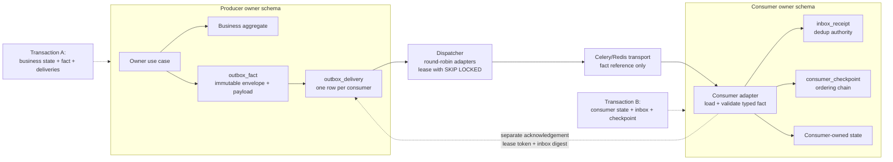
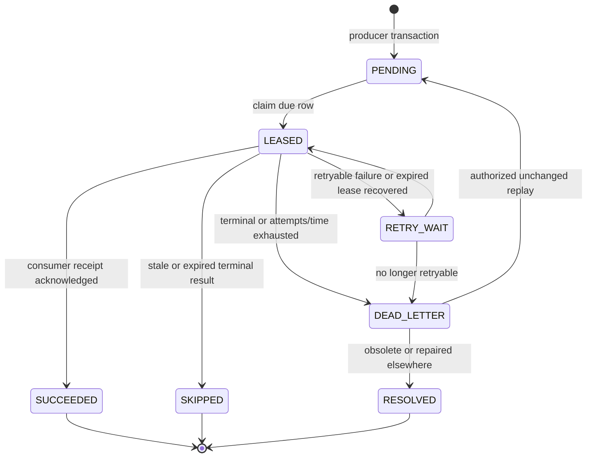
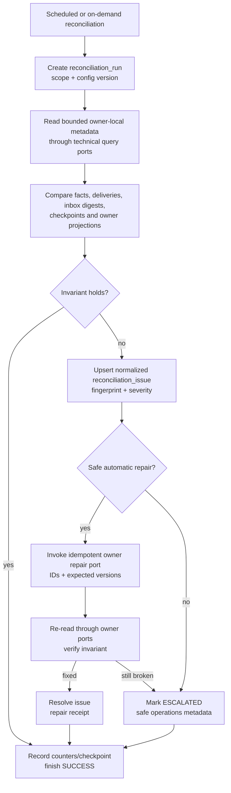

# G4.7 — Transactional outbox/inbox и reconciliation jobs

## Статус, цель и границы

- Статус: `DRAFT — ожидает подтверждения владельца`
- Горизонт: MVP/alpha на одном PostgreSQL/PostGIS server
- Delivery guarantee: at-least-once
- MVP transport: owner-local PostgreSQL outbox → dispatcher → Celery/Redis

Документ фиксирует физическую логическую модель owner-local outbox/inbox,
fan-out, leases, dispatcher, retry defaults, acknowledgement boundary,
retention/cleanup и reconciliation jobs.

Таблицы и индексы ниже нормативны на уровне PostgreSQL design, но это не
SQL/Alembic migration и не production-код. Dead-letter admin view, safe
operations-bot DTO/recipient workflow и Kafka-readiness остаются отдельными
пунктами G4.

## Источники и приоритет

Приоритет: [PD](../../PRODUCT_DECISIONS.md) →
[ADR](../../DECISIONS.md) →
[незаменённая исходная спецификация](../../SOURCE_SPECIFICATION.md).

Документ развивает принятые:

- [G4.2 — owner schemas/public ports](02-module-boundaries-and-public-ports.md);
- [G4.4A — data model/retention/compaction](04-data-model-retention-compaction.md);
- [G4.6 — Domain Event Catalogue](06-domain-event-catalogue.md).

При конфликте `ACCEPTED` решений dispatcher останавливает затронутый route; он
не исправляет payload или foreign business state.

## Подтверждённые MVP defaults

| Параметр | Значение |
|---|---|
| Claim batch | До `100` delivery rows на один dispatcher cycle суммарно по schemas |
| Lease | `60 секунд`, только по database clock |
| Heartbeat | Каждые `20 секунд`; продлевает lease новым absolute `lease_until` |
| Abandoned lease sweep | Каждую `1 минуту` |
| Delivery/inbox/order mismatch scan | Каждые `5 минут` |
| Projection/scenario parity scan | Каждые `15 минут` |
| Full integrity scan | Раз в сутки |
| Completed outbox retention | `30 дней` после terminal completion всех declared deliveries |
| Inbox receipt retention | `60 дней` после terminal processing |
| Unresolved dead-letter | До явного resolution; cleanup запрещён |
| Resolved dead-letter safe payload | `30 дней` после resolution |
| Normalized dead-letter result/audit | `90 дней` |
| Consumer checkpoint | Пока consumer active + `90 дней` после controlled decommission |

Значения являются versioned runtime configuration с этими MVP defaults.
Изменение не может вводить infinite retry, сокращать dedup ниже replay window,
открывать fail-closed resource или удалять unresolved issue/dead-letter.

## Ownership model

Каждая из семи domain schemas содержит собственный экземпляр owner-local
технических таблиц:

- `outbox_fact`;
- `outbox_delivery`;
- `inbox_receipt`;
- `consumer_checkpoint`;
- `reconciliation_run`;
- `reconciliation_issue`.

Они создаются только migrations соответствующего модуля. Общая структура
контракта проверяется architecture tests, но shared ORM/table ownership
отсутствует.

Два non-domain исключения сохраняют G4.6 boundary:

- schema `telemetry` содержит только `outbox_fact/outbox_delivery` для producer
  `api_telemetry`;
- schema `analytics` содержит только `inbox_receipt/consumer_checkpoint` и
  собственные reconciliation metadata first-party analytics.

Это технические schemas, не восьмой/девятый domain module. В них нет business
aggregates, public command ports, authorization decisions или права изменять
семь owner schemas.

### Допустимые роли

| Role/adapter | Доступ |
|---|---|
| Owner application transaction | INSERT owner `outbox_fact/outbox_delivery`; business tables своей schema; telemetry producer не имеет business tables |
| Dispatcher module adapter | SELECT fact/due delivery и UPDATE delivery lease/status только в подключённой owner schema |
| Consumer application transaction | INSERT/SELECT own `inbox_receipt`; UPSERT own checkpoint; owner business state |
| Acknowledgement adapter | UPDATE конкретной producer delivery по fact/consumer/lease token и derived `all_terminal_at`; domain/immutable fact columns недоступны |
| Reconciler query adapter | Bounded SELECT технических metadata; business state только через public query/repair ports |
| Cleanup adapter | DELETE только terminal records после retention/dependency guards |

Dispatcher/reconciler являются infrastructure processes, не восьмым domain
module. Они не получают wildcard SQL на business schemas и не создают
cross-schema JOIN/transaction.

## Physical topology



Текстовая альтернатива: producer transaction атомарно меняет aggregate и
добавляет immutable fact с delivery row на каждого consumer. Dispatcher
round-robin выбирает due deliveries через owner adapters и передаёт Celery
только reference. Consumer загружает/валидирует fact, затем одной собственной
transaction фиксирует inbox, checkpoint и owner-local reaction. Producer
delivery подтверждается отдельным ack. Потерянный ack вызывает duplicate
delivery, которую inbox завершает прежним результатом.

## `outbox_fact`

Одна immutable строка на contract G4.6.

| Column | PostgreSQL type/nullable | Назначение |
|---|---|---|
| `fact_id` | `uuid PK` | Stable UUIDv7 |
| `fact_type` | bounded text, not null | Stable G4.6 type |
| `schema_version` | positive smallint, not null | Payload schema version |
| `producer_module` | bounded text, not null | Должен совпадать с owner schema/registry |
| `aggregate_type` | bounded text, not null | Owner aggregate kind |
| `aggregate_id` | `uuid`, not null | Owner aggregate |
| `aggregate_version` | positive bigint, not null | Committed owner version |
| `aggregate_sequence` | positive bigint, not null | Monotonic fact sequence |
| `subject_event_id` | `uuid`, nullable | User-facing Event ID из G4.6 |
| `occurred_at` | `timestamptz`, not null | Business decision UTC |
| `recorded_at` | `timestamptz`, not null | Outbox insert UTC/database clock |
| `actor_kind` | bounded enum/text, not null | user/staff/service/system/anonymous |
| `actor_id` | `uuid`, nullable | Internal opaque actor where permitted |
| `source` | bounded enum/text, not null | G4.6 source |
| `request_id` | `uuid`, nullable | Safe request correlation |
| `correlation_id` | `uuid`, not null | Workflow correlation |
| `causation_id` | `uuid`, not null | Command/fact cause |
| `idempotency_key_id` | `uuid`, nullable | Reference, never raw key |
| `result` | bounded text, not null | Normalized result |
| `reason_code` | bounded text, nullable | No free text |
| `rule_version` | bounded text, not null | Opaque rule version |
| `privacy_class` | bounded enum/text, not null | G4.6 privacy class |
| `payload` | `jsonb`, not null | Exact typed payload |
| `payload_sha256` | fixed bytes/text, not null | Canonical envelope+payload fingerprint |
| `consumer_set_version` | positive bigint, not null | Registry snapshot used for fan-out |
| `consumer_manifest` | bounded `jsonb`, not null | Sorted exact consumer/contract/policy/priority/ordering snapshot |
| `consumer_manifest_sha256` | fixed bytes/text, not null | Immutable manifest fingerprint |
| `expected_delivery_count` | non-negative integer, not null | Fan-out completeness guard |
| `all_terminal_at` | `timestamptz`, nullable | Derived only when every delivery terminal |

Constraints/indexes:

- PK/unique `fact_id`;
- unique `(producer_module, aggregate_type, aggregate_id,
  aggregate_sequence)`;
- check payload/object shape and positive versions at adapter/schema boundary;
- manifest schema/size/unique consumer names и hash;
- `expected_delivery_count = length(consumer_manifest)`;
- check `expected_delivery_count > 0` для domain facts; observation с
  declared analytics consumer также не остаётся без delivery;
- index `(aggregate_type, aggregate_id, aggregate_sequence)`;
- index `(recorded_at, fact_id)` для bounded reconciliation/cleanup;
- partial index `all_terminal_at IS NOT NULL` для retention scan.

Envelope, `payload`, routing manifest, identity/order/schema fields и hashes не
обновляются. `all_terminal_at` является единственной mutable lifecycle metadata
fact row: acknowledgement adapter выставляет её после terminal transition
последней expected delivery в той же producer-schema transaction. Application/
dispatcher role не имеет UPDATE permission на immutable columns. Исправление
бизнес-факта создаёт новый compensating fact.

## `outbox_delivery`

Одна строка на `(fact_id, consumer_name)`. Retry/dead-letter независимы для
каждого consumer.

| Column | PostgreSQL type/nullable | Назначение |
|---|---|---|
| `delivery_id` | `uuid PK` | Opaque technical ID |
| `fact_id` | `uuid FK` within owner schema | Immutable fact |
| `consumer_name` | bounded text, not null | Stable G4.6 consumer |
| `consumer_contract_version` | positive integer, not null | Routing/handler contract |
| `ordering_key_hash` | fixed bytes/text, not null | Hash module/type/aggregate ID; no privacy downgrade |
| `aggregate_sequence` | bigint, not null | Copied immutable ordering value |
| `previous_delivery_sequence` | bigint, nullable | Previous fact routed to this consumer/key |
| `previous_fact_id` | `uuid`, nullable | Exact predecessor chain |
| `policy_class` | bounded enum/text, not null | Retry class G4.6 |
| `priority` | bounded smallint, not null | Safety before ordinary work; no starvation |
| `status` | bounded enum/text, not null | State machine below |
| `available_at` | `timestamptz`, not null | Earliest first claim |
| `expires_at` | `timestamptz`, nullable | Only time-sensitive business expiry |
| `attempt_count` | non-negative integer, not null | Attempts current replay generation |
| `max_attempts` | positive integer, not null | Snapshot of policy default |
| `retry_deadline_at` | `timestamptz`, nullable | Max elapsed window where applicable |
| `next_attempt_at` | `timestamptz`, nullable | Due retry time |
| `lease_owner` | opaque worker ID, nullable | No hostname/credential |
| `lease_token` | opaque random UUID, nullable | Fencing token |
| `leased_at/lease_until` | `timestamptz`, nullable | 60s lease |
| `heartbeat_at` | `timestamptz`, nullable | Last 20s heartbeat |
| `last_error_class/code` | bounded text, nullable | Safe normalized values |
| `last_error_at` | `timestamptz`, nullable | Diagnostics |
| `terminal_reason` | bounded text, nullable | succeeded/skipped/dead-letter/resolved reason |
| `terminal_at` | `timestamptz`, nullable | Terminal transition |
| `inbox_receipt_digest` | fixed bytes/text, nullable | Ack proof, not copied inbox row |
| `replay_generation` | non-negative integer, not null | Manual retry generation |
| `resolution_audit_id` | `uuid`, nullable | Privileged audit reference |
| `updated_at` | `timestamptz`, not null | Database clock |

Constraints/indexes:

- unique `(fact_id, consumer_name)`;
- unique `(consumer_name, ordering_key_hash, aggregate_sequence)`;
- predecessor sequence меньше current sequence;
- lease fields all-null outside `LEASED`;
- terminal fields required only for terminal states;
- attempt/max/deadline/expiry checks;
- due partial index on `(priority, next_attempt_at/available_at, delivery_id)`
  for `PENDING/RETRY_WAIT`;
- lease-reaper partial index on `(lease_until, delivery_id)` for `LEASED`;
- terminal/dead-letter partial indexes for cleanup/operations;
- fact FK uses `ON DELETE RESTRICT`; fact cleanup follows delivery cleanup.

## Consumer routing registry и fan-out

Versioned registry находится в application configuration/code и содержит:

- exact `fact_type` + supported schema versions;
- declared `consumer_name`;
- consumer contract version;
- policy class/priority;
- ordering required/not required;
- privacy/purpose approval;
- activation/decommission version.

Producer transaction:

1. блокирует/изменяет owner aggregate и выделяет aggregate sequence;
2. строит/валидирует typed envelope и canonical hash;
3. загружает current in-process registry snapshot;
4. INSERT `outbox_fact`;
5. INSERT по delivery на каждого declared consumer;
6. для ordered route находит предыдущую delivery этого consumer/key внутри
   той же schema/aggregate serialization и записывает predecessor;
7. проверяет inserted count = `expected_delivery_count`;
8. commit business state + fact + fan-out либо rollback всё.

Registry не читается из Redis/network во время transaction. Unknown
fact/consumer/schema не создаёт «пустой» outbox fact. Новый consumer не получает
исторические facts автоматически: он запускается со snapshot baseline либо
явно согласованным migration/replay plan.

## Dispatcher claim и fairness

Dispatcher имеет explicit adapter на каждую producer schema и обходит их
round-robin. Он не делает `UNION`/JOIN между schemas.

Один cycle:

1. формирует fair quota и набирает суммарно не более 100 rows;
2. внутри owner schema выбирает due `PENDING/RETRY_WAIT`;
3. передаёт expired candidate consumer guard для terminal `SKIPPED_EXPIRED`, но
   сам не принимает business stale decision;
4. не claim later ordered delivery, пока predecessor не `SUCCEEDED/SKIPPED`
   либо не подтверждён current checkpoint repair;
5. сортирует priority, due time, recorded time, delivery ID;
6. блокирует candidate rows `FOR UPDATE SKIP LOCKED`;
7. переводит в `LEASED`, увеличивает attempt, создаёт новый lease token и
   `lease_until = database_now + 60s`;
8. commit claim;
9. публикует тонкую Celery task с producer module/schema alias, fact ID,
   consumer name, delivery ID и lease token.

Task не содержит payload, credentials или business decision. Worker через
producer technical repository загружает immutable fact и проверяет hash/schema.

Fairness:

- `SAFETY_CRITICAL` имеет высокий priority, но reserved quota оставляет прогресс
  другим classes;
- schema с пустой очередью не резервирует slot;
- один noisy aggregate не блокирует независимые ordering keys;
- batch/config version записывается в metrics/run metadata.

## Lease и fencing semantics

- Только текущий `lease_token` может heartbeat/ack/fail delivery.
- Heartbeat каждые 20s продлевает lease до database now +60s.
- Stale worker после expiry не может обновить row старым token.
- Lease reaper каждую минуту переводит expired `LEASED` в `RETRY_WAIT` с
  `lease_expired`, очищает lease fields и сохраняет attempt.
- Если attempts/time исчерпаны, reaper переводит row в `DEAD_LETTER`.
- Clock process/host не используется для сравнения lease/retention.
- Consumer application transaction не удерживает producer delivery lock.
- Долгая media/cleanup работа не выполняется под 60s fact lease: consumer
  атомарно создаёт owner-local intent/task, ack fact и продолжает отдельным
  идемпотентным lifecycle use case.

## Delivery state machine



Текстовая альтернатива: producer создаёт pending delivery. Dispatcher lease
переводит её в processing. Успешный receipt даёт succeeded, obsolete/expired —
skipped, retryable failure/expired lease — retry wait. Terminal failure либо
исчерпание attempts/time даёт dead-letter. После privileged unchanged replay
row возвращается pending с новой generation; если intent уже безопасно
устранён/устарел, dead-letter получает resolved. Terminal rows не
реактивируются обычным worker.

### Transition guards

| Transition | Guard/side effect |
|---|---|
| pending/retry → leased | Due, predecessor complete, not expired, attempts/time available; new fencing token |
| leased → succeeded | Matching token; consumer receipt digest; fact/schema/hash unchanged |
| leased → skipped | Matching token; consumer terminal `stale/expired/noop_current` receipt |
| leased → retry | Matching token or reaper; retryable typed error; full-jitter next time |
| leased/retry → dead-letter | Terminal error, incompatible schema, ordering conflict, attempts/time exhausted while relevant |
| dead-letter → pending | G4.3 permission/re-auth/audit, current-state check, unchanged fact/consumer; generation++, attempts reset |
| dead-letter → resolved | Current state proves obsolete or repair completed; normalized reason/audit |

Admin view, batch confirmation и operations bot notification определяются
следующим G4 пунктом; эта модель предоставляет безопасные metadata.

## Retry defaults

Full jitter:

```text
delay = random(0, min(cap, base * 2^(attempt_count - 1)))
```

`next_attempt_at` не может быть позже policy deadline/`expires_at`; если может,
delivery сразу получает соответствующий terminal result.

| Policy | Attempts | Max elapsed | Base / cap | Terminal semantics |
|---|---:|---:|---:|---|
| `SAFETY_CRITICAL` | 10 | 15m | 2s / 5m | Dead-letter critical; authority остаётся fail-closed |
| `STATE_REQUIRED` | 12 | 24h | 30s / 4h | Dead-letter + reconciliation |
| `TIME_SENSITIVE` | 8 | `expires_at` | 5s / 5m | Expired/skipped если intent устарел; иначе dead-letter |
| `TECHNICAL_LIFECYCLE` | 10 | 24h | 30s / 4h | Dead-letter + lifecycle reconciliation |
| `ANALYTICS_REBUILDABLE` | 5 | 6h | 60s / 1h | Observable quality gap/rebuild |

HTTP/Telegram provider `Retry-After` может только увеличить safe delay в рамках
deadline. Unknown exception не становится бесконечно retryable.

## `inbox_receipt`

Consumer dedup authority в schema consumer.

| Column | PostgreSQL type/nullable | Назначение |
|---|---|---|
| `consumer_name` | bounded text, not null | Stable consumer |
| `fact_id` | `uuid`, not null | Producer fact |
| `producer_module` | bounded text, not null | Producer routing |
| `fact_type/schema_version` | bounded text + integer, not null | Exact processed schema |
| `payload_sha256` | fixed bytes/text, not null | Detect same ID/different payload |
| `aggregate_type/id/version/sequence` | typed fields, not null | Ordering/current-state trace |
| `previous_fact_id/sequence` | typed nullable fields | Expected predecessor |
| `received_at/processed_at` | `timestamptz`, not null | Database clock |
| `outcome` | bounded enum/text, not null | APPLIED/NOOP_CURRENT/SKIPPED_STALE/SKIPPED_EXPIRED |
| `reason_code` | bounded text, nullable | Safe normalized reason |
| `consumer_state_version` | bigint, nullable | Resulting owner version/checkpoint |
| `result_digest` | fixed bytes/text, not null | Stable duplicate acknowledgement |
| `follow_up_fact_count` | non-negative integer, not null | No copied payload/IDs |
| `correlation_id` | `uuid`, not null | Trace |

Primary key/unique `(consumer_name, fact_id)`. Same ID with different payload
hash является corruption/security incident и не возвращает success.

Дополнительные indexes: `(processed_at, fact_id)` для retention,
`(producer_module, aggregate_type, aggregate_id, aggregate_sequence)` для
bounded reconciliation и partial/filtered lookup по outcome при расследовании.

Receipt INSERT, consumer state mutation, checkpoint update и follow-up outbox
facts своей schema выполняются одной transaction. Duplicate читает committed
receipt/result digest и не повторяет side effect.

## `consumer_checkpoint`

Одна строка на `(consumer_name, producer_module, aggregate_type,
aggregate_id)`.

| Column | Назначение |
|---|---|
| Identity key | Consumer + producer ordering key |
| `last_fact_id/last_sequence/last_aggregate_version` | Последний terminal-processed predecessor |
| `last_payload_sha256` | Integrity reference |
| `consumer_state_version` | Current owner projection version |
| `activation_sequence` | Baseline нового consumer; older facts не ожидаются |
| `gap_state/gap_since/expected_predecessor_fact_id` | Observable ordering gap |
| `updated_at` | Database clock |
| `consumer_contract_version` | Versioned handler |
| `decommissioned_at` | Controlled consumer retirement |

Incoming fact:

1. exact duplicate — previous receipt;
2. predecessor совпадает checkpoint — apply;
3. predecessor выше/missing относительно checkpoint — set gap/retry, не receipt;
4. sequence ≤ checkpoint с новым fact ID — conflict/dead-letter;
5. stale owner version может стать terminal `NOOP_CURRENT/SKIPPED_STALE` только
   после explicit consumer guard;
6. checkpoint не продвигается при incompatible schema/retryable failure.

Primary key checkpoint соответствует identity key; partial index по
`gap_state IS NOT NULL` обслуживает пяти-минутный gap scan.

## Acknowledgement boundary

После consumer commit worker отправляет producer ack:

```text
delivery_id
+ fact_id
+ consumer_name
+ lease_token
+ terminal inbox outcome
+ result_digest
= producer delivery terminal transition
```

Если ack:

- успешен — delivery terminal;
- потерян после consumer commit — lease истечёт, duplicate вернёт тот же receipt
  digest, повторный ack завершит delivery;
- пришёл от stale lease token — отклоняется; current worker/duplicate продолжит;
- содержит другой digest — corruption, dead-letter/security issue;
- пытается success до inbox commit — consumer не имеет durable digest, ack
  запрещён.

Так достигается at-least-once без distributed/cross-schema transaction.

## Retention и cleanup

### Terminal outbox

1. `all_terminal_at` выставляется, когда expected deliveries существуют и все
   `SUCCEEDED/SKIPPED/RESOLVED`.
2. Fact/deliveries сохраняются 30 дней после `all_terminal_at`.
3. Cleanup сначала удаляет delivery rows, затем fact в одной owner-schema
   transaction.
4. `DEAD_LETTER` не terminal для cleanup, пока не `RESOLVED` либо успешно
   replayed.
5. Fact с missing delivery, open reconciliation issue, legal/security hold или
   consumer replay dependency не удаляется.
6. Long-term normalized business state/facts G4.4A не заменяются outbox payload.

### Inbox/checkpoints

- receipt удаляется через 60 дней после processing, только если producer replay
  window завершено и нет open gap/issue;
- cleanup order гарантирует, что producer 30d replay не переживёт consumer 60d
  dedup;
- active checkpoint сохраняется без срока;
- decommissioned checkpoint хранится 90d и удаляется только после отсутствия
  outstanding deliveries/replay;
- unresolved issue/run evidence удерживает необходимые safe metadata.

### Dead-letter

- unresolved payload/metadata остаются до resolution;
- после resolution safe technical payload/delivery detail — 30d;
- normalized type/result/resolved time/audit — 90d;
- full payload не копируется в issue/audit/operations alert;
- account erasure может удалить identifying payload только после checkpoints;
  unresolved required reaction переносится в minimized repair intent.

Backups живут 14d по G4.4A; восстановление backup всегда запускает full
reconciliation до открытия mutations/public projections.

## Reconciliation data model

### `reconciliation_run`

| Field | Назначение |
|---|---|
| `run_id`, `job_name`, `scope_type/id` | Opaque run identity/bounded scope |
| `config_version` | Cadence/rules version |
| `trigger` | scheduled/on_demand/recovery |
| `started_at`, `heartbeat_at`, `finished_at` | Database clock |
| `lease_owner`, `lease_token`, `lease_until` | Fenced singleton execution per job/scope |
| `status` | RUNNING/SUCCEEDED/PARTIAL/FAILED |
| scanned/matched/mismatch/repaired/escalated counters | Safe aggregates |
| `cursor/checkpoint` | Opaque bounded continuation, not raw payload |
| `last_error_code` | Normalized only |

### `reconciliation_issue`

| Field | Назначение |
|---|---|
| `issue_id`, `fingerprint` | Unique normalized invariant/scope fingerprint |
| `job_name`, `issue_type`, `severity` | Closed catalog |
| producer/consumer/owner IDs/versions | Minimal repair routing |
| `first_seen_at`, `last_seen_at`, `occurrences` | Dedup/age |
| `state` | OPEN/REPAIR_PENDING/RESOLVED/ESCALATED |
| `reason_code` | No free/private detail |
| `repair_action_id`, `resolution_audit_id` | Idempotent repair/audit references |
| `resolved_at` | Terminal time |

Issue не является dead-letter payload store. Repeated scan upserts by
fingerprint и не создаёт alert storm.

## Reconciliation flow



Текстовая альтернатива: scheduled/on-demand job создаёт run и bounded читает
технические metadata только через owner adapters. Он сравнивает fact/delivery/
inbox/checkpoint/projection. Совпадение продвигает checkpoint. Mismatch создаёт
deduplicated issue. Только заранее разрешённый безопасный repair вызывает
идемпотентный owner port с IDs/versions и затем проверяется повторно; остальное
эскалируется без копирования payload.

## Reconciliation job catalogue

| Job | Cadence | Invariant | Safe automatic action |
|---|---:|---|---|
| `lease_recovery` | 1m | Нет `LEASED` с истёкшим lease | Fenced transition retry/dead-letter |
| `fanout_completeness` | 5m | Delivery rows совпадают exact immutable consumer manifest fact | Добавить доказуемо missing delivery только если subsequent chain отсутствует; иначе escalate |
| `delivery_inbox_parity` | 5m | Succeeded/skipped delivery имеет matching receipt digest; committed receipt eventually acked | Повторить ack либо redeliver same fact |
| `ordering_gap` | 5m | Predecessor chain/checkpoint согласованы | Redeliver missing retained predecessor; иначе issue |
| `dead_letter_relevance` | 5m | Dead-letter current/expiry/owner state известны | Mark repair-pending/obsolete candidate; final resolution privileged |
| `public_projection_parity` | 15m | Accounts/discovery projection version соответствует owner facts/tombstone | Rebuild bounded owner projection via public repair port |
| `safety_tombstone_parity` | 15m + request-time guard | Hidden/restricted subject не открыт projection/chat | Immediate fail-closed repair/tombstone; critical issue |
| `looking_post_conversion_parity` | 15m | One reservation ↔ one Event link; interest transfer count unique | Resume missing link/interest fact through owner port |
| `attendance_reputation_parity` | 15m | Final outcome ↔ one signal/projection checkpoint | Republish/reconcile from final owner outcome; no provisional signal |
| `notification_delivery_parity` | 5m | Source key unique, current version/expiry consistent | Create missing intent, skip stale, retry ack |
| `media_lifecycle_parity` | 15m | Owner references/readiness/deletion/holds consistent | Re-run idempotent media lifecycle port |
| `compaction_parity` | 15m | Final guards/outcomes/checkpoints/media deletion complete | Resume compaction owner port, never delete directly |
| `account_erasure_parity` | 15m | Named owner checkpoints and identifying refs converge | Resume owner-local erasure/anonymization port |
| `full_integrity_scan` | 24h | Все вышеперечисленные invariants по paginated ranges | Create/refresh issues; repairs remain bounded |

Jobs не выполняют arbitrary SQL UPDATE business tables и не компенсируют
неизвестное решение. Automatic repair allowlist versioned; отсутствие expected
version/guard означает escalation.

Для каждого `(job_name, scope)` допускается один active run: partial unique
guard/lease token fences concurrent scheduler instances. Expired run lease
помечается failed/abandoned, а следующий run продолжает с durable bounded
cursor. Global scan создаёт общий correlation ID и независимые owner-local runs;
он не открывает cross-schema transaction.

## Scenario repair semantics

### LookingPost conversion

- missing Event draft: redeliver retained conversion fact;
- draft есть, link отсутствует: discovery owner repair verifies
  `source_post_id/reservation_id`, then commits link/fact;
- duplicate draft candidates: automatic merge/delete запрещён, escalate;
- interest count mismatch: emit only missing per-user transfer facts under
  unique reservation/user guard.

### Safety/public projections

- safety authority/tombstone всегда проверяется до public output;
- stale visible projection скрывается immediately, rebuild later;
- clearing tombstone не republish автоматически: lifecycle/TTL/current
  restriction rechecked;
- mismatch не копирует protected location/case evidence в issue.

### Attendance/reputation

- provisional attendance никогда не создаёт reputation repair;
- final outcome without signal invokes reputation reconciliation by source fact;
- duplicate/mismatched signal creates issue, no numeric ledger rewrite;
- correction uses compensating fact/signal only.

### Notification

- source owner commit remains success regardless Redis/Telegram;
- current `source_fact_id/version`, routing и expiry rechecked;
- expired/stale intent terminally skipped;
- missing internal notification may be recreated only from retained source fact;
- provider message/recipient cannot be edited during retry.

### Media/compaction

- reconciler invokes `MediaLifecycleCommands`/owner compaction ports;
- storage deletion without tombstone or tombstone with live bytes becomes issue;
- legal/dispute hold blocks deletion and schedules recheck;
- missing normalized outcomes/checkpoints blocks compaction.

### Account erasure

- job reads only checkpoint summaries from owner ports;
- unresolved safety/legal need retains minimal protected link;
- consumer receipt/outbox cleanup never breaks an active erasure workflow;
- after all checkpoints, identifying routing facts follow confirmed retention
  and backups expire within 14d.

## Failure matrix

| Failure | Required outcome |
|---|---|
| Crash before producer commit | Нет state/fact/delivery |
| Crash after producer commit before claim | Pending row later claimed |
| Crash after lease before enqueue | Lease reaper retry, attempt counted |
| Duplicate Celery task | Inbox duplicate; same receipt digest |
| Consumer commit succeeds, ack fails | Redelivery → duplicate receipt → ack |
| Ack arrives after lease reassigned | Old token fenced/rejected |
| Redis/Celery unavailable | PostgreSQL pending persists; business transaction not rolled back |
| Unknown/incompatible schema | No consumer state mutation; dead-letter/issue |
| Ordering predecessor missing | Stop key, bounded recovery, no skip |
| Same fact ID/different hash | Corruption/security issue, never success |
| Retry reaches expiry | Skip if obsolete by contract, else dead-letter |
| Cleanup runs during open issue/replay | Retention guard blocks deletion |
| Restored backup | Public/mutations gated until full reconciliation |
| Reconciler crashes | Run lease/heartbeat marks failed/abandoned; next run resumes cursor |

## Metrics и observability inputs

G4.7 предоставляет, но не задаёт будущие SLO thresholds:

- pending/due count и oldest age by schema/consumer/policy;
- claim/enqueue/consume/ack latency;
- active/expired leases и heartbeat failures;
- attempt/retry/dead-letter/resolution counts;
- duplicate inbox ratio;
- ordering gaps/conflicts;
- fan-out missing count;
- outbox terminal-to-cleanup age;
- receipt/checkpoint cleanup counts;
- reconciliation run duration/scanned/mismatch/repair/escalation;
- projection/safety parity age;
- payload/schema/hash validation failures.

Labels bounded: module, consumer, fact family, policy, outcome/reason class.
Fact/user/event/case IDs, payload, coordinates и free text не являются metric
labels.

## Migration и verification strategy

Перед production implementation:

1. каждая owner schema получает forward migration и downgrade/forward-fix plan;
2. миграция создаёт tables/constraints/indexes без cross-schema FK;
3. registry compatibility test проверяет 69 accepted G4.6 contracts, consumers,
   privacy и policy classes;
4. transaction test доказывает rollback state+fact+deliveries;
5. concurrency test запускает несколько dispatchers с `SKIP LOCKED`;
6. crash-point tests покрывают каждый failure из matrix;
7. duplicate/gap/hash/schema tests проверяют inbox/checkpoint;
8. fake-clock/database-clock tests проверяют lease/retry/retention;
9. reconciliation fixtures создают каждый issue/repair path;
10. restore drill запускает full integrity scan.

Production SQL, ORM и Celery implementation не создаются в G4.7.

## Явно вне G4.7

- Dead-letter admin response DTO, filters/actions UX и bulk confirmation.
- Operations bot safe alert schema, recipient selection и digest.
- Kafka publisher/topics/partitions/ACLs и adoption thresholds.
- Production migrations/SQLAlchemy/Pydantic/Celery code.
- Exact production DB roles/credentials/connection pools.
- General observability SLO/RPO/RTO dashboards.
- Business payload changes beyond accepted G4.6.

## Архитектурные инварианты

| ID | Инвариант |
|---|---|
| `BOX-01` | Business state, immutable fact и declared deliveries commit одной owner transaction |
| `BOX-02` | Outbox/inbox/checkpoints owner-local; cross-schema FK/JOIN/transaction отсутствуют |
| `BOX-03` | Fact identity/payload/hash immutable; delivery state хранится отдельно |
| `BOX-04` | Каждый consumer имеет независимую delivery, retry, dead-letter и receipt |
| `BOX-05` | Consumer state + inbox + checkpoint + follow-up facts commit атомарно в consumer schema |
| `BOX-06` | Producer ack следует после consumer commit; lost ack безопасен через duplicate receipt |
| `BOX-07` | Lease token fences stale worker; comparisons используют database clock |
| `BOX-08` | Ordered consumer не перепрыгивает predecessor/gap |
| `BOX-09` | Retry bounded по attempts/time/expiry; infinite retry запрещён |
| `BOX-10` | Unresolved dead-letter/open issue не удаляется retention cleanup |
| `BOX-11` | Reconciler вызывает только idempotent owner ports и не редактирует foreign business state |
| `BOX-12` | Safety/public access fail-closed независимо от lag/reconciliation |
| `BOX-13` | Redis/Celery/Telegram failure не откатывает PostgreSQL owner commit |
| `BOX-14` | Payload/PII/protected location не копируются в errors/issues/metrics |

## Traceability

| Решение | Источник |
|---|---|
| Owner-local schemas/technical records и repair ports | `ADR-010`, `G4.2`, `G4.4A` |
| State+outbox transaction, lease/SKIP LOCKED, bounded retry/dead-letter | `PD-012`, `ADR-015` |
| Envelope, ordering, consumers, dedup/replay/privacy | `PD-018`, `ADR-017`, `G4.6` |
| Final state/compaction/reconciliation guards | `PD-014`, `ADR-016`, `G4.4A`, `G4.4B` |
| LookingPost conversion/interest transfer | `PD-011`, `G4.6` |
| Attendance/reputation uniqueness | `PD-006`, `PD-009`, `ADR-012` |
| Notification expiry/Telegram failure | `PD-010`, `PD-012`, `ADR-015` |
| Safety fail-closed and moderation | `PD-008`, `ADR-011`, `G4.3` |
| Account erasure/backups | `PD-014`, `ADR-016`, `G4.4A` |

## Acceptance checklist

- [x] Документ остаётся `DRAFT` до owner review.
- [x] Owner-local outbox/inbox/checkpoint ownership не нарушает module schemas.
- [x] Fact и per-consumer mutable delivery разделены.
- [x] Producer transaction включает state, fact и полный declared fan-out.
- [x] Dispatcher использует fair batch 100, 60s lease, 20s heartbeat и fencing.
- [x] Consumer state/inbox/checkpoint атомарны; producer ack отделён.
- [x] Delivery state machine и все guards заданы.
- [x] Retry defaults bounded для пяти G4.6 policy classes.
- [x] Retention 30d/60d/dead-letter/checkpoint guards зафиксированы.
- [x] Reconciliation cadence и scenario repair catalogue полны.
- [x] Safety, ordering gaps, duplicate/hash/schema failures fail-closed.
- [x] Диаграммы имеют отдельные `.mmd` и текстовые альтернативы.
- [x] G4.7 checkbox/changelog принятия и следующие dead-letter/Kafka пункты не изменены.
- [x] Production SQL/ORM/Celery/Kafka и secrets не созданы.
