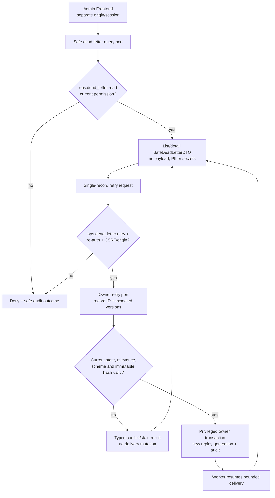
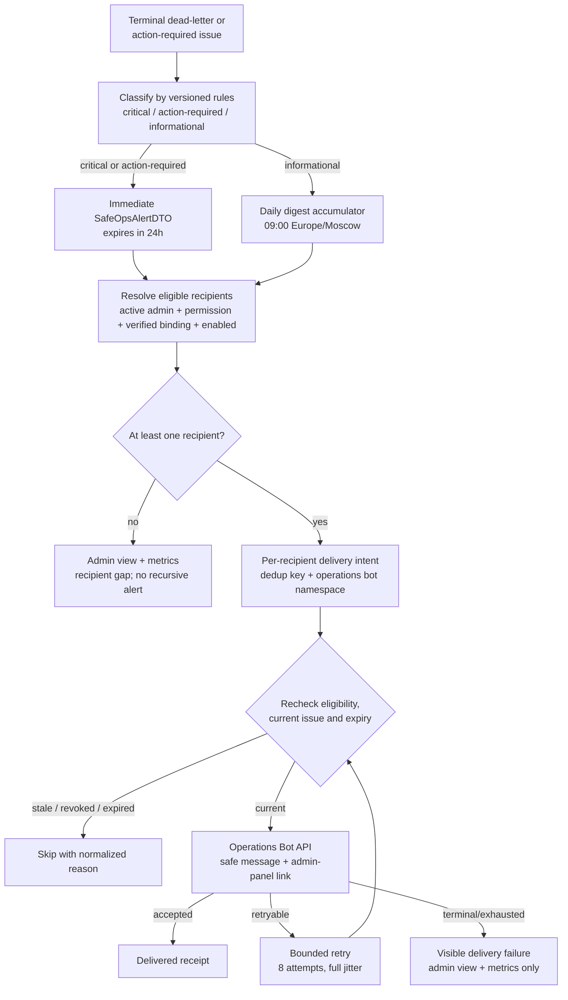
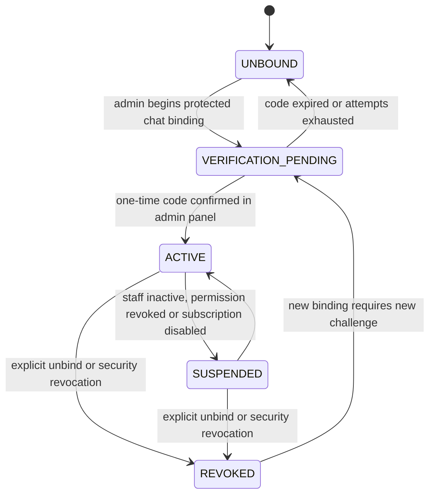

# G4.8 — Dead-letter operations и безопасные alerts

## Статус, цель и границы

- Статус: `ACCEPTED`
- Горизонт: MVP/alpha
- Source of truth: owner-local PostgreSQL outbox/reconciliation metadata
- Alert channel: отдельный outbound-only Telegram operations bot

Документ определяет закрытый dead-letter admin view, одиночный privileged
retry, recipient enrollment для `ops_alerts.receive`, безопасные alert DTO,
immediate/digest routing, expiry/retry и failure semantics.

Это логические application/data contracts. Production Python/FastAPI/Celery
код, SQL/Alembic migrations, HTML-макеты, точные domains, bot token, Telegram
webhook и Kafka не создаются.

Диаграммы являются наглядным представлением. Таблицы, guards и инварианты ниже
являются нормативным описанием.

## Источники и приоритет

Приоритет: [PD](../../PRODUCT_DECISIONS.md) →
[ADR](../../DECISIONS.md) →
[незаменённая исходная спецификация](../../SOURCE_SPECIFICATION.md).

Документ развивает принятые:

- [G4.3 — permission catalogue](03-permission-catalogue.md);
- [G4.4B — state machines](04-state-machines.md);
- [G4.5 — API/security contracts](05-api-contracts-and-request-security.md);
- [G4.6 — Domain Event Catalogue](06-domain-event-catalogue.md);
- [G4.7 — outbox/inbox/reconciliation](07-outbox-inbox-and-reconciliation.md).

При конфликте с `ACCEPTED` решением alert/retry path останавливается
fail-closed. Operations adapter не исправляет payload, permission или foreign
business state.

## Подтверждённые MVP defaults

| Параметр | Значение |
|---|---|
| Destinations | Только подтверждённые личные Telegram-чаты admin; shared groups/channels запрещены |
| Eligibility | Active admin + current `ops_alerts.receive` + verified binding + subscription enabled |
| Immediate classes | `critical`, `action_required` |
| Digest class | `informational` |
| Digest schedule | Ежедневно в `09:00 Europe/Moscow`; versioned runtime configuration |
| Quiet hours | Отсутствуют |
| Immediate expiry | `24 часа` после создания alert intent |
| Digest expiry | До создания следующего успешного digest для того же recipient |
| Delivery attempts | Максимум `8`, но не позже expiry |
| Backoff | Full jitter, base `5 секунд`, cap `5 минут` |
| Verification challenge | `10 минут`, максимум `5` проверок; single-use |
| Digest item preview | До `10` safe opaque entries; остальное — aggregate counts и ссылка |
| Bot direction | Outbound-only; Telegram updates/commands не принимаются |
| Admin action | Только single-record unchanged retry; bulk/edit/manual resolve отсутствуют |

Изменение runtime configuration:

- не может включить infinite retry;
- не может доставлять после expiry;
- не может ослабить четыре eligibility guards;
- не может добавить payload/PII/secrets в alert;
- не может превратить Telegram message в authorization proof;
- требует version, owner, validation и audit-safe change record.

## Ownership и trust boundaries

| Capability/data | Owner | Нормативная граница |
|---|---|---|
| Staff identity, active status, permission version | `trust_safety` | Единственный authority для admin и `ops_alerts.receive` |
| Dead-letter fact/delivery metadata | Producer owner schema | G4.7 owner-local tables; query только через owner adapter |
| Retry decision/transaction | Producer owner module | Current-state/relevance/hash/schema guards и privileged audit |
| Alert classification, digest, routing | `communication` | Не переопределяет severity/domain state владельца |
| Operations recipient binding | `communication` с staff reference | Protected routing record по stable `staff_id`; Telegram identity не становится staff identity |
| Operations bot credentials/provider adapter | `communication.infrastructure` | Отдельный token, client, rate/circuit-breaker и delivery namespace |
| Permission checks/audit context | `trust_safety` public ports | Проверяются при query, enrollment, fan-out и непосредственно перед send |
| Admin UI | `admin` adapter | Отдельный origin/session; DTO composition без domain decision |

Operations bot и recipient registry не являются восьмым доменным модулем.
`communication` хранит только routing necessity; staff authentication и grants
остаются в `trust_safety`.

Telegram `chat_id` — защищённый routing identifier. Он:

- шифруется/защищается теми же средствами protected operational data;
- никогда не попадает в alert DTO, URL, метрики, exception или audit text;
- не используется как primary identity;
- удаляется при подтверждённом unbind/revocation после прекращения delivery;
- не копируется в dead-letter payload.

## Dead-letter admin read model

### `SafeDeadLetterDTO`

| Поле | Тип | Источник/семантика |
|---|---|---|
| `record_id` | `OpaqueId` | Stable admin-facing reference; не table PK/fact payload |
| `owner_module` | bounded enum | Один из семи domain owners либо разрешённая technical schema |
| `consumer_name` | bounded code | Declared G4.6 consumer |
| `fact_type` | bounded code | Safe contract name; payload отсутствует |
| `schema_version` | positive int | Contract version |
| `policy_class` | enum | Пять G4.6 retry classes |
| `severity` | enum | `critical/action_required/informational` по versioned rules |
| `status` | enum | `dead_letter/replay_pending/resolved` |
| `terminal_reason_code` | bounded enum | Нормализованный безопасный класс причины |
| `attempt_count` | non-negative int | Attempts current replay generation |
| `replay_generation` | non-negative int | G4.7 generation |
| `first_failed_at` | timestamp | UTC |
| `last_attempt_at` | timestamp, nullable | UTC |
| `dead_lettered_at` | timestamp | UTC |
| `expires_at` | timestamp, nullable | Business expiry, если contract time-sensitive |
| `aggregate_type` | bounded code | Safe owner aggregate kind |
| `aggregate_ref` | `OpaqueId` | Admin-safe reference, не user/provider ID |
| `owner_version` | version | Версия, с которой завершилась delivery |
| `current_state_hint` | enum | `unknown/current/stale/obsolete/repair_pending`; не решение UI |
| `trace_id` | `OpaqueId`, nullable | Safe bounded correlation reference |
| `alert_state` | enum | `not_required/pending/delivered/partial/failed/expired` |
| `resolved_at` | timestamp, nullable | Нормализованное resolution time |
| `resolution_code` | bounded enum, nullable | Без free text/provider payload |

`SafeDeadLetterDTO` не содержит:

- domain event payload или его fragments;
- имён, usernames, phone/email, Telegram user/chat IDs;
- private text/media, адресов, координат;
- provider request/response/body/error text;
- tokens, credentials, webhook secrets, signed URLs;
- reputation weights/thresholds, anti-fraud signals/rules;
- arbitrary exception/SQL/stack trace;
- recipient list или permission internals.

### List/query contract

`GET /admin/v1/operations/dead-letters` остаётся route family G4.5 и требует
`ops.dead_letter.read`.

| Параметр | Разрешение |
|---|---|
| Status | Exact allowlist |
| Severity | Exact allowlist |
| Owner module | Exact allowlist |
| Consumer/fact type/policy class | Registry-backed allowlist |
| Terminal reason class | Exact allowlist |
| Created/dead-lettered time | Bounded UTC range, максимальное окно конфигурируется |
| Alert state | Exact allowlist |
| Record/trace opaque ID | Exact match only |
| Pagination | Stable cursor over `(dead_lettered_at, record_id)` |
| Sort | `dead_lettered_at` descending по умолчанию; arbitrary column запрещён |

Free-text search, payload search, user/Telegram ID search, wildcard,
cross-schema SQL и export отсутствуют. Page size bounded. Каждый owner adapter
возвращает свой safe page; operations query coordinator выполняет bounded
k-way merge DTO, а не cross-schema JOIN.

Detail view использует тот же DTO с разрешёнными transition timestamps и
normalized audit outcomes. «Показать raw payload/error» отсутствует как
capability.

### Read authorization

1. Admin adapter проверяет отдельную staff session, CSRF/origin controls для
   последующих mutations и current `ops.dead_letter.read`.
2. `trust_safety` возвращает current permission version.
3. Query coordinator передаёт bounded filters owner adapters.
4. Ответ повторно проходит safe DTO serializer/unknown-field deny.
5. Read фиксирует privileged audit outcome без filter contents, если они могут
   раскрывать operational identifiers.
6. Permission revoke прекращает следующие reads; frontend cache для admin data
   — `no-store`.

## Dead-letter admin workflow



Исходник:
[08-dead-letter-admin-workflow.mmd](diagrams/08-dead-letter-admin-workflow.mmd).

Текстовая альтернатива: admin с permission чтения получает только безопасную
проекцию. Для retry нужны отдельный permission, re-auth и request-security
guards. Owner повторно проверяет актуальность, версии, schema и immutable hash.
При конфликте состояние не меняется; при успехе owner transaction создаёт новую
replay generation и privileged audit, после чего worker продолжает bounded
delivery.

## Single-record retry contract

`POST /admin/v1/operations/dead-letters/{record_id}:retry` сохраняет G4.5 route
family.

### Command

| Поле/context | Требование |
|---|---|
| `record_id` | Opaque exact target |
| `expected_delivery_version` | Обязательный optimistic guard |
| `expected_owner_version` | Обязательный, если owner contract versioned |
| `expected_replay_generation` | Предотвращает двойное подтверждение |
| `reason_code` | Bounded operational enum; arbitrary free text отсутствует |
| `staff_context` | Staff ID, current permission/role version, session/re-auth decision IDs |
| `idempotency_key` | Обязательный, scoped к staff+route+record |
| Request controls | Admin origin, CSRF, action-bound re-auth, rate limit |

### Owner guards

Retry разрешён только если одновременно:

1. delivery всё ещё `DEAD_LETTER`;
2. record принадлежит заявленному owner adapter;
3. fact identity, payload digest, schema version и consumer неизменны;
4. current/previous schema поддерживается consumer;
5. owner aggregate/current version разрешает повтор;
6. intent не expired/stale/obsolete;
7. ordering predecessor/gap не нарушен;
8. нет активного conflicting retry/reconciliation lock;
9. `ops.dead_letter.retry` и re-auth всё ещё current;
10. идемпотентный retry не был уже принят.

### Результаты

| Result code | Состояние |
|---|---|
| `RETRY_ACCEPTED` | Generation increment, attempts reset, `PENDING`, owner privileged audit atomically committed |
| `ALREADY_ACCEPTED` | Тот же idempotency key возвращает прежний safe result |
| `STALE_VERSION` | Ничего не изменено; admin refresh required |
| `NO_LONGER_RELEVANT` | Ничего не изменено; reconciliation может отдельно доказать resolution |
| `EXPIRED` | Retry запрещён |
| `UNSUPPORTED_SCHEMA` | Retry запрещён; migration/repair path required |
| `ORDERING_BLOCKED` | Retry запрещён до устранения gap |
| `PERMISSION_REVOKED/REAUTH_REQUIRED` | Ничего не изменено |
| `CONFLICT_IN_PROGRESS` | Ничего не изменено; bounded retry UI request позднее |

Admin не переводит запись в `RESOLVED` вручную. Resolution выполняет
owner/reconciliation path только после доказанного obsolete/repaired state и
оставляет normalized audit. Bulk selection/retry, изменение recipient,
payload, IDs, schema или priority запрещены.

## Alert classification

Versioned classification rules используют только bounded metadata.

| Severity | Когда | Delivery |
|---|---|---|
| `critical` | `SAFETY_CRITICAL` dead-letter; fail-closed projection/integrity issue; security-required effect, которому нужно ручное действие | Immediate |
| `action_required` | Актуальный `STATE_REQUIRED`/`TECHNICAL_LIFECYCLE` dead-letter или reconciliation issue без безопасного auto-repair | Immediate |
| `informational` | Некритичный rebuildable gap, terminal delivery summary, recent resolution/expiry, не требующие немедленного действия | Daily digest |

Правила не читают payload и не вычисляют domain severity заново. Producer/owner
передаёт нормализованный issue/reason/policy class; `communication` применяет
только принятую mapping version.

Transient failures до исчерпания automatic retry не создают operations alert.
Один `(record_id, alert_kind, classification_version, replay_generation)`
создаёт не более одного active alert intent.

Severity downgrade не используется для сокрытия уже active critical issue.
Повышение создаёт immediate intent с новым classification version, но dedup не
дублирует уже доставленный эквивалентный alert.

## `SafeOpsAlertDTO`

| Поле | Тип | Правило |
|---|---|---|
| `alert_id` | `OpaqueId` | Stable internal/delivery dedup reference |
| `alert_kind` | bounded enum | `dead_letter/reconciliation/recipient_gap/digest` |
| `severity` | enum | `critical/action_required/informational` |
| `safe_type` | bounded code | Registry-approved type, не payload |
| `record_ref` | `OpaqueId`, nullable | Admin-panel lookup reference |
| `trace_id` | `OpaqueId`, nullable | Safe correlation only |
| `occurred_at` | timestamp | UTC |
| `expires_at` | timestamp | Immediate +24h либо next-digest boundary |
| `classification_version` | version | Reproducible mapping |
| `admin_path_key` | enum | Server-side route template key |
| `digest_counts` | bounded map, nullable | Counts by severity/type; no dynamic labels |
| `preview_entries` | max 10 safe entries | Только safe type/severity/opaque refs |

Admin link строится server-side из configured admin origin и allowlisted path
key. Alert DTO не содержит bearer token, session, signed authorization,
production domain или arbitrary URL. Переход всегда требует обычную admin
authentication; Telegram delivery не подтверждает личность или permission.

Safe message:

- сообщает severity и безопасный тип;
- содержит opaque record/trace reference при необходимости;
- показывает aggregate counts в digest;
- ведёт на закрытую панель;
- явно не предлагает reply/button command для retry/resolve.

## Operations alert routing



Исходник:
[08-operations-alert-routing.mmd](diagrams/08-operations-alert-routing.mmd).

Текстовая альтернатива: terminal/action-required metadata классифицируется.
Critical/action-required создают immediate intent, informational попадает в
ежедневный digest. Для каждого eligible recipient создаётся отдельная
дедуплицированная delivery. Перед send повторно проверяются permission, binding,
актуальность и expiry. Provider acceptance завершает delivery; retryable
failure получает bounded retry. Recipient gap или terminal alert-delivery
failure видны в панели/метриках и никогда не создают рекурсивный Telegram alert.

## Recipient enrollment

### Eligibility predicate

```text
eligible =
  staff.active
  AND staff.role == admin
  AND permission("ops_alerts.receive").granted
  AND binding.state == ACTIVE
  AND subscription_enabled
```

Grant сам по себе не включает доставку. Binding/subscription сами по себе не
дают permission, admin-panel access или operation rights.

### Enrollment workflow

Operations bot остаётся outbound-only:

1. authenticated admin открывает собственную настройку operations alerts;
2. current `ops_alerts.receive` проверяется у `trust_safety`;
3. admin вводит личный Telegram `chat_id` в protected field;
4. backend rate-limits запрос, создаёт keyed single-use verification digest на
   10 минут;
5. operations bot отправляет в этот chat одноразовый код без staff/internal
   context;
6. admin вводит код в закрытой панели;
7. constant-time verification при current permission делает binding `ACTIVE`;
8. plaintext code удаляется; chat ID сохраняется только в protected routing
   record;
9. privileged/security audit содержит staff ID, outcome и binding opaque ID,
   но не chat ID/code.

После пяти неверных попыток challenge инвалидируется. Повторная отправка
rate-limited и создаёт новый challenge, инвалидируя предыдущий. Один chat
нельзя одновременно привязать к нескольким active staff bindings; конфликт
не раскрывает существующего владельца.

Chat ID и короткий code являются низкоэнтропийными. Прямой/unsalted hash
запрещён: uniqueness lookup использует versioned keyed digest, verification
code — отдельный keyed digest, а ключи находятся только в runtime secret
storage. Digest не является публичным ID, не экспортируется и поддерживает
контролируемую ротацию без раскрытия chat ID.

`PUT /admin/v1/me/operations-alerts` из G4.5 представляет capability family
begin/confirm/enable/disable/unbind. Exact HTTP sub-actions/DTO уточняются при
production OpenAPI и не расширяют permission catalogue.



Исходник:
[08-recipient-enrollment.mmd](diagrams/08-recipient-enrollment.mmd).

Текстовая альтернатива: новый admin начинает с отсутствующей binding. После
outbound challenge запись ожидает подтверждения и становится active только при
верном одноразовом коде в admin panel. Истечение/исчерпание возвращает unbound.
Неактивный staff, revoke permission или disabled subscription приостанавливают
доставку. Unbind/security revoke удаляет routing capability; новая привязка
всегда требует нового challenge.

### Revocation и lifecycle

- Permission/staff/subscription recheck выполняется при fan-out и прямо перед
  provider send.
- Уже отправленное Telegram message отозвать нельзя; оно не содержит sensitive
  details и не авторизует действие.
- Unbind/revoke fences leased sends новым binding version.
- Protected chat ID удаляется после завершения/fencing in-flight delivery;
  normalized binding audit хранится 90 дней без chat ID.
- Pending challenge удаляется после expiry; hash не используется повторно.
- Staff deactivation автоматически переводит delivery eligibility в suspended.
- Новый chat или повторная привязка создаёт новый binding ID/version.

## Delivery, retry и expiry

| Alert kind | Attempts/deadline | Current-state guard | Terminal outcome |
|---|---|---|---|
| Immediate critical | Max 8, full jitter 5s/5m, ≤24h | Issue still current or unresolved; recipient eligible | Delivered, expired, skipped or failed-visible |
| Immediate action-required | Max 8, full jitter 5s/5m, ≤24h | Manual action still required; recipient eligible | Delivered, expired, skipped or failed-visible |
| Daily digest | Max 8 before next successful digest boundary | Entries re-aggregated from current safe state | Delivered, superseded/skipped or failed-visible |
| Verification challenge | Provider bounded retry inside 10m challenge | Pending challenge/current permission/chat uniqueness | Sent or challenge failed/expired |

Full jitter соответствует G4.7:

```text
delay = random(0, min(5 minutes, 5 seconds * 2^(attempt_count - 1)))
```

Telegram/provider `429` учитывает bounded `retry_after`, но итоговое время не
может превысить local cap/expiry. Network/5xx могут retry; invalid chat,
blocked bot, malformed safe DTO и credential/config errors являются terminal
либо circuit-open согласно typed adapter policy.

Operations alert intent и provider delivery:

- используют отдельный `bot_kind=operations`;
- имеют отдельные credentials, client, circuit breaker, rate-limit budget,
  dedup namespace и provider receipts;
- не используют user-bot webhook/update namespace;
- передают provider только safe rendered text и destination chat ID;
- не копируют provider response body в dead-letter/admin DTO.

Delivery worker не меняет dead-letter/issue state. Успешная доставка означает
только provider acceptance, а не read/acknowledgement или выполнение action.

## Digest semantics

1. Beat только планирует `digest_due`; бизнес-правила находятся в
   `communication` application use case.
2. Use case берёт interval от последнего успешного per-recipient checkpoint до
   текущей `09:00 Europe/Moscow` boundary.
3. В digest входят current informational issues и безопасные terminal summaries
   согласно classification version.
4. Повторы одного record агрегируются; preview содержит максимум 10 entries.
5. Остальные элементы представлены bounded counts; полная безопасная выборка
   доступна только в admin panel.
6. Digest idempotency key включает recipient, boundary и classification
   version.
7. Failed run не продвигает checkpoint. Следующий run пересобирает current
   snapshot, а не отправляет stale cached payload.
8. Новый успешный digest supersedes недоставленный предыдущий; два digest за
   одну boundary запрещены.

Время отображается пользователю как configured timezone, но timestamps
хранятся UTC. Переходы timezone/DST обрабатываются библиотекой IANA timezone;
фиксированный UTC offset не считается timezone.

## Anti-recursion и degraded modes

Alert delivery failure не создаёт operations alert о самом себе.

| Failure | Поведение |
|---|---|
| Redis/Celery unavailable | PostgreSQL intent остаётся; owner business/dead-letter transaction не откатывается |
| Telegram unavailable | Bounded retry до expiry; admin view остаётся source of truth |
| Operations token/config invalid | Circuit opens; delivery failed-visible; metric/dashboard, без Telegram recursion |
| Нет eligible recipients | `recipient_gap` status/metric; dead-letter остаётся видимым в panel |
| Permission revoked after fan-out | Pre-send guard skips/fences delivery |
| Binding changed during lease | Binding version mismatch skips stale send |
| Issue resolved before send | Delivery skipped/superseded |
| Digest job пропущен | Следующий run читает checkpoint и current state |
| Admin panel unavailable | Telegram содержит только safe pointer; действие ждёт panel recovery |
| Duplicate provider acceptance/worker crash | Per-recipient idempotency/receipt не создаёт второй logical delivery |
| Unknown classification/schema | Fail closed into visible classification issue; arbitrary fallback text не отправляется |

Minimum non-Telegram detection channel для recursive/recipient gaps —
structured safe metrics и admin operations view. Общий observability/SLO
документ остаётся последующим пунктом G4.

## Retention и audit

| Record | Retention |
|---|---|
| Unresolved dead-letter | До resolution; cleanup запрещён |
| Resolved safe technical payload | 30 дней после resolution |
| Normalized dead-letter result + privileged audit | 90 дней |
| Terminal operations alert/outbox delivery | G4.7: 30 дней после всех terminal deliveries |
| Digest checkpoint | Пока recipient/binding active; после controlled decommission 90 дней |
| Verification challenge | До success/expiry, максимум 10 минут; затем удалить secret/hash по cleanup policy |
| Active protected chat routing | Только пока binding нужен |
| Revoked binding safe audit | 90 дней без chat ID/code |

Privileged audit для retry/enrollment/unbind содержит:

- stable staff ID и permission version;
- action/decision/idempotency IDs;
- target opaque record/binding ID;
- expected/actual version outcome;
- normalized result/reason code;
- timestamp и safe trace ID.

Audit не содержит payload, chat ID, code, Telegram profile, IP beyond separate
security retention policy, exception text или secrets. Retry mutation и owner
privileged audit commit атомарно. Binding mutation и its security audit commit
атомарно в owning boundary.

## Security and privacy matrix

| Boundary | Разрешено | Запрещено |
|---|---|---|
| Admin list/detail | Safe DTO, opaque IDs, normalized codes/timestamps | Raw payload/error, PII, coordinates, provider bodies |
| Retry request | Exact record, expected versions, bounded reason, staff/re-auth context | Payload/recipient/ID/schema edit, bulk target |
| Alert classification | Policy class, safe reason/type, status/version | Domain payload inspection, secret reputation/anti-fraud logic |
| Recipient registry | Protected chat routing + staff reference | Telegram ID as staff identity, shared group |
| Telegram message | Severity, safe type, opaque ref, counts, admin link | PII/private content/address/token/action command |
| Metrics/logging | Bounded labels/counts/latency/outcome | Record/chat/user IDs, payload, free-text provider error |
| Provider adapter | Destination chat ID + safe rendered message | Admin session/re-auth proof, business payload |

## Failure-safe scenarios

### Critical safety dead-letter

1. Safety authority уже скрывает resource fail-closed.
2. Terminal consumer delivery создаёт dead-letter и outbox metadata atomically.
3. Classification выдаёт `critical`, immediate intent expires через 24h.
4. Eligible recipients получают safe pointer.
5. Отсутствие/ошибка alerts не открывает resource.
6. Admin retry проходит re-auth/current-state/hash/order guards.

### Action-required lifecycle task

1. Media/cleanup/reconciliation owner подтверждает невозможность safe auto-repair.
2. `action_required` alert не содержит filename, content или address.
3. Admin panel показывает normalized metadata.
4. Retry вызывает owner application port; legal hold/final-state проверяются
   заново.

### Informational digest

1. Некритичные rebuildable gaps агрегируются до boundary.
2. Recipient eligibility проверяется при build и send.
3. Preview bounded; детали читаются с current permission в panel.
4. Новый digest supersedes просроченный, не создавая infinite backlog.

### Revoked recipient

1. `trust_safety` повышает permission/staff version.
2. Pending delivery видит mismatch и становится skipped.
3. Binding suspended/revoked; in-flight lease fenced.
4. Уже доставленный safe message не даёт доступа к panel.

## Metrics и observability inputs

- unresolved dead-letter count/age by bounded owner, policy, severity;
- retry accepted/conflict/stale/expired/permission outcomes;
- immediate/digest intent lag;
- eligible-recipient count и recipient-gap duration;
- operations bot delivered/retry/expired/failed rates;
- challenge begin/success/expired/rate-limited outcomes;
- digest checkpoint lag/item count/truncation count;
- classification unknown/version mismatch;
- permission/binding pre-send skips;
- circuit-open duration.

Record/staff/chat/trace IDs, payload, addresses и provider error text не
являются metric labels. Trace ID допускается только в access-controlled
structured diagnostics по отдельной retention policy, не в aggregate labels.

## Verification strategy

До production implementation требуются:

1. DTO allowlist/unknown-field tests и privacy fixtures;
2. architecture test: admin coordinator не импортирует owner ORM/schema;
3. permission tests для read/retry/enrollment и mid-flight revoke;
4. action-bound re-auth/CSRF/origin/idempotency/concurrency tests;
5. immutable payload/hash/schema/recipient/version retry tests;
6. owner current-state, expiry, ordering и reconciliation conflict tests;
7. recipient challenge expiry/attempt/rate/uniqueness tests;
8. separate operations/user bot credentials/namespaces tests;
9. alert classification golden tests по versioned rules;
10. fake-clock tests для 09:00 timezone, 24h expiry и next-digest supersession;
11. retry/jitter/provider 429/circuit-breaker tests;
12. crash-point tests before/after intent, provider acceptance и receipt;
13. anti-recursion test для operations alert delivery dead-letter;
14. retention/cleanup tests с unresolved/open issue guards;
15. light/dark Mermaid render и embedded/source equality checks.

## Явно вне G4.8

- Operations bot inbound webhook, commands, callbacks или admin actions.
- Shared Telegram groups/channels и broadcast outside exact recipients.
- Bulk retry, bulk resolve, payload edit или arbitrary manual state change.
- Production UI layout, OpenAPI, Python/SQL/Celery implementation.
- Bot token/secret storage implementation и exact production domain.
- Kafka publisher/topics/partitions/ACL.
- Общие observability dashboards/SLO/RPO/RTO.
- PagerDuty/email/SMS/phone escalation.
- Полный incident-management/acknowledgement workflow.

## Архитектурные инварианты

| ID | Инвариант |
|---|---|
| `OPS-01` | Admin view содержит только safe metadata; raw payload/PII/secrets недоступны |
| `OPS-02` | Read и retry используют разные exact permissions; retry требует re-auth |
| `OPS-03` | Retry одиночный, идемпотентный, owner-controlled и не меняет immutable data |
| `OPS-04` | Admin не выполняет manual resolve; owner/reconciliation доказывает resolution |
| `OPS-05` | Operations bot outbound-only и не авторизует/исполняет commands |
| `OPS-06` | User bot и operations bot разделяют codebase, но не credentials/namespaces/scenarios |
| `OPS-07` | Recipient eligible только при четырёх current guards |
| `OPS-08` | Shared groups/channels запрещены; binding только personal verified chat |
| `OPS-09` | Critical/action-required immediate; informational daily digest; quiet hours отсутствуют |
| `OPS-10` | Alert delivery bounded 8 attempts/full jitter и прекращается по expiry |
| `OPS-11` | Alert failure никогда не создаёт recursive operations alert |
| `OPS-12` | Telegram message — safe pointer; admin panel остаётся source of truth |
| `OPS-13` | Permission/binding/current-state recheck выполняется непосредственно перед send |
| `OPS-14` | Redis/Celery/Telegram failure не откатывает owner PostgreSQL transaction |
| `OPS-15` | Protected chat ID не становится staff identity и не попадает в DTO/log/metrics/audit |

## Traceability

| Решение | Источник |
|---|---|
| Notification priority, daily digest, no quiet hours | `PD-010` |
| Outbox/dead-letter, admin-only retry, safe operations bot | `PD-012`, `ADR-015` |
| Staff permissions, re-auth, privileged audit | `ADR-011`, `G4.3` |
| Admin routes, CSRF/origin/idempotency, outbound-only bot | `ADR-020`, `G4.5` |
| Notification delivery states/current-state guards | `PD-010`, `G4.4B` |
| Fact identity/replay/privacy | `PD-018`, `ADR-017`, `G4.6` |
| Physical delivery/retry/retention/reconciliation | `ADR-015`, `G4.7` |

## Acceptance checklist

- [x] Документ остаётся `DRAFT` до owner review.
- [x] Safe admin DTO исключает payload, PII, secrets и provider bodies.
- [x] Read/retry permissions и re-auth boundary разделены.
- [x] Single retry immutable/current/idempotent; bulk/edit/manual resolve отсутствуют.
- [x] Operations bot outbound-only и отделён от user bot.
- [x] Personal chat binding использует outbound single-use challenge.
- [x] Low-entropy chat/code lookup использует отдельные keyed digests.
- [x] Recipient eligibility включает active admin, permission, binding и subscription.
- [x] Immediate/digest classification, schedule и safe DTO заданы.
- [x] Retry 8 attempts/full jitter, expiry и anti-recursion зафиксированы.
- [x] Permission/binding/current-state проверяются перед send.
- [x] Retention и privileged/security audit минимизированы.
- [x] Три диаграммы имеют текстовые альтернативы и отдельные `.mmd`.
- [x] G4.8 checkbox/changelog принятия и Kafka пункт не изменены.
- [x] Production code/migrations/OpenAPI/UI/secrets/Kafka не создавались.
