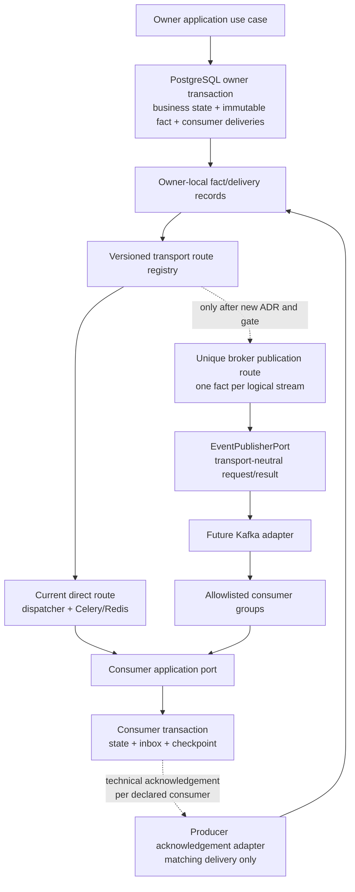
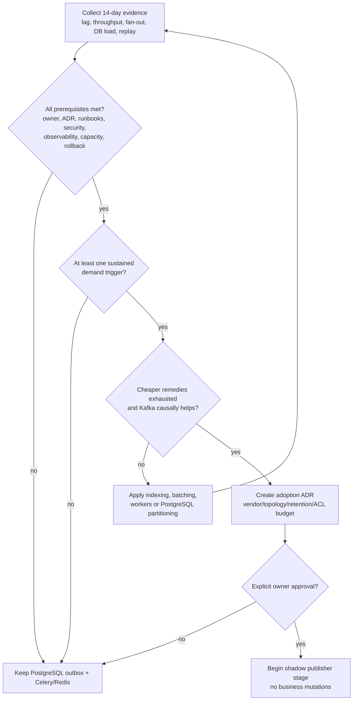
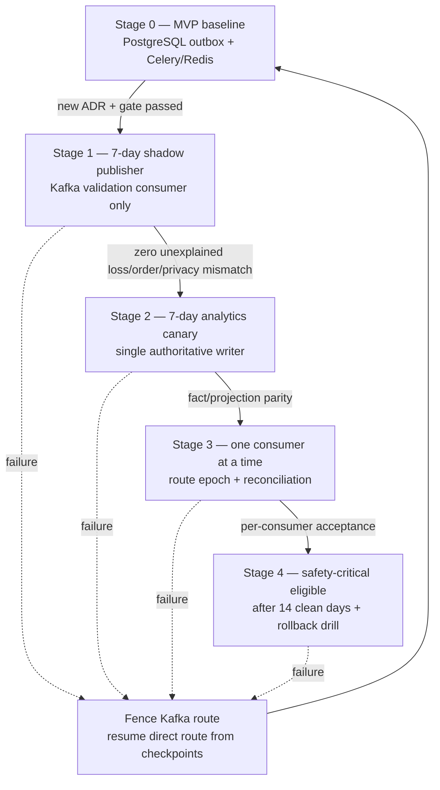

# G4.9 — Kafka-readiness matrix

## Статус, цель и границы

- Статус: `DRAFT — ожидает подтверждения владельца`
- MVP transport: PostgreSQL outbox + Celery/Redis
- Kafka status: не развёрнута и не разрешена к production adoption
- Purpose: доказать transport readiness и определить измеримый adoption gate

Документ фиксирует готовность envelope/schema/outbox к будущему Kafka
transport, логический `EventPublisherPort`, topology/privacy/order principles,
измеримые triggers, prerequisites, staged migration и rollback.

G4.9 не выбирает Kafka vendor/distribution, не создаёт cluster/topics/ACLs,
production schemas/code/dependencies и не меняет MVP deployment. Любое
фактическое подключение требует отдельного нового ADR, operations owner и
явного подтверждения владельца.

Диаграммы являются наглядным представлением. Таблицы, gates и инварианты ниже
являются нормативным описанием.

## Источники и приоритет

Приоритет: [PD](../../PRODUCT_DECISIONS.md) →
[ADR](../../DECISIONS.md) →
[незаменённая исходная спецификация](../../SOURCE_SPECIFICATION.md).

Документ развивает принятые:

- [G4.2 — module boundaries/public ports](02-module-boundaries-and-public-ports.md);
- [G4.6 — Domain Event Catalogue](06-domain-event-catalogue.md);
- [G4.7 — outbox/inbox/reconciliation](07-outbox-inbox-and-reconciliation.md);
- [G4.8 — dead-letter operations/alerts](08-dead-letter-operations-alerts.md).

При конфликте `ACCEPTED` решений Kafka route не активируется. Readiness не
является разрешением на внедрение.

## Подтверждённые решения

| Область | Решение |
|---|---|
| MVP | Kafka отсутствует; Redis остаётся stable Celery broker |
| Adoption rule | Все prerequisites + минимум один sustained demand trigger + доказанная причинная польза |
| Independent consumers | Минимум 2 независимо развёртываемых consumer groups одной fact family |
| Replay trigger | ≥1 000 000 retained facts либо прогноз >60 минут, минимум дважды за 30 дней |
| Lag trigger | `p95 >30s` либо `p99 >120s` ≥1 часа/день на 7 из 14 дней после оптимизации |
| DB-load trigger | Outbox polling/fan-out ≥15% PostgreSQL CPU либо ≥20% read I/O |
| Storage trigger | Technical outbox storage >25% business DB |
| Capacity trigger | Нагрузочный тест показывает <2× headroom относительно измеренного peak |
| Topology | Bounded fact-family streams, разделённые по privacy/purpose |
| Partitioning | Logical partition key — существующий G4.6 `ordering_key`; global order отсутствует |
| Publication | Один fact публикуется один раз на logical stream, не по копии на consumer |
| Compatibility | CI проверяет current/previous versions; exact registry vendor выбирается adoption ADR |
| Shadow | 7 дней без business mutations |
| First canary | Один `ANALYTICS_REBUILDABLE` consumer, 7 дней |
| Sequential cutover | По одному consumer; два authoritative writers запрещены |
| Safety cutover | Только после 14 clean days и успешного rollback drill |
| Retention/privacy | Kafka не продлевает разрешённый retention и не воскрешает удалённые PII |

Thresholds являются defaults для architecture decision evidence. Изменение
требует versioned rationale; нельзя снижать gate только ради уже закупленной
инфраструктуры.

## Что не является Kafka trigger

Отдельно взятые:

- медленный SQL;
- тяжёлая обработка media;
- нехватка CPU/RAM worker;
- необходимость ещё одного Celery worker;
- временный provider outage;
- единичный outbox spike;
- желание «иметь современный стек»;
- HA без доказанной event-stream потребности

не являются основанием для Kafka.

Сначала проверяются query/index design, dispatcher batching/fairness,
дополнительные workers, G4.7 reconciliation, PostgreSQL partitioning/retention,
connection/IO limits и capacity planning.

## Readiness matrix

| Capability | MVP readiness | Нужно до adoption | Gate evidence |
|---|---|---|---|
| Stable fact identity | Ready: UUIDv7 `fact_id` | Не менять при transport/replay | Contract tests |
| Typed envelope/payload | Ready: G4.6 JSON + typed schemas | Broker serializer/size limits | Golden fixtures |
| Per-aggregate ordering | Ready: ordering key/sequence | Partition routing + gap monitoring | Order/load tests |
| Schema evolution | Ready logically: current/previous | CI compatibility artefacts и adoption registry decision | Compatibility report |
| Producer atomicity | Ready: state+outbox PostgreSQL transaction | Сохранить bridge; не обещать dual-write transaction | Crash tests |
| Consumer idempotency | Ready: owner inbox/checkpoint | Kafka group/offset adapter использует тот же application port | Duplicate tests |
| Per-consumer lifecycle | Ready: G4.7 delivery/ack/dead-letter | Publication-to-consumer correlation | Reconciliation report |
| Publisher abstraction | Boundary defined in G4.9 | Production adapter/record only after ADR | Contract/load tests |
| Privacy routing | Classes ready | Topic-route purpose/ACL review | Security matrix |
| Replay authorization | Semantics ready | Permission/workflow/runbook in new ADR | Restore/replay drill |
| Observability | Metric inputs defined | Dashboards/SLO/on-call alerts | 14-day evidence |
| Operations ownership | Not assigned for Kafka | Named owner/on-call/budget/runbooks | Signed readiness record |
| Capacity/DR | Not designed for Kafka | Vendor topology, backup/config restore, failure drills | Test report |
| Cutover/rollback | Logical stages defined | Environment-specific commands/feature flags | Successful drill |

`Ready` означает совместимый contract, а не production implementation.

## Transport-neutral envelope

G4.6 envelope остаётся canonical value. Kafka adapter не создаёт второй
business-event format.

| Logical field | Kafka mapping principle | Guard |
|---|---|---|
| `fact_id` | Message identity/header + value | Stable across retries/transports |
| `fact_type` | Registry route + header + value | Never Python class name |
| `schema_version` | Header + typed value contract | Exact supported version |
| `producer_module` | Registry/observability header | Allowlisted owner |
| aggregate type/id/version/sequence | Value; ordering input | Raw IDs не используются как metric labels |
| `ordering_key` | Logical record/partition key | Same aggregate always same partition under route version |
| occurred/recorded timestamps | Value; broker timestamp informational only | Broker time не заменяет business time |
| correlation/causation | Safe headers + value | No raw request/idempotency secret |
| privacy class | Header + route validation | Consumer/topic cannot broaden purpose |
| typed payload | JSON value using accepted schema | Unknown fields/`dict[str, Any]` forbidden |

Wire partition key может быть versioned route-scoped keyed digest от
`ordering_key`, чтобы не раскрывать internal aggregate ID broker tooling.
Digest обязан сохранять equality/order routing, использует runtime secret и не
становится domain identity. Прямой low-entropy hash запрещён.

Kafka headers не содержат user/staff/Telegram IDs, addresses/coordinates,
private text/media, tokens, session data, provider payload или policy internals.
Если поле необходимо consumer, оно остаётся внутри typed value с G4.6 privacy
class и route ACL.

## Serialization и size policy

- Canonical logical encoding — UTF-8 JSON envelope с typed payload.
- Serialization deterministic enough для canonical payload digest; ordering
  JSON object keys не используется как business semantic.
- Producer проверяет schema/size/privacy до publication claim.
- Broker-specific compression/record batch не меняет value digest.
- Oversized payload не переносится в external blob автоматически и не
  обрезается; он получает typed publication failure.
- Media bytes/path/signed URL и provider raw DTO запрещены.
- Exact message/batch limits выбираются в adoption ADR после измерения G4.6
  fixtures; limit обязан быть ниже provider hard maximum с headroom.

## Schema evolution и compatibility

### Compatibility rule

| Изменение | Результат |
|---|---|
| Optional field с безопасным absence/default semantic | Compatible |
| Новый enum value | Требует explicit unknown handling; не автоматически compatible |
| Rename/remove/type/meaning change | Новая `schema_version` |
| Privacy class/purpose broadened | Security review + новая route/schema version |
| Ordering key/aggregate sequence semantic changed | Новый ADR/migration; обычная schema evolution недостаточна |
| Payload split/merge | Новые fact types/versions и migration plan |

Consumers поддерживают current и previous payload versions на переходный
период. Unknown/incompatible schema:

1. не мутирует consumer state;
2. не преобразуется эвристически;
3. фиксируется как typed dead-letter/compatibility issue;
4. останавливает order-sensitive key до repair;
5. не позволяет «пропустить» safety-critical fact.

Topic retention/replay window не может быть длиннее доказанного consumer
compatibility window без отдельного historical migration adapter. Record старше
поддерживаемой previous version не подаётся текущему business consumer
«как есть»: разрешён rebuild из retained owner projection либо новый
repair/compensating fact, но не эвристическое преобразование старого payload.

### CI contract bundle

Для каждой supported version CI хранит/проверяет:

- generated provider-neutral JSON Schema artefact;
- canonical valid/invalid golden fixtures;
- payload digest fixtures;
- privacy/purpose metadata;
- compatibility diff current ↔ previous;
- serializer/deserializer round-trip;
- unknown enum/field rejection;
- max measured serialized size distribution;
- consumer support registry.

External schema registry не обязателен для readiness. Vendor/hosted/self-hosted
registry, subject naming и enforcement выбираются только adoption ADR.

## Publisher boundary

Исходник:
[09-publisher-boundary.mmd](diagrams/09-publisher-boundary.mmd).

Текстовая альтернатива: owner transaction по-прежнему атомарно сохраняет
business state, immutable fact и declared consumer deliveries. Versioned route
выбирает текущую direct Celery delivery. Только после нового ADR может появиться
одна broker publication на logical stream через transport-neutral publisher.
Kafka groups вызывают тот же consumer application port, который атомарно пишет
state/inbox/checkpoint. Per-consumer acknowledgement остаётся техническим и не
меняет domain decision.

## `EventPublisherPort`

Production Python protocol не создаётся, но capability contract нормативен.

### `PublicationRequest`

| Field | Правило |
|---|---|
| `publication_id` | Stable opaque ID для unique route publication |
| `fact_id` | Existing G4.6 fact |
| `stream_route_id/version` | Versioned allowlisted logical route |
| `expected_envelope_digest` | Fences mutation/corruption |
| `ordering_key_digest` | Deterministic route-scoped wire key |
| `schema_version` | Exact payload version |
| `privacy_class` | Route/ACL guard |
| `attempt/fencing_token` | Stale publisher cannot acknowledge |

Request содержит reference на immutable owner-local fact. Application/domain
code не передаёт Kafka topic, partition, producer client или arbitrary headers.

### Result

| Result | Семантика |
|---|---|
| `PUBLISHED` | Broker acknowledged record; не означает consumer processed |
| `ALREADY_PUBLISHED` | Idempotent same publication/digest |
| `RETRYABLE_FAILURE` | Bounded transport retry |
| `TERMINAL_CONFIG/ACL` | Visible publication dead-letter; no fallback topic |
| `SCHEMA_INCOMPATIBLE` | Publication blocked |
| `PRIVACY_ROUTE_DENIED` | Publication blocked/security issue |
| `DIGEST_MISMATCH` | Publication blocked/corruption issue |
| `FENCED` | Stale lease/route epoch cannot commit |

Kafka producer idempotence может уменьшить broker duplicates, но system
guarantee остаётся at-least-once. Kafka transactions не делают PostgreSQL и
Kafka одной atomic transaction; transactional outbox bridge сохраняется.

## Future publication record

G4.9 не меняет G4.7 schema. Adoption migration должна ввести owner-local
technical publication lifecycle либо эквивалент с constraints:

- unique `(fact_id, stream_route_id, route_version, publication_generation)`;
- immutable envelope digest;
- lease/fencing/attempt/next retry/terminal outcome;
- broker acknowledgement metadata без payload/provider secrets;
- relation к declared consumer deliveries;
- cleanup не раньше terminal consumer/replay/retention guards.

Один publication доставляет fact в logical stream один раз. Создание отдельной
broker copy на каждого consumer запрещено. При этом G4.7 per-consumer delivery,
inbox, checkpoint и terminal outcome сохраняются: каждый consumer group после
своей atomic transaction отправляет отдельное technical acknowledgement.

Publisher, consumer ack и reconciliation являются infrastructure adapters, не
новыми domain modules.

## Topic-family и routing principles

### Logical topology

Topic/stream routes группируются по:

1. bounded fact family/purpose;
2. compatible privacy class;
3. compatible retention/replay policy;
4. ordering/throughput profile;
5. environment.

Запрещены:

- один global all-events topic;
- topic-per-fact/event/aggregate instance;
- routing по Python module/class name;
- смешивание `public_safe` analytics с `restricted_case/security_minimized`;
- подписка consumer «на всё» без declared purpose;
- dynamic topic from payload/user input.

Exact topic names/count, partitions, replicas и retention durations остаются
adoption ADR.

### Partitioning/order

- Partition key logical semantic = G4.6 `ordering_key`.
- Один route version детерминированно направляет key в partition.
- Global order между aggregates/modules отсутствует.
- Увеличение partition count требует documented ordering/rehash impact and
  rollout; consumer всё равно проверяет aggregate sequence.
- Consumer обрабатывает partition последовательно для order-sensitive facts
  либо использует key-local fencing/checkpoints.
- Gap/conflict останавливает соответствующий key, не весь unrelated stream,
  если implementation безопасно изолирует key.

Kafka offset не заменяет domain inbox/checkpoint: offset может быть committed
только после consumer owner transaction либо безопасно повторён.

### ACL/purpose

| Principal | Минимальное право |
|---|---|
| Publisher | Write только assigned logical routes; без broad read |
| Consumer group | Read только routes declared purpose/privacy позволяет |
| Reconciliation | Bounded metadata/offset read; payload только если purpose authorizes |
| Schema compatibility service | Contract metadata, не production payload |
| Operations | Topic/config metadata; payload access отдельно запрещён по умолчанию |

Wildcard cross-environment ACL, shared credentials, anonymous/plaintext access
и consumer-controlled topic creation запрещены. Exact authentication,
encryption, network and secret rotation design belongs to adoption/deployment
ADR.

## Adoption prerequisites

Все prerequisites обязательны:

| Prerequisite | Evidence |
|---|---|
| Named operations owner | On-call/escalation/budget ownership accepted |
| New architecture ADR | Vendor/topology/security/retention/cost/migration decision |
| Explicit product-owner approval | Отдельное подтверждение после evidence |
| 14-day metric baseline | Lag/throughput/fan-out/DB/replay/retry/duplicates |
| Causal bottleneck analysis | Kafka addresses measured event transport problem |
| Alternatives benchmark | Index/batch/workers/partitioning evaluated |
| Contract/compatibility CI | Current/previous, fixtures/privacy/size |
| Security/privacy review | Purpose routes, ACL, encryption, retention/erasure |
| Observability/runbooks | Publisher/consumer lag, DLQ, replay, capacity, incident |
| Capacity/cost model | Peak/headroom/partitions/storage/egress/operations |
| Failure/DR plan | Broker outage, config restore, offset/replay recovery |
| Shadow/rollback mechanism | Route epochs/fencing, checkpoints, no dual writer |
| Load/soak tests | Production-like fixtures and bounded failure injection |

Отсутствие любого prerequisite завершает decision `NOT_READY`.

## Demand triggers

Хотя бы один trigger должен быть подтверждён production-like evidence.

### Independent consumers

- Для одной fact family существуют ≥2 independently deployed consumer groups.
- Они требуют независимого scaling, replay, retention или release cadence.
- In-process modules одного modular monolith не считаются автоматически
  independent groups.

### Replay

- Требуется authorized replay ≥1 000 000 retained facts либо PostgreSQL
  replay estimate >60 минут.
- Потребность возникает минимум дважды за rolling 30 days.
- Разовый migration/backfill без повторяемого use case не достаточен.

### Outbox lag

- `p95 >30s` или `p99 >120s`;
- суммарно ≥1 часа в день;
- на 7 из последовательных 14 дней;
- после исправления slow consumers, indexes, batching и worker capacity;
- измерение отделяет business scheduling delay от transport lag.

### PostgreSQL load

- Outbox polling/fan-out causally создаёт ≥15% PostgreSQL CPU либо ≥20% read
  I/O в representative window.
- Уровень держится суммарно ≥1 часа/день на 7 из 14 последовательных дней.
- Window и attribution method versioned; общий DB pressure без attribution не
  считается.

### Storage

- Technical outbox storage (`outbox_fact`, `outbox_delivery` и непосредственно
  связанная publication metadata) превышает 25% размера business PostgreSQL
  data.
- Cleanup/partitioning/retention guards уже проверены.

### Capacity headroom

- Production-like load test показывает <2× sustainable headroom относительно
  измеренного peak facts/sec/fan-out;
- SLO/lag/DB safety нарушается раньше 2×;
- bottleneck находится в outbox fan-out/transport, не в domain handler/media.

## Adoption gate

Исходник:
[09-adoption-gate.mmd](diagrams/09-adoption-gate.mmd).

Текстовая альтернатива: команда собирает 14-дневные метрики. Если отсутствует
хотя бы один prerequisite или sustained trigger, остаётся текущий transport.
Даже при trigger сначала доказывается, что Kafka лучше более простых remedies.
Только новый ADR и явное подтверждение владельца разрешают начать shadow stage
без business mutations.

## Decision record

Gate review создаёт immutable safe evidence bundle:

- measurement interval/environment/build/config versions;
- trigger values and attribution method;
- alternatives tested/results;
- consumer inventory/purpose/owners;
- replay use cases and authorization;
- privacy/retention mapping;
- capacity/cost/operations estimate;
- readiness prerequisite results;
- decision `NOT_READY/REVIEW/APPROVED_FOR_SHADOW`;
- approvers and ADR reference.

Payload, PII, credentials и production connection strings в bundle отсутствуют.

## Migration stages

Исходник:
[09-migration-stages.mmd](diagrams/09-migration-stages.mmd).

Текстовая альтернатива: baseline использует PostgreSQL/Celery. После gate
publisher семь дней работает shadow и не меняет business state. Затем один
rebuildable analytics consumer проходит семидневный canary как единственный
authoritative writer своего результата. Далее consumers переводятся по одному
с route fencing/reconciliation. Safety-critical route допускается лишь после
14 clean days и rollback drill. На любой стадии failure fences Kafka route и
возвращает direct route с checkpoints.

## Stage gates

### Stage 1 — shadow publisher

Shadow:

- публикует в isolated validation route;
- не подключён к command/business-state consumer;
- сравнивает fact IDs, digests, order, schema/privacy route;
- работает 7 consecutive days под representative traffic;
- не изменяет G4.7 per-consumer authoritative delivery;
- не увеличивает business retention.

Exit:

- zero unexplained missing/extra facts after reconciliation window;
- zero digest/schema/privacy/order mismatch;
- expected at-least-once duplicates полностью deduplicable;
- lag/capacity/cost соответствуют adoption ADR;
- broker outage/credential rotation/restart recovered.

### Stage 2 — analytics canary

- Выбирается один `ANALYTICS_REBUILDABLE` consumer без command authority.
- До cutover shadow output сравнивается с existing projection.
- В момент route epoch switch остаётся один authoritative writer.
- Canary работает 7 consecutive days.
- Fact/inbox/checkpoint/projection parity доказана после allowed lag.
- Rollback восстанавливает direct route и rebuilds projection from authorized
  source; две writers одновременно запрещены.

### Stage 3 — sequential consumers

Каждый consumer получает отдельный:

- owner/purpose/privacy review;
- supported schema list;
- route epoch and partition strategy;
- offset/inbox/checkpoint mapping;
- lag/dead-letter/replay runbook;
- shadow/parity window;
- cutover and rollback decision;
- acceptance record.

Следующий consumer не начинается до закрытия reconciliation issues текущего.

### Stage 4 — safety-critical

Safety-critical consumer разрешается только если:

- предыдущие selected routes имеют 14 consecutive clean days;
- zero unexplained loss/gap/privacy mismatch;
- fail-closed authority остаётся вне зависимости от Kafka;
- broker/partition/consumer outage drills пройдены;
- rollback drill доказал отсутствие dual writer;
- on-call и safe G4.8 alert path готовы;
- owner даёт отдельное approval.

Kafka outage никогда не открывает скрытый resource.

## Single-writer cutover

Route registry хранит:

- consumer name;
- route kind `DIRECT/KAFKA`;
- route version/epoch;
- effective boundary/checkpoint;
- expected consumer build/schema support;
- rollback route;
- approval/evidence reference.

Cutover:

1. останавливает новые claims старого route;
2. fences leased old route;
3. ждёт/нормализует in-flight outcomes;
4. фиксирует effective checkpoint/epoch;
5. активирует новый route;
6. consumer проверяет epoch до state mutation;
7. reconciliation доказывает no gap/no double apply.

Direct и Kafka adapters могут одновременно читать в shadow mode, но только один
имеет mutation authority. Authority не определяется «кто пришёл первым»; она
явно задана route epoch.

## Rollback

Rollback:

1. freezes new Kafka mutations by route epoch;
2. stops/pauses affected consumer group;
3. captures safe offsets/checkpoints/issues;
4. fences in-flight Kafka handler before commit;
5. reactivates direct route from proven consumer checkpoint;
6. replays only missing authorized facts through G4.7 path;
7. reconciles fact/inbox/projection/order;
8. records adoption issue without payload/PII.

Retained Kafka messages from old epoch cannot mutate state after rollback.
Current-state/epoch/inbox guards return skipped/fenced. Rollback не удаляет
broker data до завершения investigation/retention guards и не превращает
Kafka offset в business truth.

## Replay semantics

Kafka replay не является свободным чтением event history.

- Replay scope: exact fact families, consumer, time/offset range, schema
  versions, privacy purpose и expected projection version.
- Source facts должны ещё быть legally/contractually retained.
- Erased/anonymized/expired PII не восстанавливаются из Kafka.
- Missing source fact не реконструируется выдуманным payload; owner создаёт
  новый repair/compensating fact.
- Replay consumer использует обычный inbox/current-state/order guards.
- Replay не повторяет external effect без отдельной идемпотентной policy.
- Bulk replay permission/workflow отсутствуют в текущем G4.3 и должны быть
  добавлены отдельным decision до adoption.
- Every replay produces safe audit/evidence and reconciliation result.

Kafka topic retention выбирается по минимально допустимому intersection
business/privacy/replay requirements, а не «хранить навсегда». Log compaction
не используется для обхода deletion/retention или как замена owner projection.

## Reconciliation

Kafka route добавляет checks:

| Check | Инвариант | Repair/escalation |
|---|---|---|
| Outbox/publication parity | Каждый selected fact имеет одну route publication | Safe republish same fact/digest или escalate |
| Publication/broker ack | Published record имеет stable broker metadata | Retry/fence, no fabricated ack |
| Broker/inbox parity | Каждый current consumer record terminally reflected | Resume/replay within retention |
| Offset/checkpoint parity | Offset не опережает committed inbox/checkpoint | Stop group and investigate |
| Ordering | Aggregate sequence без unexplained gap/conflict | Pause key/partition, repair |
| Schema support | Consumer build supports exact version | Block route/dead-letter |
| Privacy route/ACL | Fact class/purpose matches route/consumer | Stop publication/security issue |
| Route epoch | Mutations only from active epoch | Fence stale handler |
| Projection parity | Owner state matches retained facts | Idempotent owner repair |
| Retention/erasure | Broker record не переживает allowed policy | Block adoption/cleanup escalation |

Reconciler не делает arbitrary Kafka-to-domain write и не редактирует payload.

## Failure matrix

| Failure | Семантика |
|---|---|
| PostgreSQL commit fails | Нет fact/publication |
| Commit succeeded, publisher down | Fact durable; bounded publication retry |
| Publish accepted, ack lost | Idempotent/at-least-once duplicate; same fact ID/digest |
| Broker unavailable | Owner business transaction не откатывается |
| Wrong topic/ACL/config | Terminal visible issue; no fallback wildcard/global topic |
| Unknown schema | No consumer mutation; dead-letter/gap |
| Consumer crash before DB commit | Redelivery; inbox absent |
| Consumer DB commit, offset commit lost | Redelivery; inbox returns prior result |
| Offset committed before DB commit | Forbidden; reconciliation critical |
| Partition rebalance | Leases/epochs and inbox prevent stale mutation |
| Route changed mid-flight | Old epoch fenced |
| Privacy mismatch | Publication blocked/security issue |
| Kafka retention removed needed fact | Replay unavailable; owner repair path, readiness failure |
| Kafka recovery slower than direct route | Controlled rollback if evidence/checkpoints valid |

## Metrics

### Evidence inputs

- outbox creation/delivery rate and peak;
- outbox age `p50/p95/p99/max`;
- fan-out per fact family and independent consumer groups;
- dispatcher rows scanned/claimed/processed;
- PostgreSQL CPU/read I/O attributable to outbox;
- outbox/inbox technical storage vs business data;
- retry/duplicate/dead-letter rates;
- replay count/volume/estimated duration;
- publisher broker acknowledgement lag;
- consumer group lag translated to time and facts;
- inbox/checkpoint/offset gaps;
- schema/privacy/route mismatch;
- route epoch fenced attempts;
- reconciliation mismatch/repair duration.

Labels bounded by environment, route family, consumer group, policy/privacy
class and outcome. Fact/aggregate/user/staff IDs, payload, topic record key,
coordinates и free text не являются metric labels.

### Measurement discipline

- Threshold window uses UTC timestamps and versioned queries.
- `recorded_at → terminal acknowledgement` measures transport lag.
- Scheduled task delay/business expiry не смешиваются с transport lag.
- PostgreSQL attribution records query/application names and representative
  windows without logging bind payload.
- Peak is measured, not guessed; load test fixture distribution matches G4.6
  size/fan-out mix.
- Evidence must include ordinary and failure/recovery periods.

## Security/privacy adoption checklist

До shadow:

- routes/purposes/privacy classes reviewed;
- no global topic/dynamic topic;
- per-principal least-privilege ACL design;
- environment/network/credential separation;
- encryption in transit/at rest decision;
- secret rotation/fencing plan;
- operator payload-access policy;
- retention/erasure mapping;
- audit-safe config/change workflow;
- wire key pseudonymization plan;
- payload/header/log/metric redaction tests;
- supply-chain/SBOM/vulnerability process;
- incident and credential compromise runbook.

G4.9 не фиксирует credentials, endpoints, certificates или production ACL
identifiers.

## Verification strategy

До adoption implementation:

1. envelope/golden/schema compatibility CI;
2. publisher port fake-adapter contract tests;
3. one-publication-per-stream uniqueness/concurrency tests;
4. PostgreSQL commit/publish crash-point tests;
5. producer idempotence/ack-loss/duplicate tests;
6. ordering key/partition/repartition tests;
7. consumer inbox/offset commit-order tests;
8. route epoch/single-writer/fencing tests;
9. privacy-route/ACL negative tests;
10. retained-message erasure/expiry tests;
11. replay authorization/current-state tests;
12. reconciliation fixture tests;
13. 2× peak load test and soak;
14. broker outage/rebalance/restart/credential rotation drills;
15. staged cutover and rollback drill;
16. light/dark Mermaid render и embedded/source equality.

## Явно вне G4.9

- Установка/запуск Kafka в MVP.
- Kafka как Celery broker.
- Выбор vendor/distribution/managed provider.
- Exact topic names/count, partitions, replicas, retention durations.
- Production ACL principals, credentials, certificates, endpoints.
- Production Python publisher/consumer/Schema Registry dependencies.
- SQL migrations/`outbox_publication` implementation.
- Bulk replay permission/admin UI.
- Kafka Streams/Flink/ksqlDB/CDC/event sourcing.
- Изменение domain modules/use cases/payload semantics.
- Замена PostgreSQL как business source of truth.
- Deployment diagrams этапов 1/2/3 серверов — следующий G4 пункт.

## Архитектурные инварианты

| ID | Инвариант |
|---|---|
| `KAF-01` | Kafka отсутствует в MVP и не используется как Celery broker |
| `KAF-02` | State+outbox PostgreSQL transaction остаётся единственной producer atomic boundary |
| `KAF-03` | Kafka меняет transport adapter/deployment, не domain use cases/rules |
| `KAF-04` | Один fact публикуется один раз на logical stream, не на consumer |
| `KAF-05` | Delivery at-least-once; inbox/current-state guards обязательны |
| `KAF-06` | Logical partition key = G4.6 ordering key; global order отсутствует |
| `KAF-07` | Current/previous schemas поддерживаются; incompatible version fail-closed |
| `KAF-08` | Topic routes bounded по family/purpose/privacy/retention |
| `KAF-09` | Все prerequisites и минимум один sustained trigger обязательны |
| `KAF-10` | Trigger требует causal evidence и benchmark более простых alternatives |
| `KAF-11` | Новый ADR, operations owner и явное owner approval обязательны |
| `KAF-12` | Shadow/dual read разрешены; dual authoritative business writers запрещены |
| `KAF-13` | Cutover/rollback используют route epoch, fencing, inbox/checkpoints и reconciliation |
| `KAF-14` | Kafka retention не продлевает domain/privacy retention и не восстанавливает erased PII |
| `KAF-15` | Safety-critical route только после 14 clean days и rollback drill; fail-closed authority независима от Kafka |

## Traceability

| Решение | Источник |
|---|---|
| Kafka отсутствует в MVP, publisher port readiness | `PD-018`, `ADR-017` |
| Stable envelope/typed payload/order/schema versions | `PD-018`, `ADR-017`, `G4.6` |
| PostgreSQL state+outbox atomicity, at-least-once | `PD-012`, `ADR-015`, `G4.7` |
| Inbox/dedup/checkpoint/reconciliation/retention | `ADR-015`, `G4.7` |
| Privacy classes/minimized payload | `PD-014`, `ADR-016`, `G4.6` |
| Safe operations/dead-letter visibility | `ADR-015`, `G4.8` |
| Kafka measurable triggers/new ADR/owner approval | `ADR-017`, `IMPLEMENTATION_PLAN` |

## Acceptance checklist

- [x] Документ остаётся `DRAFT` до owner review.
- [x] Kafka не добавлена в MVP и не назначена Celery broker.
- [x] Envelope/schema/current-previous compatibility matrix задана.
- [x] `EventPublisherPort` не проникает в domain/application use cases.
- [x] One-publication-per-stream и per-consumer inbox/ack semantics разделены.
- [x] Topic family/privacy/partition/ACL principles заданы без production topology.
- [x] Все prerequisites и шесть измеримых demand triggers зафиксированы.
- [x] Alternatives/causal evidence/new ADR/owner approval обязательны.
- [x] Shadow, analytics canary, sequential и safety stages заданы.
- [x] Single-writer cutover, rollback, replay и reconciliation описаны.
- [x] Kafka retention не расширяет privacy/domain retention.
- [x] Три диаграммы имеют отдельные `.mmd` и текстовые альтернативы.
- [x] G4.9 checkbox/changelog принятия и deployment пункт не изменены.
- [x] Vendor/topics/partitions/ACLs/code/migrations/secrets не создавались.
