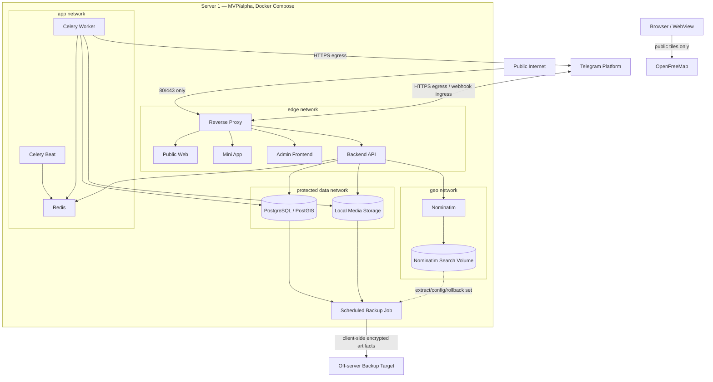
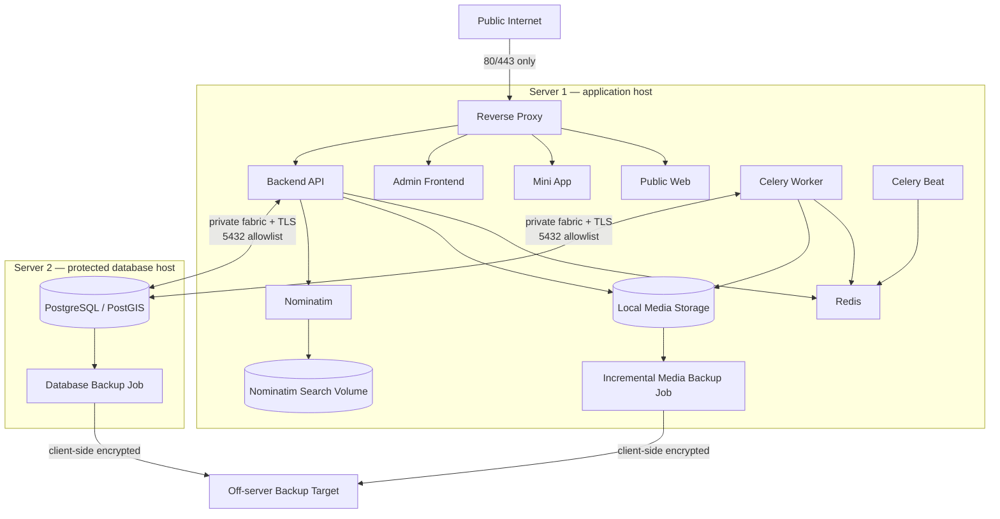
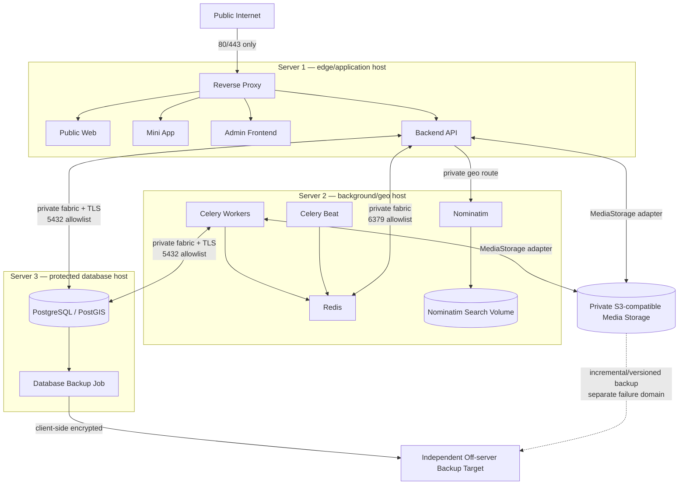
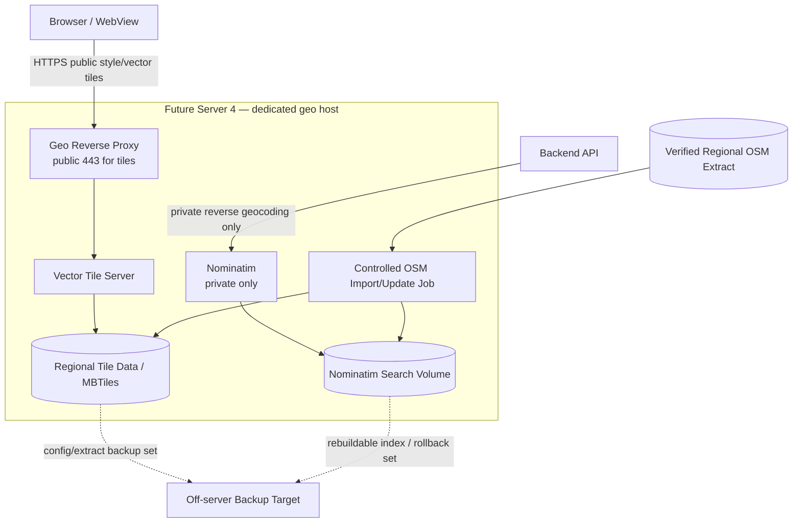
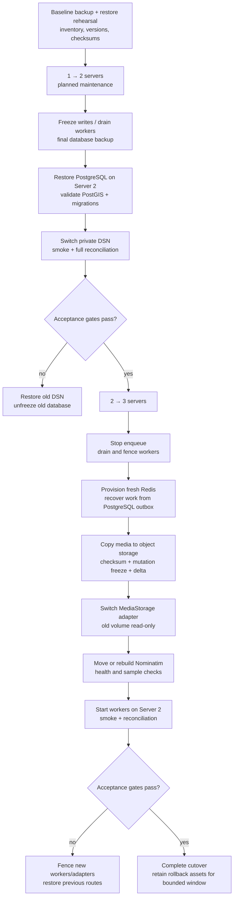

# G4.10 — Deployment topology, networks, backups и migration

## Статус, цель и границы

- Статус: `ACCEPTED`
- MVP/alpha: один физический сервер, Docker Compose
- Growth path: два, затем три core servers по измеримым triggers
- Deferred geo path: отдельный четвёртый сервер при отказе от hosted tiles
- Alpha recovery target: `RPO ≤ 24 часа`, `RTO ≤ 24 часа`

Документ фиксирует физическое размещение containers, Docker/private networks,
exposed ports, protected volumes, encrypted off-server backups и безопасные
переходы между этапами.

Это deployment design, а не production Compose/Ansible/Terraform, firewall
ruleset, runbook commands или cloud purchase. Точные domains, IP, credentials,
host sizes, provider и frontend framework не выбираются.

Диаграммы являются наглядным представлением. Нормативными являются таблицы,
network/port rules, migration gates и инварианты.

## Источники и приоритет

Приоритет: [PD](../../PRODUCT_DECISIONS.md) →
[ADR](../../DECISIONS.md) →
[незаменённая исходная спецификация](../../SOURCE_SPECIFICATION.md).

Документ развивает принятые:

- [G4.1 — C4 context/containers](01-c4-context-containers.md);
- [G4.4A — data retention/backup classes](04-data-model-retention-compaction.md);
- [G4.7 — outbox/reconciliation/restore](07-outbox-inbox-and-reconciliation.md);
- [G4.8 — safe operations view/alerts](08-dead-letter-operations-alerts.md);
- [G4.9 — Kafka readiness](09-kafka-readiness-matrix.md).

При конфликте `ACCEPTED` решений migration останавливается. Deployment не
переносит business authority из PostgreSQL и не ослабляет safety/privacy.

## Подтверждённые параметры

| Область | Решение |
|---|---|
| Stage 1 | Один server: весь MVP/alpha Compose; public только `80/443` |
| Stage 2 | Server 1 application stack; Server 2 PostgreSQL/PostGIS |
| Stage 3 | Server 1 edge/API; Server 2 workers/Redis/Nominatim; Server 3 PostgreSQL/PostGIS |
| Shared media at Stage 3 | Private S3-compatible storage через существующий `MediaStorage` adapter |
| Deferred maps | Server 4 для self-hosted vector tiles и Nominatim после отдельного trigger/review |
| Multi-host fabric | Private VLAN либо WireGuard + exact host firewall allowlist |
| Orchestration | Docker Compose per host; Kubernetes/Swarm отсутствуют |
| Public ingress | Только reverse proxy `80/443`; geo server позже публикует только tile HTTPS |
| Database backup | Daily restore point; logical full while small или verified physical/incremental after growth |
| Media backup | Initial full, затем daily incremental/deduplicated, throttled off-peak |
| Nominatim backup | Verified extract/config/rollback set после manual update; search index rebuildable |
| Backup retention | 14 дней с автоматическим expiry/deletion verification |
| Backup verification | Weekly lightweight manifest/checksum/sample verification |
| Restore drill | Quarterly, before launch и после major storage/topology change |
| 1→2 DB migration | Planned maintenance + rehearsed dump/restore по умолчанию |
| 2→3 queue migration | Fresh Redis; work recovered/reconciled from PostgreSQL outbox |

Если rehearsed PostgreSQL restore не помещается в approved maintenance/RTO
window, G4.10 не импровизирует online cutover: создаётся отдельный
physical-replication/catch-up plan.

## Stage catalogue и triggers

| Stage | Core servers | Trigger | Не означает |
|---|---:|---|---|
| 1 — MVP/alpha | 1 | Launch baseline | HA, zero downtime или отсутствие external backup |
| 2 — database separation | 2 | PostgreSQL RAM/IO pressure либо отдельный backup/failure domain | DB replica/automatic failover |
| 3 — background separation | 3 | Worker/media/Nominatim CPU/RAM/IO мешают API | Несколько API instances или orchestrator |
| Deferred geo | +1 geo server | Решение отказаться от hosted tiles после resource/quality/operations review | Передачу event markers/payload в tile stack |
| HA | 4+ core/managed components | Несколько instances и отдельный HA ADR | Автоматический результат Stage 3 |

Календарная дата, наличие свободного server или желание «разнести всё» не
являются trigger.

## Deployment invariants

1. PostgreSQL/PostGIS остаётся единственным источником business truth.
2. API, Worker и Beat остаются processes одного modular monolith.
3. Docker networks логические; при нескольких hosts они не превращаются в
   cross-host Docker overlay.
4. Межсерверный transport идёт по private VLAN/WireGuard и exact firewall
   allowlist.
5. Internet-wide PostgreSQL, Redis, Nominatim, Docker daemon и SSH запрещены.
6. Redis/Celery queue/cache не резервируются как authoritative state.
7. Nominatim search index не является business state и может быть rebuilt.
8. Media доступно только через `MediaStorage` adapter; direct public directory
   отсутствует.
9. Backup покидает source failure domain только после client-side encryption.
10. Migration имеет один authoritative writer/store и явный rollback point.
11. Kubernetes, Swarm, Kafka и несколько API instances не появляются в
    Stages 1–3.
12. Hidden coordinates, private media и credentials не попадают в diagrams,
    logs, image registry metadata или backup manifests.

## Logical network model

### Docker networks на одном host

| Network | Members | Назначение | Public/egress |
|---|---|---|---|
| `edge` | Reverse Proxy, three frontends, Backend API | Origin/path routing | Proxy публикует `80/443`; остальные ports не host-published |
| `app` | API, Worker, Beat, Redis | Task transport, cache, rate limits | Internal; controlled API/worker egress separately |
| `data` | API, Worker, PostgreSQL, MediaStorage/backup job | Business state/media | Internal, no public route |
| `geo` | API, Nominatim, Nominatim search volume/maintenance | Reverse geocoding | Internal; browser absent |
| `egress` | API, Worker, backup/update jobs as needed | HTTPS/provider/backup traffic | Outbound allowlist; no arbitrary inbound |

`internal: true` применяется к private Docker networks, где это совместимо с
необходимым egress. Container, которому нужен внешний HTTPS, получает отдельный
egress attachment; data stores его не получают.

### Несколько hosts

Docker bridge networks остаются локальными каждому host. Private inter-host
fabric предоставляет только необходимые routes:

- private cloud VLAN предпочтительна, если provider гарантирует isolation;
- иначе WireGuard host-to-host с отдельными keys/peer allowlist;
- host firewall принимает только exact source host/service port;
- public IP не используется как fallback для data traffic;
- service DNS/config указывает private addresses;
- management access идёт через VPN/provider console/bastion policy, а не
  internet-wide port `22`.

Docker Swarm overlay, Kubernetes CNI и shared Docker socket отсутствуют.

## Port and flow matrix

| Source → destination | Protocol/port | Exposure | Guard |
|---|---|---|---|
| Public internet → Reverse Proxy | TCP `80/443` | Public | 80 redirect/ACME as configured; application over HTTPS |
| Reverse Proxy → frontends/API | Container-local HTTP on configured internal ports | `edge` only | Exact origin/path allowlist |
| API/Worker → PostgreSQL | PostgreSQL TLS, normally `5432` | `data`/private fabric only | Exact source hosts, DB roles, no public bind |
| API/Worker/Beat → Redis | Redis protocol, normally `6379` | `app`/private fabric only | Exact sources, auth/TLS when cross-host |
| API → Nominatim | Internal HTTP on configured service port | `geo`/private fabric only | Backend-only; no browser/public route |
| Nominatim → search volume | Local filesystem/database access | Same geo host only | Dedicated permissions/volume |
| API/Worker → MediaStorage | Local adapter at Stages 1–2; HTTPS private object API at Stage 3 | Protected/private egress | Scoped credentials, attachment IDs |
| Worker/API → Telegram | HTTPS `443` egress | Outbound only except user webhook via Proxy | Separate user/operations bot credentials |
| Browser → OpenFreeMap | HTTPS `443` | External direct | Public style/vector tiles only |
| Backup job → off-server target | Encrypted transport, normally HTTPS `443`/provider protocol | Outbound only | Client-side encryption, scoped write credentials |
| Geo update job → verified OSM source | HTTPS `443` egress | Controlled maintenance | Explicit admin workflow/checksum |

Internal port numbers are defaults of protocols, not authorization. Exact
production bind/listen ports remain configuration, but publish policy is
normative: only `80/443` are public application ingress.

## Stage 1 — один server

Исходник:
[10-stage-1-one-server.mmd](diagrams/10-stage-1-one-server.mmd).

Текстовая альтернатива: один server запускает отдельные Compose containers и
private networks. Reverse Proxy — единственный public ingress на 80/443.
PostgreSQL, Redis, media и Nominatim закрыты. Browser получает hosted tiles
напрямую. Scheduled job читает PostgreSQL/media и проверяемый geo rollback set,
шифрует artifacts до отправки в off-server target.

### Stage 1 guards

- Host disk encryption и protected volume permissions обязательны.
- Nominatim имеет отдельные resource limits/healthcheck и не вытесняет
  API/PostgreSQL.
- Backup target находится вне этого physical server/failure domain.
- Reverse proxy/frontend/API containers не монтируют PostgreSQL data directory.
- Media directory монтируют только API, Worker и scoped backup job.
- Docker socket не монтируется application containers.
- Single-server outage означает downtime; это соответствует alpha RTO, не HA.

## Stage 2 — два servers

Исходник:
[10-stage-2-two-servers.mmd](diagrams/10-stage-2-two-servers.mmd).

Текстовая альтернатива: application host сохраняет proxy/frontends/API,
worker/beat/Redis, local media и Nominatim. PostgreSQL/PostGIS переносится на
закрытый database host. Только API/Worker source identities достигают 5432 по
private encrypted fabric. DB и incremental media backups независимо уходят в
off-server target.

### Stage 2 guards

- PostgreSQL host не имеет public application ingress.
- Database backup инициируется на DB host либо dedicated scoped job, а не через
  API container.
- Redis остаётся local к API/Worker и не переносится с database.
- Media остаётся local, потому что API и Worker ещё на одном host.
- Nominatim extract/config backup выполняется только после controlled update;
  daily search-index backup не требуется.
- Перенос PostgreSQL не означает replica/failover.

## Stage 3 — три servers

Исходник:
[10-stage-3-three-servers.mmd](diagrams/10-stage-3-three-servers.mmd).

Текстовая альтернатива: edge/API остаются на Server 1; workers, Beat, Redis и
Nominatim переходят на Server 2; PostgreSQL/PostGIS остаётся на Server 3.
API/Worker используют private database fabric. API также достигает Redis и
Nominatim на Server 2. Media предварительно переносится в private
S3-compatible storage через прежний adapter, чтобы API и Worker не использовали
общий host filesystem. DB и media имеют независимый off-server backup path.

### Stage 3 guards

- Private object storage не считается четвёртым core application server; это
  выбранный storage boundary/provider.
- Exact S3-compatible provider, bucket names/endpoints и credentials deferred.
- Bucket/public ACL запрещён; bytes выдаются только controlled application
  access.
- API получает только enqueue/cache/rate-limit Redis privileges; Redis не
  становится business truth.
- Nominatim public ingress отсутствует.
- Worker host имеет Telegram/provider egress, но не public inbound.
- Server 1 всё ещё имеет один API instance: это scale separation, не HA.

## Deferred Stage — собственный geo/tile server

Когда hosted OpenFreeMap перестаёт удовлетворять cost/SLA/data-residency/quality
и отдельный benchmark/operations review принят, появляется выделенный geo
server.

Исходник:
[10-future-geo-server.mmd](diagrams/10-future-geo-server.mmd).

Текстовая альтернатива: Browser получает public vector tiles по HTTPS от
выделенного geo reverse proxy/tile server. Backend отдельно обращается к
private-only Nominatim. Tile data и Nominatim используют отдельные volumes и
controlled OSM update job. Event markers, coordinates и payload не входят в
tile stack; они по-прежнему приходят из Backend API.

### Geo server rules

- Public route обслуживает только static style/vector tile contracts.
- Nominatim route private и доступен только Backend API/maintenance.
- Event data не импортируется в MBTiles/tile generation.
- Tile serving и OSM import имеют отдельные resource limits; update не должен
  вытеснять serving без maintenance decision.
- В первом варианте tiles и Nominatim могут делить dedicated geo host, но
  остаются containers/volumes; дальнейшее разделение выполняется по benchmark.
- Cutover hosted → self-hosted проходит shadow/cache/visual/accessibility
  checks и имеет rollback на hosted provider.
- Exact tile technology/CDN/domain/resource sizing deferred.

## Data volumes и backup inclusion

| Data/store | Authoritative | Backup policy |
|---|---:|---|
| PostgreSQL/PostGIS | Да | Daily encrypted restore point; 14d |
| Local media Stage 1–2 | Bytes authoritative behind adapter | Initial full + daily incremental/deduplicated; 14d |
| Object media Stage 3 | Bytes authoritative behind adapter | Versioned/incremental copy to independent failure domain; 14d |
| Redis broker/cache/rate limits | Нет | Не backup; rebuild/reconcile from PostgreSQL |
| Nominatim search index | Нет | Не daily; rebuild from verified extract/config |
| Verified OSM extract/config/rollback set | Operational source | Backup after controlled update/version change |
| Tile data/MBTiles | Rebuildable operational data | Extract/config + optional ready rollback set after update |
| Container images | Reproducible artifact | Registry retention/signature policy, не data backup |
| Source/IaC/config templates | Reproducible | Git/artifact repository; secrets excluded |
| Runtime secrets | Security authority | Dedicated secret recovery/rotation process; never inside ordinary data backup manifest |

## Backup model

### Что находится в PostgreSQL backup

Database backup содержит не только текст:

- rows, IDs, statuses, timestamps and numeric values;
- users/events/participation/permissions;
- PostGIS coordinates/spatial data;
- outbox/inbox/audit/normalized outcomes;
- retained text that has not yet expired.

Media bytes отсутствуют: PostgreSQL содержит attachment metadata/IDs, а файлы
идут отдельным media backup.

### Cadence

| Activity | Cadence | Нагрузка/цель |
|---|---|---|
| PostgreSQL restore point | Каждые 24 часа, off-peak | Meet alpha RPO; resource-capped |
| Media incremental/deduplicated | Каждые 24 часа, off-peak | Читать/передавать только new/changed chunks |
| Backup expiry/prune | Daily | Удалять >14d и проверять deletion outcome |
| Manifest/checksum/sample verification | Weekly | Lightweight; не full restore |
| Full isolated restore drill | Quarterly, pre-launch, after major storage/topology change | Доказать RTO/recovery procedure |
| Nominatim/tile rollback set | После controlled import/update | Не daily search-index scan |

Small alpha PostgreSQL может использовать daily encrypted logical dump.
Когда full dump создаёт заметную IO/CPU нагрузку, переходят на проверенную
physical base/WAL/incremental strategy отдельным operations design, сохраняя
RPO/RTO и restore testing.

`RPO ≤24h` оценивается по возрасту последней успешно завершённой и проверенной
restore point, а не по наличию cron schedule. Failed/missed job немедленно
создаёт safe backup status/operations alert и bounded retry; пока verified age
превышает 24 часа, recovery target считается нарушенным.

Media job:

- использует content-addressed/deduplicated chunks либо эквивалент;
- ограничивает IO priority, concurrency и bandwidth;
- не открывает media directory внешнему target;
- исключает уже удалённые до snapshot files;
- не превращает backup в бессрочное media storage;
- проверяет manifest/size/checksum без логирования filenames/private metadata.

### Encryption и target

- Artifact шифруется client-side до network upload.
- Encryption keys и backup credentials не хранятся в Git, image или backup
  рядом с data.
- Target находится вне source physical server и по возможности вне того же
  provider account/failure domain.
- Credentials write-scoped; public read/list запрещены.
- Transport имеет timeout, bounded retry и observable safe outcome.
- Backup admin view показывает только status/age/result, не contents/keys.

### Consistency manifest

Backup set имеет opaque set ID и минимальный manifest:

- source class/server role;
- started/completed timestamps;
- application/schema/PostgreSQL/PostGIS versions;
- database backup digest/size;
- media snapshot boundary and aggregate counts/digests;
- erasure-ledger checkpoint;
- encryption/key version reference;
- verification/expiry state.

Manifest не содержит user/event IDs, filenames, coordinates, bucket endpoint,
credentials или payload.

Database/media snapshots могут иметь небольшое временное расхождение. Restore
запускает attachment reconciliation: missing file становится controlled
unavailable/tombstone, orphan не публикуется и уходит в cleanup.

## Restore procedure

1. Isolate target environment/network.
2. Verify artifact signature/digest/encryption key version.
3. Restore PostgreSQL/PostGIS matching supported version/extensions.
4. Restore media set behind `MediaStorage` adapter.
5. Restore/rebuild Nominatim only if required.
6. Apply all migrations expected by restored application build.
7. Reapply erasure ledger and retention/expiry cleanup since backup checkpoint.
8. Run G4.7 full integrity/reconciliation.
9. Validate counts, constraints, outbox/inbox/order, attachments and safety
   projections.
10. Keep public reads/mutations gated until safety/erasure/reconciliation pass.
11. Record safe restore evidence and destroy test environment/data after drill.

Restore from backup does not re-enable expired sessions/tasks/notifications and
does not republish erased profile/location/media.

## Migration 1 → 2 servers

### Preconditions

- Stage 2 trigger/evidence recorded.
- Private fabric/firewall/TLS/service identities ready.
- Target PostgreSQL/PostGIS versions/extensions match.
- Full restore rehearsal fits approved window.
- Current backup and rollback evidence verified.
- Disk/RAM/IO capacity and 14d backup space verified.
- Application build/config can switch DSN without code change.
- No simultaneous application/schema feature migration.

### Default planned-maintenance sequence

1. Announce maintenance and gate public mutations.
2. Stop new enqueue/scheduled mutations; drain/fence workers.
3. Confirm outbox/inbox/reconciliation stable.
4. Take final encrypted PostgreSQL backup and verify digest.
5. Restore on Server 2; validate extensions, schemas, roles and migrations.
6. Keep old PostgreSQL stopped/read-only as rollback source.
7. Switch API/Worker DSN secret to private Server 2 endpoint.
8. Start one controlled API/worker set.
9. Run migrations only if separately planned and backwards compatible.
10. Smoke auth/public/admin/spatial/outbox flows.
11. Run full reconciliation and safety projection checks.
12. Open traffic/mutations only after acceptance gates.
13. Retain old DB volume read-only for bounded rollback window, then securely
    delete by approved procedure.

`RPO ≤24h` is disaster-recovery loss target, not permission to lose data during
planned migration: final backup/checkpoint is required.

### When dump/restore is insufficient

If rehearsal does not fit maintenance/RTO window, migration pauses. A separate
plan must define physical base backup/streaming catch-up, replication slots/WAL
retention, final write freeze, promotion and rollback. G4.10 does not improvise
logical dual-write.

## Migration 2 → 3 servers

### Redis/Worker

1. Stop new Celery enqueue and Beat scheduling.
2. Drain tasks where safe; fence remaining worker leases.
3. Record G4.7 outbox/reconciliation checkpoint.
4. Provision fresh Redis on Server 2.
5. Do not copy Redis dump as business recovery mechanism.
6. Start Beat/Workers with same application build/config version.
7. Re-enqueue/reconcile required work from PostgreSQL outbox.
8. Verify duplicate/idempotency/lease recovery.

Cache/rate-limit reset is expected and guarded; it cannot alter rights,
capacity or participation.

### Media

1. Provision private S3-compatible target and scoped adapter credentials.
2. Bulk copy retained live files with attachment/checksum manifest.
3. Verify counts/checksums and deny public bucket access.
4. Enter short media-mutation freeze.
5. Copy delta and mark adapter epoch.
6. Switch API/Worker to object `MediaStorage` adapter as single writer.
7. Run attachment/orphan/missing-file reconciliation.
8. Keep old local media read-only for bounded rollback window.
9. After acceptance/backup, securely delete old copy by retention policy.

Dual authoritative media writes are forbidden. Shadow read/checksum допускается.

### Nominatim

1. Provision resource-limited container/volume on Server 2.
2. Restore verified rollback set or rebuild from regional extract.
3. Run healthcheck and manual representative point checks.
4. Switch Backend private service endpoint.
5. Keep old instance available only for bounded rollback.
6. No browser/public route appears.

### API connectivity

After cutover API on Server 1 needs private allowlisted access to:

- PostgreSQL Server 3;
- Redis Server 2;
- Nominatim Server 2;
- private object media endpoint.

Worker Server 2 needs PostgreSQL, Redis, object media and approved HTTPS egress.

## Migration sequence

Исходник:
[10-migration-sequence.mmd](diagrams/10-migration-sequence.mmd).

Текстовая альтернатива: после baseline backup/restore rehearsal переход 1→2
замораживает writes, drains workers, восстанавливает PostgreSQL на новом host,
переключает private DSN и запускает smoke/reconciliation. Failure возвращает
старый DSN. Переход 2→3 создаёт fresh Redis, восстанавливает задачи из outbox,
копирует и переключает media adapter, переносит Nominatim и запускает workers
на Server 2. Failure fences новые adapters и возвращает прежние routes.

## Acceptance gates

### Common

- Images/config versions pinned and verified.
- Secrets delivered outside Git/image.
- Only intended public ports visible from external scan.
- Private ports reject non-allowlisted hosts.
- Healthchecks/resource limits/log redaction active.
- Backup/rollback artifacts verified.
- No pending incompatible migration/open safety issue.
- Monitoring inputs and operator contacts available.

### Database cutover

- PostgreSQL/PostGIS version/extensions/schema/migration heads match.
- Row/constraint/spatial smoke checks pass.
- API/Worker roles have least privileges.
- Outbox/inbox/checkpoint/reconciliation parity passes.
- Public safety projections remain fail-closed.
- Final backup and rollback DB remain identifiable/read-only.

### Worker/media cutover

- Redis treated as disposable transport/cache.
- All required tasks recoverable from PostgreSQL outbox.
- No two worker lease epochs can commit same mutable effect incorrectly.
- Media counts/checksums/attachment reconciliation pass.
- Object storage is private and backup path verified.
- Nominatim representative checks pass.

## Rollback rules

| Scope | Rollback |
|---|---|
| DB | Gate writes, fence new connections, restore old DSN/source only if no divergent accepted writes; otherwise forward-repair plan |
| Worker/Redis | Fence new workers, stop Beat, restore old workers/Redis route; reconcile from PostgreSQL |
| Media | Fence adapter epoch, revert to old read-only/full source only before divergent writes; otherwise reconcile/forward copy |
| Nominatim | Switch private endpoint to old healthy instance/rollback set |
| Geo tiles | Switch browser style URL/config back to hosted provider |
| Backup target | Stop jobs, rotate credentials, retain verified previous target until new target drill |

Rollback cannot silently discard writes accepted after cutover. If divergence
exists, automatic rollback запрещён; traffic remains gated until forward
reconciliation/merge procedure is approved.

## Failure matrix

| Failure | Поведение |
|---|---|
| Server 1 outage Stage 1 | Full service downtime; restore on replacement within RTO |
| Application host outage Stage 2 | DB survives, but service downtime; no direct DB public access |
| DB host outage Stage 2/3 | Service mutations/read paths gated; restore from off-server backup |
| Worker host outage Stage 3 | API/public reads may remain; background effects delayed in outbox |
| Redis loss | Fresh Redis + re-enqueue/reconcile from PostgreSQL |
| Object media unavailable | Metadata remains; upload/read returns safe unavailable; no DB rollback |
| Nominatim unavailable | Event hidden-location publication requiring street resolution fails closed |
| Private fabric down | No public fallback to DB/Redis/Nominatim |
| Backup job fails | Safe admin status/metrics/ops alert; business transaction unaffected |
| Backup target compromised | Revoke credentials, stop jobs, verify encrypted artifacts/independent copies |
| Restore contains erased data | Erasure ledger reapplied before traffic; reconciliation blocks exposure |
| Migration smoke fails | Keep traffic gated and execute bounded rollback |
| Old/new writes diverge | Automatic rollback forbidden; forward reconciliation |
| Geo update overload | Resource limit/maintenance rollback; API event data unaffected |

## Resource and capacity policy

G4.10 не задаёт production vCPU/RAM/disk numbers. Перед каждым stage нужны
measurements:

- API CPU/connections/latency;
- Worker queue/outbox lag, CPU/RAM/media IO;
- PostgreSQL working set, IOPS, connections, backup/restore duration;
- Redis memory/eviction/queue depth;
- media live bytes/change rate/backup throughput;
- Nominatim index size/import/query load;
- tile data size/requests/cache hit/update duration для deferred geo.

Stage change принимается по causal bottleneck/failure-domain evidence, а не по
общему «сервер загружен».

## Security and operations checklist

- Host OS/container runtime patched by controlled process.
- Containers non-root/read-only filesystem where compatible.
- Images pinned by digest, scanned and signed according to later CI/CD design.
- No secrets in Compose, Git, image layers, env dumps or logs.
- Host firewall default deny.
- Database/Redis/Nominatim bind private addresses only.
- Docker API/socket not remotely/publicly exposed.
- Backup and media credentials scoped/rotated.
- Admin/operations endpoints remain behind main reverse proxy/admin auth.
- Time synchronization and UTC logs without payload/PII.
- Audit-safe deployment/migration evidence retained.
- Production shell access follows least privilege and separate management plane.

## Verification strategy

Перед implementation/deployment:

1. Parse/validate Compose and network membership.
2. External port scan proves only intended `80/443`.
3. Cross-network negative connectivity tests.
4. Private-fabric/WireGuard/firewall tests.
5. Secret/image/SBOM/container security checks.
6. PostgreSQL/PostGIS backup/restore/migration rehearsal.
7. Daily restore-point and 14d expiry tests.
8. Incremental media dedup/checksum/throttle tests.
9. Weekly verification and isolated quarterly restore drill.
10. Erasure-ledger + full reconciliation restore test.
11. Redis loss/re-enqueue/outbox recovery test.
12. Worker lease/drain/fencing cutover test.
13. Media single-writer epoch and rollback test.
14. Nominatim rebuild/health/manual point checks.
15. Geo tile shadow/rollback test before future self-host cutover.
16. Light/dark Mermaid render и embedded/source equality.

## Явно вне G4.10

- Production Compose/Ansible/Terraform/firewall files.
- Exact domains, hostnames, IPs, provider, regions or credentials.
- Exact resource sizes, autoscaling or cost plan.
- Kubernetes, Docker Swarm, service mesh.
- Multiple API instances/load balancer/automatic HA.
- PostgreSQL replica/failover/PITR implementation.
- Kafka deployment.
- Exact S3-compatible or backup provider.
- Production tile technology/CDN configuration.
- General observability SLO/dashboard implementation.
- CI/CD and migration commands.

## Архитектурные инварианты

| ID | Инвариант |
|---|---|
| `DEP-01` | Stage 1 public ingress ограничен `80/443`; data services never public |
| `DEP-02` | Multi-host traffic uses private encrypted fabric and exact firewall allowlist |
| `DEP-03` | Compose remains per host; no overlay/orchestrator in Stages 1–3 |
| `DEP-04` | PostgreSQL remains business truth; Redis/media/Nominatim roles не расширяются |
| `DEP-05` | Backup encrypted before leaving source and retained 14d |
| `DEP-06` | Media backup daily incremental/deduplicated, не daily full copy |
| `DEP-07` | Nominatim index rebuildable; update rollback set, не daily index backup |
| `DEP-08` | Restore reapplies erasure ledger and full reconciliation before traffic |
| `DEP-09` | Stage 3 shared media uses private object storage via `MediaStorage` adapter |
| `DEP-10` | Migration/cutover has one authoritative writer/store and fenced rollback |
| `DEP-11` | Redis queue is not migrated as business state; outbox restores required work |
| `DEP-12` | Future tile server never receives event markers/payload/private coordinates |
| `DEP-13` | Nominatim remains backend-only even on dedicated geo host |
| `DEP-14` | Stage change follows measured bottleneck/failure-domain trigger |
| `DEP-15` | Exact production infrastructure/secrets remain outside this document |

## Traceability

| Решение | Источник |
|---|---|
| One/two/three server layout, Compose, triggers | `ADR-018` |
| Public 80/443, container/data boundaries | `PD-015`, `ADR-018`, `G4.1` |
| PostgreSQL/Redis/outbox authority | `PD-012`, `ADR-015`, `G4.7` |
| Media adapter/local→object migration | `PD-014`, `ADR-018`, `G4.1` |
| Nominatim isolation and future self-host maps | `PD-017`, `ADR-018`, `ADR-019` |
| Backup 14d, erasure restore | `PD-014`, `ADR-016`, `G4.4A`, `G4.7` |
| Alpha RPO/RTO and off-server backup | `ADR-018` |
| Safe backup status/operations alert | `ADR-015`, `G4.8` |
| Kafka/Kubernetes deferred | `ADR-017`, `ADR-018`, `G4.9` |

## Acceptance checklist

- [x] Документ остаётся `DRAFT` до owner review.
- [x] Stage 1/2/3 physical placement задано без HA/orchestrator.
- [x] Public/private ports и Docker/private-fabric boundaries определены.
- [x] PostgreSQL/Redis/media/Nominatim placement и authority заданы.
- [x] Future dedicated geo/tile server показан отдельно как deferred.
- [x] Daily incremental media backup не трактуется как daily full copy.
- [x] Backup cadence, 14d retention, verification и restore drill заданы.
- [x] Restore повторно применяет erasure ledger/reconciliation.
- [x] 1→2 database и 2→3 worker/media/Nominatim migrations описаны.
- [x] Redis не переносится как durable business state.
- [x] Single-writer/fencing/rollback/divergence rules зафиксированы.
- [x] Пять диаграмм имеют отдельные `.mmd` и текстовые альтернативы.
- [x] G4.10 checkbox/changelog принятия и auth-flow пункт не изменены.
- [x] Production infra/code/secrets/providers/Kubernetes/Kafka не создавались.
