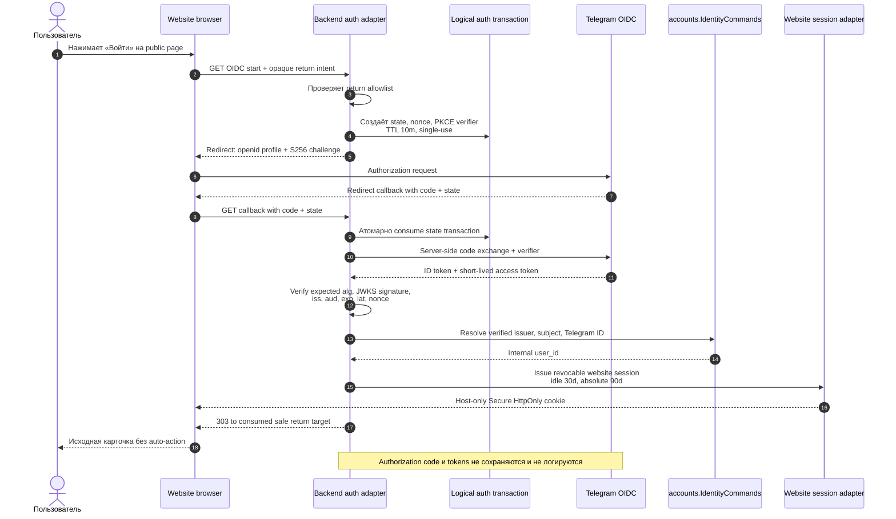
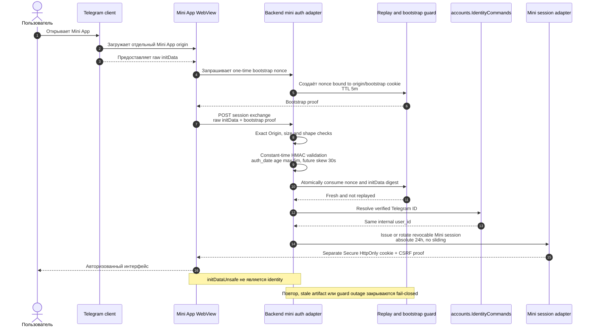
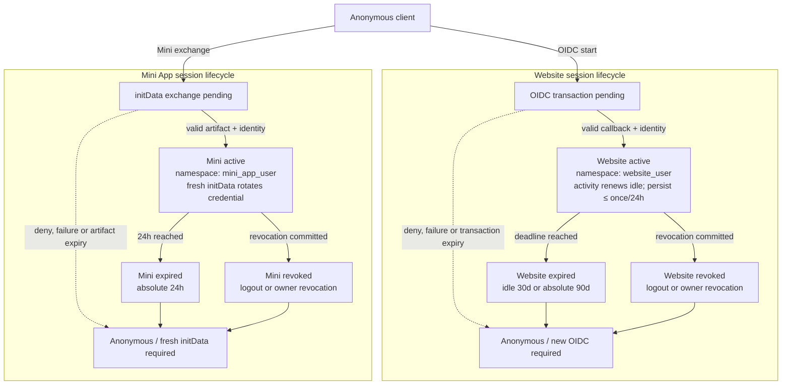

# G4.11 — Web и Mini App authentication flow

## Статус, цель и границы

- Статус: `DRAFT — ожидает подтверждения владельца`
- Website identity protocol: Telegram OIDC Authorization Code Flow + PKCE
- Mini App identity protocol: server-validated Telegram `initData`
- Domain result: один immutable internal `user_id`
- Website session: rolling idle `30 дней`, absolute `90 дней`
- Mini App session: absolute `24 часа`, без sliding renewal

Документ нормативно описывает protocol flow, trust boundaries, verification,
replay/CSRF/origin guards, identity resolution и lifecycle пользовательских
website/Mini App sessions.

Это не физическая модель хранения. Exact identity/session/replay tables,
columns, indexes, encryption и cleanup job остаются G4.12. Production Python,
FastAPI routes, OIDC library configuration, secrets, domains и cookie names
также не создаются.

Диаграммы являются наглядным представлением. Нормативными являются таблицы,
последовательности проверок, failure semantics и инварианты.

## Источники и приоритет

Приоритет: [PD](../../PRODUCT_DECISIONS.md) →
[ADR](../../DECISIONS.md) →
[незаменённая исходная спецификация](../../SOURCE_SPECIFICATION.md).

Документ развивает принятые:

- `PD-013` — server-derived identity, strict validation, safe logging;
- `PD-015` — website/Mini App UX, auth protocols и session lifetimes;
- `ADR-020` — Telegram как identity provider, а не domain model;
- [G4.1 — C4 context/containers](01-c4-context-containers.md);
- [G4.2 — module boundaries/public ports](02-module-boundaries-and-public-ports.md);
- [G4.5 — API/request security](05-api-contracts-and-request-security.md);
- [G4.10 — deployment/network boundaries](10-deployment-topology-and-migration.md).

Protocol-level external sources:

- [Telegram Login / OpenID Connect](https://core.telegram.org/bots/telegram-login);
- [Telegram Mini Apps / validating initData](https://core.telegram.org/bots/webapps);
- [OpenID Connect Core](https://openid.net/specs/openid-connect-core-1_0.html);
- [OAuth 2.0 Security Best Current Practice](https://www.rfc-editor.org/rfc/rfc9700);
- [PKCE](https://www.rfc-editor.org/rfc/rfc7636).

Если внешний provider protocol меняется, реализация не ослабляет принятые
guards автоматически. Изменение scopes, algorithms, identity claims или
verification method требует integration tests и отдельного review.

## Подтверждённые параметры

| Область | Решение |
|---|---|
| Website UX | Full-page redirect; popup login не является MVP contract |
| OIDC flow | Authorization Code, PKCE только `S256` |
| OIDC scopes | Только `openid profile`; `phone` и `telegram:bot_access` не запрашиваются |
| OIDC transaction | TTL `10 минут`; `state`, nonce и authorization code single-use |
| OIDC signature | Configured allowlist; MVP ожидает `RS256`; `none`/unexpected algorithm запрещены |
| OIDC tokens | Проверяются server-side, затем удаляются; browser refresh token отсутствует |
| Mini verification | Direct backend использует Telegram HMAC validation; Ed25519 не является fallback |
| `initData` freshness | Возраст не более `5 минут`; future clock skew не более `30 секунд` |
| Mini replay | One-time bootstrap nonce + keyed artifact digest; replay window минимум `10 минут` |
| Website session | Idle/rolling `30 дней`, absolute `90 дней` |
| Website activity write | Coalesced: не чаще одного persistence update за `24 часа` на active session |
| Mini session | Absolute `24 часа`; refresh только через новое valid `initData` |
| Browser storage | Только opaque server session cookie; auth token в `localStorage`/URL запрещён |
| Cookie baseline | Host-only, `Secure`, `HttpOnly`, `SameSite=Lax`; отдельные Web/Mini namespaces |
| Mutations | Exact allowed `Origin` + session-bound CSRF proof |
| Return target | Opaque, server-held, allowlisted, single-use; business action не повторяется автоматически |
| Identity conflict | Fail-closed; auto-merge, support merge и identity transfer отсутствуют |

Численные security defaults меняются только через reviewed configuration и
не могут быть увеличены клиентом. Более короткий provider expiry всегда имеет
приоритет.

## Actors и trust boundaries

| Boundary/actor | Доверие | Разрешённый вход | Запрещённое предположение |
|---|---|---|---|
| Anonymous browser | Недоверенный public client | Public reads, OIDC start | Cookie/URL/profile fields не доказывают identity |
| Website browser | Недоверенный browser после session issuance | Opaque Web cookie, CSRF proof, exact Origin | ID/access token и Telegram ID не становятся client credential |
| Telegram Mini App WebView | Недоверенный browser runtime | Raw `initData` только на exchange endpoint | WebView, user agent и `initDataUnsafe` не являются proof |
| Reverse Proxy | Public edge | TLS termination, origin/path routing, limits | Не определяет `user_id` и не принимает auth policy |
| Backend auth adapters | Protocol trust boundary | OIDC callback либо Mini exchange | Не передают raw provider payload в domain |
| `accounts.IdentityCommands` | Identity owner port | Только verified canonical auth context | Не проверяет browser-controlled raw artifact повторно |
| Session adapters | Credential/session boundary | Internal `user_id`, session type и policy | Web session не принимается как Mini/Admin session |
| Telegram OIDC/Mini Apps | External identity provider | Signed artifacts через registered flows | Доступность provider не является business-state authority |
| Admin boundary | Отдельная staff identity | Только будущий G4.13 password flow | User Telegram identity никогда не повышается до staff |

### Общая trust-последовательность

1. Public edge принимает недоверенный request и применяет transport limits.
2. Boundary-specific adapter проверяет origin, shape, freshness и cryptography.
3. Replay guard атомарно consume одноразовый protocol context.
4. Adapter создаёт минимальный `VerifiedTelegramIdentityContext`.
5. `accounts.IdentityCommands` разрешает context в internal `user_id`.
6. Session adapter выпускает opaque credential соответствующего session type.
7. Следующие API requests получают `UserActor` только из server-side session.

Ни frontend, ни Telegram profile fields, ни path/body `user_id` не пропускают
какой-либо из этих шагов.

## Website OIDC + PKCE

### Sequence diagram

Текстовая альтернатива: пользователь начинает вход с безопасной public page.
Backend проверяет return intent и создаёт одноразовую 10-минутную transaction
со `state`, nonce и PKCE verifier. Telegram получает только `openid profile` и
`S256` challenge. Callback атомарно consume transaction, после чего backend
сам обменивает code и проверяет ID token. Только проверенный issuer, subject и
Telegram ID передаются в `accounts`. После разрешения internal `user_id`
выдаётся отдельная website session, а browser возвращается на исходную
карточку без автоматического выполнения действия.

### OIDC start

| Шаг | Нормативное действие | Failure |
|---|---|---|
| 1 | Принять только opaque return intent либо локальный route key | Raw absolute URL, scheme-relative URL и неизвестный route отклоняются |
| 2 | Нормализовать return target через server-side allowlist | Open redirect запрещён |
| 3 | Сгенерировать high-entropy `state`, nonce и PKCE verifier | Client-provided values не принимаются |
| 4 | Сохранить только необходимый logical transaction context с TTL 10m | Недоступность single-use store закрывает новый вход fail-closed |
| 5 | Отправить `code_challenge_method=S256` и `openid profile` | Plain PKCE и scope expansion запрещены |
| 6 | Использовать только заранее зарегистрированный callback | Dynamic callback от browser запрещён |

Logical auth transaction содержит server-derived identifiers, digests,
timestamps и return reference, но не raw profile, access token или secret.
Физическая запись определяется G4.12.

### Callback и token exchange

Порядок обязателен:

1. Применить strict query size/count/encoding limits.
2. Отклонить provider error безопасным generic result.
3. Найти transaction по constant-time-safe digest `state`.
4. Проверить type, unused state, deadline и exact callback context.
5. Атомарно consume transaction до либо вместе с началом code exchange.
6. Выполнить server-to-server token request с exact redirect URI, client
   authentication и сохранённым PKCE verifier.
7. Применить bounded connect/read timeout; redirect ответа не следовать.
8. Проверить ID token до чтения identity claims.
9. Создать canonical verified context и немедленно redacted/discard tokens.
10. Разрешить identity, выдать website session и выполнить `303` только на
    сохранённый safe return target.

Callback является protocol `GET`, но не crawler-safe resource read. Он
одноразово завершает auth transaction; prefetch/replay не создаёт вторую
session.

### ID token validation

| Проверка | Правило | Failure semantics |
|---|---|---|
| Compact JWT | Ровно ожидаемая структура и bounded size | `authentication_failed` |
| Header `alg` | На configured allowlist; MVP — `RS256`; `none` запрещён | Fail-closed до чтения claims |
| Header `kid` | Ключ из trusted Telegram JWKS | Unknown `kid`: один bounded refresh, затем fail-closed |
| Signature | Проверка approved library по выбранному key/algorithm | Никогда не fallback на другой algorithm |
| `iss` | Exact configured Telegram issuer | String/prefix mismatch отклоняется |
| `aud` | Содержит exact BotFather client ID; multi-audience обрабатывается по OIDC rules | Чужой bot/client отклоняется |
| `exp` | Не истёк с малым configured clock tolerance | Client clock не используется |
| `iat` | Не находится недопустимо в будущем/прошлом относительно transaction | Аномалия времени отклоняется |
| nonce | Exact transaction nonce и single-use | Missing/mismatch/replay отклоняется |
| `sub` | Непустой immutable provider subject | Name/username не заменяют subject |
| Profile Telegram `id` | Валидный signed numeric identity в supported range | Missing/invalid ID не создаёт user |
| Claims type/size | Strict expected types и bounds | Unknown display fields игнорируются |

JWKS разрешено кэшировать по protocol caching metadata. При временной
недоступности Telegram уже кэшированный ещё действительный trusted key может
использоваться; неизвестный key не принимается. JWKS URL, issuer, client ID и
algorithm allowlist являются deployment configuration, а client secret —
secret storage.

Telegram сейчас не предоставляет обязательный отдельный UserInfo step для
этого flow. Afisha не делает лишний provider request и использует только
проверенные claims ID token.

## Telegram Mini App `initData`

### Sequence diagram

Текстовая альтернатива: Telegram открывает отдельный Mini App origin и
предоставляет WebView raw `initData`. До обмена backend создаёт короткий
одноразовый bootstrap proof, привязанный к exact origin и bootstrap cookie.
Exchange endpoint принимает raw artifact только один раз, ограничивает его
размер, проверяет HMAC и `auth_date`, затем атомарно consume bootstrap nonce и
keyed digest artifact. Проверенный Telegram ID разрешается в тот же internal
`user_id`, но выдаётся отдельная Mini session на 24 часа. `initDataUnsafe`,
WebView и user agent не участвуют в доказательстве identity.

### Bootstrap и exchange

| Этап | Требование | Причина |
|---|---|---|
| Mini bootstrap | Exact allowed Mini Origin, bounded anonymous rate limit | Чужой origin не получает usable exchange context |
| Bootstrap proof | Random, single-use, TTL 5m, привязан к origin и host-only bootstrap cookie | Выполняет nonce/session binding из ADR-020 |
| Request method | Только `POST`, bounded form/JSON envelope, no redirects | Raw artifact не появляется в URL/referrer |
| Raw field | Только `Telegram.WebApp.initData` | `initDataUnsafe` не передаётся как proof |
| Parsing | Reject invalid encoding, duplicate security keys и oversized values | Не допускает ambiguous canonicalization |
| Signed unknown fields | Включаются в provider-defined signature calculation, но не используются domain | Forward-compatible без расширения доверия |
| HMAC | Current Telegram WebAppData algorithm, constant-time comparison | Backend владеет bot token и проверяет напрямую |
| Freshness | `now - auth_date ≤ 5m`, `auth_date - now ≤ 30s` | Ограничивает stolen/replayed artifact |
| Subject | Signed `user.id` обязателен для user session | Chat/query/context не заменяют user identity |
| Replay | Keyed digest raw artifact + bootstrap nonce consume атомарны | Повтор не создаёт новую session |
| Output | Только canonical verified Telegram identity context | Raw query/profile не входит в domain |

Keyed replay digest вычисляется отдельным auth-replay key и не позволяет
восстановить `initData`. Он хранится не менее 10 минут, то есть дольше
допустимого freshness window. Redis может ускорять отрицательную проверку, но
не является единственным single-use authority; точный durable control
фиксируется в G4.12.

### HMAC и Ed25519 modes

Для MVP Backend API является прямой стороной bot-а и использует HMAC validation
с bot token из secret storage.

Telegram Ed25519 third-party validation:

- не включается как автоматический fallback после HMAC failure;
- не используется для сокрытия bot token внутри того же trusted backend;
- может быть добавлена как отдельный configured verifier mode только при
  появлении независимой third party;
- требует отдельного key provenance/rotation/integration-test review;
- при переключении режима не меняет freshness, replay и identity rules.

Такой выбор предотвращает algorithm downgrade и сохраняет ADR-020 совместимым
с обоими официальными режимами.

### Mini refresh

Mini session не продлевает expiry обычными API requests. Когда клиенту нужна
новая session:

1. Mini App получает текущее свежее raw `initData` от Telegram runtime.
2. Выполняет новый bootstrap + exchange целиком.
3. Backend повторяет cryptographic/freshness/replay/identity checks.
4. Если active Mini cookie принадлежит той же identity/session family, session
   атомарно rotates; старый credential становится unusable.
5. Если cookie отсутствует, создаётся новая owner-visible Mini session.
6. Stale `initData` не продлевает session и не изменяет identity state.

Background timer сам по себе не является proof. Если Telegram runtime не
предоставляет свежий artifact, после 24 часов пользователь возвращается в
anonymous/reauth-required state.

## Canonical identity resolution

Auth adapter передаёт `accounts.IdentityCommands` только:

| Поле | Website OIDC | Mini App | Domain visibility |
|---|---|---|---|
| Provider kind | `telegram_oidc` | `telegram_mini_app` | Только accounts/auth boundary |
| Verified Telegram user ID | Signed profile claim | Signed `user.id` | Никогда не primary key бизнес-сущности |
| Verified issuer | Обязательно | Неприменимо | Protected identity binding |
| Verified subject | Обязательно | Неприменимо | Protected identity binding |
| Authentication time | Checked `iat`/transaction time | Checked `auth_date` | Audit-safe normalized timestamp |
| Protocol correlation | Opaque server ID | Opaque server ID | Safe correlation, не raw artifact |

Name, username, picture, language, Premium status, phone, chat context,
`query_id` и `start_param` не определяют identity. Они не копируются в
публичный Profile и не перезаписывают пользовательские поля.

### Resolution rules

| Current binding | Verified input | Result |
|---|---|---|
| Нет Telegram ID и OIDC pair | Первый valid flow | Создать internal `user_id` и protected binding в owner transaction |
| Telegram ID уже связан | Mini с тем же ID | Вернуть существующий `user_id` |
| Telegram ID уже связан, OIDC pair ещё нет | Website с тем же signed Telegram ID | Добавить verified issuer/subject к тому же `user_id` |
| OIDC pair уже связан | Website с той же pair и ID | Вернуть существующий `user_id` |
| OIDC pair и Telegram ID указывают на разные users | Любой flow | `identity_conflict`, session не выдавать, auto-merge запрещён |
| Telegram ID/pair уже связан с deleted/blocked lifecycle | Любой flow | Owner lifecycle/safety policy; новый user автоматически не создаётся |
| Profile display claims изменились | Valid повторный вход | Identity timestamps могут обновиться; public Profile не меняется |

Unique/fencing details принадлежат G4.12. Логически resolution является одной
owner transaction: нельзя сначала создать session, а затем асинхронно выяснять
identity conflict.

В MVP отсутствуют manual recovery, перенос identity на другой Telegram account,
support merge и staff override. Ошибка conflict фиксирует безопасный incident
reference без raw claims и не раскрывает, какие users существуют.

## User session lifecycle

### State diagram

Текстовая альтернатива: anonymous client может начать либо website OIDC
transaction, либо Mini exchange. Успешная проверка создаёт соответствующую
active session. Website activity двигает idle deadline, но не absolute
90-дневный deadline и записывается не чаще раза в сутки. Mini session не
продлевается активностью; только свежий `initData` полностью повторяет exchange
и rotates credential. Logout или owner revocation переводят session в revoked,
а достижение соответствующего deadline — в expired. В обоих случаях запрос
снова рассматривается как anonymous.

### Session contracts

| Свойство | Website | Mini App |
|---|---|---|
| Subject | Internal `user_id` | Тот же internal `user_id` |
| Session type | `website_user` | `mini_app_user` |
| Cookie namespace | Только website session name | Отдельное Mini session name |
| Credential | Opaque high-entropy value | Другой opaque high-entropy value |
| Idle deadline | 30d с activity renewal | Нет |
| Absolute deadline | 90d от initial login | 24h от issue/rotation |
| Renewal proof | Valid active session activity | Полный fresh `initData` exchange |
| Activity persistence | Coalesced ≤1 write/24h | Не продлевает deadline |
| Revocation | Current либо выбранная owner session | Current либо выбранная owner session |
| Mutations | Exact Web Origin + session CSRF | Exact Mini Origin + session CSRF |
| Cache | `Cache-Control: no-store` | `Cache-Control: no-store` |
| Staff use | Запрещено | Запрещено |

Absolute website deadline наследуется от исходной successful OIDC
authentication и не двигается rolling activity. Когда он достигнут, нужен
новый OIDC flow.

Session rotation меняет credential и CSRF binding. Старый credential
отклоняется даже если cookie/client повторно прислал его после успешной
rotation.

### Cookie и browser storage

1. Session cookies — host-only, `Secure`, `HttpOnly`, `SameSite=Lax`.
2. Domain-wide cookie запрещён; exact host/path задаются deployment config.
3. Website/Mini cookies имеют разные names и server-side session types.
4. Endpoint + exact Origin определяют допустимый namespace; наличие второй
   cookie не расширяет доступ.
5. API никогда не выбирает «наиболее привилегированную» из нескольких cookies.
6. Session/token/initData/CSRF secret не сохраняются в URL, history,
   `localStorage`, IndexedDB, analytics или error reporting.
7. Public SSR/crawler response не получает private data из случайно
   присутствующей cookie и не варьирует индексируемый HTML закрытыми полями.
8. Auth/session responses используют `Cache-Control: no-store`.

Admin cookie, когда появится в G4.13, имеет отдельный origin, namespace,
identity owner и validation flow.

### CSRF, Origin и CORS

Для каждого cookie-authenticated mutation обязательны одновременно:

- exact `Origin` из boundary-specific allowlist;
- credentialed CORS только для exact Website либо Mini origin;
- session-bound CSRF proof в отдельном request header;
- совпадающий active session type;
- обычные identity, authorization, object/state и idempotency guards.

Missing `Origin` на browser mutation закрывается fail-closed, кроме
документированного non-browser protocol endpoint, к которому user commands не
относятся. `Referer` может быть дополнительным signal, но не заменяет Origin.

CSRF proof выдаётся после session/bootstrap boundary, rotates с session и не
является bearer identity. Его transport encoding определяется G4.12/API
implementation; он не хранится в `localStorage`.

`SameSite=Lax` является дополнительной защитой, а не заменой CSRF/Origin.

### Logout и owner session management

| Действие | Semantics |
|---|---|
| Logout current | Идемпотентно revoke текущую session, очищает только соответствующую cookie |
| List own sessions | Возвращает safe session ID, type, created/last-active/expiry status; без token, raw IP/User-Agent |
| Revoke selected | Только session того же internal user; повтор даёт безопасный current result |
| Revoke current from list | Commit revocation прежде cookie cleanup; текущий response после этого не авторизует commands |
| Account deletion/security restriction | Owner policy может revoke все user sessions fail-closed |
| Provider outage | Не отзывает уже valid local sessions автоматически |

Функция «logout all» может быть выражена owner command, который отзывает все
website/Mini sessions пользователя. Exact table/update strategy — G4.12.

## Return-to-intent UX

После anonymous action frontend:

1. Показывает необходимость Telegram login.
2. Передаёт backend только route/resource/action-family intent из allowlist.
3. Backend сохраняет opaque return reference внутри auth transaction.
4. После успешного входа consume reference и возвращает пользователя на
   исходную безопасную карточку.
5. Join, like, create, reveal или иная business command не запускается
   автоматически.
6. Пользователь повторно нажимает действие уже в authenticated context.

Это предотвращает login CSRF, open redirect и неявное выполнение
state-changing command после внешнего redirect.

`start_param` Mini App и deep links являются navigation hints. Они не дают
membership, permission, exact-location access или automatic action.

## Failure semantics

| Failure | Public result | State effect | Recovery |
|---|---|---|---|
| User cancel/deny | `authentication_cancelled` | Session не создаётся | Вернуться на safe public page |
| OIDC state/nonce missing, expired, replayed | `authentication_failed` | Transaction остаётся consumed/invalid | Начать новый flow |
| Code exchange timeout/provider 5xx | `authentication_temporarily_unavailable` | User/business state не меняется | Новый flow после bounded retry/backoff |
| Unknown JWKS `kid` после refresh | `authentication_temporarily_unavailable` | Session не создаётся | Alert/monitor provider change |
| Invalid token signature/claims | `authentication_failed` | Session не создаётся | Новый flow; security metric |
| Mini malformed/oversized artifact | `authentication_failed` | Bootstrap consume/deny по policy | Полностью перезапустить Mini flow |
| Mini HMAC mismatch | `authentication_failed` | Session не создаётся | Не пробовать Ed25519 fallback |
| Stale/future/replayed `initData` | `authentication_expired` | Session не создаётся/не обновляется | Получить fresh artifact |
| Replay/single-use store unavailable | `authentication_temporarily_unavailable` | Новый вход fail-closed | Existing valid sessions продолжают работать |
| Identity conflict | `authentication_failed` + opaque incident ID | Merge/session запрещены | Security review; no support relink |
| Session expired/revoked | `session_expired` | Command не выполняется | Website OIDC либо Mini fresh exchange |
| CSRF/Origin mismatch | `request_not_allowed` | Command не выполняется | Reload safe app context |
| PostgreSQL commit failure | `authentication_temporarily_unavailable` | Ни binding, ни session не считаются созданными | Safe retry с новым protocol context |

Ошибка не раскрывает provider body, code/token/initData, Telegram ID, наличие
аккаунта, binding conflict details, secret, JWKS internals или infrastructure
topology.

Temporary Telegram/OIDC outage:

- не отменяет committed PostgreSQL business transactions;
- не отзывает valid local user sessions;
- блокирует только новый/renewed identity proof, который нельзя проверить;
- не превращает anonymous browser в authenticated actor;
- не разрешает cached display profile как identity fallback.

## Logging, audit, metrics и privacy

### Разрешённый operational минимум

- request/correlation ID;
- flow type: `web_oidc` либо `mini_init_data`;
- protocol stage и normalized outcome/reason;
- opaque auth transaction/session reference;
- latency bucket и provider availability class;
- key-cache hit/refresh outcome без key/token body;
- freshness/replay result без raw timestamp/profile payload;
- identity-conflict incident reference без Telegram identifiers.

### Запрещено

- authorization code, PKCE verifier/challenge pair, raw `state` или nonce;
- ID/access token, client secret, bot token, session/CSRF/bootstrap cookie;
- raw `initData`, its hash/signature или decoded user/profile JSON;
- Telegram ID, name, username, picture, phone, raw IP/User-Agent;
- full callback/exchange URL, query string, provider error body;
- production origin/domain и secret/config values в repository examples.

Reverse Proxy и error tracker должны redacted auth paths/query before access
logging. Metrics используют bounded labels; `user_id`, session ID, provider
subject и incident reference не являются metric labels.

### Обязательные metrics

| Metric family | Dimensions |
|---|---|
| Auth starts/completions | flow, normalized outcome |
| Auth stage failures | flow, stage, safe reason |
| Provider latency/timeout | operation, outcome |
| JWKS cache/refresh | hit/refresh/failure |
| Mini freshness/replay | outcome only |
| Session issue/rotate/revoke/expire | session type, outcome |
| CSRF/origin denies | boundary, safe reason |
| Identity conflict | count only |

Thresholds, alert routing и SLO задаются будущим G4 observability package.

## Security tests до реализации

### Website

- state/nonce/code reuse, expiry и parallel callbacks;
- PKCE verifier mismatch и запрет `plain`;
- forged signature, `alg=none`, algorithm confusion и unexpected algorithm;
- unknown/rotated `kid`, stale cached JWKS и provider outage;
- wrong issuer/audience, expired/future token, missing subject/profile ID;
- open redirect variants, encoded/Unicode/path traversal return target;
- callback prefetch/reload и token/provider error body redaction;
- отсутствие `phone`/`telegram:bot_access` scopes.

### Mini App

- HMAC valid/invalid с official test vectors;
- parameter reorder, duplicate keys, percent encoding и unknown signed field;
- oversized artifact/nested profile values;
- stale/future `auth_date` boundary values;
- bootstrap nonce reuse, artifact replay и concurrent double-submit;
- missing user, invalid numeric ID и `initDataUnsafe` substitution;
- запрет Ed25519 fallback после HMAC failure;
- wrong Origin, missing bootstrap cookie и replay-store outage.

### Sessions

- Web/Mini cookie namespace confusion;
- idle/absolute boundary, coalesced activity update и server clock change;
- Mini ordinary activity не продлевает 24h;
- rotation invalidates old credential/CSRF proof;
- logout/revoke race с concurrent mutation;
- CSRF missing/mismatch и CORS Origin variants;
- session list не раскрывает credential, raw IP/User-Agent;
- user session никогда не создаёт `StaffActor`.

## Архитектурные инварианты

| ID | Инвариант |
|---|---|
| `AUTH-01` | Website OIDC и Mini `initData` разрешаются в один internal `user_id`, но создают разные session types |
| `AUTH-02` | Telegram ID/issuer/subject принадлежат protected accounts identity boundary и не становятся domain primary identity |
| `AUTH-03` | Browser/WebView никогда не задаёт authoritative `user_id` |
| `AUTH-04` | Website использует Authorization Code + `S256` PKCE, single-use state/nonce/code и server-side exchange |
| `AUTH-05` | OIDC scope ограничен `openid profile`; phone/bot access отсутствуют |
| `AUTH-06` | ID token проверяется по expected algorithm/JWKS/issuer/audience/time/nonce до чтения identity |
| `AUTH-07` | Direct Mini backend использует HMAC; Ed25519 не является fallback |
| `AUTH-08` | `initDataUnsafe`, WebView, user agent и display profile не доказывают identity |
| `AUTH-09` | Mini freshness/replay/bootstrap guards fail-closed и не зависят только от Redis |
| `AUTH-10` | Website idle renewal не меняет absolute 90d; Mini activity не меняет absolute 24h |
| `AUTH-11` | Website/Mini/Admin cookies, session namespaces и actor types не смешиваются |
| `AUTH-12` | Cookie mutation требует exact Origin и session-bound CSRF proof |
| `AUTH-13` | Login возвращает на safe page, но не выполняет исходную business command автоматически |
| `AUTH-14` | Telegram display claims не копируются/не перезаписывают public Profile |
| `AUTH-15` | Identity conflict закрывается fail-closed; auto-merge/recovery/transfer отсутствуют |
| `AUTH-16` | Raw auth artifacts, credentials, Telegram PII и production config не попадают в logs/analytics/Git |
| `AUTH-17` | Provider/replay-guard outage не отзывает valid session и не откатывает business transaction |
| `AUTH-18` | Identity resolution и session issuance не оставляют usable session без committed owner binding |

## Явно вне G4.11

- Физическая Telegram identity/session/replay schema, columns, unique indexes,
  encryption и cleanup jobs — G4.12.
- Admin invitation/login/reset/bootstrap, Argon2id, idle/absolute session и
  re-auth sequence — G4.13.
- Production FastAPI/Pydantic/SQLAlchemy code, OIDC library и tests.
- Exact API payloads/OpenAPI, cookie names, domains, BotFather values, secrets,
  rate-limit thresholds и alert thresholds.
- Account recovery, identity transfer, support/admin merge и second identity
  provider.
- Phone scope/storage, Telegram bot write-access consent during website login.
- Social login popup, native SDK, password/passkey user login и browser refresh
  token.
- Operations bot/user-bot webhook flow, delivery state и deep-link token
  implementation.
- Full threat model/STRIDE, observability SLO и production runbooks.

## Traceability

| Решение | Источник |
|---|---|
| Server-derived identity, safe logs, strict request validation | `PD-013` |
| Anonymous website, equal Web/Mini capabilities, return-to-card UX | `PD-015` |
| OIDC+PKCE and Mini `initData` resolve one user | `PD-015`, `ADR-020` |
| Website 30d rolling/90d absolute, Mini 24h | `PD-015`, `ADR-020` |
| Immutable internal identity and protected Telegram binding | `ADR-020`, `G4.2` |
| OIDC issuer/subject/profile ID and no profile overwrite | `ADR-020` |
| `openid profile`, no phone/bot access | `ADR-020` |
| Mini HMAC/Ed25519 modes, auth_date, replay/session binding | `ADR-020`, Telegram Mini Apps protocol |
| Separate origins, sessions, cookies and Admin boundary | `PD-015`, `ADR-020`, `G4.1`, `G4.5` |
| CSRF/Origin/replay/request error rules | `PD-013`, `G4.5` |
| Session/list/revoke API capability | `PD-015`, `G4.5` |
| PostgreSQL authority and Redis failure semantics | `PD-012`, `G4.1`, `G4.10` |
| Exact physical identity/session data deferred | `IMPLEMENTATION_PLAN.md` next G4 item |

## Acceptance checklist

- [x] Документ остаётся `DRAFT` до отдельного owner review.
- [x] Website OIDC + PKCE и Mini `initData` показаны отдельными flows.
- [x] Оба flows возвращают один internal `user_id`, но разные session types.
- [x] Website 30d idle/90d absolute и Mini 24h absolute semantics заданы.
- [x] `state`, nonce, PKCE, JWKS, claims, `auth_date` и replay guards описаны.
- [x] Scopes ограничены `openid profile`; phone/bot access отсутствуют.
- [x] Cookies, CSRF, Origin/CORS и browser-storage rules зафиксированы.
- [x] Return target безопасен и не повторяет business action автоматически.
- [x] Identity conflict/profile overwrite закрыты fail-closed.
- [x] Provider/guard outage не ослабляет identity и не отзывает valid sessions.
- [x] Raw secrets/tokens/initData/PII/production domains отсутствуют.
- [x] Три диаграммы имеют отдельные `.mmd` и текстовые альтернативы.
- [x] Встроенный Mermaid должен совпасть с `.mmd` перед commit.
- [x] G4.11 checkbox и changelog принятия не изменены.
- [x] G4.12 physical tables и G4.13 admin auth не реализованы заранее.
- [x] Production code, migrations, API payload schemas и secrets не созданы.
