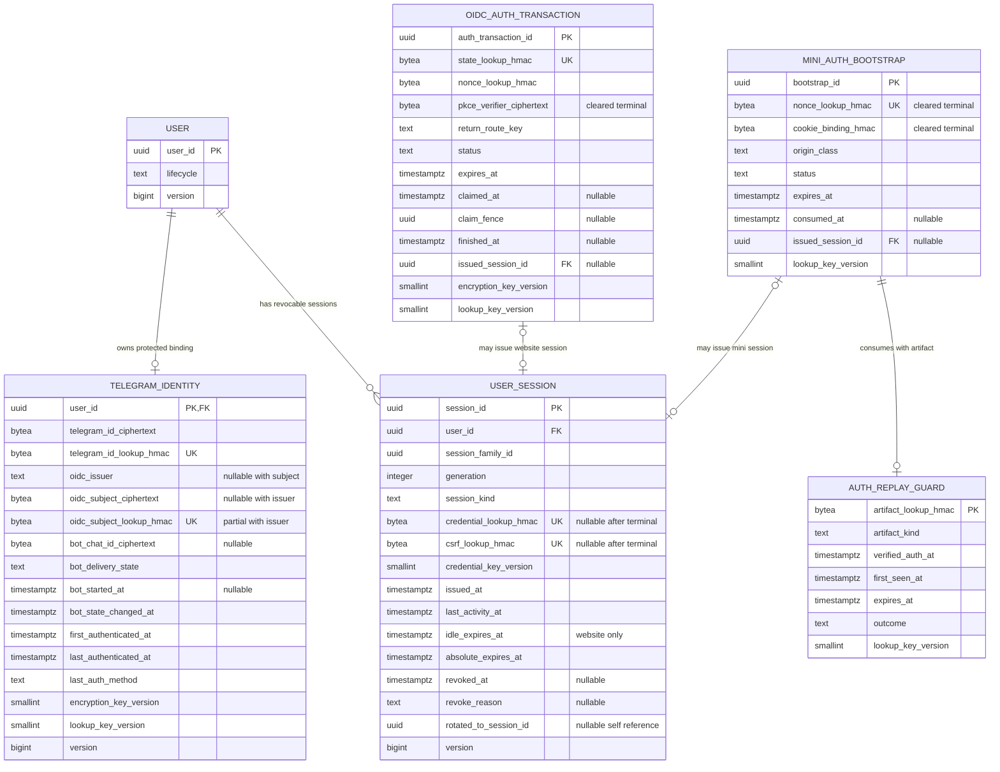
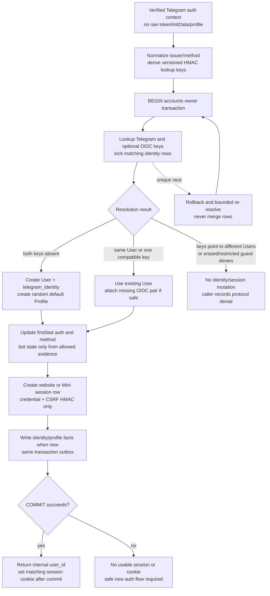
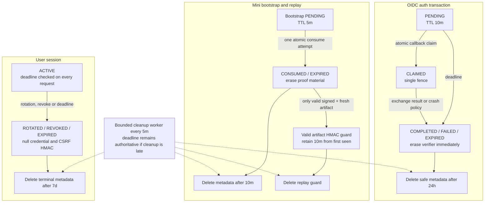

# G4.12 — Telegram identity, session и replay data model

## Статус, цель и границы

- Статус: `DRAFT — ожидает подтверждения владельца`
- Owner: модуль `accounts`, PostgreSQL schema `accounts`
- Identity: один Telegram binding на один immutable internal `user_id`
- Sessions: server-side website и Mini App sessions
- Replay authority: PostgreSQL, не Redis
- Production code/migrations: не создаются

Документ уточняет принятые в G4.4 conceptual `ExternalIdentity` и
`UserSession`: задаёт физические tables/columns, constraints, encryption and
lookup strategy, transaction boundaries, retention и cleanup.

Это logical physical design для будущих SQLAlchemy/Alembic migrations, но не
готовый DDL. Имена constraints/indexes, конкретная cryptographic library,
secret-manager/provider, exact SQL types для ciphertext envelope и deployment
keys выбираются при реализации с сохранением нормативных свойств документа.

Admin identity/password/session остаются отдельным G4.13 в schema
`trust_safety`. Telegram user session никогда не становится staff session.

Диаграммы являются наглядным представлением. Нормативными являются таблицы,
constraints, transaction algorithms, retention и invariants.

## Источники и приоритет

Приоритет: [PD](../../PRODUCT_DECISIONS.md) →
[ADR](../../DECISIONS.md) →
[незаменённая исходная спецификация](../../SOURCE_SPECIFICATION.md).

Документ развивает:

- `PD-012` — PostgreSQL authority, Redis не хранит business/security truth;
- `PD-013` — server-derived identity, strict input и safe logging;
- `PD-014` — short auth retention и account erasure;
- `PD-015` — единый user, Web 30/90d, Mini 24h;
- `ADR-010`/`ADR-011` — schema ownership и семь модулей;
- `ADR-015` — state+outbox transaction;
- `ADR-016` — retention/erasure semantics;
- `ADR-020` — Telegram identity binding, bot availability и no profile overwrite;
- [G4.2 — module boundaries/public ports](02-module-boundaries-and-public-ports.md);
- [G4.4A — data model/retention](04-data-model-retention-compaction.md);
- [G4.5 — API/request security](05-api-contracts-and-request-security.md);
- [G4.6 — domain-event catalogue](06-domain-event-catalogue.md);
- [G4.7 — outbox/inbox/reconciliation](07-outbox-inbox-and-reconciliation.md);
- [G4.11 — Web/Mini authentication flow](11-web-mini-app-authentication-flow.md).

Security references:

- [OWASP Session Management Cheat Sheet](https://cheatsheetseries.owasp.org/cheatsheets/Session_Management_Cheat_Sheet.html);
- [OWASP Cryptographic Storage Cheat Sheet](https://cheatsheetseries.owasp.org/cheatsheets/Cryptographic_Storage_Cheat_Sheet.html);
- [OWASP Key Management Cheat Sheet](https://cheatsheetseries.owasp.org/cheatsheets/Key_Management_Cheat_Sheet.html);
- [PostgreSQL pgcrypto limitations](https://www.postgresql.org/docs/current/pgcrypto.html).

Изменение Telegram protocol не может автоматически менять identity
uniqueness, session lifetime, encryption, replay или erasure policy.

## Подтверждённые решения

| Область | Решение |
|---|---|
| Conceptual mapping | `accounts.telegram_identity` физически реализует G4.4 `ExternalIdentity` для единственного MVP provider |
| Cardinality | Не более одной Telegram identity на User и одного User на Telegram identity |
| Provider lookup | Provider user IDs: AEAD ciphertext + versioned HMAC-SHA-256 equality digest; canonical issuer remains public configuration |
| OIDC binding | Canonical issuer + encrypted subject; issuer/subject присутствуют только вместе |
| Bot contact | Current `UNKNOWN / AVAILABLE / UNAVAILABLE`; attempts остаются `communication` |
| `/start` | Не создаёт User; обновляет существующий binding, unmatched update bounded-retry/expire |
| User session credential | 256-bit opaque random value; PostgreSQL хранит только keyed HMAC digest |
| CSRF | Независимый random proof; хранится только keyed HMAC digest, bound to session |
| Session authority | PostgreSQL check каждого protected request; Redis positive auth cache отсутствует |
| Session limit | Hard active-session cap не фиксируется; issuance защищено rate/abuse controls |
| OIDC transaction | 10m pending, single claim fence, PKCE verifier encrypted |
| Mini bootstrap | 5m single-use, exact origin + bootstrap-cookie binding |
| Mini replay | Keyed raw-artifact digest только после valid signature/freshness; 10m |
| Terminal session | Credential/CSRF digests irreversibly invalidated; safe metadata 7d |
| Cleanup | Каждые 5m bounded batches; deadline действует до физического delete |
| Erasure | Active restriction/legal hold задерживает identity removal; perpetual fingerprint отсутствует |

## Schema boundary и access model

Все пять таблиц принадлежат schema `accounts`:

1. `accounts.telegram_identity`;
2. `accounts.user_session`;
3. `accounts.oidc_auth_transaction`;
4. `accounts.mini_auth_bootstrap`;
5. `accounts.auth_replay_guard`.

Они дополняют уже принятые `accounts.user` и `accounts.profile`, но не
дублируют их.

| Caller | Доступ |
|---|---|
| Accounts identity repository | Encrypt/decrypt identity values, equality lookup, owner transaction |
| Website/Mini auth adapters | Передают только `VerifiedTelegramIdentityContext`; не читают tables напрямую |
| Session adapter | HMAC lookup, deadline/type/lifecycle validation, bounded activity update |
| User-bot webhook adapter | Узкая команда bot-start для существующей identity |
| Communication Telegram-delivery adapter | Узкий restricted routing query и delivery-state command |
| Другие domain modules | Только internal `user_id` и versioned facts; provider identity запрещена |
| Admin adapter | Telegram identifiers не выдаются обычным permissions; G4.13 не расширяет доступ автоматически |
| Analytics | Не имеет SELECT/consumer payload с identity/session/replay data |

Cross-schema FK/JOIN/ORM к этим таблицам запрещены. `communication` не хранит
копию Telegram ID/chat route: delivery adapter запрашивает минимальный
`RestrictedTelegramRoute` just-in-time, не логирует и не сохраняет его в
outbox/inbox/dead-letter.

Database backups содержат только ciphertext/digests; encryption/lookup keys
хранятся вне PostgreSQL, Git, image и backup archive.

## ER-модель

Текстовая альтернатива: `User` имеет не более одного protected Telegram
binding и любое число bounded-lifetime sessions. OIDC transaction может
выпустить одну website session; Mini bootstrap вместе с одним replay guard
может выпустить одну Mini session. Provider identifiers существуют только в
`telegram_identity` как ciphertext и equality digest. Auth transaction,
bootstrap/replay и session являются отдельными короткоживущими security
records и не смешиваются с Profile.

Отдельный physical `identity_id` намеренно отсутствует: в MVP
`telegram_identity.user_id` является PK/FK строгой one-to-one реализации
единственного Telegram provider. Добавление второго identity provider или
нескольких bindings одному User потребует новой миграции и отдельного
архитектурного решения, а не неявного ослабления этой cardinality.

## `accounts.telegram_identity`

### Column catalogue

| Column | Тип/nullable | Назначение и constraint |
|---|---|---|
| `user_id` | UUIDv7, not null | PK и owner-local FK `accounts.user(user_id)`; one-to-one |
| `telegram_id_ciphertext` | AEAD envelope, not null | Encrypted canonical unsigned Telegram user ID |
| `telegram_id_lookup_hmac` | 32-byte digest, not null | Unique equality lookup; domain-separated HMAC |
| `oidc_issuer` | bounded canonical text, nullable | Exact configured issuer identifier; не browser value |
| `oidc_subject_ciphertext` | AEAD envelope, nullable | Encrypted exact OIDC `sub` |
| `oidc_subject_lookup_hmac` | 32-byte digest, nullable | Equality digest domain-bound to issuer |
| `bot_chat_id_ciphertext` | AEAD envelope, nullable | Verified private user-bot route; не считается равным Telegram ID по предположению |
| `bot_delivery_state` | closed enum, not null | `UNKNOWN`, `AVAILABLE`, `UNAVAILABLE` |
| `bot_started_at` | `timestamptz`, nullable | Первая verified `/start`; monotonic earliest value |
| `bot_state_changed_at` | `timestamptz`, not null | Timestamp current routing-state transition |
| `first_authenticated_at` | `timestamptz`, not null | Первый successful Web/Mini identity proof |
| `last_authenticated_at` | `timestamptz`, not null | Последний successful Web/Mini proof; monotonic |
| `last_auth_method` | closed enum, not null | `WEBSITE_OIDC` либо `MINI_APP` |
| `encryption_key_version` | positive smallint, not null | Version ciphertext envelope/key |
| `lookup_key_version` | positive smallint, not null | Version provider lookup HMAC key |
| `version` | positive bigint, not null | Optimistic owner version |

### Required constraints

1. `user_id` primary key prevents multiple Telegram bindings for one User.
2. `telegram_id_lookup_hmac` globally unique.
3. OIDC issuer, subject ciphertext и subject digest одновременно all-null или
   all-not-null.
4. Partial unique `(oidc_issuer, oidc_subject_lookup_hmac)` для non-null pair.
5. Typed repository canonicalization запрещает empty issuer, zero/negative
   Telegram ID и malformed ciphertext envelope; database проверяет доступную
   envelope/version/nullability shape.
6. `last_authenticated_at >= first_authenticated_at`.
7. `bot_started_at <= bot_state_changed_at` when both exist.
8. `AVAILABLE` требует verified route ciphertext и допустимое availability
   evidence; `UNKNOWN` не обещает delivery.
9. `version` увеличивается при identity/OIDC/bot-state update.
10. Database constraint является последним arbiter concurrency; application
    pre-check не заменяет uniqueness.

`oidc_issuer` не принимается из произвольного token без exact configured
issuer validation G4.11. Subject digest вычисляется над versioned canonical
tuple `(issuer, subject)`, поэтому одинаковые subject разных issuers не
смешиваются.

### Запрещённые columns

В identity table отсутствуют:

- Telegram name/first name/last name;
- username;
- profile picture URL/bytes;
- phone;
- language/Premium status;
- raw OIDC token/claims JSON;
- raw `initData`, signature, hash или query;
- bot token/webhook secret;
- raw IP/User-Agent.

Повторная авторизация может изменить только protected binding/auth timestamps
и допустимый bot state. Она не выполняет `UPDATE accounts.profile`.

## Bot-start и delivery availability

### State semantics

| Current/input | Result | Fact |
|---|---|---|
| New Website identity | `UNKNOWN` | `accounts.identity_linked`; delivery не обещается |
| Verified `/start` for existing identity | `AVAILABLE`, save verified private route and first start time | `accounts.bot_delivery_state_changed` if state changed |
| Successful user-bot delivery | `AVAILABLE` | Fact only if current state/version changed |
| Permanent provider blocked/deactivated result | `UNAVAILABLE` | State-change fact |
| Timeout, network failure, `429`, provider `5xx` | Без изменения current state | Delivery attempt остаётся `communication` |
| Operations-bot update/result | Запрещено | Отдельные credentials/namespaces; no accounts mutation |

`communication` владеет delivery attempt, retry, expiry и provider-safe result.
После окончательного provider result его adapter может вызвать узкий
`BotDeliveryStateCommands` в разрешённом направлении
`communication → accounts`. Accounts повторно проверяет bot kind, user,
current version и normalized result.

### `/start` ordering

`/start` сам не создаёт `User`, Profile или session.

Если user-bot webhook обработан до первой Web/Mini authentication:

1. update остаётся в существующем webhook inbox/dedup flow;
2. handler сохраняет только protected Telegram lookup digest + key version и
   получает `identity_not_yet_linked`;
3. он выполняет bounded retry не дольше 10 минут;
4. если identity появляется, current-state handler записывает availability;
5. если identity не появляется, intent expires без orphan identity/profile;
6. повторный Telegram `update_id` не создаёт второе изменение.

Точный webhook inbox table уже принадлежит G4.7 и не дублируется G4.12.
Raw update/profile не копируется в `accounts`.

## Cryptographic storage и equality lookup

### Data classes

| Data | At rest | Lookup |
|---|---|---|
| Telegram user ID | AEAD ciphertext | Domain-separated HMAC-SHA-256 digest |
| OIDC subject | AEAD ciphertext | HMAC over canonical issuer+subject |
| Bot private chat route | AEAD ciphertext | Lookup не требуется |
| Session credential | Не хранится | HMAC-SHA-256 digest only |
| CSRF proof | Не хранится | Session-bound HMAC-SHA-256 digest only |
| OIDC state/nonce | Не хранится | Separate domain HMAC digests |
| PKCE verifier | Short-lived AEAD ciphertext | Lookup не требуется |
| Mini bootstrap nonce/cookie proof | Не хранится | Separate HMAC digests |
| Raw valid `initData` | Не хранится | Keyed artifact HMAC digest |

AEAD envelope содержит algorithm/format version, key reference, random nonce,
ciphertext и integrity tag. Конкретный vetted algorithm/library выбирается в
implementation ADR/DoD; custom cryptography запрещена.

HMAC inputs:

- имеют отдельный purpose/domain prefix;
- используют unambiguous length-prefixed canonical encoding;
- не разделяют key между provider lookup, session, CSRF, OIDC и replay;
- сравниваются constant-time после indexed lookup where applicable;
- никогда не возвращаются клиенту и не логируются.

Plain SHA-256 не используется для provider/session lookup: Telegram ID имеет
малое предсказуемое пространство, а session/replay purposes требуют key
separation.

### Key location и availability

- Keys отсутствуют в Git, image layers, database, backup manifests и logs.
- MVP использует restricted secret mount/secret manager abstraction;
  production provider выбирается позднее.
- Database role не получает encryption key.
- Key ID/version не является secret и хранится с record.
- Key service/secret mount failure закрывает новый identity lookup/issue
  fail-closed.
- Уже active user session может продолжить HMAC validation без decrypting
  provider identity, если session lookup key доступен.
- Telegram routing при недоступном decrypt key не отправляется; internal
  notification fallback сохраняется.

### Key rotation

| Key class | Rotation |
|---|---|
| Provider encryption | Bounded decrypt→reencrypt batches; old key доступен до verification и backup window |
| Provider lookup | Decrypt canonical value, compute new digest, update ciphertext/digest/version under uniqueness guard |
| Session/CSRF lookup | New sessions use current key; current + bounded previous versions проверяются до expiry всех old sessions |
| OIDC/bootstrap/replay lookup | Previous key живёт не меньше максимального record TTL/cleanup grace |

Session token нельзя re-HMAC после issuance, потому что raw value отсутствует.
Поэтому старый lookup key нельзя удалять раньше последней session этого version
и verified cleanup.

Rotation job не ослабляет unique identity mapping и не создаёт dual-active
digest без fencing. Конфликт или unreadable ciphertext останавливает batch,
оставляет старую запись authoritative и создаёт safe operations alert.

Provider lookup-key cutover требует write fence для identity create/attach:
MVP one-column digest не может одновременно обеспечить database uniqueness для
old/new HMAC values. Existing sessions продолжают работать; identity writes
останавливаются, rows re-HMAC-ятся bounded batches, новое состояние
проверяется, затем configuration atomically switches. Online dual-index
rotation потребует отдельной migration design.

## `accounts.user_session`

### Column catalogue

| Column | Тип/nullable | Назначение и constraint |
|---|---|---|
| `session_id` | UUIDv7, not null | PK; safe opaque ID для owner session list, не credential |
| `user_id` | UUIDv7, not null | Owner-local FK `accounts.user` |
| `session_family_id` | UUIDv7, not null | Группа initial+rotated credentials |
| `generation` | integer ≥1 | Monotonic within family |
| `session_kind` | enum, not null | `WEBSITE_USER` либо `MINI_APP_USER` |
| `credential_lookup_hmac` | 32-byte digest, nullable terminal | Unique active credential lookup |
| `csrf_lookup_hmac` | 32-byte digest, nullable terminal | Unique independent session-bound CSRF proof |
| `credential_key_version` | positive smallint | Lookup-key version for credential/CSRF family |
| `issued_at` | `timestamptz` | Server issue time |
| `last_activity_at` | `timestamptz` | Coalesced successful activity |
| `idle_expires_at` | `timestamptz`, conditional | Website only; never after absolute expiry |
| `absolute_expires_at` | `timestamptz` | Website +90d, Mini +24h |
| `revoked_at` | `timestamptz`, nullable | Terminal revocation/rotation time |
| `revoke_reason` | closed enum, nullable | `LOGOUT`, `OWNER_REVOKE`, `ROTATED`, `ACCOUNT_LIFECYCLE`, `SECURITY` |
| `rotated_to_session_id` | UUIDv7, nullable | Owner-local self FK to unique direct successor |
| `version` | positive bigint | Optimistic update/fencing |

### Session constraints

1. Unique non-null `credential_lookup_hmac`.
2. Unique non-null `csrf_lookup_hmac`.
3. Unique `(session_family_id, generation)`.
4. `generation=1` для новой family; successor increment ровно на один.
5. `rotated_to_session_id` указывает на same user/kind/family next generation.
6. Website: `idle_expires_at` not null и
   `idle_expires_at <= absolute_expires_at`.
7. Mini: `idle_expires_at is null`, absolute lifetime 24h.
8. Website absolute lifetime 90d от initial OIDC issue; rolling activity её не
   меняет.
9. `last_activity_at >= issued_at`.
10. Terminal row имеет `revoked_at/reason` либо reached absolute/idle deadline.
11. Revoked/rotated row имеет null credential/CSRF digests before commit.
12. Session kind определяется auth boundary и не меняется.

Lifetime equality проверяется application policy + database-safe bounds rather
than exact interval arithmetic tied to wall-clock in a CHECK. Server
timestamps/closed policy version are authoritative.

### Credential issuance

- Генерируются независимые cryptographically random 256-bit credential и CSRF
  proof.
- Browser получает raw values только через approved cookie/CSRF transport from
  G4.11.
- PostgreSQL получает только purpose-separated HMAC digests.
- Session cookie устанавливается только после commit.
- Если response потерян после commit, orphan active session допустима до
  owner revoke/expiry; raw credential неизвестен серверу и не может быть
  восстановлен.
- Issuance rate limit/abuse controls обязательны, но hard active-session count
  не является schema constraint.

### Request validation

Для каждого protected request:

1. Adapter извлекает cookie соответствующего exact boundary.
2. Вычисляет credential HMAC с current и допустимыми previous keys.
3. Делает indexed lookup в PostgreSQL.
4. Проверяет exact `session_kind`, non-revoked state, idle/absolute deadlines.
5. Проверяет `accounts.user.lifecycle == ACTIVE`.
6. Для mutation проверяет independent session-bound CSRF digest и exact Origin.
7. Только затем создаёт `UserActor(user_id, session_id)`.
8. Website successful activity выполняет conditional update не чаще одного
   раза за 24h и двигает idle deadline максимум до absolute deadline.

Redis может хранить rate limits или short negative-abuse hint, но никогда не
создаёт `UserActor`. Positive session cache в MVP запрещён: revoke и account
lifecycle видны новому request сразу после PostgreSQL commit.

Coalescing консервативно может сократить фактическое idle окно менее чем на
24 часа; оно не может продлить session после 30 дней без активности либо после
absolute 90 дней.

### Rotation и revocation

Mini refresh:

1. Полностью проверяет fresh `initData` + bootstrap/replay.
2. Lock current Mini session when cookie present.
3. Creates next generation in same family.
4. Old row receives `ROTATED`, successor ID и null digests.
5. New row receives new credential/CSRF digests and fresh 24h absolute expiry.
6. Both updates commit atomically; only then new cookie is returned.

No current Mini cookie creates a new family. Website new OIDC login also
creates a new family; rolling activity does not rotate credential.

Logout/revoke:

- current logout atomically nulls digests and sets terminal reason;
- selected revoke verifies same owner `user_id`;
- logout-all locks/updates all active Web/Mini rows for that user in bounded
  owner transaction;
- account `DELETION_REQUESTED` revokes all sessions before deletion fact;
- repeated command returns idempotent current result.

Revocation linearizes at PostgreSQL commit. Requests beginning validation after
commit fail. Уже прошедший authentication request может завершить начатый
owner use case; revoke не откатывает committed/in-flight business transaction.
Sensitive owner use cases повторно проверяют current account/safety guards по
своему contract.

## `accounts.oidc_auth_transaction`

### Required data

| Column group | Нормативное содержание |
|---|---|
| Identity | `auth_transaction_id` UUIDv7 |
| Single-use lookup | state HMAC unique, nonce HMAC |
| Secret | AEAD-encrypted PKCE verifier, encryption/lookup key versions |
| Navigation | Allowlisted `return_route_key`/opaque resource reference; no raw URL |
| Lifecycle | `PENDING`, `CLAIMED`, `COMPLETED`, `FAILED`, `EXPIRED` |
| Fencing | `claimed_at`, random `claim_fence`; exactly one claim |
| Deadlines | created/10m expiry/finished timestamps |
| Result link | Nullable owner-local `issued_session_id`; no provider token |

Authorization code, ID/access token, raw state/nonce, token response/error body,
claims JSON, IP/User-Agent и provider profile не сохраняются.

### Claim algorithm

1. Hash received `state` with supported lookup key versions.
2. Begin short owner transaction.
3. Find exactly one `PENDING`, non-expired row and lock it.
4. Atomically set `CLAIMED`, `claimed_at`, random fence; commit.
5. Decrypt verifier in auth adapter and perform bounded external code exchange
   outside database transaction.
6. Verify token per G4.11.
7. Begin identity-resolution transaction.
8. Require same transaction ID/fence still `CLAIMED`.
9. Resolve identity, issue session/outbox, set `COMPLETED`,
   `issued_session_id`, finished time and erase verifier.
10. Commit, then return cookie.

Provider failure sets `FAILED` and erases verifier in a short transaction.
Crash/timeout leaves `CLAIMED`; reconciliation marks it `FAILED/EXPIRED`, never
returns it to `PENDING`. Пользователь начинает новый OIDC flow.

## Mini bootstrap и replay guard

### `accounts.mini_auth_bootstrap`

| Column group | Нормативное содержание |
|---|---|
| Identity | `bootstrap_id` UUIDv7 |
| Proof | Nonce HMAC unique + bootstrap-cookie binding HMAC |
| Boundary | Closed `origin_class=MINI_APP`; exact origin remains config |
| Lifecycle | `PENDING`, `CONSUMED`, `FAILED`, `EXPIRED` |
| Deadline | Created +5m; consumed/finished timestamp |
| Result link | Nullable owner-local `issued_session_id` |

Raw nonce/cookie value не хранится. One bootstrap can authorize at most one
exchange attempt. Signature/freshness failure consumes or terminally fails
bootstrap according to G4.11, чтобы proof нельзя было использовать как oracle.

### `accounts.auth_replay_guard`

| Column | Constraint |
|---|---|
| `artifact_lookup_hmac` | PK, keyed digest exact raw `initData` bytes |
| `artifact_kind` | `TELEGRAM_MINI_INIT_DATA_V1` |
| `verified_auth_at` | Checked provider `auth_date`, normalized UTC |
| `first_seen_at` | Server timestamp |
| `expires_at` | First seen +10m |
| `outcome` | Safe `ACCEPTED` or normalized terminal denial class |
| `lookup_key_version` | Exact HMAC key version |

Guard не содержит `user_id`, Telegram ID, session ID, decoded profile,
signature/hash или raw artifact.

### Atomic Mini algorithm

After transport, Origin, shape, HMAC and freshness validation:

1. Derive bootstrap nonce/cookie digests and artifact replay digest.
2. Begin accounts owner transaction.
3. Lock one matching `PENDING`, unexpired bootstrap.
4. Insert replay guard; unique conflict means replay and no session.
5. Mark bootstrap `CONSUMED` with proofs irreversibly cleared.
6. Resolve Telegram lookup and lifecycle guards.
7. On compatible identity, create/rotate Mini session and link it.
8. On identity conflict, commit consumed/replay denial without identity change.
9. On new identity, create User/identity/Profile and required outbox facts.
10. Commit; only then return Mini cookie/CSRF proof.

Invalid signature/freshness does not insert arbitrary attacker-controlled
artifact rows before cryptographic validity. Bootstrap terminal outcome is
bounded and does not include raw failure data.

Infrastructure rollback creates no session/cookie. Client starts a new
bootstrap rather than blindly replaying an ambiguous exchange.

## Identity-resolution transaction

Текстовая альтернатива: auth adapter преобразует уже проверенный provider
artifact в минимальный canonical context и HMAC lookup keys. Accounts
transaction ищет и блокирует совпадения Telegram/OIDC. Отсутствие создаёт
User, protected identity и random default Profile; совместимое совпадение
использует существующий User и при необходимости добавляет OIDC pair.
Разные users или запрещённый lifecycle дают conflict без merge/identity
mutation; enclosing protocol use case terminally records safe denial. В той
же transaction создаются session и outbox facts. Cookie выдаётся только после
commit; unique race приводит к bounded re-resolution.

### Resolution matrix

| Telegram lookup | OIDC lookup | User lifecycle | Result |
|---|---|---|---|
| None | N/A Mini | — | Create User + identity without OIDC |
| None | None Website | — | Create User + identity with OIDC pair |
| User A | N/A Mini | `ACTIVE` | Authenticate User A |
| User A | None Website | `ACTIVE` | Atomically attach OIDC pair to User A |
| User A | User A | `ACTIVE` | Authenticate User A |
| None | User A | `ACTIVE`, Telegram ciphertext matches verified ID after decrypt | Repair/attach missing lookup only under explicit migration guard; normal path expects both |
| User A | User B | any | Fail `identity_conflict`; no merge/session |
| User A | User A | `DELETION_REQUESTED/ERASED` | Lifecycle policy denies new session |
| Unique insert race | Any | — | Rollback, re-read once under constraint; never create duplicate |

OIDC website context always contains both verified Telegram profile ID and
issuer/subject. `None/User A` is treated as anomaly unless a controlled
key-rotation/migration repair proves ciphertext equality.

### Transaction/fact boundary

First successful identity:

- inserts `accounts.user`;
- inserts `accounts.telegram_identity`;
- inserts random default `accounts.profile`;
- inserts `accounts.user_session`;
- writes `accounts.identity_linked`;
- writes `accounts.profile_created`;
- optionally writes bot-state fact only from approved evidence.

All owner state and facts commit atomically. Consumers never receive provider
identifiers. Subsequent auth normally updates last-auth fields/session only and
does not publish profile-changed fact.

## Profile non-overwrite enforcement

Protection существует на четырёх уровнях:

1. `telegram_identity` schema не имеет name/username/picture/phone columns.
2. `VerifiedTelegramIdentityContext` public port содержит только provider IDs,
   method/time и safe correlation.
3. Existing-user authentication use case не вызывает `ProfileCommands`.
4. Identity/outbox facts не содержат provider display claims.

При первом User creation Profile получает:

- server-generated random nickname/pseudonym;
- server-generated immutable random public profile ID;
- no Telegram avatar;
- empty/default bio/privacy/preferences по отдельным product policies.

Любое последующее изменение Profile требует explicit authenticated
`ProfileCommands`, allowlist fields, expected version и profile policy. Even
verified Telegram profile changes не являются такой командой.

## Auth-record lifecycle и cleanup

Текстовая альтернатива: OIDC transaction живёт 10 минут, single-use claims и
после любого terminal result сразу теряет PKCE verifier; safe metadata
удаляется через 24 часа. Mini bootstrap живёт 5 минут, после consume/expiry
теряет proof material и удаляется через 10 минут; replay digest существует
10 минут. Session проверяет deadline на каждом request, а rotation/revoke/
expiry обнуляет credential и CSRF digests; terminal metadata удаляется через
7 дней. Cleanup работает bounded batches каждые 5 минут, но задержка delete
никогда не продлевает validity.

### Retention table

| Record/data | Logical invalidation | Physical cleanup |
|---|---|---|
| OIDC `PENDING` | At 10m deadline | Mark terminal; erase verifier |
| OIDC terminal verifier | Same terminal transaction | Set null/crypto-shred immediately |
| OIDC safe metadata | Terminal/expiry | Hard delete after 24h |
| Mini bootstrap | Consume/fail/5m expiry | Clear nonce/cookie digests terminally |
| Mini bootstrap safe metadata | Terminal | Hard delete after 10m |
| Valid Mini replay digest | At `first_seen+10m` | Hard delete next bounded cleanup |
| Active Web session | Idle 30d or absolute 90d | Terminalize/null digests, then metadata 7d |
| Active Mini session | Absolute 24h | Terminalize/null digests, then metadata 7d |
| Rotated/revoked session | At commit | Null digests immediately; metadata 7d |
| Telegram identity | Account lifecycle | Delete only after safety/legal/erasure guards |
| Encryption keys for backup | Key policy + all dependent backups expired | Never remove before verified 14d backup window |

Terminal session metadata содержит только safe session ID/type/timestamps/
reason/version; no token, CSRF, provider identity, IP или User-Agent.

### Cleanup algorithm

Every 5 minutes Celery Beat передаёт cleanup job ID; Worker вызывает accounts
application use case:

1. Select bounded ordered batch by indexed due timestamp using lease/fencing.
2. Recheck current status/version/deadline in owner transaction.
3. Terminalize active-but-expired session before delete grace.
4. Null sensitive digest/ciphertext fields before retaining safe metadata.
5. Delete rows past class deadline.
6. Commit cleanup outcome + safe reconciliation metadata.
7. Repeat next bounded batch without one unbounded transaction.

Beat не содержит retention logic. Redis/Celery outage задерживает physical
cleanup, но request validation по PostgreSQL deadline продолжает fail-closed.

### Required indexes

Logical indexes:

- unique Telegram lookup digest;
- partial unique OIDC issuer+subject digest;
- unique active session credential/CSRF digests;
- `(user_id, session_kind, absolute_expires_at)` for session list/revoke;
- `(session_family_id, generation)` unique;
- partial due indexes for non-terminal sessions and terminal cleanup;
- unique OIDC state digest + `(status, expires_at)`;
- unique Mini bootstrap nonce digest + `(status, expires_at)`;
- replay guard PK/due `expires_at`.

Exact PostgreSQL index names/fillfactor/partitioning are implementation
details. Partitioning is not justified for MVP.

## Account deletion, hold и re-registration

1. `accounts.user` enters `DELETION_REQUESTED`.
2. All sessions are revoked and digests cleared in accounts owner transaction.
3. New auth/session issuance for this user is denied.
4. Pending auth transactions/bootstrap records are terminalized/deleted.
5. Trust/safety/legal/dispute guards determine whether provider binding can be
   removed now.
6. While active restriction/hold requires linkage, encrypted identity remains
   protected and cannot authenticate; deletion cannot bypass ban.
7. After all guards/checkpoints, delete Telegram/OIDC ciphertext, lookup
   digests, bot route/state, Profile/preferences and remaining auth records.
8. Other modules anonymize links per G4.4/G4.6.
9. Backups lose erased ciphertext by 14-day expiry; restore reapplies erasure
   ledger before traffic.

After complete eligible erasure no perpetual Telegram HMAC/fingerprint is
retained «на всякий случай». Следующая valid authentication того же Telegram
может create a new User only after prior binding and all justified holds are
truly removed. Если law/safety требует блокировать повторную регистрацию,
erasure remains held under an explicit purpose/deadline rather than hiding a
permanent undocumented tombstone.

Manual identity transfer, support merge и linking нового Telegram ID к старому
User отсутствуют.

## Concurrency и failure semantics

| Situation | Required behavior |
|---|---|
| Concurrent first Mini/Web auth same Telegram | Unique HMAC constraint chooses one row; loser rollback/re-resolve returns same User |
| Concurrent Website attach same OIDC pair | Row lock + partial unique; no duplicate binding |
| Telegram key points User A, OIDC points User B | Commit no identity/session; safe conflict incident only |
| Session rotate vs request | Old digest null at rotation commit; requests validated after commit denied |
| Session revoke vs rotate | Lock current row/version; exactly one terminal successor/outcome |
| Logout-all vs new login | Оба use case lock один `accounts.user`: login, committed раньше, попадает под logout-all; независимо доказанный login, начатый после commit logout-all, может создать новую session, если lifecycle/restrictions разрешают |
| Cleanup vs active request | Deadline is checked independently; cleanup uses version/locks |
| Encryption key unavailable | New identity/routing operation fail-closed; no plaintext fallback |
| Session lookup key unavailable | Protected request fails authentication; ops alert, no Redis fallback |
| PostgreSQL unavailable | New auth/session/revoke unavailable; no cookie issued and no cached authorization |
| Redis/Celery unavailable | Existing PostgreSQL checks work; cleanup/retry resumes later |
| Outbox unavailable within DB transaction | State/fact transaction fails together |
| Cookie response lost after commit | Orphan session expires/revocable; secret cannot be reconstructed |
| Backup restore | Reapply erasure ledger, expire deadlines, reconcile identity uniqueness before traffic |

### Locking order

To avoid deadlocks:

1. `accounts.user` by ascending `user_id` when already known;
2. matching `telegram_identity` rows by `user_id`;
3. auth transaction/bootstrap;
4. current session/family rows;
5. outbox record.

First-auth lookup without `user_id` relies on unique lookup indexes and
bounded insert-conflict re-resolution. Arbitrary retry loops запрещены.

## Reconciliation

| Job/check | Detects | Repair boundary |
|---|---|---|
| Identity uniqueness scan | Duplicate/missing lookup/ciphertext/key versions | Stop auth for affected keys; no auto-merge |
| OIDC pair consistency | Partial issuer/subject triples, wrong digest | Decrypt+verify under controlled key-rotation repair |
| User/identity parity | Active User without required identity or orphan binding | Safe case; never invent provider value |
| Session deadline scan | Active digest after logical expiry | Terminalize/null immediately |
| Rotation-chain scan | Two successors, gap or cross-user/kind family | Revoke affected family fail-closed |
| Auth TTL scan | Stale pending/claimed/bootstrap rows | Terminalize and erase secrets |
| Replay expiry scan | Expired digest rows | Delete; duplicates before expiry remain denied |
| Bot routing parity | AVAILABLE without route/start evidence | Set `UNKNOWN/UNAVAILABLE`, internal fallback |
| Key-version inventory | Rows needing re-encryption/old active-session keys | Resume bounded rotation; never drop required key |
| Erasure parity | Erased User retains identity/session/auth record | Delete/alert under erasure checkpoint |

Reconciliation output contains counts, opaque record IDs, key versions and safe
reason codes, but no ciphertext/plaintext/digests/provider IDs.

## Security and migration tests

### Schema/constraints

- one User↔Telegram identity cardinality;
- Telegram digest and OIDC pair uniqueness under concurrent inserts;
- issuer/subject all-null/all-present check;
- bot state/route/time consistency;
- Web/Mini session-kind-specific deadline checks;
- session family generation/successor constraints;
- terminal digest nulling and partial unique behavior.

### Cryptography

- AEAD tamper/wrong-key/wrong-version fails closed;
- HMAC domain separation and canonical encoding test vectors;
- no plain SHA equality lookup;
- provider lookup rotation preserves uniqueness;
- current+previous session key lookup and retirement gate;
- ciphertext/digest never appears in logs/errors/facts.

### Transactions/races

- parallel Mini/Web first auth returns one User;
- incompatible OIDC/Telegram mapping never merges;
- commit failure never sets cookie;
- OIDC claim crash never reopens transaction;
- Mini concurrent double-submit creates one replay guard/session;
- rotate/revoke/logout-all races leave one valid outcome;
- request after revoke commit denied without Redis;
- cleanup race cannot delete active/renewed record.

### Retention/erasure

- exact 5m/10m/24h/7d and 30/90d/24h boundaries;
- cleanup delay does not extend authorization;
- credential/CSRF/verifier cleared at terminal transition;
- legal/safety hold blocks identity removal and authentication;
- completed erasure leaves no provider fingerprint;
- restore reapplies erasure and expired-session cleanup.

## Архитектурные инварианты

| ID | Инвариант |
|---|---|
| `IDM-01` | `accounts.telegram_identity` физически уточняет, а не дублирует G4.4 `ExternalIdentity` |
| `IDM-02` | Business entities reference only internal `user_id`; Telegram/OIDC values не покидают protected adapter boundary |
| `IDM-03` | One User↔one Telegram identity enforced database uniqueness, not application hope |
| `IDM-04` | Provider user identifiers encrypted; equality uses versioned keyed HMAC, not plaintext/plain hash; canonical issuer является public provider configuration |
| `IDM-05` | Telegram display claims/phone отсутствуют в identity/Profile update path |
| `IDM-06` | `/start` не создаёт User/session и operations bot не меняет user identity |
| `IDM-07` | Delivery attempts принадлежат communication; accounts хранит только current routing state |
| `IDM-08` | Raw session/CSRF/state/nonce/initData/code/token не хранится |
| `IDM-09` | PKCE verifier — единственный short-lived reversible auth secret и стирается terminally |
| `IDM-10` | PostgreSQL session row проверяется каждым protected request; Redis не создаёт actor |
| `IDM-11` | Website/Mini session types, deadlines, families и cookies не смешиваются |
| `IDM-12` | Revoke/rotation commit nulls credential/CSRF digests; cleanup delay не продлевает access |
| `IDM-13` | Mini replay guard вставляется только после valid signature/freshness и atomically consumes bootstrap |
| `IDM-14` | Identity conflict fail-closed; merge/recovery/transfer отсутствуют |
| `IDM-15` | Identity, User, Profile, session и first facts commit atomically before cookie |
| `IDM-16` | Key rotation сохраняет uniqueness и старые keys до последнего dependent record/backup |
| `IDM-17` | Account erasure не обходится ban/hold и не оставляет undocumented perpetual fingerprint |
| `IDM-18` | Auth/security tables не содержат raw IP/User-Agent, production secrets или provider payload |

## Явно вне G4.12

- Production SQLAlchemy models, Alembic migrations, DDL/index names и seed data.
- Production cryptographic library/KMS/Vault choice, secret values и rotation
  runbook commands.
- FastAPI handlers, cookies/API payloads и generated OpenAPI.
- Admin/staff identity, passwords, invites, reset, sessions и re-auth — G4.13.
- Bot webhook physical inbox/update table — уже G4.7 technical boundary.
- Notification/delivery attempt schema — `communication`, G4.4/G4.6.
- Public Profile projection/avatar/enumeration — отдельный будущий G4 пункт.
- Account recovery, merge, identity transfer, second provider, MFA/passkeys.
- Production rate-limit/session-count thresholds и device fingerprinting.
- IP/User-Agent/device-history tracking.
- Full STRIDE/threat-model diagrams и observability SLO.

## Traceability

| Решение | Источник |
|---|---|
| UUIDv7, owner-local FK, no cross-schema relation | `G4.4A`, `ADR-010` |
| Telegram identity separated from User/Profile | `PD-015`, `ADR-020`, `G4.2`, `G4.4A` |
| Unique Telegram ID and OIDC issuer/subject | `ADR-020`, `G4.11` |
| Encrypted/minimal ExternalIdentity | `G4.4A`, OWASP cryptographic storage/key management |
| No Telegram profile overwrite/phone | `PD-015`, `PD-016`, `ADR-020`, `G4.11` |
| Bot start/availability and internal fallback | `PD-010`, `PD-015`, `ADR-020`, `G4.6` |
| Website/Mini session lifetime/types/revoke | `PD-015`, `ADR-020`, `G4.5`, `G4.11` |
| OIDC state/nonce/PKCE transaction | `ADR-020`, `G4.5`, `G4.11` |
| Mini bootstrap/freshness/replay | `ADR-020`, `G4.5`, `G4.11` |
| PostgreSQL authority/no Redis auth truth | `PD-012`, `ADR-015`, `G4.1`, `G4.10`, `G4.11` |
| State+outbox atomicity and safe facts | `PD-018`, `ADR-015`, `G4.6`, `G4.7` |
| Short auth retention/account erasure/backup | `PD-014`, `ADR-016`, `G4.4A`, `G4.10` |

## Acceptance checklist

- [x] Документ остаётся `DRAFT` до отдельного owner review.
- [x] G4.4 ExternalIdentity/UserSession уточнены без конкурирующей модели.
- [x] Пять owner-local accounts tables и exact relations каталогизированы.
- [x] Columns, nullability, uniqueness, checks и indexes описаны.
- [x] Provider identifiers используют AEAD + versioned HMAC lookup.
- [x] Raw session/CSRF/auth artifacts/provider payloads не хранятся.
- [x] Website/Mini deadlines, families, rotation/revoke и DB lookup заданы.
- [x] OIDC claim fencing и Mini bootstrap/replay transactions заданы.
- [x] `/start`/delivery ownership и user/operations bot isolation сохранены.
- [x] Identity resolution/unique races/conflict fail-closed описаны.
- [x] Telegram claims не могут перезаписать Profile.
- [x] Exact retention/cleanup/key rotation/erasure/reconciliation заданы.
- [x] Три диаграммы имеют `.mmd` и текстовые альтернативы.
- [x] Встроенный Mermaid должен совпасть с `.mmd` перед commit.
- [x] Нет secrets, PII examples, production domains, raw IP/User-Agent.
- [x] G4.12 checkbox/changelog принятия не изменены.
- [x] G4.13 admin auth и production code/migrations не созданы заранее.
