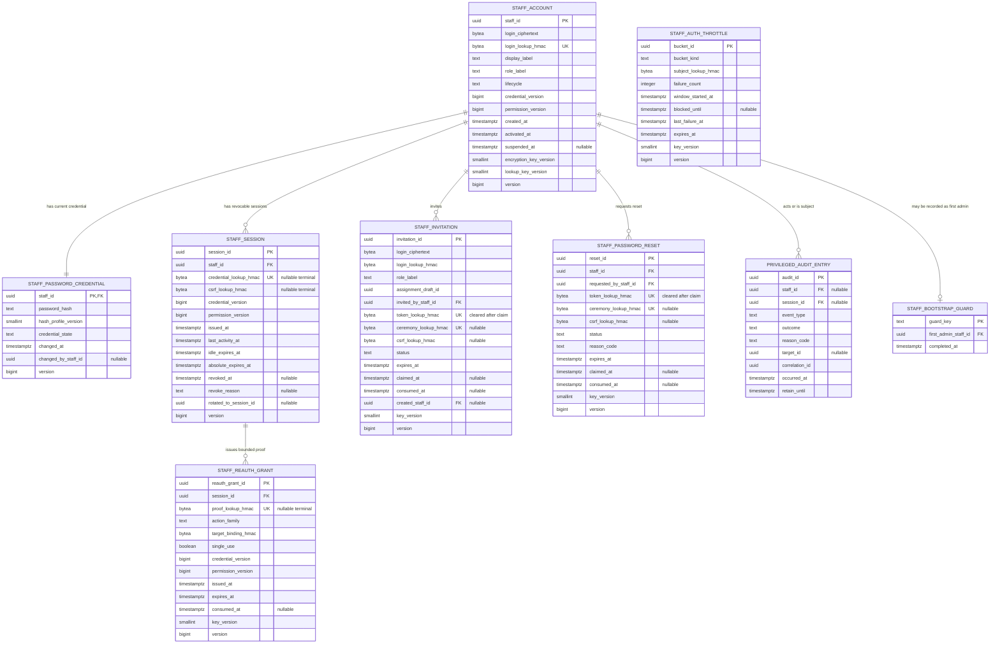
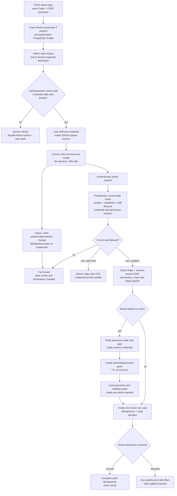

# G4.13 — Admin authentication flow

## Статус, цель и границы

- Статус: `ACCEPTED`
- Горизонт: MVP/alpha
- Owner: модуль `trust_safety`, PostgreSQL schema `trust_safety`
- Actors: `moderator` и `admin` как staff identities
- Authentication: отдельный login/password flow, не Telegram
- Production code/migrations: не создаются

Документ физически уточняет принятые G4.3 staff identity/session/re-auth
contracts и G4.5 admin authentication boundary. Он задаёт security records,
transactions, credential ceremonies, session validation, rate limiting,
retention и failure semantics.

G4.13 не меняет permission catalogue, role templates, scopes или owner-module
authorization. Успешная authentication создаёт только `StaffActor`; каждое
действие всё равно требует current exact permission, scope, object/state guard
и, когда указано G4.3, action-bound re-auth.

Диаграммы являются наглядным представлением. Нормативными являются таблицы,
constraints, algorithms, deadlines и invariants этого документа.

## Источники и приоритет

Приоритет:

1. [PRODUCT_DECISIONS.md](../../PRODUCT_DECISIONS.md);
2. [DECISIONS.md](../../DECISIONS.md);
3. [SOURCE_SPECIFICATION.md](../../SOURCE_SPECIFICATION.md), только пока её
   часть не заменена PD/ADR.

Прямые архитектурные зависимости:

- [G4.1 — C4 boundaries](01-c4-context-containers.md);
- [G4.2 — module ownership and ports](02-module-boundaries-and-public-ports.md);
- [G4.3 — permission catalogue](03-permission-catalogue.md);
- [G4.4A — data model and retention](04-data-model-retention-compaction.md);
- [G4.5 — API/request security](05-api-contracts-and-request-security.md);
- [G4.6 — domain facts](06-domain-event-catalogue.md);
- [G4.7 — outbox/inbox/reconciliation](07-outbox-inbox-and-reconciliation.md);
- [G4.8 — operations alerts](08-dead-letter-operations-alerts.md);
- [G4.10 — deployment/secrets/backups](10-deployment-topology-and-migration.md);
- [G4.12 — user identity/session model](12-telegram-identity-session-replay-model.md).

Security references:

- [NIST SP 800-63B](https://pages.nist.gov/800-63-4/sp800-63b.html);
- [OWASP Authentication Cheat Sheet](https://cheatsheetseries.owasp.org/cheatsheets/Authentication_Cheat_Sheet.html);
- [OWASP Password Storage Cheat Sheet](https://cheatsheetseries.owasp.org/cheatsheets/Password_Storage_Cheat_Sheet.html);
- [OWASP Session Management Cheat Sheet](https://cheatsheetseries.owasp.org/cheatsheets/Session_Management_Cheat_Sheet.html);
- [OWASP CSRF Prevention Cheat Sheet](https://cheatsheetseries.owasp.org/cheatsheets/Cross-Site_Request_Forgery_Prevention_Cheat_Sheet.html);
- [OWASP Forgot Password Cheat Sheet](https://cheatsheetseries.owasp.org/cheatsheets/Forgot_Password_Cheat_Sheet.html);
- [RFC 9106 — Argon2](https://www.rfc-editor.org/rfc/rfc9106.html).

Изменение внешней рекомендации не меняет автоматически принятую schema,
credential lifetime или authorization policy. Такое изменение проходит
отдельный review и migration.

## Подтверждённые параметры

| Область | Решение |
|---|---|
| Staff identity | Полностью отделена от `accounts.User` и Telegram identity |
| Login | Admin-assigned, case-insensitive canonical ASCII, 3–64 символа |
| Contact channel | Email/Telegram provider не добавляется; invite/reset link передаёт admin по доверенному внешнему каналу |
| First admin | Interactive one-time server command; HTTP bootstrap route отсутствует |
| Password | 15–128 Unicode code points, NFC, без composition/periodic rotation |
| Password blocklist | Локальная versioned common/compromised-password list; внешнего lookup при вводе нет |
| Hash | Argon2id: `m=64 MiB`, `t=3`, `p=1`, salt 128 bit, tag 256 bit |
| Hash benchmark | Deployment target 250–500 ms; профиль нельзя ослабить ниже принятого без review |
| Invitation | 256-bit opaque token, single-use, 24h absolute deadline |
| Reset | Другой admin, 256-bit opaque token, single-use, 30m absolute deadline |
| Re-auth | Password поверх current session; proof ≤5m, action/target-bound |
| Admin session | 8h absolute, 30m idle, PostgreSQL authoritative |
| Concurrent sessions | Hard cap отсутствует; все sessions видимы, revocable и audited |
| Cookie | Host-only `__Host-` namespace, `Secure`, `HttpOnly`, `SameSite=Strict` |
| CSRF | Independent session-bound synchronizer proof + exact Origin |
| Rate limit | Durable per-login/per-session buckets + short-lived HMAC IP bucket; Redis только accelerator |
| Audit | Security/privileged metadata 90d; passwords/tokens/digests/raw login/IP отсутствуют |

## Ownership и trust boundaries

Все описанные records принадлежат `trust_safety`. Admin frontend и admin HTTP
adapter не имеют прямого SQL/ORM access.

| Caller | Разрешённый доступ |
|---|---|
| Bootstrap CLI adapter | Только узкий `BootstrapFirstAdmin` command после operator-local invocation |
| Admin auth adapter | Login/logout, ceremony claim, invite acceptance, reset completion, re-auth |
| Admin application adapter | Current-session authorization query и exact G4.3 permission checks |
| `trust_safety` application services | Owner transactions, credential verification, lifecycle, audit |
| Other domain modules | Только trusted `StaffAuthorizationContext`/decision ID; staff auth tables запрещены |
| Worker/cleanup | Deadline cleanup и reconciliation по typed owner ports |
| Redis | Negative/abuse accelerator; не создаёт staff/session/permission truth |
| Analytics | Только заранее разрешённые aggregate security metrics без IDs, login или network data |

Admin frontend, API endpoint, PostgreSQL и secret provider находятся в разных
trust roles:

- browser получает raw session/CSRF/ceremony secrets, но не password hash;
- edge передаёт только trusted short-lived abuse context после удаления
  client-supplied forwarding headers;
- API выполняет Argon2id/HMAC и owner transactions;
- PostgreSQL хранит hashes/HMAC/ciphertext, но не raw credentials;
- HMAC/AEAD keys находятся вне DB, Git, image и обычного backup.

## Staff authentication data model



Текстовая альтернатива: `StaffAccount` имеет один current Argon2id credential и
любое число independently revocable admin sessions. Session может выпустить
короткий action-bound re-auth grant. Active admin создаёт invitations и reset
requests. Singleton bootstrap guard навсегда фиксирует создание первого admin.
Durable throttle buckets и append-only audit не содержат raw credentials или
network identifiers.

Permission assignments/scopes остаются принятой моделью G4.3. Поле
`assignment_draft_id` ссылается на immutable, заранее провалидированный
owner-local draft; G4.13 не вводит JSON permissions или wildcard grants.

## `trust_safety.staff_account`

| Column | Тип/nullable | Назначение |
|---|---|---|
| `staff_id` | UUIDv7, not null | Immutable PK; никогда не равен user/Telegram ID |
| `login_ciphertext` | AEAD envelope, not null | Canonical login для owner-only display/recovery |
| `login_lookup_hmac` | 32-byte HMAC, not null | Unique case-insensitive equality lookup |
| `display_label` | bounded text, not null | Admin-assigned non-secret working label, не authentication key |
| `role_label` | enum, not null | `moderator` или `admin`; не заменяет permissions |
| `lifecycle` | enum, not null | `ACTIVE`, `SUSPENDED`, `TERMINATED` |
| `credential_version` | positive bigint | Меняется при password change/reset/credential disable |
| `permission_version` | positive bigint | G4.3 grants/role/scope version |
| lifecycle timestamps | UTC | Created/activated/suspended state evidence |
| key versions | positive smallint | AEAD и equality HMAC rotation |
| `version` | positive bigint | Optimistic concurrency |

Canonical login:

1. принимает 3–64 ASCII characters;
2. преобразуется Unicode-independent ASCII lowercase;
3. разрешает только `a-z`, `0-9`, `.`, `_`, `-`;
4. не допускает leading/trailing punctuation, consecutive punctuation и
   reserved/system-looking names;
5. сравнивается только по domain-separated keyed HMAC;
6. не выдаётся public/user APIs и не используется как display label.

Unknown/known login имеет одинаковый внешний login/reset outcome. Lookup HMAC,
ciphertext и keys не попадают в logs/audit/events.

Required constraints:

- unique `login_lookup_hmac`;
- `suspended_at` присутствует только для non-active lifecycle;
- `credential_version`/`permission_version` монотонны;
- последний active admin с `staff.permissions.manage` нельзя suspend,
  terminate, reset или лишить permission, пока другой такой admin не активен;
- staff не меняет собственные role/grants/scopes через management flow.

## `trust_safety.staff_password_credential`

| Column | Правило |
|---|---|
| `staff_id` | Owner-local PK/FK |
| `password_hash` | Полный encoded Argon2id hash с salt/parameters; никогда не reversible |
| `hash_profile_version` | Version accepted deployment profile |
| `credential_state` | `ACTIVE`, `RESET_REQUIRED`, `DISABLED` |
| `changed_at` | Server UTC |
| `changed_by_staff_id` | `null` для bootstrap/self-change; другой admin для reset |
| `version` | Row-lock/optimistic guard |

Сохраняется только current password hash. Password history отсутствует: система
не требует периодической смены и не создаёт дополнительную коллекцию reusable
credential verifiers.

После успешной проверки старого, но всё ещё разрешённого hash profile,
application может rehash тот же password новым профилем. Такая техническая
rehash не меняет `credential_version` и не отзывает sessions; изменение самого
password увеличивает version и отзывает их.

## Password policy и Argon2id

### Password input

- 15–128 Unicode code points после NFC normalization;
- принимаются spaces, printable Unicode и paste/password managers;
- password проверяется полностью, без truncation;
- нет обязательных upper/lower/digit/symbol combinations;
- нет security questions, hints или плановой смены;
- exact current password и confirmation должны совпасть constant-time там,
  где применимо;
- локальная versioned blocklist отклоняет common/compromised password;
- внешний API для проверки password не вызывается;
- raw password живёт только в bounded request memory и очищается по
  возможностям runtime/library;
- password, его фрагменты, длина, hash, blocklist match и timing не попадают в
  logs, analytics, audit или errors.

### Hash profile

MVP profile:

| Parameter | Value |
|---|---:|
| Algorithm | Argon2id |
| Memory `m` | 65,536 KiB |
| Iterations `t` | 3 |
| Parallelism `p` | 1 |
| Salt | 128 random bits per credential |
| Tag | 256 bits |
| Deployment target | 250–500 ms на production-class API host |

Hash verification выполняется через bounded concurrency gate. Saturation даёт
generic temporary denial/`429` до запуска нового expensive hash, чтобы
authentication не вытеснила основной API по RAM/CPU.

Ослабление profile запрещено без benchmark, security review и нового version.
Усиление использует versioned profile и opportunistic rehash. Dummy hash для
unknown login имеет тот же active profile, но создаётся из deployment secret
material вне source code.

## Invitation, bootstrap и reset flow

```mermaid
flowchart TB
    subgraph bootstrap["First-admin bootstrap — server command only"]
        direction TB
        b0["Operator starts interactive command"] --> b1["Lock singleton bootstrap guard<br/>require no completed bootstrap"]
        b1 --> b2["Read login and password<br/>password input has no echo"]
        b2 --> b3["Validate login, password policy<br/>local blocklist and Argon2id"]
        b3 --> b4["Create active admin + baseline grants<br/>credential + bootstrap guard + audit"]
        b4 --> b5{"Owner transaction commits?"}
        b5 -->|"yes"| b6["Bootstrap permanently closed<br/>no reusable token"]
        b5 -->|"no"| b7["No staff or partial grants"]
    end

    subgraph invite["Subsequent staff invitation"]
        direction TB
        i0["Active admin session + CSRF<br/>permission + re-auth + last-admin guards"] --> i1["Create validated assignment draft<br/>256-bit invite token, TTL 24h"]
        i1 --> i2["Store token HMAC only<br/>commit invitation + audit"]
        i2 --> i3["Admin transfers link<br/>through trusted external channel"]
        i3 --> i4["Token GET uses no-referrer page<br/>atomic claim and URL-stripping redirect"]
        i4 --> i5["Bound ceremony cookie + CSRF<br/>choose password"]
        i5 --> i6["Create staff + credential + grants<br/>consume invitation atomically"]
        i6 --> i7["No automatic login<br/>use normal login"]
    end

    subgraph reset["Admin-initiated password reset"]
        direction TB
        r0["Different active admin<br/>permission + re-auth + reason"] --> r1["Last-admin and target guards"]
        r1 --> r2["Revoke target sessions immediately<br/>credential state RESET_REQUIRED"]
        r2 --> r3["Create 256-bit reset token, TTL 30m<br/>store HMAC and audit"]
        r3 --> r4["Atomic token claim<br/>bound ceremony cookie + CSRF"]
        r4 --> r5["Set new Argon2id credential<br/>increment credential version"]
        r5 --> r6["Consume all reset artifacts<br/>no automatic login"]
    end

    b6 -. "later staff onboarding" .-> i0
    i7 -. "later credential recovery" .-> r0
```



Текстовая альтернатива: первый admin создаётся только interactive server
command под singleton lock; success permanently закрывает повторный bootstrap.
Следующий staff получает 24-часовой single-use invite от active/re-authenticated
admin. Reset другого staff немедленно отзывает его sessions и выдаёт 30-минутную
single-use ceremony. Invite/reset token сначала atomically заменяется на
bound ceremony cookie и удаляется из URL; установка password никогда не создаёт
admin session автоматически.

## First-admin bootstrap

`BootstrapFirstAdmin` доступен только из interactive server command внутри
application container/host operator context.

Алгоритм:

1. открыть owner transaction;
2. lock singleton `staff_bootstrap_guard` key `first_admin`;
3. deny, если guard уже completed или существует любой active staff;
4. принять login/display label через TTY и password через no-echo prompt;
5. проверить canonical login, password policy, blocklist и Argon2id;
6. создать active admin, credential, baseline role assignment,
   `permission_version=1`;
7. записать immutable bootstrap guard и privileged audit;
8. commit целиком либо rollback целиком.

Command не печатает password/hash/session/invite token и не создаёт HTTP
bootstrap route. Guard не удаляется даже при последующей staff lifecycle
cleanup: восстановление административного доступа не маскируется повторным
«первым bootstrap».

## Invitation

### Creation

Требуются current admin session, `staff.account.invite`, global scope,
пятиминутный re-auth, CSRF, exact Origin, normalized reason и idempotency key.

Owner transaction:

1. повторно проверяет inviter lifecycle/session/permission versions;
2. валидирует role и immutable assignment draft без wildcard/self-elevation;
3. проверяет отсутствие account и active invitation с тем же login HMAC;
4. генерирует 256 random bits;
5. хранит только domain-separated token HMAC/key version;
6. устанавливает `PENDING`, `expires_at = created_at + 24h`;
7. пишет audit и возвращает raw link ровно один раз после commit.

Система не отправляет email/Telegram message и не хранит адрес доставки.
Inviting admin передаёт link через организационно доверенный канал. Потерянный
link отзывается и создаётся заново; raw token не восстанавливается.

### Claim и acceptance

Initial token допустим в URL только на dedicated admin-origin claim page:

- `Referrer-Policy: no-referrer`;
- no third-party scripts/assets;
- CSP запрещает внешние connections/navigation;
- reverse proxy/application redacts query;
- response не кэшируется;
- page немедленно выполняет atomic claim и same-origin redirect на URL без
  token.

Claim locks active invitation, constant-time verifies HMAC and deadline, clears
token HMAC, stores new ceremony/CSRF HMAC and sets short-lived host-only
HttpOnly ceremony cookie. Ceremony deadline не продлевает исходные 24 часа.

Acceptance повторно проверяет invitation/current assignment draft, cookie,
CSRF, Origin, deadline и password policy; затем одной owner transaction создаёт
StaffAccount, credential, permission assignments, consumes invitation и пишет
audit/outbox. Cookie выдачи admin session отсутствует — сотрудник проходит
обычный login.

## Password reset и self-change

Reset другого staff требует `staff.password.reset`, global scope, другой
active admin, reason, CSRF, current re-auth и last-admin guard.

В transaction создания reset:

1. lock requester, target credential и last-admin guard set;
2. revoke все target sessions и re-auth grants;
3. increment target `credential_version`;
4. поставить credential `RESET_REQUIRED`;
5. revoke прежние active reset requests;
6. создать single-use 256-bit token на 30 минут;
7. сохранить HMAC token и audit decision.

Token claim использует тот же URL-stripping ceremony pattern, что invitation.
Completion создаёт новый Argon2id hash, ставит credential `ACTIVE`, ещё раз
инвалидирует старые reset/ceremony secrets и пишет audit. Автоматической session
нет.

Self password change требует active session,
`staff.credentials.change_self`, CSRF и password re-auth. Success меняет hash,
увеличивает `credential_version`, отзывает все sessions, включая текущую, и
требует normal login. Admin reset самого себя management route запрещён.

## Login throttling и anti-enumeration

### Buckets

PostgreSQL содержит authoritative buckets:

| Bucket | Key | Default |
|---|---|---|
| Login/account | Purpose-separated HMAC canonical login | 5 failures за rolling 15m |
| Network abuse | Rotating HMAC edge abuse context | 20 attempts за 5m |
| Re-auth/session | HMAC non-secret session reference | 5 failures за 15m |
| Ceremony | Invitation/reset record + abuse context | 5 failures за 15m |

После превышения login threshold применяются progressive cooldown:
`30s → 2m → 10m → 30m`, cap 30m. Permanent automatic lock отсутствует.
Successful real login очищает login bucket после safe audit; network bucket
продолжает собственное окно.

Redis может раньше отклонить явный flood, но:

- Redis success/absence не отменяет PostgreSQL decision;
- restart/eviction не сбрасывает durable account cooldown;
- Redis не хранит password, raw login/IP, staff permissions или session truth;
- недоступность PostgreSQL означает отсутствие нового login/re-auth/ceremony.

### Generic behavior

Unknown login выполняет dummy Argon2id active-profile verification. Unknown
login, wrong password, inactive staff, reset-required credential и active
cooldown возвращают одинаковые status/body/cache headers. Response timing
выравнивается bounded processing path, но искусственная синхронная sleep не
занимает worker.

Audit известного staff может содержать `staff_id`; unknown attempt содержит
только normalized outcome и correlation ID. Raw login, persistent login
fingerprint, raw/precise IP и User-Agent не сохраняются. Network HMAC key
rotates daily, bucket удаляется не позже 24h после последней необходимости.

## Admin session и re-auth lifecycle



Текстовая альтернатива: login проходит durable rate gates, HMAC login lookup и
real/dummy Argon2id verification. Success atomically создаёт opaque
PostgreSQL-authoritative session на 8 часов absolute и 30 минут idle. Каждый
request проверяет current staff/session/credential/permission versions.
Mutation дополнительно требует exact Origin/CSRF/permission guards, а опасная
операция — password re-auth, rotation session credential и action-bound proof
до пяти минут. Logout, expiry, reset, password/permission change или suspension
немедленно закрывают access.

## `trust_safety.staff_session`

Raw session credential — 256-bit CSPRNG value. Browser получает его один раз в
cookie; PostgreSQL хранит только domain-separated HMAC и key version.
Independent 256-bit CSRF secret также хранится только HMAC.

Required validation каждого admin request:

1. derive session credential HMAC;
2. find exactly one active row;
3. check `now < idle_expires_at` и `now < absolute_expires_at`;
4. check staff `ACTIVE` и credential `ACTIVE`;
5. match current `credential_version` and `permission_version`;
6. check row is not revoked/rotated;
7. для mutation проверить exact configured Origin и CSRF constant-time;
8. получить current exact permission/scope/object decision;
9. только затем вызвать owner query/command.

Redis positive session cache запрещён. Если current PostgreSQL state нельзя
проверить, admin request fail-closed.

`last_activity_at`/idle deadline обновляются coalesced, не чаще одного раза в
60 секунд на session, только после принятого authenticated admin API request.
Static assets, preflight, health checks и rejected requests не продлевают idle.
Absolute deadline никогда не сдвигается.

Terminal transition atomically:

- ставит `revoked_at/reason`;
- nulls credential/CSRF HMAC;
- consumes active re-auth grants;
- сохраняет только safe metadata до cleanup;
- очищает browser cookie независимо от DB cleanup.

## Cookie, Origin, CORS и CSRF

Logical admin cookie:

```text
__Host-<admin-session>=opaque
Secure; HttpOnly; SameSite=Strict; Path=/
```

- `Domain` отсутствует;
- cookie name/session namespace не совпадает с Public Web/Mini App;
- cookie устанавливает admin API host только после commit;
- credential не доступен JavaScript и не помещается в local/session storage;
- admin API разрешает credentials только exact configured admin origin;
- wildcard/suffix-regex CORS origins запрещены;
- reverse proxy перезаписывает trusted forwarding headers.

State-changing requests используют synchronizer CSRF proof в custom header.
Raw proof возвращается authenticated bootstrap endpoint и хранится frontend
только в memory; reload получает новый proof/rotates его через current session.
SameSite/Fetch Metadata являются defense in depth, а не заменой CSRF и Origin.

Unauthenticated login form получает короткую pre-auth ceremony + CSRF,
не связанную с staff existence. Invite/reset используют отдельную ceremony
cookie; ни одна ceremony не принимается как admin session.

Admin pages/responses:

- `Cache-Control: no-store`;
- не включаются в service-worker/offline cache;
- не содержат secrets в URL/history/referrer;
- не загружают third-party scripts на auth/ceremony pages;
- CSP/connect/frame/form destinations задаются allowlist;
- logout — POST mutation с CSRF, не GET.

## Re-auth grant

Re-auth endpoint требует current session, CSRF, Origin, action family,
target/batch binding и password. После successful Argon2id verification:

1. lock current session/staff/credential;
2. проверить current versions и rate bucket;
3. rotate session credential atomically в successor/current row;
4. создать random opaque re-auth proof;
5. сохранить только proof HMAC, action family, target-binding HMAC,
   versions и `expires_at ≤ now + 5m`;
6. audit success без password/proof;
7. вернуть rotated cookie и raw proof после commit.

Proof не расширяет permissions. Command повторно проверяет session, versions,
exact permission, scope, target и current owner state.

| Action | Consumption |
|---|---|
| Irreversible mutation, override, permanent restriction, password/permission change | Single-use, consume atomically with authorization decision/idempotency record |
| Bounded sensitive read requiring re-auth | Может повторяться только для exact action family/target до deadline; каждый read audited |
| Idempotent retry того же committed command | Возвращает stored outcome без повторного proof consumption/effect |
| Другой target/family/session | Deny |

Expiration, logout, session rotation other than issuing re-auth, password/reset,
permission change или staff suspension инвалидируют grant.

## Privileged/security audit

Audit остаётся append-only моделью G4.3. G4.13 уточняет authentication events:

- bootstrap attempt/outcome;
- invitation create/claim/consume/revoke/expire;
- login success/failure/cooldown decision;
- logout/session expiry/revoke;
- password self-change/reset create/consume;
- re-auth success/failure/grant consume;
- staff credential/lifecycle/version change;
- denied auth mutation, если safe record не создаёт enumeration oracle.

Minimal fields: audit ID, server time, nullable internal staff/session
reference, normalized event/outcome/reason, target internal ID при наличии,
credential/permission versions, request/correlation/idempotency IDs и retention
deadline.

Запрещены:

- password/hash/salt;
- raw/token HMAC invite/reset/session/CSRF/re-auth;
- login ciphertext/HMAC или unknown login;
- raw/precise IP, User-Agent/device fingerprint;
- assignment secret details;
- cookie/header/body dumps;
- arbitrary exception text.

Known successful/failed staff events хранятся 90 дней согласно `PD-014`.
Unknown/flood network bucket не превращается в 90-дневный visitor identifier;
долгосрочно остаются только агрегированные счётчики без subject IDs.

## Transactions и concurrency

| Ситуация | Required outcome |
|---|---|
| Два concurrent bootstrap | Singleton lock/unique guard позволяет один commit |
| Invite и account с одинаковым login | Account unique HMAC + active-invite partial unique; loser re-resolves/denies |
| Два claim одного token | Row lock/version; один ceremony, второй generic invalid |
| Claim рядом с deadline | Server transaction time authoritative; commit после deadline запрещён |
| Два accept одной invitation | Один StaffAccount/consume; другой safe idempotent outcome либо deny |
| Reset создаётся во время active request | Reset commit bumps credential version/revokes; последующая authorization deny |
| Reset и password self-change | Credential row lock/version; один winning credential version |
| Login и suspension/permission change | Staff lock/current versions; stale session либо не выдаётся, либо сразу invalid |
| Logout-all и new login | Lock staff; earlier login попадает под later revoke, login after revoke требует новый proof/current lifecycle |
| Re-auth и permission change | Version mismatch invalidates grant before owner action |
| Duplicate privileged command | Same actor/route idempotency key returns stored outcome |
| Audit decision не записывается | Privileged mutation не начинается |
| Owner outcome consumer задержан | Committed owner state не откатывается; outbox/reconciliation завершает audit |

Locking order внутри `trust_safety`:

1. bootstrap/last-admin guard, если нужен;
2. actor `staff_account`;
3. target `staff_account` в UUID order;
4. password credential;
5. sessions/reauth grants;
6. invitation/reset/throttle/idempotency;
7. audit/outbox.

Cross-module row locks запрещены.

## Retention и cleanup

| Record | Logical deadline | Physical cleanup |
|---|---|---|
| Pending invitation | 24h absolute | Token/ceremony HMAC cleared terminally; safe metadata 7d |
| Pending reset | 30m absolute | Token/ceremony HMAC cleared terminally; safe metadata 7d |
| Pre-auth/ceremony CSRF | Не дольше parent ceremony; login pre-auth ≤10m | HMAC cleared terminally; metadata ≤24h |
| Active session | 30m idle / 8h absolute | Credential/CSRF HMAC cleared terminally; metadata 7d |
| Re-auth grant | ≤5m | Proof/target HMAC cleared terminally; safe metadata 7d |
| Login/session throttle | Window/cooldown; network subject ≤24h | Delete bounded after deadline |
| Password hash | Пока credential active | Erase on eligible terminal staff cleanup; audit keeps no hash |
| Bootstrap guard | Постоянно | Не удаляется; не содержит secret |
| Privileged/security audit | 90d | Delete after deadline unless explicit legal hold |

Cleanup запускается каждые 5 минут bounded batches через owner application port.
Deadline проверяется каждым request независимо от задержки worker; late cleanup
никогда не продлевает credential/session/proof.

Indexes обязаны поддерживать:

- unique staff login HMAC;
- partial unique active invitation per login;
- unique non-null token/session/ceremony/proof HMAC;
- unique throttle `(bucket_kind, subject_lookup_hmac, key_version)`;
- active sessions by staff/deadline;
- active reset by staff;
- pending invitation/reset/proof by `expires_at`;
- terminal cleanup by retain deadline;
- audit by time/staff/event with bounded pagination.

Backup restore до открытия traffic:

1. expire all passed auth deadlines;
2. clear terminal raw-verifier HMAC fields;
3. reapply staff lifecycle/credential/permission versions;
4. reconcile sessions, resets, invitations and last-admin guard;
5. verify encryption/HMAC/hash-profile keys are available;
6. run auth/revocation smoke tests.

## Failure semantics

| Failure | Behavior |
|---|---|
| PostgreSQL unavailable | Login, admin requests, re-auth, invite/reset fail-closed |
| Redis unavailable | Durable PostgreSQL throttle/session checks continue |
| Argon2 concurrency saturated | Generic bounded temporary denial; no weaker hash |
| AEAD/login HMAC key unavailable | Login/invite fail-closed; no plaintext fallback |
| Session HMAC key unavailable | Existing admin authentication denied + safe ops alert |
| Audit owner transaction fails | Privileged auth mutation is not committed |
| Cookie response lost after commit | Orphan session expires/revocable; secret not reconstructable |
| External invite channel unavailable | No fallback email/Telegram provider; admin revokes/retries later |
| Cleanup late | Deadlines remain authoritative |
| Clock skew/backwards time | Server UTC/DB time, monotonic deadline guards; anomaly alert |
| Last-admin guard cannot prove safety | Staff-management/reset action denied |

Redis/Celery/operations Telegram outage не откатывает уже committed
PostgreSQL business/auth transaction. Operations alert содержит только safe
category/correlation/time; staff/login/token/target details не отправляются.

## Reconciliation

| Check | Mismatch | Repair |
|---|---|---|
| Staff credential version | Active session has stale version | Revoke/null verifier |
| Permission version | Active session/grant stale | Revoke session/grant |
| Credential state | Reset-required/disabled has active session | Revoke + security audit |
| Invitation | Consumed/expired retains verifier | Clear verifier, preserve safe deadline metadata |
| Reset | Multiple active reset rows | Keep winning locked/versioned row, revoke others |
| Re-auth | Expired grant retains proof | Clear proof |
| Last admin | No active permission manager | Critical safe ops alert; no automatic bootstrap/elevation |
| Audit decision | Pending without owner outcome | Resolve from outbox/idempotency or mark normalized failed |

Reconciliation не расшифровывает login для analytics/alerts и не
автоматически выдаёт permissions.

## Verification strategy

### Password/hash

- 14 code points rejected; 15 and 128 accepted; 129 rejected;
- Unicode NFC equivalence follows documented rule;
- spaces/paste accepted; no composition rule;
- local blocklist reject has safe user guidance;
- encoded hash has accepted Argon2id profile, unique salt and version;
- dummy/real verification use same active profile;
- opportunistic rehash does not change credential secret version;
- raw password/hash absent from logs/audit/errors/traces.

### Bootstrap/invite/reset

- concurrent bootstrap produces exactly one first admin;
- bootstrap cannot rerun after staff termination/restore;
- invitation expires at 24h and is single-use under concurrent claim;
- URL token is stripped and no-referrer/no-store headers applied;
- invitation cannot carry wildcard/unknown/self-escalating assignment;
- reset requires other admin and last-admin guard;
- reset creation immediately invalidates target sessions;
- reset expires at 30m, no auto-login after consume;
- replayed/revoked/expired tokens return generic result.

### Login/session/CSRF

- known/unknown/wrong/inactive/reset-required responses are externally uniform;
- durable cooldown survives Redis restart;
- Argon2 concurrency exhaustion is bounded;
- cookie is host-only, Secure, HttpOnly, Strict and separate from user cookies;
- cross-origin, missing/incorrect CSRF and simple-content mutation denied;
- every request checks PostgreSQL lifecycle/versions/deadlines;
- idle timeout 30m and absolute 8h enforced server-side;
- static/poll/rejected requests do not extend idle;
- logout/reset/password/permission/suspension revocation is immediate;
- no Redis positive authorization path exists.

### Re-auth/audit

- proof expires by 5m and is bound to successor session/action/target;
- target/family substitution denied;
- single-use command race has one effect;
- permission change between proof and command denies;
- idempotent retry returns prior outcome;
- audit failure prevents privileged mutation;
- audit contains no credential/login/network secrets;
- 90d cleanup and legal hold behavior tested.

## Архитектурные инварианты

| ID | Инвариант |
|---|---|
| `ADM-AUTH-01` | Staff identity не является `accounts.User` и не использует Telegram login |
| `ADM-AUTH-02` | `admin` остаётся adapter; auth/permissions/audit принадлежат `trust_safety` |
| `ADM-AUTH-03` | Role label никогда не заменяет exact permission/scope/object checks |
| `ADM-AUTH-04` | Первый admin создаётся только one-time interactive command |
| `ADM-AUTH-05` | Саморегистрация, self-reset management flow и повторный bootstrap запрещены |
| `ADM-AUTH-06` | Password хранится только Argon2id; raw/hash не попадает в telemetry/audit |
| `ADM-AUTH-07` | Invite/reset/session/CSRF/re-auth raw tokens не хранятся |
| `ADM-AUTH-08` | Invite/reset acceptance не создаёт authenticated session |
| `ADM-AUTH-09` | PostgreSQL является authority для staff/session/version/throttle |
| `ADM-AUTH-10` | Admin cookie/origin/session namespace отделены от Public Web/Mini |
| `ADM-AUTH-11` | 8h absolute и 30m idle deadlines проверяются server-side |
| `ADM-AUTH-12` | Re-auth ≤5m не расширяет permission и bound к action/target |
| `ADM-AUTH-13` | Password/reset/permission/lifecycle change немедленно инвалидирует stale access |
| `ADM-AUTH-14` | Last-active-admin guard fail-closed |
| `ADM-AUTH-15` | Unknown login и network abuse не создают perpetual fingerprint |
| `ADM-AUTH-16` | Privileged mutation не выполняется без durable audit decision |
| `ADM-AUTH-17` | Operations bot не принимает admin commands и не участвует в authentication |
| `ADM-AUTH-18` | Production domains, secret values и anti-fraud internals отсутствуют в документе |

## Явно вне G4.13

- Production SQLAlchemy/Alembic/FastAPI/frontend code и DDL/index names.
- Physical permission/grant/scope tables, уже нормативно заданные G4.3.
- UI/UX закрытой панели кроме security ceremony requirements.
- MFA, TOTP, WebAuthn/passkeys, SSO/SAML/enterprise IdP.
- Email/SMS/Telegram delivery provider для staff credentials.
- Self-service forgot-password endpoint.
- Security questions, recovery codes и support identity proofing.
- Break-glass/root shell recovery runbook.
- Exact secret manager/KMS/library/container sizing.
- Device fingerprinting, trusted-device cookies, geolocation/IP history.
- Full STRIDE/data-flow threat model и observability SLO.
- Public user sessions/Telegram identity, уже принятые G4.11/G4.12.

MFA остаётся осознанным residual risk MVP согласно `R-122` и должно быть
пересмотрено до расширения закрытой alpha или выдачи более широких privileged
permissions.

## Traceability

| Решение | Источник |
|---|---|
| Separate staff identity/admin origin/cookie | `PD-013`, `PD-015`, `ADR-020`, `G4.1`, `G4.3`, `G4.5` |
| `trust_safety` ownership/admin adapter | `ADR-010`, `ADR-011`, `G4.2`, `G4.3` |
| Moderator/admin role templates and exact permissions | `ADR-011`, `G4.3` |
| First-admin command/invite/reset by other admin | `ADR-020`, `G4.3`, `G4.5` |
| Argon2id and password policy | `ADR-020`, NIST SP 800-63B, OWASP Password Storage, RFC 9106 |
| Generic errors/rate limit/no raw IP | `PD-013`, `ADR-020`, OWASP Authentication |
| 8h absolute/30m idle/current DB check | `ADR-020`, `G4.3`, `G4.5`, OWASP Session Management |
| Exact Origin/CSRF/host-only cookie | `PD-013`, `G4.3`, `G4.5`, OWASP CSRF/Session Management |
| Five-minute action-bound re-auth | `G4.3`, `G4.5` |
| Last-admin/separation/permission version | `G4.3` |
| Owner transaction/outbox/audit reconciliation | `PD-018`, `ADR-015`, `G4.3`, `G4.6`, `G4.7` |
| 90d privileged audit/short technical records | `PD-014`, `ADR-016`, `G4.4A` |
| Redis non-authoritative/degraded semantics | `PD-012`, `ADR-015`, `G4.1`, `G4.10` |
| MFA residual risk | `RISKS.md` `R-122` |

## Acceptance checklist

- [x] Документ переведён в `ACCEPTED` после отдельного owner review.
- [x] Staff/User/Telegram identities и cookie namespaces разделены.
- [x] Staff account, credential, invitation, reset, session, re-auth, throttle,
      bootstrap guard и audit records каталогизированы.
- [x] Login canonicalization и protected lookup заданы.
- [x] Password policy и exact versioned Argon2id profile зафиксированы.
- [x] Bootstrap/invite/reset transactions, claim fencing и no-auto-login заданы.
- [x] Durable rate limiting и anti-enumeration не зависят только от Redis.
- [x] Admin session проверяет PostgreSQL state, 8h absolute и 30m idle.
- [x] Cookie, CORS, Origin, CSRF и ceremony boundaries определены.
- [x] Re-auth ≤5m bound к session/action/target и не расширяет permissions.
- [x] Reset/password/permission/lifecycle revocation fail-closed.
- [x] Last-admin, self-management и concurrency guards описаны.
- [x] Audit, retention, cleanup, restore и reconciliation определены.
- [x] Три диаграммы имеют `.mmd` и текстовые альтернативы.
- [x] Встроенные Mermaid blocks должны совпасть с `.mmd` перед commit.
- [x] Нет secrets, PII examples, production domains, raw IP/User-Agent.
- [x] Production code/migrations, MFA и permission schema не созданы.
- [x] G4.13 checkbox и changelog принятия обновлены отдельным изменением.
