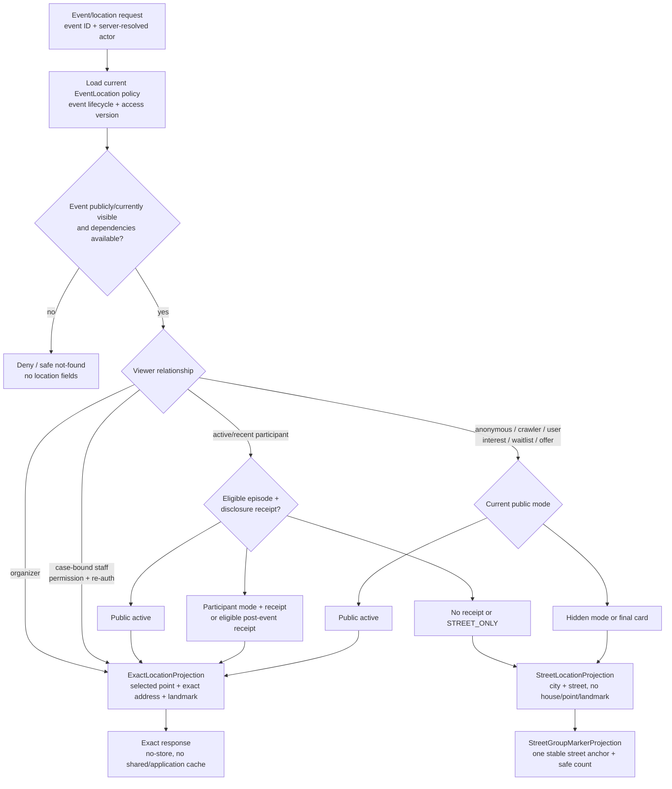
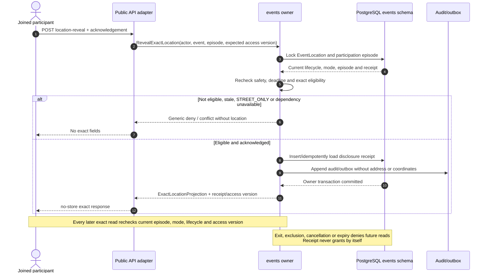
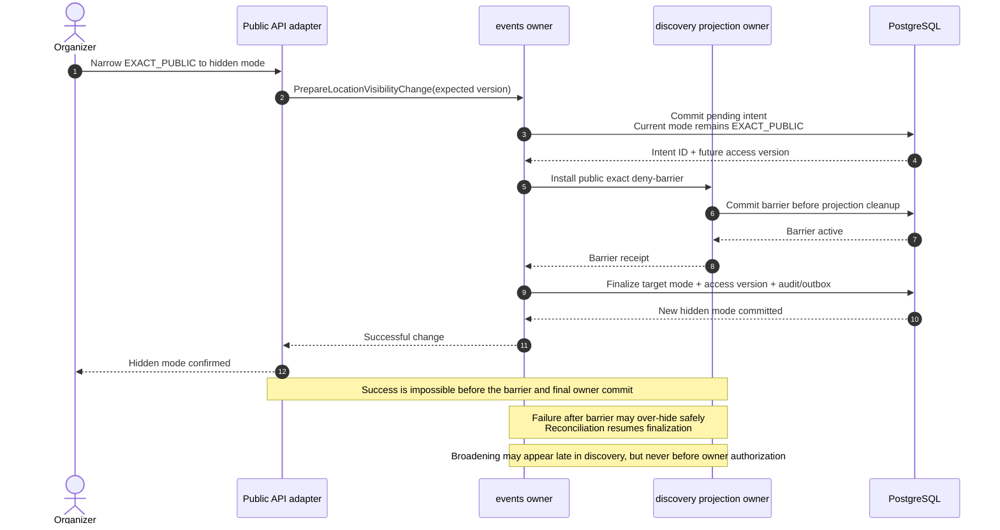

# G4.14 — Exact-location projection и reveal matrix

## Статус, цель и границы

- Статус: `ACCEPTED`
- Горизонт: MVP/alpha
- Owner точной location и access policy: модуль `events`
- Public map/card consumer: `discovery`
- Reminder/notification consumer: `communication`
- Production code/migrations: не создаются

Документ задаёт caller-specific location projections, правила раскрытия точной
точки и адреса, participant acknowledgement, organizer visibility changes,
fail-closed public revocation, reminders, audit, cache isolation и lifecycle
после окончания события.

Режим `EXACT_PUBLIC` остаётся принятым default согласно `PD-017`. G4.14 не
пересматривает этот product risk, но делает публичность явной, подтверждаемой и
технически отделённой от скрытых projections.

Здесь не определяется визуальный дизайн legend, accessibility wording и
алгоритм расчёта официальной street anchor — это следующий G4.15. G4.14 задаёт
только privacy/security contract для таких данных.

Диаграммы наглядны; нормативны таблицы, predicates, transactions, deadlines и
invariants.

## Источники и приоритет

Приоритет:

1. [PRODUCT_DECISIONS.md](../../PRODUCT_DECISIONS.md);
2. [DECISIONS.md](../../DECISIONS.md);
3. [SOURCE_SPECIFICATION.md](../../SOURCE_SPECIFICATION.md), если часть не
   заменена PD/ADR.

Связанные принятые артефакты:

- [G4.1 — C4 and trust boundaries](01-c4-context-containers.md);
- [G4.2 — module ports](02-module-boundaries-and-public-ports.md);
- [G4.3 — staff permissions](03-permission-catalogue.md);
- [G4.4A — data/retention](04-data-model-retention-compaction.md);
- [G4.4B — state machines](04-state-machines.md);
- [G4.5 — API/request security](05-api-contracts-and-request-security.md);
- [G4.6 — domain events](06-domain-event-catalogue.md);
- [G4.7 — outbox/reconciliation](07-outbox-inbox-and-reconciliation.md);
- [G4.10 — deployment/cache/backup boundaries](10-deployment-topology-and-migration.md);
- [G4.11/G4.12 — user authentication and sessions](11-web-mini-app-authentication-flow.md).

Security/cache references:

- [OWASP Authorization Cheat Sheet](https://cheatsheetseries.owasp.org/cheatsheets/Authorization_Cheat_Sheet.html);
- [OWASP API Security — BOLA](https://owasp.org/API-Security/editions/2023/en/0x11-t10/);
- [RFC 9111 — HTTP Caching](https://www.rfc-editor.org/rfc/rfc9111.html).

## Подтверждённые параметры

| Область | Решение |
|---|---|
| Modes | `STREET_ONLY`, `EXACT_PARTICIPANTS`, `EXACT_PUBLIC` |
| Default | Новый draft получает `EXACT_PUBLIC`; publication требует explicit organizer acknowledgement |
| Exact source | Authoritative selected PostGIS point; Nominatim только объясняет адрес |
| Participant reveal | Один receipt на participation episode; rejoin требует новый receipt |
| Interest/waitlist | Interest, waitlist entry и offer exact access не дают |
| Participant window | Joined-through-end participant с receipt: до `ends_at + 24h`; exit/exclusion/cancellation закрывают сразу |
| Public window | Exact public только для active published event до `ends_at`; final/cancelled public card максимум street |
| Organizer | Видит exact owner projection всегда; confirmation требуется для расширения audience |
| Staff | Только case-bound permission `events.private_location.read` + re-auth; каждый read audited |
| Reminders | Только `STREET_ONLY`, за 3h, 1h и 15m; автоматического reveal нет |
| Landmark | Следует exact classification; отсутствует в street projection |
| Audit | Policy changes, first participant reveal/episode и каждый staff read; 90d, без location payload |
| Crawler | `EXACT_PUBLIC` address может индексироваться; raw coordinates не входят в SEO metadata/JSON-LD |
| Notifications | Только event ID/street-safe summary/deep link; no exact address/point/landmark |
| Exact cache | `no-store`; CDN/Redis/service worker/shared projection cache запрещены |
| Public hide | Pre-invalidation deny-barrier до successful narrowing response |

## Термины и data classification

| Термин | Значение |
|---|---|
| Selected point | Выбранная организатором authoritative `geography(Point,4326)` |
| Provider point | Nominatim/provider suggestion; никогда не заменяет selected point |
| Exact address | Canonical address including house-level fields when resolved |
| Street projection | City + canonical street, без house/unit/selected/provider point/landmark |
| Exact projection | Selected point + exact canonical address + landmark |
| Street anchor | Stable official reference point street geometry; не derived from event point |
| Public mode | Current `EventLocation.location_visibility` |
| Access version | Monotonic version меняется при mode/lifecycle/participation rule change |
| Reveal receipt | Audit/security acknowledgement; сам по себе права не предоставляет |
| Public deny-barrier | Discovery-owned fail-closed suppression exact projection through access version |

Точная point/address/landmark относятся к `protected_location`, кроме времени,
когда owner policy явно разрешает `EXACT_PUBLIC`. Переход в public не создаёт
вторую копию source location и не разрешает её помещать в logs, analytics,
notifications или provider requests.

## Projection DTO catalogue

### `StreetLocationProjection`

| Field | Правило |
|---|---|
| `event_id` / safe public ID | Caller-safe opaque ID |
| `event_version`, `location_access_version` | Consistency/checkpoint, не authorization token |
| `city_id`, safe city label | Public catalog value |
| `street_id`, safe street label | Canonical street; требуется для hidden publication |
| `marker_kind` | `STREET_GROUP` либо card-level `STREET_ONLY` |
| `visibility_label` | Closed safe enum for UI/legend |

Запрещены selected/provider point, latitude/longitude, house/building/unit,
postcode когда он сужает до дома, provider ID/raw response, landmark и
precision metadata, позволяющая восстановить точку.

### `ExactLocationProjection`

| Field | Правило |
|---|---|
| `event_id`, versions | Event/location/access versions |
| `selected_point` | Latitude/longitude выбранной authoritative point |
| `exact_address` | Canonical allowed address components |
| `city_id`, `street_id` | Catalog linkage |
| `landmark` | Optional ≤20 chars; same exact classification |
| `marker_kind` | `EXACT` |
| `disclosure_context` | `PUBLIC`, `PARTICIPANT`, `ORGANIZER`, `STAFF_CASE` |
| `receipt_id` | Только participant response; non-secret reference |

Provider point/place ID/confidence/raw response не выдаются. DTO никогда не
содержит participant list, organizer private identity или reason внутреннего
staff access.

### `StreetGroupMarkerProjection`

Одна safe public entry для пары caller-safe visibility set + street:

- canonical `city_id/street_id`;
- stable street anchor;
- count только событий, которые caller может видеть;
- marker label kind `STREET_GROUP`;
- no event-specific point, distance, route или ordering по точной позиции.

События одной улицы не создают несколько approximate markers. Точный placement
и accessibility contract определит G4.15.

### `LocationDisclosureReceipt`

Owner-local `events` security record:

| Field | Правило |
|---|---|
| `receipt_id` | UUIDv7 PK |
| `event_id`, `episode_id`, `user_id` | Current internal owner references |
| `location_access_version` | Version, при которой впервые раскрыто |
| `visibility_at_reveal` | `EXACT_PARTICIPANTS` или post-event eligible context |
| `acknowledgement_version` | Version irreversible-warning text/contract |
| `first_revealed_at` | Server UTC |
| `expires_at` | Не позже `ends_at + 24h`; cancellation/revoke может закрыть раньше |
| `revoked_at`, `revoke_reason` | Nullable safe terminal metadata |
| `idempotency_key_hash` | Bounded command dedup, без raw key |

Unique `(event_id, episode_id)`. Receipt не содержит address/point/landmark и
не является bearer capability. User ID берётся из server session.

## Location projection matrix



Текстовая альтернатива: owner и case-bound/re-authenticated staff получают
exact projection. Anonymous, crawler, ordinary user, interest, waitlist и offer
получают exact только пока event активно `EXACT_PUBLIC`, иначе street.
Participant получает exact публично в active `EXACT_PUBLIC` либо после
episode-bound acknowledgement в `EXACT_PARTICIPANTS`/разрешённом post-event
окне. Любой отказ/dependency failure возвращает projection без location либо
street; exact response всегда `no-store`.

### Нормативная actor/mode matrix

| Viewer/current state | `STREET_ONLY` | `EXACT_PARTICIPANTS` | `EXACT_PUBLIC` active window |
|---|---|---|---|
| Anonymous | Street | Street | Exact public |
| Search crawler | Street | Street | Exact address/card; no coordinates in SEO metadata |
| Authenticated nonparticipant | Street | Street | Exact public |
| Interest only | Street | Street | Exact public |
| Waitlist / active offer | Street | Street | Exact public |
| Active joined participant, no receipt | Street | Street + reveal available | Exact public |
| Active joined participant, receipt | Street | Exact | Exact public |
| Joined-through-end, ≤24h, receipt | Street | Exact | Exact through participant context, not public |
| Left/excluded episode | Street | Street | Public exact only while mode itself remains public |
| Organizer | Exact | Exact | Exact |
| Case-bound staff + permission + re-auth | Exact | Exact | Exact |
| Staff without current case/re-auth | Deny exact | Deny exact | Только ordinary public projection |
| Completed/cancelled public card | Street | Street | Street |

`EXACT_PUBLIC` означает отсутствие confidentiality для active public window.
Anonymous viewer не получает receipt: organizer acknowledgement является
моментом принятия необратимого public disclosure.

## Eligibility predicates

### Active participant

Exact participant access требует одновременно:

```text
authenticated user
+ active EventParticipation episode owned by user
+ event SCHEDULED or IN_PROGRESS
+ mode EXACT_PARTICIPANTS or public EXACT_PUBLIC
+ current safety/event visibility
+ current access version
+ receipt when mode is not already public
= allow exact
```

Interest, waitlist entry, waitlist offer, former offer acceptance intent,
attendance dispute и chat history не заменяют participation predicate.

### Post-event participant window

До `ends_at + 24h` exact может получить только episode, который:

- действительно вступил;
- не завершился `LEFT` или `EXCLUDED` до конца;
- относится к non-cancelled event;
- имеет current/non-revoked receipt;
- проходит current account/safety guards.

Public/card/map projection уже street. Если active `EXACT_PUBLIC` participant
не создавал receipt, после окончания он должен один раз подтвердить warning и
получить post-event receipt; публичность до конца события не превращается в
вечное персональное право.

После deadline exact доступ остаётся только organizer owner projection и
case-bound staff use case. Attendance outcome не продлевает deadline.

### Exit, exclusion и cancellation

Exit/exclusion transaction increment location access relation version и
закрывает будущую выдачу exact после commit. Receipt остаётся audit evidence,
но получает terminal revoke metadata. Event cancellation закрывает participant
и public exact немедленно; финальная карточка street-only.

Уже увиденную/сохранённую информацию отозвать невозможно. UI не обещает
«удалить адрес у пользователя».

## Participant reveal flow



Текстовая альтернатива: joined participant отправляет acknowledgement,
idempotency key и expected access version. `events` locks current location и
episode, заново проверяет mode/lifecycle/safety/deadline, затем atomically
создаёт или находит receipt и audit без location payload. Exact DTO
возвращается только после commit с `no-store`. Любой последующий read повторяет
current authorization; receipt сам права не даёт.

### Port/API clarification

Принятый G4.5 `POST /v1/events/{event_id}/location-reveal` логически указывает
на `events` owner и не меняет Event/Location/Participation business state.
G4.14 уточняет внутреннее разделение:

- `LocationDisclosureCommands` — idempotent security receipt/audit side effect;
- `EventQueries` — caller-safe current projection после receipt.

Endpoint требует:

- authenticated server-derived actor;
- `Idempotency-Key`;
- acknowledgement version/value;
- current event/episode/access version;
- CSRF и exact allowed Origin;
- no auto-action from deep link.

Unknown/foreign event и unauthorized relationship не раскрываются разными
деталями. Receipt insertion race возвращает тот же receipt/outcome.

## Organizer visibility changes

### Allowed transitions

| From → to | Класс | Confirmation | Public barrier |
|---|---|---:|---:|
| `STREET_ONLY → EXACT_PARTICIPANTS` | Audience broadening | Да | Нет |
| `STREET_ONLY → EXACT_PUBLIC` | Public broadening | Да | Нет; publication waits for safe projection |
| `EXACT_PARTICIPANTS → EXACT_PUBLIC` | Public broadening | Да | Нет |
| `EXACT_PARTICIPANTS → STREET_ONLY` | Narrowing | Нет | Participant owner check closes at commit |
| `EXACT_PUBLIC → EXACT_PARTICIPANTS` | Public narrowing | Нет | Да |
| `EXACT_PUBLIC → STREET_ONLY` | Public narrowing | Нет | Да |

Mode change не меняет point/address/category и не расходует reschedule limit.
Command требует organizer, allowed event lifecycle, `If-Match`, idempotency key
и current safety state.

Broadening acknowledgement explicitly states:

- exact address/marker becomes visible to target audience;
- `EXACT_PUBLIC` includes anonymous users and search engines;
- recipients may save/share it;
- later hiding stops future Afisha delivery but cannot revoke prior disclosure.

Initial publication of default `EXACT_PUBLIC` requires the same explicit
acknowledgement; default value cannot silently bypass it.

## Fail-closed public hide barrier



Текстовая альтернатива: narrowing из `EXACT_PUBLIC` сначала сохраняет
idempotent intent, оставляя current mode прежним. Затем `events` синхронно
просит разрешённый DAG-call `events → discovery` установить deny-barrier.
Только после barrier receipt `events` фиксирует скрытый mode/access version и
возвращает success. Сбой после barrier может временно скрыть сильнее, но не
раскрыть; reconciliation завершает intent. Broadening разрешается появиться в
discovery позже owner commit, но никогда раньше authorization.

### Owner records

`LocationVisibilityChangeIntent` (`events`):

- intent/event IDs;
- from/target modes;
- current/future access versions;
- actor/idempotency/expected event version;
- acknowledgement version when broadening;
- `PREPARED`, `BARRIER_INSTALLED`, `COMMITTED`, `FAILED_SAFE`;
- barrier receipt, timestamps и normalized failure.

`LocationPublicDenyBarrier` (`discovery`):

- event/intent IDs;
- `deny_through_access_version`;
- installed/acknowledged/compacted timestamps;
- active state/version;
- no address/coordinate.

Unique event + active intent предотвращает competing mode changes.

### Failure behavior

- До barrier install current public mode может оставаться публичным, но command
  не возвращает success.
- После barrier install discovery выдаёт максимум street даже при stale exact
  projection.
- После final owner commit `EventQueries` также немедленно выдаёт hidden mode.
- Если final commit потерян, retry/reconciliation использует intent/barrier
  receipt и завершает либо оставляет safe over-hide.
- Barrier нельзя снять из-за timeout/Redis/Celery failure.
- Следующая exact-public projection с более новым authorized access version
  atomically supersedes старый barrier.
- Cancellation/completion active `EXACT_PUBLIC` используют тот же
  pre-invalidation contract до terminal success.

## Reminders

Создаются только для published `STREET_ONLY` event:

| Offset до start | Назначение |
|---:|---|
| 3 часа | Проверить состав участников и выбранный режим |
| 1 час | Повторно проверить, нужно ли раскрывать joined participants |
| 15 минут | Последнее напоминание; автоматического reveal всё равно нет |

Schedule key: `(event_id, schedule_version, location_access_version, offset)`.

Beat передаёт только IDs. Worker перед delivery повторно проверяет:

- event `SCHEDULED`;
- current start/schedule version;
- current mode всё ещё `STREET_ONLY`;
- organizer и notification route current;
- due/expiry window;
- reminder ещё не delivered/skipped.

Переход из `STREET_ONLY`, cancellation, start-time revision или lifecycle
change делает старую task `skipped`. Reminder payload содержит event ID,
street-safe label, current mode и deep link; no exact address/point/landmark,
participant list/count или delivery secrets.

`EXACT_PARTICIPANTS` reminder не создаёт: joined audience уже может выполнить
explicit reveal. Система никогда не раскрывает автоматически из-за deadline,
числа участников или недоставленного reminder.

## Audit

### Audited events

| Событие | Частота | Retention |
|---|---|---:|
| Initial public/bounded audience acknowledgement | На publication | 90d |
| Organizer mode change attempt/outcome | Каждый command | 90d |
| Participant first reveal | Один receipt на episode | 90d |
| Participant denied reveal | Safe normalized security event, без oracle | 90d/aggregate where appropriate |
| Case-bound staff exact read | Каждый read | 90d |
| Barrier install/finalize/reconcile | Каждый transition | 90d |

Participant subsequent exact reads не создают отдельный 90-дневный trail; они
проверяются current-state и отражаются только aggregate security metrics без
user/event/location linkage.

Audit fields: internal actor/event/episode/case/receipt/intent IDs, mode
from/to, access/event versions, acknowledgement version, permission/decision
reference, normalized outcome/reason, request/correlation/idempotency IDs и
server time.

Запрещены address/coordinates/landmark, map viewport, route, tile URL,
participant name/Profile, raw IP/User-Agent, session/cookie и provider payload.

Anonymous/crawler views `EXACT_PUBLIC` не audit-ируются per-view и не создают
visitor fingerprint. Сам organizer publication/mode transition является
доказательством public disclosure.

## Cache и client isolation

### Exact response

Каждый response, содержащий хотя бы одно exact field:

```text
Cache-Control: no-store
Pragma: no-cache
```

`Pragma` нужен только как legacy defense in depth. Нормативным является
`no-store`.

Exact DTO:

- не попадает в CDN/reverse-proxy cache;
- не сохраняется Redis application cache;
- не попадает в service worker/Cache API/offline state;
- не кладётся в browser local/session storage;
- не используется как stale-if-error/stale-while-revalidate response;
- не смешивается с street DTO через nullable fields;
- не содержится в list/search cursor;
- не prefetch-ится на hover/viewport без explicit current need.

`Vary: Cookie/Authorization` недостаточен: personalized exact response всё
равно non-storable. RFC `no-store` не возвращает уже увиденный адрес и не
защищает от malicious client, screenshot или search index.

### Public street/discovery cache

Street projection может кэшироваться только по safe keys:

```text
city/catalog version
+ street ID
+ event public projection version
+ safety tombstone version
+ location access version
= safe cache key
```

Exact and street DTO имеют разные types/routes/serializers. Cache miss,
dependency failure или unknown visibility дают street/deny, но не fallback к
последнему exact.

Discovery exact-public projection может хранить exact public point только для
текущего authorized access version и обязана проверять active deny-barrier
перед response. Analytics projection exact point не получает.

## Browser, crawler и external providers

### Browser/OpenFreeMap

Exact marker рисуется Afisha frontend как client overlay. Event ID/address/
coordinates не добавляются в OpenFreeMap style/tile URL, headers или feature
payload. Browser обращается к OpenFreeMap только за public style/vector tiles.

Nominatim вызывается backend-only при draft location resolution; event reads не
вызывают reverse geocoding заново и не передают provider DTO клиенту.

External routing/deep-link provider с coordinates в MVP отсутствует.

### Search crawler

Для active `EXACT_PUBLIC` event:

- exact canonical address может находиться в indexable safe HTML;
- raw latitude/longitude не добавляются в JSON-LD, OpenGraph или other SEO
  metadata;
- participant/organizer/staff context не влияет на crawler HTML;
- после hidden/final transition SSR выдаёт максимум street и `no-store` exact
  source больше не используется.

Search engine мог сохранить ранее публичный address. Hide не обещает удаление
из внешнего index; operational de-index request находится вне G4.14.

### Notifications и facts

Telegram, notification center payload, reminder, operations alert, dead-letter,
error, metric и ordinary outbox fact не содержат exact location.

`events.event_published`/safe-card fact может включать public point только для
active `EXACT_PUBLIC` и current access version, как разрешено G4.6. Hidden
mode facts содержат city/street/mode/version, no point/address/landmark.

`events.location_visibility_changed` никогда не копирует coordinates/address.
Communication хранит deep link и при открытии инициирует fresh authorized
projection query.

## Lifecycle и retention

| Transition/state | Public projection | Participant projection | Organizer/staff |
|---|---|---|---|
| Draft | Not public | Not applicable | Organizer exact |
| Published `STREET_ONLY` | Street | Street | Organizer/staff exact |
| Published `EXACT_PARTICIPANTS` | Street | Exact after receipt | Organizer/staff exact |
| Published active `EXACT_PUBLIC` | Exact | Exact public | Organizer/staff exact |
| At `ends_at` | Street immediately | Receipt-based through +24h | Exact |
| Cancelled | Street final/safe status | Exact denied immediately | Organizer/case staff exact |
| Completed after +24h | Street | Street/denied exact | Organizer/case staff exact |
| Safety hidden | Safe not-found/tombstone | Deny unless explicit internal case | Case staff only |

Exact final location remains in canonical protected Event record with original
classification under ADR-016. It is not copied to analytics/archive and does
not become public again after completion.

Disclosure receipt/audit metadata — 90d from reveal/policy action, subject to
legal hold. Intent/barrier technical metadata:

- committed safe metadata 30d;
- failed/pending kept until reconciliation then 30d;
- active barrier retained until superseded/acknowledged projection;
- idempotency follows G4.5/G4.7 technical TTL.

Cleanup never deletes an active barrier or receipt required by a still-open
participant window.

## Authorization/failure semantics

| Situation | Required behavior |
|---|---|
| PostgreSQL/events unavailable | No exact response |
| Participation/current access cannot be checked | Participant exact denied |
| Safety dependency unavailable | Public/private exact fail-closed |
| Redis unavailable | No positive exact authorization cache; DB path continues or denies |
| Celery/Telegram unavailable | Mode/reveal transaction remains committed; reminder/delivery retries safely |
| Discovery unavailable during public hide | Hide command not successful; intent retries, no false success |
| Barrier installed, owner finalize unavailable | Safe over-hide; reconciliation completes |
| Stale client access/event version | Conflict; no exact fields |
| Receipt exists but episode ended by exit/exclusion | Deny |
| Mode changes while reveal request runs | Row lock/version selects one outcome; stale reveal denied |
| Event ends during request | Server/DB time and locked lifecycle decide; public final street |
| Exact serialization/log redaction fails | Request fails before emitting payload |
| Cache configuration uncertain | Exact route disabled/fail-closed |

Authorization is property-level as well as object-level: access to Event/card
does not imply access to exact fields.

## Concurrency и locking

Within `events`:

1. Event row/version;
2. EventLocation/access version;
3. visibility intent, если есть;
4. participation episode by ID;
5. disclosure receipt/idempotency;
6. audit/outbox.

Within `discovery`: event barrier, exact projection, street projection,
projection checkpoint.

Cross-module row locks и shared transaction запрещены. `events → discovery`
uses typed idempotent command/receipt. Retried intent with same idempotency key
cannot choose another target mode.

Mode change and lifecycle transition serialize on Event/EventLocation. Receipt
race unique by episode. Public barrier is idempotent by intent/access version.

## Reconciliation

| Check | Mismatch | Repair |
|---|---|---|
| Public exact projection | Event no longer current `EXACT_PUBLIC` | Install/retain barrier, remove exact projection |
| Barrier | Pending intent with no barrier receipt | Retry install |
| Intent | Barrier active, owner not finalized | Finalize target or keep safe over-hide + alert |
| Broadening | Owner exact-public newer than discovery | Rebuild later; keep street until ready |
| Receipt | Episode left/excluded/cancelled | Mark revoked |
| Receipt deadline | `ends_at +24h` passed | Revoke/cleanup verifier-free record by retention |
| Reminder | Mode/version/lifecycle stale | Mark skipped |
| Final card | Contains house/point/landmark | Remove immediately + security alert |
| Analytics/fact | Contains protected location unexpectedly | Quarantine/dead-letter without copying payload |

Reconciliation never automatically broadens mode or creates participant
receipt.

## Verification strategy

### Projection matrix

- table-driven tests cover every actor/mode/lifecycle cell;
- anonymous/user/interest/waitlist/offer cannot get hidden exact fields;
- organizer exact does not leak through public serializer;
- staff requires case, permission, re-auth and every read audit;
- unknown actor/mode/dependency returns deny/street, never exact;
- exact/street schemas share no nullable sensitive fields.

### Participant reveal

- no receipt before acknowledgement;
- receipt unique/idempotent per episode;
- foreign/stale episode cannot reveal;
- rejoin requires new episode/receipt;
- exit/exclusion/cancellation revoke immediately after commit;
- public exact active needs no participant receipt;
- post-event exact requires eligible episode + receipt and ends at +24h;
- exact response headers/storage rules asserted.

### Visibility/barrier

- initial exact-public publication requires acknowledgement;
- every broadening requires acknowledgement;
- narrowing does not require warning;
- public-hide success impossible before barrier + owner commit;
- crash at each barrier step produces public-safe outcome;
- retry/reconciliation is idempotent;
- stale exact projection cannot bypass barrier;
- completion/cancellation from exact-public applies same barrier.

### Data leakage

- exact fields absent from street DTO, facts, reminders, Telegram, logs,
  analytics, metrics, errors and dead letters;
- OpenFreeMap requests contain no event payload/coordinates;
- crawler hidden/final HTML has no house/coordinates/landmark;
- SEO metadata never contains raw lat/lon;
- `no-store` exact response excluded from CDN/Redis/service-worker tests;
- backup/restore preserves access versions/barriers and reruns reconciliation.

## Архитектурные инварианты

| ID | Инвариант |
|---|---|
| `LOC-01` | Selected PostGIS point is authoritative; Nominatim does not move it |
| `LOC-02` | There are exactly three modes and two public precision levels |
| `LOC-03` | Default `EXACT_PUBLIC` still requires explicit publication acknowledgement |
| `LOC-04` | Hidden point/house/landmark never appears as nullable fields in street DTO |
| `LOC-05` | Interest, waitlist and offer do not grant exact access |
| `LOC-06` | Receipt records warning, but current relationship/policy grants access |
| `LOC-07` | Exit/exclusion/cancellation close future exact reads fail-closed |
| `LOC-08` | Public final card is street-only regardless of historical mode |
| `LOC-09` | Organizer mode change never changes location or reschedule count |
| `LOC-10` | Public narrowing cannot report success before deny-barrier and owner commit |
| `LOC-11` | Exact response is no-store and has no positive Redis/cache fallback |
| `LOC-12` | Exact location is absent from analytics/logs/notifications/dead letters |
| `LOC-13` | Anonymous/crawler exact-public views are not converted into tracking records |
| `LOC-14` | Staff exact read is case-bound, re-authenticated and audited |
| `LOC-15` | Landmark follows exact classification |
| `LOC-16` | Reminders never auto-reveal and run only for current STREET_ONLY |
| `LOC-17` | OpenFreeMap receives tiles/style only, not event payload |
| `LOC-18` | No client or projection can infer event point from street anchor |

## Явно вне G4.14

- Production SQLAlchemy/PostGIS migrations, FastAPI/Pydantic/frontend code.
- Exact UI copy/localization and visual irreversible-warning design.
- Map legend icons/colors/keyboard/screen-reader contract — G4.15.
- Street geometry anchor selection algorithm — G4.15.
- Map clustering.
- External routing/navigation links.
- Own tile server implementation.
- User geolocation, address or route history.
- Individual organizer approval of participants for location.
- Automatic reveal based on time/count/capacity.
- De-index/removal workflow for third-party search engines.
- Full STRIDE/security DFD and observability SLO.
- Application-level encryption of PostGIS point, excluded by ADR-014 for MVP.

## Traceability

| Решение | Источник |
|---|---|
| Three modes/default exact-public/two levels | `PD-017`, `ADR-014` |
| Organizer selects immutable exact point | `PD-005`, `PD-017`, `ADR-013`, `ADR-014` |
| Street anchor/group, no fake event point | `PD-017`, `ADR-014` |
| Interest/waitlist no access; exit/exclusion revoke | `PD-006`, `PD-017`, `G4.4B`, `G4.5` |
| Confirmation/irreversible warning | `PD-013`, `PD-017`, `RISKS R-001/R-119`, `G4.5` |
| Current per-request property authorization | `PD-013`, `G4.2`, `G4.5`, OWASP Authorization/BOLA |
| Staff case-bound exact read | `G4.3`, `G4.5`, `G4.13` |
| 3h/1h/15m reminders/no auto reveal | `PD-017`, `G4.2`, `G4.6` |
| Audit without location payload | `PD-013`, `PD-014`, `PD-017`, `G4.3`, `G4.6` |
| No-store/cache isolation | `G4.5`, RFC 9111 |
| No exact in OpenFreeMap/Nominatim browser path | `ADR-014`, `ADR-019`, `G4.1`, `G4.10` |
| Exact final protected/public final street | `PD-014`, `ADR-016`, `G4.4A` |
| State+outbox/idempotency/reconciliation | `PD-018`, `ADR-015`, `G4.6`, `G4.7` |
| Public point only in exact-public safe card | `G4.6 EVT-11` |

## Acceptance checklist

- [x] Документ принят владельцем 2026-07-29.
- [x] Three modes и exact/street DTO separation зафиксированы.
- [x] Actor/mode/lifecycle matrix покрывает anonymous through staff.
- [x] Interest/waitlist/offer не дают hidden exact access.
- [x] Participant receipt, rejoin и +24h deadline определены.
- [x] Exit/exclusion/cancellation revoke current delivery.
- [x] Organizer broadening acknowledgement и narrowing semantics заданы.
- [x] `EXACT_PUBLIC → hidden` использует pre-invalidation barrier.
- [x] Reminders 3h/1h/15m не раскрывают автоматически.
- [x] Audit/retention не содержат location payload.
- [x] Exact cache/client/SEO/notification/provider isolation определена.
- [x] Public final card street-only, protected final record сохранён.
- [x] Failure/concurrency/reconciliation/negative tests описаны.
- [x] Три Mermaid diagrams имеют `.mmd` и текстовые альтернативы.
- [x] Встроенные Mermaid blocks должны совпасть с `.mmd` перед commit.
- [x] Нет secrets, PII examples, production domains или anti-fraud internals.
- [x] G4.15 legend/anchor algorithm и production code не созданы.
- [x] G4.14 checkbox и architecture changelog обновлены при принятии.
