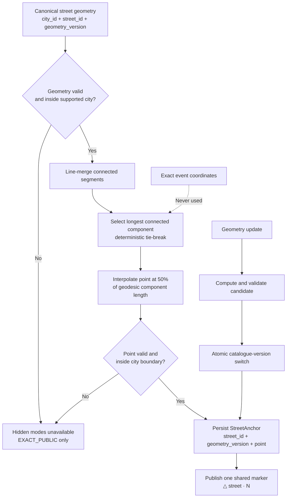
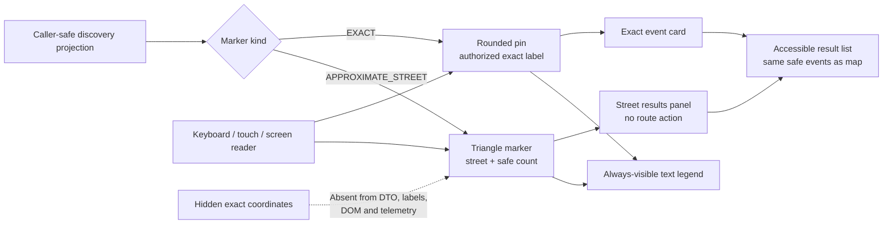

# G4.15 — Map legend, accessibility и approximate-marker placement

## Статус, цель и границы

- Статус: `DRAFT — ожидает подтверждения владельца`
- Горизонт: MVP/alpha
- Map/catalog owner: модуль `discovery`
- Exact location и visibility owner: модуль `events`
- Safety decisions: модуль `trust_safety`
- Clients: Public Web и Telegram Mini App
- Production code, HTTP schemas и migrations: не создаются

Документ задаёт нормативный presentation contract карты: различимость exact и
approximate markers, постоянно видимую легенду, доступность без зависимости от
цвета, текстовую альтернативу карте и детерминированный расчёт общей опорной
точки улицы. Он продолжает принятый G4.14 и не меняет правила выдачи exact
location.

Диаграммы являются наглядным представлением. Таблицы, алгоритм и инварианты
ниже являются нормативными.

## Приоритет источников

При конфликте применяется порядок:

1. `PRODUCT_DECISIONS.md`;
2. `DECISIONS.md`;
3. незаменённая часть `SOURCE_SPECIFICATION.md`;
4. текущие G4-документы как детализация принятых решений.

Историческая запись changelog о hash-based placement была предварительным
направлением. По подтверждению владельца в G4.15 алгоритм уточняется:
используется геометрическая середина основной части официальной street
geometry, без event ID, hash события и ручной настройки каждой улицы.

## Термины и ownership

| Термин | Нормативное значение | Owner |
|---|---|---|
| Exact marker | Обычная округлая pin-метка только для caller-safe exact projection | `events` решает доступ; `discovery` отображает |
| Approximate marker | Треугольная общая метка улицы; не обозначает примерное место события | `discovery` |
| Street plaque | Подпись `△ {улица} · {N}` с числом доступных caller-safe событий | `discovery` |
| Canonical street | Проверенная запись улицы внутри поддерживаемого города | `discovery` |
| Street geometry | Версионированная официальная линия/мультлиния улицы | `discovery` |
| Primary component | Самая длинная связная часть нормализованной street geometry | `discovery` |
| Street anchor | Сохранённая середина primary component для конкретной geometry version | `discovery` |
| Safe count | Число событий улицы, уже прошедших lifecycle, visibility и safety filters | `discovery` |
| Result list | Текстовый список тех же доступных событий, что представлены на карте | `discovery` adapter |
| Legend | Постоянное текстовое объяснение обоих видов markers под основной картой | Frontend adapter |

Street anchor не является:

- приблизительной координатой события;
- предполагаемым домом или входом;
- навигационной точкой;
- результатом усреднения event coordinates;
- пользовательской геолокацией;
- substitute для exact address.

## Нормативный marker contract

| Свойство | `APPROXIMATE_STREET` | `EXACT` |
|---|---|---|
| Форма | Triangle/треугольник | Rounded pin/округлая метка |
| Видимая подпись | Название улицы и safe count | Caller-safe название/адрес события |
| Семантика | «На этой улице есть N событий со скрытым точным местом» | «Здесь находится событие с доступным точным местом» |
| Coordinate source | `StreetAnchor` | Только разрешённая exact projection |
| Один marker | Один на canonical street в текущей caller projection | Один на видимое точное событие |
| Click/activate | Открывает street results panel | Открывает exact event card |
| Route action | Отсутствует | Не входит в MVP |
| Exact fields | Запрещены | Только после server-side authorization |
| Cache | Safe public projection | Правила G4.14: hidden exact `no-store` |
| Search/SEO | Street и safe event summaries | Только текущая `EXACT_PUBLIC` projection |

Approximate и exact markers могут одновременно существовать на одной карте:
например, часть событий улицы раскрыта, а часть остаётся скрытой. Они не
объединяются в cluster и не заменяют друг друга.

## Постоянная легенда

Под основной картой всегда отображаются два элемента:

1. треугольный символ и текст «Примерное расположение — показана только
   улица»;
2. округлая pin-метка и текст «Точное место события».

Нормативные правила:

- legend видима без открытия help/popover;
- icon всегда сопровождается текстом;
- различие не зависит только от цвета;
- порядок элементов одинаков в Public Web и Mini App;
- перевод может менять wording, но не смысл;
- legend не содержит точный адрес или число скрытых событий;
- в compact layout legend переносится на строки, но не скрывается;
- skeleton/loading не показывает фиктивный exact marker;
- unavailable/error state сохраняет текстовое объяснение типов markers.

Конкретные цвета, typography и component library выбираются при UI design.
Semantic tokens должны сохранять установленный contrast contract.

## Accessibility contract

Целевой стандарт — WCAG 2.2 Level AA для web и Mini App surface.

### Визуальная различимость

| Требование | Контракт |
|---|---|
| Не только цвет | Exact и approximate отличаются формой, icon и текстом |
| Text contrast | Не менее 4.5:1 для обычного текста; 3:1 для крупного |
| Non-text contrast | Marker boundary/icon и focus indicator не менее 3:1 к соседним цветам |
| Zoom | При browser zoom до 200% legend и result list остаются читаемыми без потери функций |
| Motion | Marker selection не требует animation; reduced-motion отключает необязательные transitions |
| Error | Ошибка карты описана текстом и не обозначается только красным цветом |

### Keyboard и focus

- Каждый интерактивный marker представлен focusable button-equivalent.
- `Enter` и `Space` открывают тот же panel/card, что pointer activation.
- `Escape` закрывает panel и возвращает focus на исходный marker/list item.
- Focus indicator видим и не перекрывается картой или sticky controls.
- Tab order не заставляет проходить сотни markers: карта является одним
  регионом, а доступный result list — основным последовательным интерфейсом.
- Map pan/zoom controls доступны с клавиатуры, но просмотр событий не зависит
  от умения управлять canvas.
- Touch target интерактивного marker/list control — минимум `44×44 CSS px`.

### Screen reader и текстовая альтернатива

Map container имеет краткое имя и описание. Каждый map result существует также
в семантическом списке. Нормативные accessible names:

| Объект | Пример смысла accessible name |
|---|---|
| Approximate | «Примерное расположение, улица Гагарина, 4 события» |
| Exact public | «Точное место, событие {safe title}, {public exact address}» |
| Exact participant | Та же семантика, но только внутри authorized `no-store` response |
| Disabled/unavailable | «Карта недоступна; используйте список событий» |

Accessible name строится только из полей текущего caller-safe DTO. Hidden house,
landmark, coordinate, participant relation и internal IDs не попадают в DOM,
ARIA, accessibility tree или client telemetry.

### Map/list parity

- Result list доступен рядом с картой и не считается fallback второго сорта.
- Map и list используют одну projection version и одинаковые safety filters.
- Выбор marker выделяет соответствующую группу/карточку в list.
- Выбор list item может центрировать карту, но не меняет права и projection.
- Если WebGL, tiles или JavaScript недоступны, SSR-safe list остаётся основным
  публичным способом просмотра.
- Screen reader не обязан озвучивать визуальные перемещения карты.

## Данные marker projection

Capability-level DTO, без фиксации HTTP/production Python:

### `ApproximateStreetMarker`

| Поле | Смысл | Ограничение |
|---|---|---|
| `city_public_id` | Публичный opaque ID города | Не внутренний DB key |
| `street_public_id` | Публичный opaque ID canonical street | Не event ID |
| `street_display_name` | Проверенное безопасное название | Без дома/landmark |
| `anchor_point` | Разрешённая общая координата улицы | Не derived from event |
| `safe_event_count` | Count после всех filters | Не раскрывает скрытые/hold events |
| `catalogue_version` | Версия каталога и anchor | Для coherent response/cache |
| `projection_version` | Версия агрегированной выдачи | Monotonic apply |
| `marker_kind` | `APPROXIMATE_STREET` | Closed enum |

DTO не содержит event exact points, distance до событий, минимальный bounding
box скрытых событий, centroid событий или список внутренних event IDs.

### `ExactEventMarker`

Содержит только public-safe event ID/card fields и координату, которую G4.14
разрешает текущему caller. Для hidden participant projection ответ `no-store`.
Frontend не объединяет её с public cache.

## Алгоритм StreetAnchor

### Нормативные входы

- supported `city_id`;
- `canonical_street_id`;
- проверенная geometry version;
- нормализованная `LineString`/`MultiLineString`;
- действующая city boundary version.

Exact event coordinates, counts и locations других объектов запрещены как
входы.

### Расчёт

1. Проверить, что street относится к активному supported city.
2. Проверить geometry type, SRID, непустоту, конечность координат и попадание
   в разрешённую city boundary.
3. Нормализовать и line-merge соединяемые сегменты.
4. Для каждой оставшейся связной части вычислить geodesic length.
5. Выбрать самую длинную часть. При одинаковой длине применить стабильный
   технический tie-break по нормализованному geometry digest.
6. Интерполировать точку на 50% geodesic length выбранной части.
7. Повторно проверить, что точка лежит на выбранной geometry и внутри city.
8. Сохранить `StreetAnchor` с street/geometry/catalogue versions.
9. Переключить активную catalogue version только после полной проверки.

Это автоматическая середина основной части улицы. Ручная настройка каждой улицы
не требуется. Детерминизм означает, что одинаковый нормативный вход всегда
даёт одинаковую точку.

### Почему не midpoint bounding box

Центр прямоугольника вокруг улицы может попасть во двор, море или квартал,
через который улица не проходит. Интерполяция по длине остаётся на официальной
линии улицы и не создаёт вымышленный номер дома.

### Почему не event-aware placement

Использование event point, ближайшего сегмента, средней координаты, density или
distance позволило бы сравнивать marker между улицами/версиями и делать выводы
о скрытом месте. Anchor является свойством street catalogue, а не Event.

## Диаграмма выбора StreetAnchor



Текстовая альтернатива: проверенная geometry улицы нормализуется; выбирается её
самая длинная связная часть и точка на половине длины. После повторной проверки
anchor сохраняется с версиями. Exact event coordinates не участвуют. Если
geometry или midpoint непригодны, скрытые modes недоступны и событие может быть
опубликовано только как `EXACT_PUBLIC`.

## Geometry lifecycle и failure semantics

| Ситуация | Поведение |
|---|---|
| Geometry отсутствует | Hidden publication deny; только `EXACT_PUBLIC` |
| Geometry invalid/outside city | То же fail-closed поведение; catalogue issue observable |
| Street name есть, geometry нет | Текст улицы недостаточен для hidden mode |
| Несколько частей | Выбирается longest connected component |
| Geometry обновлена | Candidate считается отдельно; active version меняется атомарно |
| Candidate failed validation | Старая valid version остаётся; для новой улицы hidden deny |
| Nominatim временно недоступен | Existing verified anchor продолжает работать; новый hidden publish deny |
| Anchor storage/read unavailable | Approximate marker не заменяется event point; safe list без map point либо temporary unavailable |
| Street renamed/merged | Versioned catalogue migration и projection rebuild; exact points не участвуют |

Пользователю при недоступной улице не предлагается «подвинуть точку». UI
объясняет единственный допустимый путь публикации: выбрать публичный точный
адрес (`EXACT_PUBLIC`) либо отложить публикацию.

## Marker aggregation

Aggregation key:

```text
caller_visibility_class
+ city_public_id
+ canonical_street_id
+ catalogue_version
+ safety_projection_version
```

Правила:

- count включает только текущие caller-safe active events;
- safety tombstone и public-hide barrier применяются до count;
- нулевой count удаляет marker;
- один event учитывается один раз;
- `EXACT_PUBLIC` event показывается exact marker и не увеличивает approximate
  count;
- authorized participant может получить exact marker своего события; оно
  исключается из его approximate group;
- изменение rights не меняет anchor, только состав caller projection;
- count не используется для аналитического восстановления скрытых locations.

## Interaction flow



Текстовая альтернатива: caller-safe projection выбирает approximate либо exact
marker. Оба объяснены постоянной легендой и доступны мышью, touch, клавиатурой
и screen reader. Approximate marker открывает список событий улицы без route
action; exact marker открывает карточку. Hidden coordinates отсутствуют во
всех клиентских данных.

## Privacy и inference resistance

Запрещено:

- рассчитывать anchor из одного или нескольких event points;
- двигать anchor при добавлении/удалении события;
- отдавать bounding box скрытых events;
- показывать расстояние от anchor до скрытого event;
- помещать exact coordinate в HTML comments, hydration state, source maps,
  logs, analytics или error payload;
- создавать отдельные street markers для каждого скрытого события;
- использовать marker jitter, уникальный event hash или animation как
  кодирование;
- сравнивать public и privileged projections на клиенте;
- отправлять event marker payload в OpenFreeMap.

Обычный safe count является принятой продуктовой информацией об активных
событиях улицы, но rate limits и result pagination не позволяют превратить API
в bulk enumeration surface.

## Cache, SSR и telemetry

| Surface | Правило |
|---|---|
| Anonymous public map | Cache только caller-independent safe projection |
| Authorized ordinary map | Не смешивать с anonymous cache, даже если поля совпали |
| Participant exact | `private, no-store`; G4.14 |
| SSR | Safe list и legend; hidden exact отсутствует в hydration/metadata |
| Service worker | Не сохраняет participant exact response |
| CDN | Только anonymous safe street/exact-public projection |
| Analytics | Marker kind, city, result count band и outcome; без coordinates/street free text |
| Logs | Opaque catalogue/projection IDs; без exact coordinates |

## Security и safety boundaries

1. `events` сначала вычисляет location projection текущего caller.
2. `trust_safety` deny/tombstone имеет приоритет.
3. `discovery` агрегирует только уже безопасные event summaries.
4. Frontend отображает DTO и не вычисляет visibility.
5. Stale public-hide projection блокируется barrier из G4.14.
6. Недоступность cache/Redis не разрешает exact access и не меняет owner state.
7. MapLibre/OpenFreeMap получает style/tiles, но не event payload.

## Архитектурные инварианты

| ID | Инвариант |
|---|---|
| `MAP-01` | Approximate marker не обозначает место конкретного события |
| `MAP-02` | Все hidden events одной canonical street используют один anchor |
| `MAP-03` | Anchor не зависит от event coordinates, event ID или count |
| `MAP-04` | Anchor — midpoint longest connected street component |
| `MAP-05` | Без valid street geometry hidden publication запрещена |
| `MAP-06` | Marker kinds различаются формой, icon и текстом, не только цветом |
| `MAP-07` | Legend всегда видна под основной картой |
| `MAP-08` | Map имеет эквивалентный accessible result list |
| `MAP-09` | Hidden fields отсутствуют в DTO/DOM/ARIA/cache/telemetry |
| `MAP-10` | Approximate marker не предлагает маршрут |
| `MAP-11` | Clustering отсутствует в MVP |
| `MAP-12` | Safety hide и exact revoke работают fail-closed |

## Deferred scope

Не определяются:

- собственный vector tile styling и tile-server implementation;
- clustering, heatmaps и marker spidering;
- routes/navigation;
- device geolocation и «рядом со мной»;
- manual street-anchor editor;
- address search/autocomplete;
- UI component library и final palette;
- production code, PostGIS migration и concrete HTTP schema.

## Traceability

| Требование | Источник |
|---|---|
| Два уровня места, общая street plaque и legend | `PD-017` |
| Карта и markers входят в MVP; clustering исключён | `PD-011` |
| Exact/street disclosure и no-client hidden point | `PD-002`, `PD-013`, `PD-017`, `G4.14` |
| PostgreSQL/PostGIS, canonical street и official anchor | `ADR-014` |
| MapLibre/OpenFreeMap boundaries | `ADR-019`, `G4.1`, `G4.10` |
| Fail-closed discovery projection | `ADR-011`, `G4.2`, `G4.14` |
| Safe SSR/indexing | `PD-015`, `ADR-016`, `G4.1`, `G4.11` |
| Accessibility и map/list parity | владелец, G4.15 clarification 2026-07-29 |
| Midpoint primary street component | владелец, G4.15 clarification 2026-07-29 |
| No move-point suggestion; exact-public only fallback | владелец, G4.15 clarification 2026-07-29 |

## Acceptance checklist

- [x] Документ остаётся `DRAFT` до отдельного owner review.
- [x] Exact и approximate marker contracts разделены.
- [x] Постоянная legend не зависит только от цвета.
- [x] WCAG 2.2 AA, keyboard, touch и screen-reader rules заданы.
- [x] Map/list parity и SSR fallback описаны.
- [x] Автоматический midpoint algorithm не использует event point.
- [x] Multi-part street, updates и failures определены.
- [x] Hidden publication без valid geometry работает fail-closed.
- [x] Approximate marker не создаёт route или fake house.
- [x] Privacy/cache/telemetry boundaries зафиксированы.
- [x] Mermaid diagrams имеют текстовые альтернативы.
- [x] Встроенные Mermaid blocks должны совпасть с `.mmd`.
- [x] Production code/migrations, colors и thresholds не создаются.
- [x] Нет secrets, PII или production domains.
- [x] G4.15 checkbox/changelog принятия не изменены.
