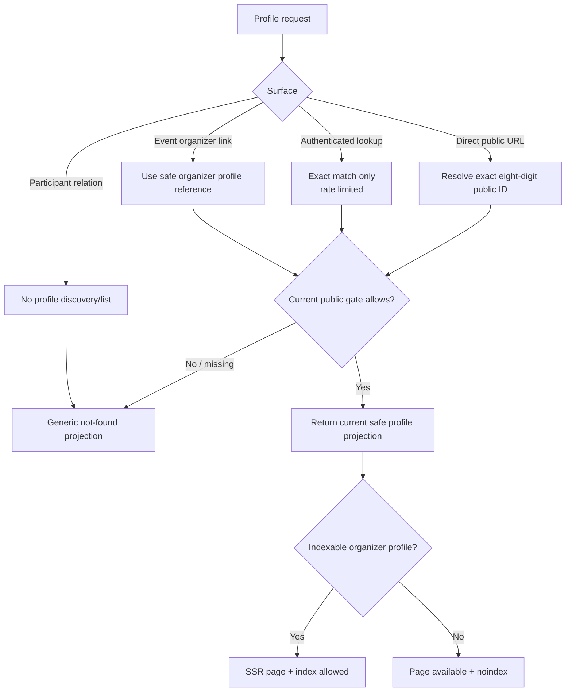
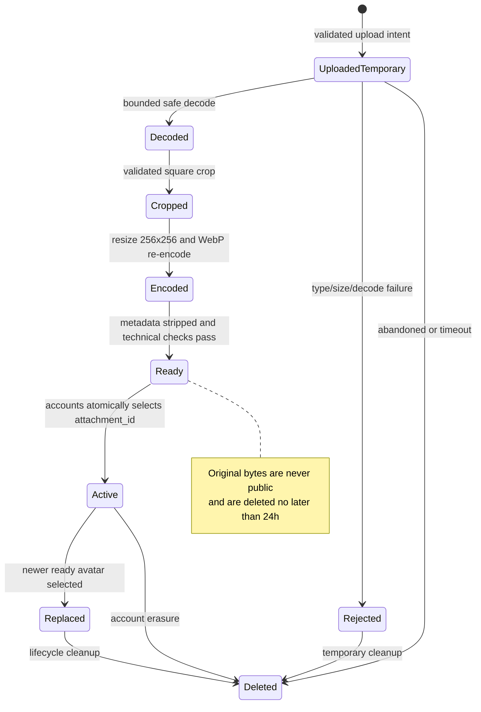
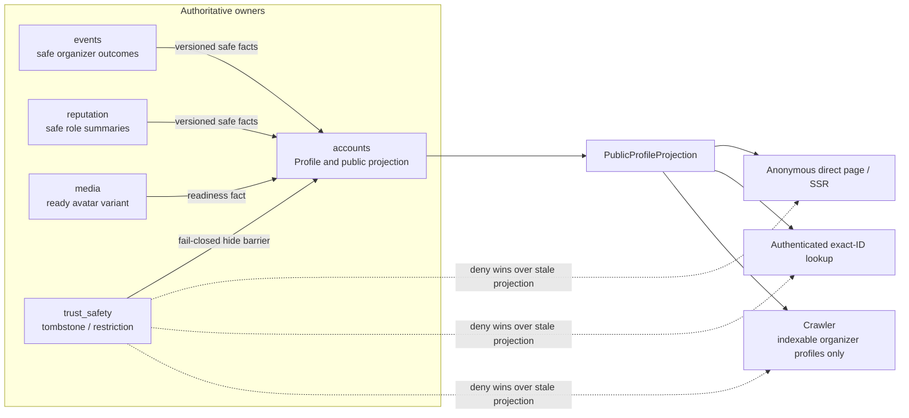

# G4.16 — Public-profile projection

## Статус, цель и границы

- Статус: `ACCEPTED`
- Горизонт: MVP/alpha
- Profile и public projection owner: модуль `accounts`
- Avatar bytes/lifecycle owner: модуль `media`
- Reputation summary owner: модуль `reputation`
- Organizer outcome owner: модуль `events`
- Safety/tombstone owner: модуль `trust_safety`
- Production code, HTTP schemas и migrations: не создаются

Документ задаёт публичную проекцию Profile, восьмизначный public ID, правила
anonymous/authenticated/crawler visibility, безопасную обработку avatar,
защиту от enumeration и fail-closed скрытие. Он не превращает публичный профиль
в каталог участников и не использует Telegram profile data.

Диаграммы поясняют потоки. Таблицы, invariants и failure semantics являются
нормативными.

## Приоритет источников

1. `PRODUCT_DECISIONS.md`;
2. `DECISIONS.md`;
3. незаменённая исходная спецификация;
4. принятые G4-документы.

Основные источники: `PD-002`, `PD-013`–`PD-016`, `ADR-011`, `ADR-016`,
`ADR-020`, G4.2, G4.4A, G4.5, G4.6 и G4.12.

## Назначение публичного профиля

Публичный Profile позволяет:

- понять, кто организует событие;
- открыть стабильную безопасную страницу по public ID;
- увидеть псевдоним, avatar, bio и публичные role-specific reputation levels;
- увидеть число успешно организованных событий и их безопасные итоговые
  карточки;
- найти конкретного пользователя по полностью введённому ID после входа.

Он не позволяет:

- узнать Telegram identity, username или phone;
- узнать выбранный город, адрес или geolocation;
- получить membership/participation history;
- построить каталог пользователей;
- искать по части ID, имени, телефону или Telegram данным;
- авторизовать действие на основании public ID;
- читать внутренний score, weights, signals, complaints или sanctions.

## Ownership и нормативные записи

| Запись/projection | Owner | Содержание | Не содержит |
|---|---|---|---|
| `Profile` | `accounts` | internal `user_id`, public ID, nickname, bio, selected avatar attachment ID, versions | Telegram claims, reputation ledger |
| `PublicProfileProjection` | `accounts` | Только allowlisted public fields и safe summaries | Participation history, private city, internal IDs |
| `AvatarAttachment` | `media` | File metadata, processing/lifecycle state, ready variant | Profile business fields |
| `OrganizerSummary` | `accounts` projection from `events` fact | Successful count и safe final cards | Participant list, protected location |
| `RoleReputationSummary` | `accounts` projection from `reputation` fact | Public status/level per role | Score, weights, raw signals |
| `ProfileSafetyTombstone` | `trust_safety` | Subject/version/hidden/safe reason class | Evidence content |

Межмодульные связи используют internal stable IDs в facts. Public response
использует только public ID и public-safe attachment/event references.

## Public ID contract

### Формат

- Ровно восемь ASCII digits.
- Диапазон `10000000`–`99999999`.
- Генерируется cryptographically secure server-side random source.
- Неизменяем на всём lifecycle Profile.
- Не содержит timestamp, shard, Telegram ID или internal `user_id`.
- Не используется как authentication credential, access token или proof of
  relationship.
- Хранится как string/validated value object, чтобы clients не выполняли
  арифметику и не меняли формат.

### Создание и collision

1. `accounts` создаёт default Profile после успешного identity resolution.
2. В owner transaction генерируется candidate.
3. PostgreSQL unique constraint является окончательной защитой collision.
4. Collision вызывает bounded retry с новым independent candidate.
5. Исчерпание retry отменяет Profile creation с internal safe error; слабый
   sequential fallback запрещён.
6. Outbox fact публикуется только после успешного commit.

Public ID нельзя менять для уклонения от жалоб или восстановления после бана.
При account erasure старый ID не назначается другому пользователю: остаётся
минимальный non-reusable tombstone/digest в рамках G4.4A.

## Default profile

После первого Telegram-входа `accounts` создаёт:

- случайный допустимый псевдоним;
- пустой bio;
- восьмизначный public ID;
- системную avatar placeholder;
- `NEW` public reputation statuses до появления достаточной выборки.

### Системная avatar placeholder

По решению владельца это единая нейтральная пустая белая заглушка, как в
обычных мессенджерах:

- один и тот же versioned asset для всех пользователей без своего avatar;
- без initials, узора, случайного цвета и персонального seed;
- не кодирует public/internal/Telegram ID;
- имеет нейтральную границу, чтобы оставаться видимой на белом фоне;
- accessible text сообщает «Аватар не установлен»;
- placeholder не хранится как отдельный per-user binary attachment.

## Public field catalogue

| Поле | Anonymous direct URL | Authenticated exact lookup | Crawler | Правило |
|---|---:|---:|---:|---|
| `public_profile_id` | Да | Да | Да, если indexable | Никогда не authorization input |
| `nickname` | Да | Да | Да, если indexable | 3–32, normalized/filtered |
| `avatar_url/ref` | Да | Да | Да, если indexable | Только current ready 256 WebP или placeholder |
| `bio` | Да | Да | Да, если indexable | До 150, safe rendered text |
| Organizer reputation status | Да | Да | Да | Level/status, без score |
| Participant reputation status | Да | Да | Да | Не доказывает участие в конкретном event |
| Successful organized count | Да | Да | Да | Final safe outcomes |
| Safe final organizer cards | Да | Да | Да | Pagination; street максимум |
| Future medals | Нет в MVP | Нет в MVP | Нет | Deferred achievements projection |

Никогда не входят:

- Telegram username/photo/phone/issuer subject;
- selected/private city;
- email, address, coordinates, IP/fingerprint;
- список или история участий;
- current event participant relation;
- chat membership;
- private trust/event-quality scores;
- complaints, moderation cases и internal restrictions;
- reputation number, weights, thresholds, signals или confidence internals;
- internal `user_id`, attachment storage path или provider metadata.

## Actor и discoverability matrix

| Actor/surface | Может открыть known direct URL | Может найти по exact ID | Может перечислять | Indexing |
|---|---:|---:|---:|---|
| Anonymous | Да, current safe projection | Нет lookup endpoint | Нет | Только indexable organizer profile |
| Authenticated user | Да | Да, exact match + rate limit | Нет | Не влияет |
| Event viewer | Только organizer link | Через общий exact lookup | Participant list отсутствует | Organizer profile может индексироваться |
| Chat participant | Видит nickname/avatar сообщения | Только общий exact lookup | Нет author directory | Chat не индексируется |
| Organizer | Те же public права | Те же lookup права | Не получает profiles участников из public API | — |
| Moderator/admin | Public projection как обычный viewer | Public lookup; private case view отдельным port | Только case-bound admin surfaces | Admin noindex |
| Crawler | Только разрешённый SSR URL | Нет | Sitemap только indexable profiles | Follow/index по gate |

Прямой URL не является секретом. Доступность страницы не раскрывает, как URL
был получен. Профиль участника никогда не появляется как связь из event
participation/waitlist/attendance. Наличие открываемого direct URL не создаёт
такой связи.

## Indexability contract

Профиль получает `indexable=true`, только если одновременно:

- account/Profile active;
- нет safety tombstone/public restriction;
- существует хотя бы одна current или safe final public organizer card;
- nickname, avatar и bio projection прошли текущие public gates;
- projection version согласована с safety barrier.

Active safe Profile без organizer projection доступен по known direct URL, но
возвращает `noindex, nofollow` и не включается в sitemap. После исчезновения
последней допустимой organizer card профиль становится `noindex`; поисковый
cache не считается security boundary, поэтому sensitive fields в indexed HTML
никогда не допускаются.

Canonical URL содержит public ID, но не nickname, Telegram data или internal
ID. OpenGraph/structured data формируются из того же allowlist, что visible
public projection.

## Visibility и lookup flow

Текстовая альтернатива: direct URL, authenticated exact lookup и organizer link
разрешаются через единый current public gate. Отсутствующий, скрытый или
запрещённый Profile даёт одинаковую not-found projection. Safe Profile
возвращается как indexable SSR только при наличии organizer projection; иначе
страница доступна с `noindex`. Participant relation не является способом
обнаружения профиля.

## Enumeration protection

### Authenticated lookup

- Только exact eight-digit match.
- Prefix, range, fuzzy, name, phone, Telegram и bulk lookup запрещены.
- Один ID на request; batch endpoint отсутствует.
- Actor identity определяется server-side.
- Per-user и coarse abuse rate limit.
- Результаты unknown, erased, hidden и caller-unavailable используют одинаковый
  safe `not_found`.
- Response time не является обещанным oracle; lookup path должен быть
  сопоставимым.
- Successful lookup не создаёт contact graph, recent-search public record или
  notification найденному пользователю.

### Anonymous direct reads

- URL допускает только canonical eight-digit segment.
- IP используется лишь как краткоживущий HMAC fingerprint по `PD-013`.
- Нет public directory, sequential pagination или public-ID sitemap для
  non-indexable profiles.
- Rate limit/abuse response не раскрывает существование ID.
- CDN cache key не смешивает `200`, tombstone и authorization variants.

### Monitoring

Допустимы агрегированные metrics:

- lookup attempts/outcome class;
- rate-limit decisions;
- unique HMAC fingerprint band;
- sequential-pattern detector outcome;
- public-gate denial reason code.

Raw query history, raw IP и список проверенных public IDs не становятся
analytics profile.

## Profile owner commands

| Capability | Caller | Guard | Owner transaction/side effects |
|---|---|---|---|
| `CreateDefaultProfile` | Identity onboarding adapter | Current internal user, no Profile | Profile + public ID + outbox |
| `ChangeNickname` | Self | 3–32, normalized/filter, 7-day cooldown, expected version | Profile update + fact/audit |
| `ChangeBio` | Self | ≤150, normalized/filter, expected version | Profile update + fact |
| `SelectAvatar` | Self | Ready owned attachment, expected version | Swap attachment ID + lifecycle fact |
| `RemoveAvatar` | Self | Current Profile | Select shared placeholder; old cleanup |
| `EraseAccountProfile` | Account lifecycle | Current erasure workflow | Hide barrier, unlink media, tombstone ID |
| `RepairPublicProjection` | Reconciliation adapter | Owner checkpoints | Idempotent projection rebuild |

Duplicate nickname is allowed. Nickname is display data, not login or unique
handle. Cooldown check belongs to `accounts`, not frontend/Redis.

## Avatar upload and processing contract

### Input limits

| Свойство | Правило MVP |
|---|---|
| Accepted formats | JPEG, PNG, still WebP after content sniff/decode |
| Rejected | SVG, animated image, archive, arbitrary URL fetch |
| Maximum upload | 10 MiB |
| Pixel/decode limits | Bounded dimensions, pixels, frames, memory and CPU |
| Crop | User-selected square crop coordinates validated server-side |
| Orientation | Apply decoded orientation before crop |
| Output | Exactly `256×256` still WebP |
| Metadata | EXIF/ICC/comments/provider metadata stripped from public output |
| Original | Never public; deleted immediately after success and no later than 24h |
| Storage | Only through `MediaStorage`; no direct filesystem URL |

Media technical readiness означает, что файл безопасно декодирован и получен
нормативный output. Content/safety moderation является отдельным gate и не
подменяется MIME/decoder checks.

### Processing lifecycle

Текстовая альтернатива: временный upload проходит bounded decode, crop,
`256×256` WebP re-encode и metadata stripping. Только Ready attachment может
атомарно стать avatar Profile. Rejected, abandoned, replaced и erased bytes
удаляются lifecycle cleanup; оригинал никогда не публикуется и живёт максимум
24 часа.

### Failure semantics

| Failure | Result |
|---|---|
| Upload invalid/oversize | Typed validation error; Profile не меняется |
| Decoder timeout/bomb | Reject, cleanup, safe metric |
| Crop invalid/outside image | Reject command; повторная загрузка/selection |
| Worker/Redis unavailable | Upload intent/outbox retained; old avatar remains |
| WebP encoding failed | Attachment не становится Ready |
| Safety hold | Public projection uses previous avatar или placeholder fail-closed |
| Selection version conflict | New attachment remains unselected until retry/cleanup |
| Cleanup delayed | File stays protected, never gains public route |
| Media read unavailable | Placeholder and safe alt text; no storage path leakage |

Недоступность processing не откатывает уже committed Profile. Новый avatar
становится видим только после readiness и текущего public gate.

## Projection composition

Текстовая альтернатива: `accounts` владеет Profile projection и получает
versioned safe organizer outcomes, reputation summaries и media readiness от
их owners. `trust_safety` hide barrier имеет приоритет над stale projection.
Одна safe projection обслуживает direct public page, authenticated exact-ID
lookup и crawler, но crawler допускается только для indexable organizers.

### Consistency

- Profile mutation и outbox fact фиксируются атомарно в `accounts`.
- Event/reputation/media facts применяются inbox-idempotently и monotonic by
  owner version.
- Ordinary new summary может быть eventual.
- Safety hide/removal устанавливает deny barrier до очистки projection.
- Missing reputation summary возвращает `NEW/UNAVAILABLE` safe state, но не
  raw/старый private score.
- Missing event summary уменьшает public list/count; не читает `events` tables
  напрямую.
- Adapters не компонуют private owner data поверх public projection.

## Public response, cache и rendering

| Surface | Cache/render rule |
|---|---|
| Indexable SSR profile | Public bounded cache by profile + projection + safety version |
| Non-indexable direct profile | Public safe response; conservative short cache/no stale-on-error |
| Authenticated lookup | Private response; public projection body, no shared user-search cache |
| Avatar output | Immutable content-addressed/versioned public variant after gate |
| Placeholder | Shared immutable asset |
| Hidden/erased/tombstone | No stale-while-revalidate; deny barrier wins |
| Admin case profile | Separate `no-store` privileged DTO and audit |

HTML, metadata, structured data, hydration и avatar alt используют один
allowlisted public DTO. Free text экранируется; пользовательский HTML запрещён.

## Lifecycle, retention и erasure

| State | Public behavior | Data behavior |
|---|---|---|
| Active | Current safe projection | Owner Profile retained |
| Temporarily restricted | Generic unavailable/not-found | Tombstone + protected owner state |
| Account deletion pending | Public deny immediately | Erasure workflow controls dependencies |
| Erased | No public page/lookup | Public ID non-reuse marker; required normalized facts only |
| Avatar replaced | New ready variant only | Previous/original delete ≤24h |
| Organizer summaries compacted | Safe final cards/count remain per policy | No copied Profile/event private data |

Search-engine removal may lag externally and is not a confidentiality control.
Поэтому indexed projection изначально содержит только fields, допустимые для
неограниченного public disclosure.

## Security и abuse cases

| Threat | Control |
|---|---|
| Sequential ID scan | Random 90M namespace, exact match, rate limits, no directory |
| BOLA through public ID | Public ID resolves only public projection; commands use server identity/internal relation |
| Participant discovery | No event membership → profile edges/list |
| Telegram correlation | Telegram data never copied to Profile |
| Stale banned profile | Fail-closed tombstone/barrier |
| Stored XSS in nickname/bio | Normalize, allowlisted plain text, output escaping |
| Malicious image | Content sniff, bounded decode, re-encode, metadata strip |
| Avatar path traversal | Attachment ID through MediaStorage, no raw path |
| Cache resurrection | Safety versioned keys, no stale-on-deny |
| Reputation leakage | Only public statuses; no score/config/signals |

## Архитектурные инварианты

| ID | Инвариант |
|---|---|
| `PRO-01` | Public ID случаен, неизменяем, не повторно назначается и не авторизует |
| `PRO-02` | Public Profile не содержит Telegram identity или private city/location |
| `PRO-03` | Participation history и participant directory отсутствуют |
| `PRO-04` | Anonymous known direct URL разрешён для current safe Profile |
| `PRO-05` | Только organizer projection делает профиль indexable |
| `PRO-06` | Lookup требует auth, exact ID и rate limit |
| `PRO-07` | System avatar — единая пустая белая placeholder без identity encoding |
| `PRO-08` | Public avatar — только ready `256×256` WebP без original/metadata |
| `PRO-09` | `accounts` владеет composed public projection |
| `PRO-10` | Safety deny имеет приоритет над stale cache/projection |
| `PRO-11` | Reputation summary не содержит score/weights/raw signals |
| `PRO-12` | Admin/private profile view не переиспользует public cache |

## Deferred scope

- achievements/medals и отдельный achievements module;
- public follower/contact graph;
- profile directory, name search и recommendations;
- multiple avatar sizes/formats;
- animated avatar и SVG;
- Telegram avatar import;
- user-selected public city;
- production implementation, migrations и concrete endpoints.

## Traceability

| Требование | Источник |
|---|---|
| Profile fields, random ID, avatar pipeline, role levels | `PD-016` |
| Private city/location/participation | `PD-002` |
| Public anonymous organizer profile и safe indexing | `PD-015`, `PD-016` |
| Request validation/rate limit/HMAC IP | `PD-013`, G4.5 |
| Avatar retention/erasure | `PD-014`, `ADR-016`, G4.4A |
| Accounts/media ownership | `ADR-011`, G4.2 |
| No Telegram profile overwrite | `ADR-020`, G4.11, G4.12 |
| Safe profile facts/projection | G4.2, G4.6, G4.7 |
| Eight-digit no-leading-zero range | владелец, G4.16 clarification 2026-07-29 |
| Anonymous known direct URL | владелец, G4.16 clarification 2026-07-29 |
| White shared system placeholder | владелец, G4.16 clarification 2026-07-29 |
| 10 MiB/static formats/user crop | владелец, G4.16 clarification 2026-07-29 |

## Acceptance checklist

- [x] Документ принят владельцем и имеет статус `ACCEPTED`.
- [x] Owner records и public projection разделены.
- [x] Random immutable eight-digit ID и collision handling заданы.
- [x] Anonymous/authenticated/crawler matrix определена.
- [x] Organizer indexing и participant non-disclosure разделены.
- [x] Exact authenticated lookup и enumeration controls описаны.
- [x] Shared blank system avatar не кодирует identity.
- [x] Safe avatar decode/crop/WebP/cleanup lifecycle задан.
- [x] Public/private fields и cache boundaries определены.
- [x] Safety hide работает fail-closed.
- [x] Facts, consistency, retention и erasure описаны.
- [x] Три Mermaid diagrams имеют текстовые альтернативы.
- [x] Встроенные Mermaid blocks должны совпасть с `.mmd`.
- [x] Нет secrets, PII examples, production domains или reputation internals.
- [x] Production code, migrations и HTTP schemas не создаются.
- [x] G4.16 checkbox и architecture changelog обновлены отдельным acceptance commit.
