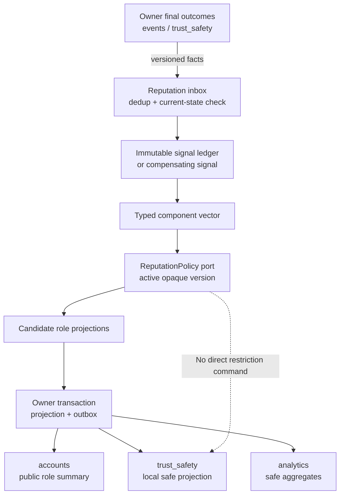
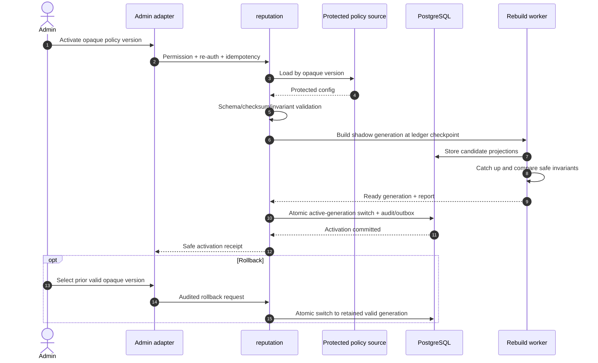
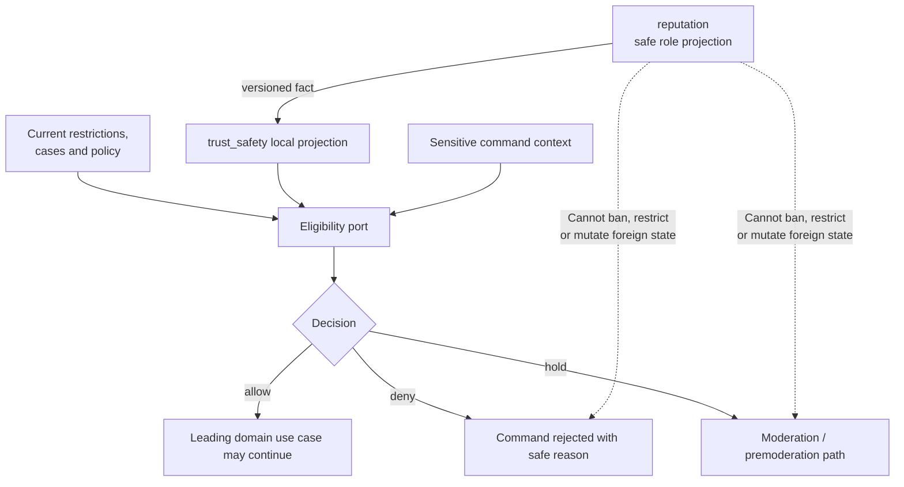

# G4.17 — ReputationPolicy port и безопасные projections

## Статус, цель и границы

- Статус: `DRAFT — ожидает подтверждения владельца`
- Горизонт: MVP/alpha
- Signal ledger, policy и projection owner: модуль `reputation`
- Final source outcomes: `events` и `trust_safety`
- Enforcement/eligibility owner: `trust_safety`
- Public profile consumer: `accounts`
- Production code, migrations и production policy: не создаются

Документ задаёт capability-level `ReputationPolicy` port, типизированный signal
и component contract, два role-specific projections, прозрачную local/test demo
policy и границу внешней production-конфигурации. Production weights,
thresholds вычислительной policy, sensitive anti-fraud rules и raw signals не
попадают в Git, API, admin UI или публичную projection.

Публичные продуктовые границы уровней из `PD-009` не являются закрытой
production-конфигурацией: они нормативны и приведены ниже. Закрыты коэффициенты
и внутренние правила, которые формируют score.

Диаграммы поясняют потоки. Таблицы, ports, invariants и failure semantics
являются нормативными.

## Приоритет источников

1. `PRODUCT_DECISIONS.md`;
2. `DECISIONS.md`;
3. незаменённая исходная спецификация;
4. принятые G4-документы.

Ключевые источники: `PD-008`, `PD-009`, `PD-013`, `PD-014`, `PD-016`,
`ADR-011`, `ADR-012`, `ADR-016`, G4.2–G4.7 и G4.16.

## Responsibility split

| Responsibility | Owner | Нормативное правило |
|---|---|---|
| Final event/attendance/rating outcome | `events` | Только final owner fact может стать reputation input |
| Final upheld/reversed safety outcome | `trust_safety` | Complaint/hold сам по себе не является penalty |
| Immutable signal ledger | `reputation` | Dedup by source outcome; correction via compensation |
| Component vector | `reputation` | Typed, rebuildable, not embedding |
| Score/role projection | `reputation` через `ReputationPolicy` | Deterministic for policy version + input checkpoint |
| Restriction/ban/hold | `trust_safety` | Reputation не применяет санкции |
| Sensitive operation decision | `trust_safety.EligibilityQueries` | Current restrictions + local safe reputation projection |
| Public profile composition | `accounts` | Получает только safe role summaries through facts |
| Production policy distribution | Deployment secret boundary | Вне repository и admin read surface |

`reputation` не вызывает другие domain modules синхронно и не пишет их schema.
Source outcomes поступают после commit через versioned facts/outbox/inbox.

## Role model

Для каждого User существуют независимые projections:

| Role | Смысл | Minimum sample до публичного уровня |
|---|---|---|
| `PARTICIPANT` | Надёжность участия и финальных attendance outcomes | 5 final participations |
| `ORGANIZER` | Надёжность организации событий | 3 successful events и 10 confirmed attendances пользователя |

Пока minimum sample не выполнен:

- participant public status — `NEW_USER`;
- organizer public status — `NEW_ORGANIZER`;
- внутренний projection может вычисляться для проверки и rebuild, но level/score
  публично не показывается;
- отсутствие sample не считается плохой репутацией;
- `NEW_*` само по себе не блокирует действие; обязательная премодерация нового
  организатора определяется `trust_safety` по `PD-008`.

## Публичные уровни

После sample gate internal materialized score `0–100` отображается только
закрытым enum:

| Internal score band | Public code | Русская подпись |
|---:|---|---|
| `0–34` | `LOW_RELIABILITY` | Низкая надёжность |
| `35–64` | `ORDINARY` | Обычная репутация |
| `65–84` | `RELIABLE` | Надёжный |
| `85–100` | `HIGH_REPUTATION` | Высокая репутация |

Число score не входит в public DTO. Границы являются product contract; они не
раскрывают production weights, decay, caps или anti-fraud rules.

## Signal acceptance

### Общие требования

Reputation signal создаётся только когда:

- producer outcome final и committed;
- fact schema/version поддерживается;
- source aggregate/outcome version актуальна;
- subject и role определены stable internal IDs;
- business dedup key ещё не принят;
- signal code находится в allowlist;
- correction представлена новым compensating fact, а не mutation history.

Provisional no-show, открытый dispute, сырая complaint, ожидание moderation,
waitlist/offer, интерес и notification delivery не изменяют reputation.

### Публичный каталог signal families

Каталог описывает семантику, но не production numeric weight.

| Family / code | Source owner | Role/component | Когда допустим |
|---|---|---|---|
| `PARTICIPATION_FINAL_ATTENDED` | `events` | Participant reliability/sample | Final successful attendance |
| `PARTICIPATION_FINAL_NO_SHOW` | `events` | Participant reliability/sample | Dispute завершён либо deadline истёк |
| `PARTICIPATION_FINAL_NEUTRAL` | `events` | Participant sample only | Moderator/owner outcome neutral |
| `PARTICIPATION_LATE_EXIT` | `events` | Participant reliability | Final late exit strictly under 3h |
| `EVENT_SUCCESSFUL` | `events` | Organizer reliability/sample | Event reached accepted successful final outcome |
| `EVENT_CANCELLED_RESPONSIBLE` | `events` | Organizer reliability | Только normalized attributable final reason |
| `EVENT_CRITICAL_CHANGE` | `events` | Organizer reliability | Final approved late/critical change category |
| `EVENT_RATING_RECORDED` | `events` | Organizer quality component | One eligible `1–5` rating; never public alone |
| `SAFETY_VIOLATION_UPHELD` | `trust_safety` | Role-neutral safety component | Final upheld serious decision |
| `SAFETY_DECISION_REVERSED` | `trust_safety` | Compensation trigger | Successful appeal/correction |
| `SOURCE_OUTCOME_CORRECTED` | Source owner | Compensation | Replaces effect of earlier immutable signal |

Signal names, source facts и normalized reason codes могут быть публично
документированы. Production coefficients, mapping of sensitive anti-fraud
signals and detection logic remain protected.

### One-source/one-event caps

- Один finalized participation episode создаёт не больше одного effective
  attendance outcome.
- Rejoin episodes не умножают итоговое влияние одного Event.
- Одна rating eligibility создаёт не больше одного rating signal.
- Один source outcome имеет один active effect; correction compensates original.
- Policy обязана ограничивать совокупное влияние одного Event.
- Организатор не оценивает своё Event.

## Typed component vector

`ComponentVector` — versioned typed input policy, а не свободный JSON и не
embedding.

| Component group | Пример безопасной семантики | Source |
|---|---|---|
| `participant_sample` | Counts final attended/no-show/neutral outcomes | Final attendance |
| `participant_reliability` | Bounded normalized positive/negative components | Attendance/late exit |
| `organizer_sample` | Successful event count + confirmed attendance prerequisite | Event/attendance |
| `organizer_reliability` | Bounded normalized event outcome components | Final event lifecycle |
| `organizer_quality` | Aggregated eligible rating components | Internal stars |
| `safety_final` | Final upheld/compensated normalized components | Trust/safety decisions |
| `recovery` | Successful sequence/elapsed-time inputs | Accepted final facts/time |

Контракт содержит:

- `subject_user_id` только внутри owner boundary;
- `role`;
- typed counters/components;
- `ledger_checkpoint`;
- `calculation_as_of`;
- source/rule schema versions;
- requested opaque policy version.

Он не содержит complaint text/evidence, moderation payload, Telegram identity,
exact location, profile free text, IP, device fingerprint или provider data.

Component vector materialized для эффективности, но immutable ledger остаётся
источником rebuild. Reconciliation сравнивает vector checkpoint с ledger.

## `ReputationPolicy` port

Conceptual protocol:

```text
evaluate(
    input: PolicyEvaluationInput,
) -> PolicyEvaluationResult | TypedPolicyError
```

### Input

| Поле | Назначение |
|---|---|
| `policy_version` | Opaque selected version |
| `role` | `PARTICIPANT` или `ORGANIZER` |
| `component_vector` | Validated typed components |
| `ledger_checkpoint` | Reproducibility/dedup checkpoint |
| `calculation_as_of` | Explicit UTC instant for decay/recovery |
| `rules_schema_version` | Compatibility fence |

### Result

| Поле | Назначение | Public? |
|---|---|---:|
| `policy_version` | Opaque version used | Safe opaque code |
| `calculation_version` | Unique reproducible calculation ID/version | Нет |
| `role` | Projection role | Да |
| `internal_score` | Clamped integer `0–100` | Нет |
| `sample_status` | `NEW`/`ESTABLISHED` | Да |
| `public_level` | Closed enum or absent when `NEW` | Да |
| `confidence_band` | Safe coarse internal projection | Только allowlisted consumer |
| `component_summary` | Typed safe/self explanation codes | Private scoped |
| `next_recalculation_at` | Time-based policy scheduling | Нет |

### Typed errors

| Error | Meaning | Failure behavior |
|---|---|---|
| `POLICY_NOT_AVAILABLE` | Requested opaque version not loaded | No new projection; old committed remains |
| `POLICY_SCHEMA_UNSUPPORTED` | Config/input incompatible | Reject activation/evaluation |
| `COMPONENT_VECTOR_INVALID` | Range/invariant failure | Dead-letter + reconciliation; no guessed result |
| `LEDGER_CHECKPOINT_STALE` | Input behind required checkpoint | Rebuild/catch-up |
| `POLICY_EVALUATION_FAILED` | Deterministic adapter failure | Preserve previous projection; alert safely |
| `CALCULATION_CONFLICT` | Concurrent newer projection committed | Retry from current state |

Port is pure with respect to domain state: it returns a value and cannot commit,
send facts, restrict user or call providers. Application service owns the
transaction.

## Projection transaction

1. Inbox adapter accepts finalized source fact and deduplicates it.
2. `reputation` validates current source outcome/checkpoint where required.
3. Owner transaction appends immutable signal or compensating signal.
4. Component vector advances to the same ledger checkpoint.
5. Application invokes active `ReputationPolicy`.
6. Result invariants and product-level band mapping are validated.
7. Projection, inbox receipt and outbox `projection_changed` commit atomically.
8. Consumers update safe local projections after commit.

Redis/Celery/Telegram failure does not roll back ledger/projection commit.
Outbox reconciliation delivers later.

## Signal-to-projection flow



Текстовая альтернатива: final owner facts проходят inbox dedup и current-state
check, после чего `reputation` добавляет immutable/compensating signal,
обновляет typed vector и вызывает активную policy. Projection и outbox
фиксируются вместе. `accounts`, `trust_safety` и analytics получают только safe
facts. Policy не отправляет restriction command.

## Demo policy

Public repository должен содержать прозрачный deterministic demo adapter для
local development, tests и architecture examples. G4.17 фиксирует его contract;
production implementation будет создана в инженерном срезе.

### Safety fence

- `policy_kind = DEMO`.
- Версия имеет явный prefix `demo-`.
- Deployment mode кроме local/test отказывается загружать demo adapter.
- Demo activation не мигрируется в production database.
- Fixtures используют synthetic users/outcomes.
- Demo coefficients не являются рекомендацией, production baseline или
  раскрытием production rules.
- Demo policy не содержит anti-fraud detection.

### Прозрачная synthetic formula

Начальный demo score каждой established role — `50`.

| Demo component | Synthetic delta |
|---|---:|
| Final attended | `+2` participant |
| Final no-show | `-8` participant |
| Final neutral | `0` |
| Late exit | `-3` participant |
| Successful event | `+4` organizer |
| Responsible cancellation | `-8` organizer |
| Critical change | `-3` organizer |
| Eligible rating | `(stars - 3) × 0.5`, organizer |
| Final upheld serious violation | `-10` bounded role effect |
| Compensating reversal | Exact inverse of referenced demo effect |

Demo rules:

- clamp each role score to `0–100`;
- cap total effect of one Event to `[-10, +10]` per role;
- duplicate source fact has zero additional effect;
- old negative demo effect decays linearly to zero over 365 days;
- successful outcomes can restore score through ordinary positive deltas;
- calculation uses explicit `calculation_as_of`;
- public level uses the normative PD-009 bands;
- sample gate uses the normative product counts above.

Эти numbers intentionally visible and simple. Production adapter may use
другую protected formula while preserving port/result/product invariants.

### Required demo fixtures

| Fixture | Expected property |
|---|---|
| No history | `NEW_*`, no public level |
| Minimum participant sample reached | Established role + correct public band |
| Duplicate final fact | Projection unchanged |
| Provisional no-show | No signal/projection effect |
| Final no-show then reversed | Compensation returns referenced effect |
| Multiple episodes one event | Per-event cap respected |
| Old violation | Effect smaller at later `calculation_as_of` |
| Score overflow/underflow | Clamped to `0/100` |
| Organizer without both sample gates | `NEW_ORGANIZER` |
| Serious violation | Reputation changes; restriction still only trust_safety |

## Production policy boundary

### Storage and loading

Production policy:

- находится вне Git и build artifact;
- предоставляется runtime через protected secret/config mount;
- имеет opaque `policy_version`, schema version и checksum;
- encrypted at rest and access-controlled by deployment environment;
- не выводится environment dump, logs, exception, telemetry или admin response;
- загружается только backend/worker policy adapter;
- не передаётся browser, API client, Celery task payload или domain fact;
- проходит strict schema/range/invariant validation.

Repository содержит public interface, validation schema без sensitive values,
demo adapter и synthetic tests. Production values подставляются deployment
boundary.

### Activation permissions

Admin с `reputation.policy.activate`:

- видит только opaque available version, compatibility state, checksum prefix,
  load/validation status и activation result;
- не читает/редактирует weights, thresholds или anti-fraud rules;
- проходит current admin session, CSRF, rate limit и action-bound re-auth;
- отправляет idempotent activate command;
- не загружает произвольный policy file через admin UI.

Protected policy version должна быть предварительно размещена отдельным
authorized deployment process.

## Shadow activation, cutover и rollback

### Activation flow



Текстовая альтернатива: admin активирует только opaque version через permission
и re-auth. `reputation` загружает protected config, проверяет schema/checksum и
строит отдельное shadow generation на ledger checkpoint. Worker догоняет новые
signals и проверяет safe invariants. Только готовая generation атомарно
становится active вместе с audit/outbox. Rollback переключает pointer на
предыдущую сохранённую valid generation без раскрытия policy contents.

### Validation gates

- schema compatibility;
- checksum matches protected manifest;
- score finite/integer and inside `0–100`;
- public enum/sample gates comply with `PD-009`;
- same input/version/as-of gives same output;
- no subject loses a projection due to adapter error;
- ledger/vector/checkpoint parity;
- compensation and per-event cap fixtures pass;
- output contains no policy internals;
- shadow completion/catch-up checkpoint recorded;
- operator sees only aggregate distribution/change bands, not hidden formula.

### Atomic cutover

Candidate projections are written under a new generation. Current public and
trust_safety consumers continue seeing the old valid active generation until:

1. snapshot rebuild completes;
2. signals after snapshot are caught up;
3. validation report passes;
4. active `(policy_version, generation, checkpoint)` pointer commits atomically.

После commit outbox emits `reputation.policy_activated` and bounded
`reputation.projection_changed`/rebuild notifications. Consumers compare
projection version and remain fail-closed where reputation is a safety input.

### Rollback

- Previous valid generation retained for bounded operational window.
- Rollback is a new audited activation, not deletion/history rewrite.
- Pointer switch is atomic and idempotent.
- Signals accepted after old checkpoint are caught up before old policy becomes
  active again.
- Projection facts republished with newer calculation/projection version.
- Restrictions already decided by `trust_safety` are not silently reversed;
  eligibility re-evaluates current owner state.

## Reputation and trust_safety separation



Текстовая альтернатива: `trust_safety` получает safe versioned reputation
projection в локальную таблицу и объединяет её со своими restrictions, cases и
policy. Только Eligibility port выдаёт allow/deny/hold ведущему use case.
`reputation` не может ban/restrict пользователя или изменить чужое состояние.

### Current decision examples

| Situation | Reputation output | `trust_safety` responsibility |
|---|---|---|
| New organizer | `NEW_ORGANIZER` | Обязательная премодерация по PD-008 |
| Low organizer level | `LOW_RELIABILITY` | Вернуть премодерацию/current hold policy |
| Upheld serious violation | Recalculated safe status | Сначала применить proportional restriction/ban |
| Successful appeal | Compensating projection | Re-evaluate, но не auto-restore expired content |
| Reputation dependency unavailable | No guessed allow | Sensitive command fail-closed/hold by eligibility policy |
| Stale local reputation projection | Version/checkpoint mismatch | Hold/deny action whose current projection is required |

Опасный account не остаётся активным только с красной public label:
enforcement выполняет `trust_safety`.

## Query contracts

### `PublicReputationQueries`

Caller: `accounts` projection adapter и public adapters через owner projection.

Result per role:

- `role`;
- `sample_status`;
- `public_level` if established;
- localized-safe label code;
- `projection_version`.

Не возвращает score, exact sample counters, confidence internals, signals,
weights, thresholds вычислительной policy, anti-fraud data или complaint info.

### `PrivateReputationQueries`

| Caller | Scope | Safe result |
|---|---|---|
| Self | Own subject | Role statuses, high-level explanation codes, recovery guidance |
| Case-bound moderator/admin | Current case + permission + audit | Safe summary relevant to case |
| `trust_safety` consumer | Internal versioned projection | Closed safe fields needed by eligibility |

Self explanation может сообщить «final no-shows affected participant
reliability» или «недостаточно завершённых событий», но не numeric delta,
weight, detection rule или identity другого пользователя.

### Commands

| Port | Caller | Idempotency | Side effects |
|---|---|---|---|
| `ReputationProjectionCommands` | Inbox/reconciliation worker | Source fact + consumer unique receipt | Ledger/vector/projection/outbox |
| `ReputationReconciliationCommands` | Worker or permissioned admin adapter | Subject/range/version key | Rebuild candidate/current projection |
| `ReputationPolicyActivationCommands` | Admin adapter | Activation request ID + target version | Shadow workflow, activation audit/fact |
| `PublicReputationQueries` | Accounts/public adapter | Read | None |
| `PrivateReputationQueries` | Self/case-bound staff adapter | Read + privileged audit where required | None |

## Consistency, concurrency и idempotency

- Ledger signal unique by source fact/outcome/effect role.
- Duplicate delivery returns existing receipt.
- Compensation references exactly one original signal and is itself immutable.
- Projection commit checks expected ledger checkpoint/calculation version.
- Concurrent signals retry from current vector; lost update forbidden.
- Policy activation and ordinary projection update use generation/checkpoint
  fencing.
- A task carries IDs/versions, not policy config or full component vector.
- Beat only schedules recalculation/reconciliation and contains no business
  rules.
- Redis is transport/cache, never score or ledger authority.

## Time, decay и scheduled recalculation

Policy receives explicit `calculation_as_of`; it must not read wall clock
implicitly. If production policy uses decay/recovery:

- result provides bounded `next_recalculation_at`;
- worker loads current ledger/vector and active policy at execution;
- stale scheduled task is skipped/rescheduled;
- recalculation commits only if checkpoint/policy/generation still current;
- missed schedule is reconciled from PostgreSQL;
- time-based change emits normal versioned projection fact;
- retention/erasure semantics remain those of owner ledger policy.

## Privacy, audit и observability

### Logs/metrics may contain

- opaque policy/calculation/projection versions;
- signal code and result class;
- counts, latency, retry/dead-letter/rebuild progress;
- aggregate public-level distribution/change bands;
- checksum prefix sufficient for operator comparison;
- trace ID and safe error code.

### Forbidden

- production config/body/weights/deltas;
- anti-fraud inputs/rules/matches;
- raw complaint/evidence;
- exact address, chat/profile free text;
- Telegram identifiers/tokens;
- per-user signal history in analytics;
- subject identity in operations-bot alert;
- secrets or protected mount path contents.

Policy activation, rollback, permission decision and manual rebuild are audited
with actor, opaque target version, outcome, time and trace. Audit не содержит
policy contents.

## Failure semantics

| Failure | Safe behavior |
|---|---|
| Source fact duplicate | Return existing receipt; no second effect |
| Source fact out of order | Hold until predecessor/current-state reconcile |
| Policy unavailable | Preserve old projection; retry/alert |
| Adapter returns invalid score | Reject candidate; old projection remains |
| Redis/Celery unavailable | PostgreSQL ledger/outbox remains; delivery later |
| Projection fact delayed | Accounts shows old safe status; safety-sensitive eligibility checks version and fails closed |
| Shadow rebuild failed | No cutover |
| Activation transaction failed | Old generation remains active |
| Rollback generation stale | Catch up before pointer switch |
| Complaint unresolved | No reputation penalty |
| Appeal reversed | Append compensation; no history mutation |
| Public query missing | Safe `NEW/UNAVAILABLE`, never raw score/config |

## Retention and erasure

- Immutable normalized reputation ledger and current projection follow `R12`
  long-lived result/aggregate semantics from G4.4A.
- Ledger references source facts by ID and does not copy private payload.
- Policy activation history stores opaque version/checksum/audit, not config.
- Rebuild generations older than active/rollback need are cleaned idempotently.
- Account erasure anonymizes subject links where safety/dispute/legal purpose no
  longer requires identity.
- Backups follow 14-day ordinary retention; removed secret/config versions are
  handled by deployment secret-store lifecycle, not database backup payload.
- Public profile projection is removed/fail-closed before asynchronous cleanup.

## Security threats and controls

| Threat | Control |
|---|---|
| User games repeated join/exit | One Event cap and final outcome dedup |
| Complaint weaponized as penalty | Only final upheld decision |
| Replay/duplicate fact | Inbox + source outcome unique key |
| Admin tunes own score | No direct edit; opaque preloaded policy only |
| Policy exfiltration | Protected mount, no admin read/log/fact/task payload |
| Demo accidentally production | `demo-` kind/runtime fence |
| Stale policy split-brain | Active generation/checkpoint fence |
| Bad rollout mass-changes levels | Shadow rebuild, invariant report, atomic cutover/rollback |
| Reputation used as ban | Only trust_safety eligibility/restrictions |
| Score exposed via profile | Closed public enum only |
| Correction rewrites evidence | Immutable compensation |

## Архитектурные инварианты

| ID | Инвариант |
|---|---|
| `REP-01` | Reputation consumes only finalized versioned owner outcomes |
| `REP-02` | Provisional no-show and complaint do not affect projection |
| `REP-03` | Ledger immutable; correction is compensating signal |
| `REP-04` | Component vector typed and rebuildable, never embedding |
| `REP-05` | Participant and organizer projections are independent |
| `REP-06` | Public response never contains numeric score or policy internals |
| `REP-07` | `ReputationPolicy` is pure and cannot restrict/mutate foreign state |
| `REP-08` | Only `trust_safety` issues allow/deny/hold and sanctions |
| `REP-09` | Production policy/config remains outside Git and admin read surface |
| `REP-10` | Demo policy cannot activate outside local/test |
| `REP-11` | Policy cutover is shadowed, validated, atomic and reversible |
| `REP-12` | One source/event cannot multiply effect through retry/rejoin |
| `REP-13` | Redis/Celery never become ledger, score or activation authority |
| `REP-14` | Successful appeal produces compensation and re-evaluation |

## Deferred scope

- Production weights, decay periods, caps and anti-fraud rules;
- final production policy values/configuration;
- ML/embedding/recommendation model;
- achievements/challenges/medals;
- public stars/average;
- manual score editing;
- Kafka transport;
- production code, migrations, endpoint schemas and deployment secret choice.

## Traceability

| Требование | Источник |
|---|---|
| Attendance, two roles, levels, sample gates, internal stars | `PD-009` |
| Premoderation/low reliability/upheld violation | `PD-008` |
| Final attendance/dispute and one-event semantics | `ADR-012`, G4.4B |
| Seven modules and trust_safety ownership | `ADR-011`, G4.2 |
| Ledger/projection/policy entities | G4.4A |
| Signal/projection/policy facts | G4.6 |
| Outbox/inbox/reconciliation | G4.7 |
| Public profile role summaries | `PD-016`, G4.16 |
| Retention/compensation/final facts | `PD-014`, `ADR-016` |
| Request/admin permission boundaries | `PD-013`, G4.3, G4.5, G4.13 |
| Demo policy with synthetic numbers | владелец, G4.17 clarification 2026-07-29 |
| External versioned secret config + shadow/rollback | владелец, G4.17 clarification 2026-07-29 |
| Reputation cannot block | владелец, `PD-008`, `ADR-011` |

## Acceptance checklist

- [x] Документ остаётся `DRAFT` до отдельного owner review.
- [x] Signal ledger, component vector, policy и projections разделены.
- [x] Final-only signals и compensation semantics определены.
- [x] Два role projections и public sample/level contract зафиксированы.
- [x] `ReputationPolicy` input/result/errors описаны.
- [x] Transparent synthetic demo policy и runtime fence заданы.
- [x] Production config остаётся вне Git/admin/facts/tasks/logs.
- [x] Shadow activation, atomic cutover и rollback определены.
- [x] Trust_safety является единственным enforcement owner.
- [x] Public/private query contracts не раскрывают internals.
- [x] Idempotency, concurrency, decay и failures описаны.
- [x] Security, retention, audit и observability boundaries заданы.
- [x] Три Mermaid diagrams имеют текстовые альтернативы.
- [x] Встроенные Mermaid blocks должны совпасть с `.mmd`.
- [x] Production code/migrations/configuration не создаются.
- [x] Нет secrets, PII examples, production domains или protected rules.
- [x] G4.17 checkbox/changelog принятия не изменены.
