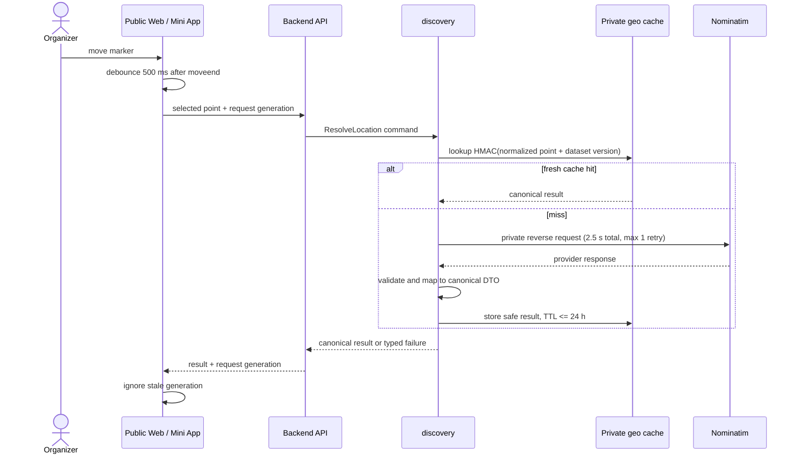
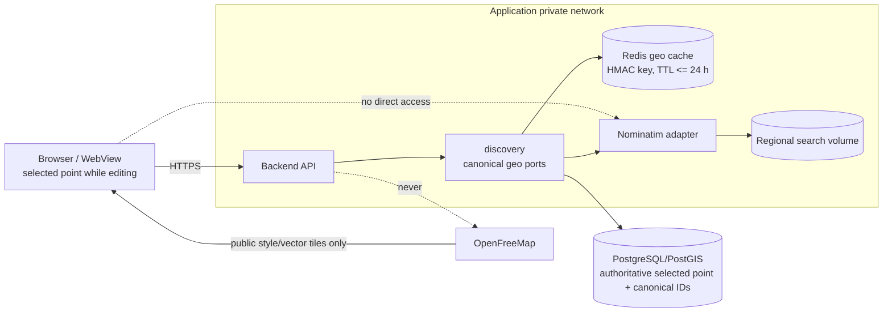
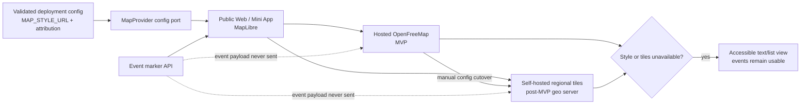

# G4.18 — Geo provider ports и canonical DTOs

## Статус, цель и границы

- Статус: `DRAFT — ожидает подтверждения владельца`
- Горизонт: MVP/alpha с совместимым post-MVP switch map tiles
- Owner canonical geo catalogue и provider adapters: `discovery`
- Owner authoritative event point и disclosure: `events`
- Production code, migrations, infrastructure и provider credentials: не создаются

Документ отделяет бизнес-модель Afisha от Nominatim/OpenFreeMap, задаёт
capability-level ports, canonical DTO, cache/privacy boundaries, failure
semantics и ручное переключение map provider. Диаграммы наглядны; таблицы,
инварианты и contracts нормативны.

## Источники и приоритет

1. [PRODUCT_DECISIONS.md](../../PRODUCT_DECISIONS.md);
2. [DECISIONS.md](../../DECISIONS.md);
3. [SOURCE_SPECIFICATION.md](../../SOURCE_SPECIFICATION.md), если требование не
   заменено PD/ADR;
4. принятые G4.1, G4.2, G4.5, G4.10, G4.14 и G4.15.

Ключевые решения: `PD-002`, `PD-013`, `PD-014`, `PD-017`, `PD-018`,
`ADR-014`, `ADR-018`, `ADR-019`.

## Responsibility split

| Responsibility | Owner | Нормативное правило |
|---|---|---|
| Selected event point | `events` | Authoritative PostGIS point; provider не может переместить его |
| Exact/street disclosure | `events` | Caller-specific projections G4.14 |
| Supported city/street catalogue | `discovery` | Stable internal IDs и versioned geometry |
| Reverse geocoding | `discovery.ReverseGeocodingProvider` | Backend-only adapter к private Nominatim |
| Canonical mapping | `discovery` | Provider response не покидает infrastructure boundary |
| Street anchor | `discovery` | G4.15, не derived from event point |
| Basemap rendering | Frontend через `MapProvider` config | Browser загружает только public style/tiles |
| Map provider selection | Deployment owner | Manual validated config change, не runtime user choice |

## Public ports

### `LocationResolutionCommands.resolve_selected_point`

| Contract | Значение |
|---|---|
| Caller | `events` leading draft use case через typed public port |
| Input | `city_id`, normalized WGS84 point, `request_generation`, locale allowlist |
| Result | `CanonicalReverseGeocodeResult` |
| Errors | `POINT_OUTSIDE_SUPPORTED_CITY`, `PROVIDER_TIMEOUT`, `PROVIDER_UNAVAILABLE`, `PROVIDER_RESPONSE_INVALID`, `ADDRESS_UNRESOLVED` |
| Consistency | Provider answer advisory; selected point remains authoritative |
| Idempotency | Same normalized point + dataset version yields equivalent canonical meaning |
| Side effects | Safe cache fill; no event state commit by `discovery` |
| Authorization | Leading `events` use case owns organizer/draft authorization |

### `ReverseGeocodingProvider.reverse`

Infrastructure protocol, callable only by `discovery.application`.

```text
reverse(
    point: ProviderQueryPoint,
    locale: SupportedLocale,
    deadline: MonotonicDeadline,
) -> ProviderReverseResult | TypedProviderError
```

- total deadline: `2.5 s`, including at most one bounded retry;
- retry only transient connection/`429`/`5xx`, never invalid input/response;
- retry uses remaining deadline and jitter; no unbounded SDK retry;
- provider call has no event ID, user ID, Telegram identity or visibility mode;
- raw response is validated under size/depth/content limits before mapping.

### `MapProviderConfiguration.get_public_map_config`

| Output | Правило |
|---|---|
| `style_url` | Validated HTTPS allowlisted endpoint, supplied by deployment config |
| `attribution` | Required provider/OSM attribution, never removable by client |
| `provider_generation` | Opaque version for cache/cutover diagnostics |
| `fallback_mode` | Always `ACCESSIBLE_LIST` for alpha |

Port has no event data and no browser credential. Forward geocoding,
autocomplete, routes and tile proxy are absent.

## Canonical DTO catalogue

### `CanonicalReverseGeocodeResult`

| Field | Rule |
|---|---|
| `resolution_id` | Internal opaque result ID; not provider place ID |
| `dataset_version` | Version of verified regional extract |
| `point_echo` | Normalized requested point; protected, owner-boundary only |
| `city_id` | Required supported canonical city |
| `street_id` | Canonical street when resolved |
| `house_label` | Optional normalized display component |
| `postcode` | Optional; exact-classified when it narrows location |
| `display_parts` | Typed safe components, not provider free-form HTML |
| `precision` | Closed enum: `HOUSE`, `STREET`, `LOCALITY`, `UNRESOLVED` |
| `resolved_at` | Server UTC instant |

Provider-specific IDs, ranking, raw JSON, SQL/class/type names and geometry are
not part of public/application DTO. UI получает только projection,
соответствующую текущему draft/edit context; сохранённое событие использует
G4.14 DTO, а не этот result напрямую.

### `ProviderReverseResult`

Живёт только в infrastructure adapter и содержит bounded provider fields,
provider dataset marker и diagnostic outcome. Raw body:

- не логируется и не попадает в traces/analytics/facts/tasks;
- не сохраняется в event schema;
- допустим только in-memory до mapping;
- при invalid response уничтожается после safe error classification.

### Cache record

| Field | Rule |
|---|---|
| Key | `HMAC(cache_key_secret, rounded_point || dataset_version || locale)` |
| Value | Canonical result without user/event IDs and without raw provider body |
| TTL | Не более `24 h` |
| Scope | Private Redis namespace, never CDN/browser/service-worker |
| Rotation | Versioned HMAC key ID; old entries expire naturally |

HMAC скрывает координату в key listing, но cache value всё равно считается
protected location data. Secret хранится вне Git; telemetry видит только
hit/miss/outcome and latency, без key/value/coordinates.

## Reverse-geocoding flow



Текстовая альтернатива: после `moveend` клиент ждёт 500 мс и отправляет
выбранную точку с generation. Backend сначала проверяет private HMAC cache,
затем при miss вызывает закрытый Nominatim в общем deadline 2,5 секунды с
максимум одним retry. Adapter валидирует и преобразует ответ в canonical DTO.
Клиент игнорирует ответ старой generation.

## Cache и privacy boundary



Текстовая альтернатива: browser общается с backend и отдельно получает только
public basemap из OpenFreeMap. Nominatim, его volume, geo cache и business DB
находятся в закрытых boundaries. Backend не отправляет event payload в
OpenFreeMap, browser не вызывает Nominatim.

## Map provider switch



Текстовая альтернатива: deployment config выбирает совместимый style URL и
attribution. MapLibre может вручную переключиться с OpenFreeMap на отдельный
self-hosted geo server без изменения event API или business logic. При
недоступности tiles карта уступает доступному списку; события не исчезают.

### Cutover gate

1. Подготовить отдельный geo server и проверенный региональный tile set.
2. Проверить style/schema compatibility, attribution, light/dark readability,
   representative cities и отсутствие event data в tile requests.
3. Выполнить shadow visual/accessibility checks и измерить disk/traffic.
4. Вручную изменить validated config и generation.
5. Выполнить smoke checks; при failure вернуть предыдущий style URL.

Автоматический failover между неизвестными providers запрещён: он может
нарушить attribution/privacy и дать труднообъяснимую карту.

## Failure semantics

| Failure | Behavior |
|---|---|
| Redis unavailable | Direct provider path в deadline; cache не business truth |
| Nominatim timeout/unavailable | Typed retryable error; selected point не сдвигается |
| House absent | Preserve point, return partial street/locality + optional short landmark flow |
| Street unresolved for hidden event | Publication fail-closed per G4.15 |
| Provider returns another city | Reject as outside supported catalogue |
| Stale UI response | Client generation fence discards it |
| Dataset updated | New dataset version invalidates logical cache and triggers anchor verification |
| Tiles/style unavailable | Accessible list/cards remain; no geocoder fallback |
| OpenFreeMap contract changes | Manual reviewed config switch; no event payload exposure |

## Security and operational rules

- Nominatim binds private network only and has resource limits/healthcheck.
- SSR/backend must not proxy arbitrary style/tile URLs.
- Config accepts HTTPS URL from deployment allowlist, not request input.
- Coordinates/provider payload do not enter log messages, metrics labels,
  analytics, operations alerts, outbox facts or Celery task arguments.
- Tasks carry stable IDs and re-read authorized PostgreSQL state.
- Exact response remains `no-store`; geo cache is resolution cache, never
  authorization cache.
- Manual OSM update has verified extract, sample checks and rollback set.
- Nominatim search index is rebuildable and not daily business backup.

## Architectural invariants

| ID | Invariant |
|---|---|
| `GEO-01` | Selected PostGIS point is authoritative |
| `GEO-02` | Provider DTO/raw response never becomes domain/public contract |
| `GEO-03` | Browser cannot reach Nominatim |
| `GEO-04` | OpenFreeMap receives style/tile requests only |
| `GEO-05` | Cache key hides coordinates via versioned HMAC; TTL <=24h |
| `GEO-06` | Cache/provider availability cannot grant disclosure |
| `GEO-07` | Hidden publication without canonical street/anchor fails closed |
| `GEO-08` | Tile provider switches by reviewed config without event API changes |
| `GEO-09` | Map outage leaves text/list discovery usable |
| `GEO-10` | Forward search, routing and autocomplete are out of MVP |

## Deferred scope

- own vector tile server implementation and operational runbook;
- CDN in front of self-hosted tiles;
- Photon/Pelias or external forward geocoder;
- address autocomplete/manual text search;
- routing/navigation/clustering;
- multi-provider automatic failover;
- scheduled Nominatim replication.

## Traceability

| Decision | Sources |
|---|---|
| Marker source of truth and two disclosure levels | `PD-002`, `PD-017`, G4.14 |
| Private location/log/cache restrictions | `PD-013`, `PD-014`, `ADR-014`, G4.5 |
| Canonical IDs/DTO and analytics safety | `PD-018`, G4.2 |
| OpenFreeMap direct public tiles | `ADR-019`, G4.1, G4.10 |
| Backend-only regional Nominatim | `ADR-018`, `ADR-019`, G4.1, G4.10 |
| Street geometry anchor/fail-closed publish | G4.15 |
| 24h HMAC cache, 2.5s/one retry, manual switch | owner clarification 2026-07-29 |

## Acceptance checklist

- [x] Документ остаётся `DRAFT` до отдельного owner review.
- [x] MapProvider и ReverseGeocodingProvider отделены от domain DTO.
- [x] Canonical DTO и typed errors определены.
- [x] Backend-only Nominatim и browser-only OpenFreeMap path зафиксированы.
- [x] HMAC cache key, protected value и TTL не более 24h заданы.
- [x] Total timeout 2.5s и максимум один retry заданы.
- [x] Manual map-provider switch и accessible list fallback описаны.
- [x] Exact/street disclosure G4.14/G4.15 не ослаблено.
- [x] Три Mermaid diagrams имеют текстовые альтернативы.
- [x] Встроенные Mermaid blocks должны совпасть с `.mmd`.
- [x] Нет secrets, PII, production domains или raw provider examples.
- [x] Production code/migrations/infrastructure не создаются.
- [x] G4.18 checkbox/changelog принятия не изменены.
