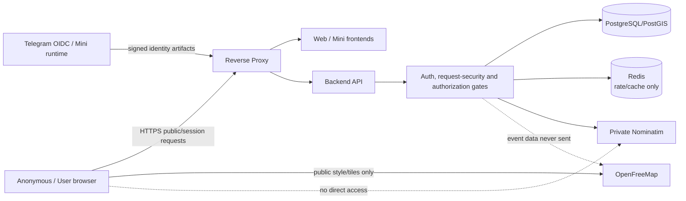
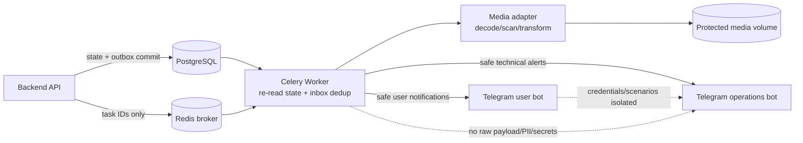
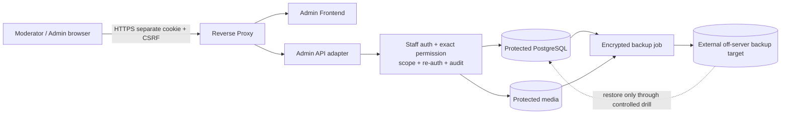
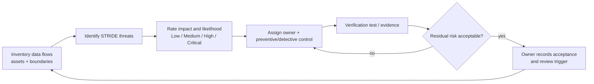

# G4.19 — Threat model, data flows и security controls

## Статус, цель и границы

- Статус: `ACCEPTED`
- Метод: architecture-level DFD + STRIDE threat catalogue
- Горизонт: MVP/alpha на одном физическом сервере
- Risk owner: владелец продукта/системы; control owner указан по boundary
- Production secrets, infrastructure и security code: не создаются

Документ моделирует потоки public/auth/location, async/media/notifications и
admin/backup, связывает существенные угрозы с preventive/detective/recovery
controls и задаёт release gates. Это не penetration-test report, не раскрытие
anti-fraud logic и не production runbook.

## Источники и приоритет

Приоритет: [PD](../../PRODUCT_DECISIONS.md) →
[ADR](../../DECISIONS.md) →
[незаменённая спецификация](../../SOURCE_SPECIFICATION.md) → принятые G4.

Основные источники: `PD-002`, `PD-013`–`PD-018`, `ADR-011`, `ADR-014`,
`ADR-015`, `ADR-018`–`ADR-020`, G4.1–G4.8 и G4.10–G4.18.

Методические ссылки:

- [OWASP Threat Modeling](https://owasp.org/www-community/Threat_Modeling);
- [OWASP ASVS](https://owasp.org/www-project-application-security-verification-standard/);
- [OWASP API Security Top 10](https://owasp.org/API-Security/).

## Assets и classification

| Asset | Classification | Primary owner | Security objective |
|---|---|---|---|
| Internal user/staff identity | Restricted | `accounts` / `trust_safety` | Confidentiality, integrity, unlinkability |
| Session/auth/replay artifacts | Secret/restricted | Identity owner | Never logged; single-use/expiry/revoke |
| Exact event point/address/landmark | Protected location | `events` | Caller-scoped disclosure, fail-closed |
| Public profile/event projections | Public-safe | Owner projection | Integrity, availability, no hidden-field bleed |
| Participation/capacity/chat access | Business restricted | `events`/`communication` | PostgreSQL authority, immediate revoke |
| Complaints/evidence/restrictions | Highly restricted | `trust_safety` | Need-to-know, audit, retention |
| Reputation ledger/policy | Restricted/protected rules | `reputation` | Integrity, non-disclosure of policy internals |
| Media originals/processed files | Restricted/public-safe by state | `media` | Safe decode, controlled access/lifecycle |
| Privileged audit | Restricted | `trust_safety` | Append-only, completeness, 90d retention |
| Backups and credentials | Secret/restricted | Operations | Encryption, off-server isolation, tested restore |

## Trust boundaries

1. Untrusted public internet/browser/WebView.
2. Public edge: reverse proxy, only `80/443`.
3. Boundary-specific frontend origins: public web, Mini App, admin.
4. Private application network: API, worker, beat, Redis, Nominatim.
5. Protected data zone: PostgreSQL/PostGIS and media volumes.
6. External providers: Telegram, OpenFreeMap, off-server backup target.
7. Operator/deployment secret boundary outside Git and ordinary admin reads.

Admin origin остаётся internet-reachable через `443` для alpha, но имеет
отдельные identity/cookie/CSRF/re-auth/permission boundaries. VPN/IP allowlist
не обязательны; их отсутствие не разрешает ослабить controls G4.13.

## DFD 1 — public, authentication и location

Текстовая альтернатива: весь пользовательский API проходит edge и server-side
auth/request/authorization gates. PostgreSQL хранит authority, Redis — только
временные rate/cache данные. Browser отдельно получает public tiles.
Nominatim закрыт; event payload не передаётся OpenFreeMap.

## DFD 2 — async, media и notifications

Текстовая альтернатива: API сначала атомарно сохраняет state/outbox. Worker
получает только IDs, дедуплицирует inbox и повторно читает актуальное состояние.
Media доступно через adapter. User и operations bots имеют разные credentials
и payload families; operations alerts не содержат PII/secrets.

## DFD 3 — admin и backups

Текстовая альтернатива: staff browser использует отдельный origin/session.
Каждое действие проходит exact permission, scope, при необходимости re-auth и
durable audit. Бизнес-БД и media резервируются зашифрованно во внешнюю
off-server цель; restore выполняется только контролируемым процессом.

## Risk method и release gate

| Rating | Meaning | Gate |
|---|---|---|
| `Critical` | Реалистичная потеря admin/identity authority, массовое раскрытие protected data или необратимая потеря business truth | Ни одного unresolved перед release |
| `High` | Существенное нарушение confidentiality/integrity/availability с реальным attack path | Обязательны owner, control, verification test и срок; открытый High блокирует затронутый feature |
| `Medium` | Ограниченный impact либо требует существенных предпосылок | Owner + planned control/deadline |
| `Low` | Малый impact и ограниченная exploitability | Track; допускается documented acceptance |

Rating учитывает impact и likelihood; значение не понижается только потому, что
alpha мала. Security/privacy violation не компенсируется product error budget.

## Threat register

| ID / STRIDE | Threat / asset | Initial | Required controls | Verification / residual target |
|---|---|---:|---|---|
| `TM-01` Spoofing | Поддельный Telegram OIDC/`initData` создаёт чужую session | Critical | Signature/JWKS, exact claims, PKCE, nonce/state/freshness/replay, server identity mapping | Negative token/replay suite; residual Low |
| `TM-02` Spoofing | User session используется как staff | Critical | Separate staff identity/origin/cookie/schema; no role elevation path | Cross-boundary tests; residual Low |
| `TM-03` Tampering | CSRF меняет event/account/admin state | High | Exact Origin, session-bound CSRF, SameSite defense-in-depth | Origin/CSRF matrix; Low |
| `TM-04` Tampering | Duplicate/reordered command corrupts capacity/waitlist | High | Idempotency, owner lock/version, PostgreSQL transaction | Concurrency/property tests; Low |
| `TM-05` Repudiation | Staff action без доказуемого audit | High | Audit decision in owner transaction, append-only, 90d | Failure-injection/audit completeness; Low |
| `TM-06` Disclosure | Exact point попадает в street DTO/cache/log/SEO | Critical | Separate types/routes, no-store, deny barrier, field allowlists | Serialization/cache/log tests; Low |
| `TM-07` Disclosure | OpenFreeMap/Nominatim получает лишние event/user fields | High | Browser tiles-only; backend provider DTO with point only; network policy | Egress/request capture test; Low |
| `TM-08` Disclosure | Telegram operations alert содержит PII/secret | High | Closed safe alert DTO, redaction, separate bot | Snapshot/schema tests; Low |
| `TM-09` Disclosure | Backup украден | Critical | Client-side encryption, separate credential, off-server access control | Restore/decrypt drill + denied plaintext checks; Low |
| `TM-10` DoS | Oversized JSON/media/decompression bomb | High | Edge/body/pixel/decode/time limits, isolated worker | Adversarial fixtures/load test; Medium |
| `TM-11` DoS | Nominatim/media work starves API on one server | High | Resource limits, deadlines, queue, disk headroom, health gates | Soak/resource-pressure test; Medium |
| `TM-12` Elevation | BOLA/permission bypass via guessed ID | Critical | Server actor, owner query, exact permission/scope/object/state guard | Authorization matrix; Low |
| `TM-13` Elevation | Stale admin permission/session remains usable | High | PostgreSQL current version, immediate revoke, no positive Redis authority | Revocation race tests; Low |
| `TM-14` Tampering | Queue payload changes business outcome after commit | High | IDs only, inbox dedup, re-read owner state, outbox | Replay/stale task tests; Low |
| `TM-15` Disclosure | Malicious media causes stored XSS/metadata leak | High | Safe decode/re-encode, strip EXIF, controlled content headers, no direct original | Polyglot/XSS/EXIF suite; Low |
| `TM-16` SSRF | Arbitrary provider/media URL reaches internal network | High | No URL upload; allowlisted deployment endpoints; no request-derived provider URL | SSRF negative tests; Low |
| `TM-17` Info disclosure | Enumeration of public IDs/profiles | Medium | Random public ID, exact lookup, rate limits, generic miss | Rate/enumeration tests; Low |
| `TM-18` Tampering | Production reputation policy/config leaked or modified | High | Secret mount, schema/signature/hash/version fence, shadow/cutover audit | Invalid-config/rollback tests; Low |
| `TM-19` DoS/data loss | Disk full breaks DB/media/backups | Critical | Disk threshold alert, bounded logs, reserve/headroom, fail-safe writes | Fill-disk drill; Medium |
| `TM-20` Supply chain | Compromised dependency/image/CI artifact | High | Lock/digest pinning, dependency scan, provenance, least-privilege CI | CI gates/SBOM review; Medium |

`Medium` residual означает явный owner monitoring/response и не освобождает от
control. Exact thresholds/secrets/anti-fraud signals не публикуются.

## Control catalogue

### Identity and sessions

- Telegram identity отделена от immutable internal `user_id`.
- Raw tokens/cookies/passwords/CSRF/initData не хранятся и не логируются.
- Session records authoritative в PostgreSQL; Redis failure не grants access.
- Purpose-separated HMAC/AEAD keys versioned and rotated.
- Generic authentication errors and durable rate gates resist enumeration.

### Authorization and transactions

- Default deny; actor derived only server-side.
- Один handler → один leading owner use case → одна owner transaction.
- Cross-module IDs не дают permission; current object/state guards обязательны.
- Safety hiding fail-closed; chat access проверяется синхронно без eventual
  revoke window.
- External delivery follows commit через outbox/inbox.

### Location and privacy

- Exact/street DTO физически разделены; exact `no-store`.
- No application encryption for exact coordinates: protection обеспечивают
  TLS, disk/backup encryption, DB/schema permissions, access control и audit
  согласно `ADR-014`.
- Nominatim private/backend-only; OpenFreeMap gets public tiles only.
- HMAC geo-cache key and 24h TTL не являются authorization mechanism.

### Media, notifications and admin

- Media проходит bounded decode/re-encode; originals never public.
- User/operations bots do not share credentials or scenarios.
- Admin mutation requires separate session, CSRF, exact permission and audit;
  sensitive action additionally re-auth.
- Operations bot sends alerts only; no admin commands/control plane.

### Infrastructure and recovery

- Only reverse proxy exposes `80/443`; database/Redis/Nominatim/media private.
- Secrets outside Git/images/logs; separate least-privilege credentials.
- Encrypted off-server backups and verified restore under G4.10.
- Log rotation and disk alert prevent unbounded storage consumption.

## Threat-control lifecycle

Текстовая альтернатива: для каждого flow сначала определяются assets/boundaries,
затем STRIDE threats и rating. Threat получает owner, controls и проверяемое
доказательство. Неприемлемый residual risk возвращается на усиление controls;
принятый риск документируется и пересматривается при trigger.

## Verification strategy

Обязательны перед соответствующим vertical slice:

- auth/session/replay/CSRF/origin negative suites;
- permission × scope × object/state matrix;
- exact/street serialization, cache, SEO and notification non-disclosure;
- concurrency/idempotency/outbox/inbox replay tests;
- malicious media corpus and resource-limit tests;
- provider/Telegram egress payload capture;
- backup encryption/restore and disk-pressure drill;
- dependency/secret/SAST/container scans;
- safe telemetry test: no tokens, PII, exact location or policy internals.

Review triggers: new external provider, new data class, new public/admin route,
own tile server, multi-server migration, security incident, dependency with
material attack-surface change or accepted PD/ADR supersession.

## Architectural invariants

1. Ни один `Critical` risk не остаётся unresolved перед release.
2. `High` имеет owner/control/test/deadline и блокирует affected feature пока
   обязательный control отсутствует.
3. PostgreSQL остаётся authority для identity, permissions и business state.
4. Redis/queue/provider outage не превращается в authorization allow.
5. Hidden location отсутствует, а не маскируется null-полями.
6. Admin и user identities/sessions/cookies не пересекаются.
7. Operations bot не является control plane.
8. Security audit failure prevents privileged mutation.
9. Secrets/PII/raw provider payloads не входят в Git/logs/metrics/traces.
10. Защитное решение fail-closed не подменяется доступностью UX.

## Deferred scope

- penetration test и production incident runbooks;
- WAF/vendor DDoS service;
- mandatory VPN/IP allowlist/MFA;
- hardware KMS/HSM;
- multi-region disaster recovery;
- own tile server threat delta;
- exact anti-fraud rules and production thresholds.

## Traceability

| Area | Sources |
|---|---|
| Data minimization/retention/audit | `PD-013`, `PD-014`, `ADR-016`, G4.4 |
| Staff roles/permissions/admin auth | `PD-013`, `ADR-011`, G4.3, G4.13 |
| Request/auth/session security | `PD-015`, `ADR-020`, G4.5, G4.11, G4.12 |
| Location/provider privacy | `PD-002`, `PD-017`, `ADR-014`, `ADR-019`, G4.14, G4.18 |
| Transaction/outbox/async | `PD-012`, `PD-018`, `ADR-015`, G4.6–G4.8 |
| Deployment/backups/private network | `PD-014`, `ADR-018`, G4.10 |
| Media/profile/reputation | `PD-016`, `ADR-011`, G4.16, G4.17 |
| Risk scale/admin exposure/no app-layer location encryption | owner clarification 2026-07-29 |

## Acceptance checklist

- [x] Документ принят владельцем и имеет статус `ACCEPTED`.
- [x] Assets, classifications и trust boundaries каталогизированы.
- [x] Три DFD имеют текстовые альтернативы.
- [x] STRIDE threat register содержит risk/control/test/residual target.
- [x] Critical/High release gates заданы.
- [x] Auth, location, media, async, admin и backup flows покрыты.
- [x] Fail-closed authorization/safety semantics сохранены.
- [x] Admin internet exposure и alpha controls явно зафиксированы.
- [x] No application-layer encryption decision не ослабляет access controls.
- [x] Четыре встроенных Mermaid blocks должны совпасть с `.mmd`.
- [x] Нет secrets, PII, production domains, weights или anti-fraud rules.
- [x] Production code/infrastructure/pentest не создаются.
- [x] G4.19 checkbox и architecture changelog обновлены отдельным acceptance commit.
