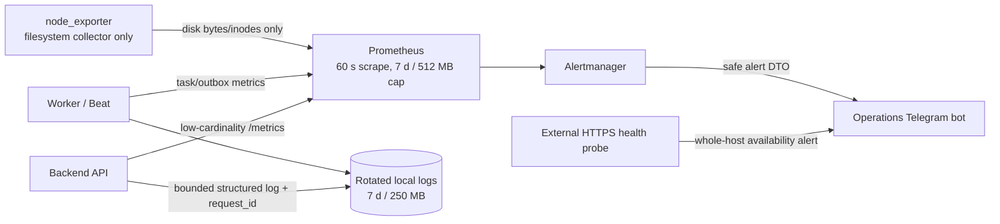
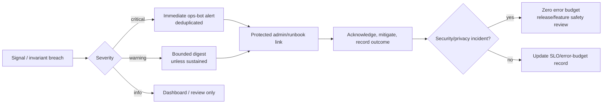
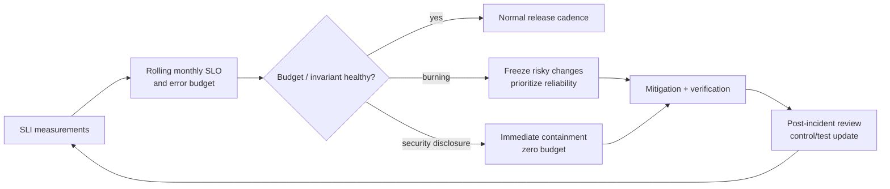

# G4.20 — Observability, SLO, RPO и RTO

## Статус, цель и границы

- Статус: `ACCEPTED`
- Горизонт: MVP/alpha на одном physical server
- Цель: минимальная low-overhead наблюдаемость приложения, диска и recovery
- Alert channel: отдельный Telegram operations bot
- Production monitoring stack/configuration/code: не создаются

Документ задаёт service-level indicators/objectives, простой monitoring
baseline, bounded retention, alert routing, error-budget semantics и связь с
backup RPO/RTO. Он намеренно не вводит тяжёлую observability-платформу.

## Источники и приоритет

Приоритет: [PD](../../PRODUCT_DECISIONS.md) →
[ADR](../../DECISIONS.md) →
[незаменённая спецификация](../../SOURCE_SPECIFICATION.md) → принятые G4.

Ключевые источники: `PD-012`–`PD-014`, `PD-018`, `ADR-015`, `ADR-016`,
`ADR-018`, G4.6–G4.10, G4.13, G4.14 и G4.19.

## Подтверждённый alpha baseline

| Component | Назначение | Ограничение нагрузки |
|---|---|---|
| Prometheus | Scrape low-cardinality application/worker/disk metrics; basic private query UI | Interval `60 s`; retention `7 d`; local data cap `512 MB` |
| node_exporter | Только filesystem bytes/inodes/mount availability | Все collectors кроме filesystem/textfile allowlist отключены |
| Alertmanager | Dedup/group/routing safe alerts в operations bot | No PII/payload/secrets; bounded repeat intervals |
| Rotated local logs | Debug по `request_id`, startup/error/security outcomes | Без Loki/Alloy; жёсткие time+size caps |
| External HTTPS probe | Замечает полное падение host/edge, когда local monitoring тоже недоступен | Один safe health endpoint; не собирает system metrics |

Для alpha не устанавливаются Grafana, Loki, Jaeger, Grafana Alloy, cAdvisor и
полный system monitoring CPU/RAM/network/process. Distributed traces не
сохраняются: используется server-generated `request_id` и safe correlation
между API/outbox/task. Это снижает CPU, disk I/O и операционную сложность.

Prometheus/node_exporter/Alertmanager находятся в private operations network;
наружу их ports не публикуются. Basic Prometheus UI при необходимости доступен
только через защищённый operator/admin route, не public internet.

## Signal flow

Текстовая альтернатива: Prometheus раз в минуту получает только метрики API,
worker и заполнения filesystem. API/worker пишут ограниченные локальные логи с
request ID. Alertmanager отправляет безопасные alerts operations bot. Отдельный
внешний HTTPS probe замечает полное падение сервера.

## SLI и SLO

Окно availability/latency SLO — rolling calendar month. Плановые технические
работы считаются недоступностью, если пользовательский endpoint реально
недоступен; это не позволяет улучшать SLO исключением неудобных периодов.

| Service class | SLI | Alpha SLO |
|---|---|---|
| Public/user API | Good server-handled requests / eligible requests | `>= 99.5%` monthly |
| Admin/background | Successful eligible admin operations and due workflows / total | `>= 99.0%` monthly |
| Public reads | Server duration p95, без OpenFreeMap tile latency | `<= 800 ms` |
| Business commands | Server duration p95 for completed owner outcome | `<= 1.5 s` |
| Authentication | Afisha-controlled duration p95 | `<= 2 s`, external Telegram wait excluded and reported separately |
| Reverse geocoding | Backend resolution duration p95 | `<= 2.5 s` |
| Outbox delivery | Committed eligible item reaches terminal delivery/deferred state | Objective and backlog age reported; external Telegram outage separate |
| Safety/privacy | Unauthorized disclosure or privileged mutation without audit | `0`; no error budget |
| Recovery | Last recoverable authoritative state / restore service | `RPO <=24 h`, `RTO <=24 h` |

### Eligible request rules

Не считаются server failures: schema-invalid request, failed authentication,
authorization deny, domain conflict, client cancellation and provider failure
explicitly represented by typed contract. Считаются failures: unhandled `5xx`,
deadline breach under Afisha control, wrong safe projection, dropped committed
workflow, inability to persist required audit and incorrect success response.

Low-traffic percentiles показываются вместе с sample count; при недостаточной
выборке решение принимается по individual failures, synthetic checks и
scenario tests, а не по красивому проценту.

## Metrics catalogue

Labels используют только closed low-cardinality enums. Запрещены user/staff/
event IDs, URL paths вместо route templates, coordinates, street/free text,
exception message, Telegram fields, media filename и idempotency key.

| Metric family | Safe dimensions | Purpose |
|---|---|---|
| HTTP requests/duration | route template, method class, outcome code, actor class | Availability/latency SLI |
| Owner commands | module, use-case code, outcome | Business failure/conflict trends |
| Outbox/inbox | fact family, state, age bucket | Stuck delivery/reconciliation |
| Celery tasks | task family, terminal outcome, age bucket | Queue health without payload |
| Telegram delivery | bot class, safe outcome | User/ops provider health |
| Geo provider | cache hit/miss, safe outcome, latency bucket | Nominatim health |
| Media workflow | stage, safe outcome | Decode/process lifecycle |
| Safety barriers | barrier code, allow/deny/error | Fail-closed invariant |
| Disk | approved mount class, bytes/inodes free percentage | Capacity alert only |
| Backup | last success age, artifact verification outcome | RPO risk |

## Disk-only host monitoring

node_exporter exports filesystem collector only for explicitly allowlisted
application/data/media/backup-temp mounts. It does not collect CPU, RAM,
network, process, hardware or per-container metrics.

Initial operational thresholds:

| Level | Condition | Action |
|---|---|---|
| Warning | Free bytes or inodes `<30%` sustained 15m | Digest; inspect growth and next backup/import |
| Critical | Free bytes or inodes `<15%` sustained 5m | Immediate alert; stop non-essential imports/media batch |
| Emergency | Free bytes or inodes `<10%` | Immediate containment; preserve PostgreSQL and audit writes |
| Backup risk | Last verified authoritative backup older than 24h | Immediate RPO alert |

Thresholds are reviewed after soak measurements. Cleanup never silently deletes
authoritative state, privileged audit before retention or current media.

## Logs, audit and storage budget

| Record | Retention | Hard local cap / rule |
|---|---:|---|
| Application technical logs | `7 d` | `250 MB`; rotation by age and size |
| Security detection logs | `14 d` | `250 MB`; closed codes, no credential/network raw values |
| Distributed traces | Не сохраняются | `0`; request ID only |
| Prometheus metrics | `7 d` | `512 MB`; time/size limit, whichever first |
| Privileged/admin audit | `90 d` | PostgreSQL compact records; not log files and not subject to 250 MB rotation |

Privileged audit остаётся 90 дней по `PD-014` и G4.13: это компактные
нормализованные записи действия/решения, а не verbose request logs. Он не
содержит password/token/CSRF, exact location payload, evidence body, raw IP/
User-Agent или свободный exception text. Его рост измеряется отдельным bounded
count/bytes query; неожиданное увеличение создаёт warning.

Если локальный hard cap достигается раньше срока для technical/security logs,
rotation удаляет старейшие файлы и создаёт disk-pressure metric. Audit
PostgreSQL таким способом не удаляется.

## Health endpoints

| Endpoint class | Meaning | Exposure |
|---|---|---|
| Liveness | Process event loop отвечает; без deep dependency fan-out | Private/orchestrator |
| Readiness | API может принять запрос и mandatory config loaded | Edge routing/internal |
| Public synthetic health | Safe minimal edge response, no version/dependency detail | External probe |
| Dependency metrics | DB/Redis/Telegram/Nominatim safe outcome separately | Private Prometheus |

Health endpoint не возвращает secrets, dependency URLs, build paths, database
names, queue depth payloads or stack traces. Redis/Telegram outage не делает
PostgreSQL business commit false; readiness отражает только реальную
способность обслужить соответствующий route class.

## Alert routing

Текстовая альтернатива: critical alerts идут сразу, warnings агрегируются,
info остаётся для просмотра. Сообщение ведёт только на защищённую панель/
runbook. После mitigation результат фиксируется; security/privacy incident
имеет нулевой error budget.

Operations bot:

- отдельные credentials и chat allowlist от user bot;
- только исходящие alerts, без admin commands;
- payload: severity, closed alert code, environment class, first/last seen,
  safe count/band, correlation ID и protected link;
- no PII, exact location, event text, exception/SQL, token, URL credential,
  reputation internals or production secret;
- grouping/dedup/silence ограничены временем; critical recovery сообщает
  resolved.

## Error budget и incident loop

Текстовая альтернатива: SLI формируют monthly SLO/error budget. Нормальный
budget допускает обычные releases; быстрый burn приостанавливает рискованные
изменения. Security disclosure немедленно изолируется. После исправления
обновляются control/test и измерение.

## RPO/RTO и recovery evidence

- Authoritative PostgreSQL и required media входят в encrypted off-server
  backup flow G4.10.
- Alpha: restore point ежедневно, `RPO <=24h`, `RTO <=24h`.
- Backup success не равен recoverability: проверяются artifact existence,
  integrity/decryption metadata и scheduled restore drill.
- Redis, Celery transport и Nominatim index не authoritative; они
  rebuild/reconcile from DB/outbox or verified extract.
- Recovery dashboard: last successful/verified backup age, last restore drill
  outcome/duration and unresolved recovery exceptions.

## Failure semantics

| Failure | Behavior |
|---|---|
| Prometheus unavailable | Business service continues; alert gap recorded after recovery/external probe |
| Alertmanager/Telegram unavailable | No business rollback; local alert state persists for retry |
| node_exporter unavailable | Monitoring alert; no guessed disk value |
| Logs hit cap | Rotate oldest technical logs; preserve business DB/audit |
| Metrics hit cap | Oldest samples expire; cardinality incident investigated |
| Whole host down | External probe alerts independently |
| Operations bot compromised | Revoke its isolated credential; user bot unaffected |
| Disk emergency | Stop non-essential workload; protect PostgreSQL/audit and verify backup |

## Architectural invariants

1. Observability не является business truth и не влияет на authorization.
2. Metrics/logs/alerts не содержат secrets, PII, exact location or payloads.
3. Monitoring consumes bounded CPU/disk by sparse scrape, low cardinality and
   hard retention caps.
4. Host monitoring ограничено filesystem capacity.
5. User и operations bots не разделяют credentials/scenarios.
6. Security/privacy breach has zero error budget.
7. Redis/Telegram/monitoring outage не откатывает PostgreSQL transaction.
8. Privileged audit 90d отделён от 7/14-day technical logs.
9. No public monitoring ports or production domains in this document.
10. RPO/RTO подтверждаются restore evidence, а не только backup job success.

## Deferred scope

- Grafana dashboards, Loki, Alloy, Jaeger/distributed tracing, cAdvisor;
- full CPU/RAM/network/process/container monitoring;
- centralized log cluster and long-term metrics;
- on-call rotation/paging vendor;
- multi-server/multi-region SLO split;
- automatic remediation.

## Traceability

| Area | Sources |
|---|---|
| PostgreSQL authority/async failure | `PD-012`, `ADR-015`, G4.6–G4.8 |
| Retention/audit separation | `PD-014`, `ADR-016`, G4.4, G4.13 |
| Safe analytics/metrics | `PD-018`, G4.4 |
| Operations bot routing | G4.8, G4.19 |
| Backup/RPO/RTO | `ADR-018`, G4.10 |
| Exact-location telemetry exclusion | `PD-017`, `ADR-014`, G4.14 |
| SLO values and minimal monitoring/retention | owner clarification 2026-07-29 |

## Acceptance checklist

- [x] Документ принят владельцем и имеет статус `ACCEPTED`.
- [x] SLI/SLO и eligible request rules заданы.
- [x] Public/user 99.5%, admin/background 99.0% закреплены.
- [x] Latency objectives и zero-budget safety заданы.
- [x] RPO/RTO <=24h связаны с restore evidence.
- [x] Minimal Prometheus/filesystem-only/Alertmanager stack описан.
- [x] Grafana/Loki/Jaeger/Alloy/cAdvisor исключены из alpha.
- [x] Logs/metrics имеют короткие сроки и hard size caps.
- [x] Privileged audit остаётся compact PostgreSQL record на 90d.
- [x] Safe operations-bot alert DTO и external whole-host probe заданы.
- [x] Три Mermaid diagrams имеют текстовые альтернативы.
- [x] Встроенные Mermaid blocks должны совпасть с `.mmd`.
- [x] Нет secrets, PII, production domains или sensitive rules.
- [x] Production monitoring/config/code не создаются.
- [x] G4.20 checkbox и architecture changelog обновлены отдельным acceptance commit.
