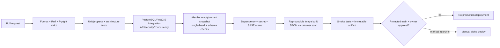
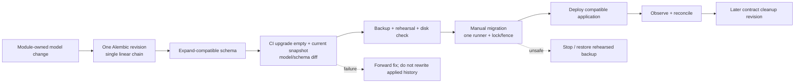
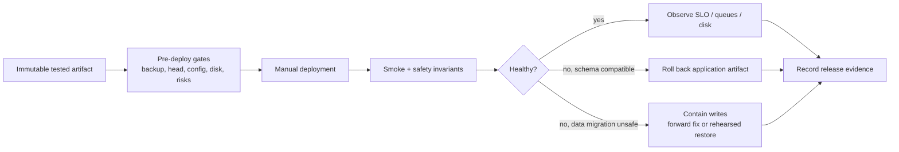

# G4.21 — CI/CD, migrations и Definition of Done

## Статус, цель и границы

- Статус: `DRAFT — ожидает подтверждения владельца`
- CI provider: GitHub Actions
- Migration tool: Alembic, одна линейная revision chain
- Alpha production deployment: только manual owner approval/trigger
- Production workflows, migrations, code и infrastructure: не создаются

Документ задаёт нормативные quality/security/release gates, module-owned
migration discipline, deploy/rollback semantics и Definition of Done для
будущих vertical slices. Реальные `.github/workflows`, Alembic environment,
Docker/Compose и project skeleton создаются в G6 после полного G4/G5 approval.

## Источники и приоритет

Приоритет: [PD](../../PRODUCT_DECISIONS.md) →
[ADR](../../DECISIONS.md) →
[незаменённая спецификация](../../SOURCE_SPECIFICATION.md) → принятые G4.

Ключевые источники: `PD-012`–`PD-014`, `PD-018`, `ADR-010`, `ADR-015`,
`ADR-016`, `ADR-018`, G4.2–G4.10 и G4.19–G4.20.

## Branch, artifact и environment rules

| Area | Rule |
|---|---|
| Change entry | Pull request from short-lived branch; reviewed diff and linked plan/ADR |
| Protected branch | `main`; direct unreviewed production release forbidden |
| CI authority | Required checks must succeed on exact commit |
| Artifact | Build once from exact commit; immutable digest promoted, not rebuilt for deploy |
| Environment | Alpha secrets/approvals live in protected GitHub environment or deployment secret boundary |
| Deploy | No automatic production deployment; owner manually approves/triggers after gates |
| Concurrency | One production deployment/migration at a time |
| Rollback | Previous immutable compatible artifact retained; DB action follows migration plan |
| Evidence | Commit, checks, artifact digest/SBOM, migration head, approval, smoke and outcome |

PR from fork/untrusted context never receives production/environment secrets.
Workflow permissions are explicitly least-privilege; third-party actions are
pinned to immutable commit SHA and reviewed.

## CI/CD pipeline

Текстовая альтернатива: pull request проходит format/lint/strict typing, unit
и architecture tests, PostGIS integration/security/concurrency, Alembic
upgrade/schema checks, security scans, reproducible image/SBOM/container scan
и smoke. Только immutable artifact с protected main может быть вручную
развёрнут владельцем; без approval deployment отсутствует.

## Required CI gates

### Static and architecture

1. Deterministic dependency install from committed lock.
2. Formatting check without modifying CI workspace.
3. Ruff lint.
4. Pyright `strict` for `src` and tests with documented narrow exceptions.
5. Architecture import rules:
   - only other module `public` package may be imported;
   - no foreign ORM/schema/infrastructure imports;
   - synchronous edges exactly match G4.2 DAG;
   - shared kernel contains no domain policies;
   - adapters/Beat/analytics do not own business rules.

### Tests

| Suite | Mandatory evidence |
|---|---|
| Unit/property | Value objects, guards, normalization, state-machine transitions |
| Integration | PostgreSQL/PostGIS constraints, transactions, locks, owner schema |
| API contract | Strict validation, typed errors, pagination, idempotency/version conflict |
| Permission/security | BOLA/IDOR, CSRF/origin/session/replay, admin re-auth/audit |
| Concurrency | Capacity, waitlist, duplicate commands/facts/tasks and state races |
| Privacy | Exact/street serializers/cache/SEO/log/notification provider egress |
| Adapter | Telegram/Nominatim/media timeout, malformed/oversized response and retry |
| Migration | Empty DB and supported current snapshot upgrade; single head; schema diff |
| Recovery | Crash-after-commit, outbox/inbox reconcile and restore drill evidence |
| Smoke | Health, public safe read, auth boundary and no public internal ports |

### Coverage policy

- measured application source coverage: overall line coverage `>=85%`;
- pull request must not reduce baseline coverage;
- generated code/migrations excluded only by documented config;
- percentage не заменяет scenario coverage;
- auth, permission, exact-location, state transitions, concurrency, reputation
  signals/policy activation and audit failure require named positive/negative
  scenario tests regardless of overall percentage.

Mutation/property tests применяются к наиболее рискованным guards по мере
реализации; их отсутствие не маскируется дополнительными trivial tests.

### Security and supply chain

| Gate | Blocking rule |
|---|---|
| Secret scan | Any verified credential/secret blocks immediately |
| Dependency audit | Applicable `Critical` or `High` blocks release |
| SAST | Applicable `Critical` or `High` blocks affected feature/release |
| Container scan | Applicable runtime `Critical` or `High` blocks |
| Medium finding | Document owner, applicability, mitigation/deadline |
| False positive | Evidence and reviewer approval; never silently ignored |
| SBOM | Generated for immutable release artifact |
| Image/action pinning | Immutable digest/SHA; floating production tag/action forbidden |

Waiver для Critical/High требует отдельного owner security decision that
supersedes default gate; обычный PR reviewer не может скрыто его выдать.

## Current repository gaps delegated to G6

Этот документ намеренно не исправляет существующий skeleton. G6 должен:

- исправить pytest coverage target с `my_project` на `afishabot` и добавить
  `pytest-cov`;
- переключить Pyright `standard` → `strict`;
- зафиксировать runtime/dev dependencies and lock;
- создать module/application skeleton и architecture tests;
- добавить PostgreSQL/PostGIS/Redis/Celery integration environment;
- реализовать GitHub Actions stages, image build/SBOM/scans.

До этих исправлений текущий repository не удовлетворяет Definition of Done для
production slice; это известный pre-G6 state, не CI exception.

## Migration ownership и repository layout

Семь module schemas сохраняют owner из G4.2/G4.4. Alembic использует один
общий environment и одну линейную chain, чтобы deployment имел ровно один
однозначный head.

| Rule | Normative behavior |
|---|---|
| Revision owner | Metadata/header содержит module/schema owner |
| One revision | Изменяет только owner schema; shared technical change имеет явно назначенного owner |
| Heads | Ровно один head; multiple heads/merge revisions запрещены обычным CI |
| Ordering | Cross-module rollout координируется последовательными revisions, не branching chain |
| Foreign objects | No cross-schema FK/JOIN/view/trigger/ORM relationship |
| History | Applied revision immutable; ошибка исправляется новой forward revision |
| Transaction | Transactional DDL where supported; non-transactional step explicit/rehearsed |
| Lock | One migration runner + advisory/deployment fence |
| Data | Bounded, resumable/idempotent backfill; no unbounded ORM loop |

Module-owned revision не означает семь Alembic heads. Ownership относится к
изменяемой schema, а linear chain — к общему порядку deployment.

## Migration lifecycle

Текстовая альтернатива: model change получает одну module-owned revision в
linear chain. Сначала выполняется backward-compatible expand, затем CI upgrade
empty/current snapshots и diff. Перед manual migration проверяются backup,
rehearsal и disk. Compatible app разворачивается и наблюдается; destructive
contract cleanup выполняется позже. Applied history не переписывается.

### Expand/contract discipline

1. Expand: nullable/new table/index/compatible enum strategy.
2. Deploy dual-compatible reader/writer when required.
3. Backfill bounded chunks by stable cursor with progress/checkpoint.
4. Verify counts, invariants, owner projections/outbox and disk/time.
5. Switch read path behind version/feature gate.
6. After rollback window, separate contract revision removes legacy field.

Adding non-null without safe default/backfill, renaming/dropping used column in
same release, table rewrite without rehearsal, destructive enum change and
business side effects inside migration are prohibited.

### Migration tests

- `upgrade head` from empty DB;
- upgrade from supported current production snapshot;
- exactly one head and no missing revision;
- downgrade is syntax-tested only where genuinely safe; documented
  forward-fix/restore plan is primary;
- SQL/model/schema diff contains only expected owner objects;
- PostgreSQL/PostGIS extension/version preconditions;
- backfill idempotency/restart and representative volume timing;
- no cross-schema object/import;
- post-upgrade smoke and integrity/reconciliation queries.

No production data/PII is committed as fixture. Sanitized synthetic snapshots
must preserve structural edge cases.

## Deployment gates

Before manual alpha deploy:

1. Exact commit on protected `main`; all required checks green.
2. Immutable scanned artifact, SBOM and config schema compatible.
3. No unresolved applicable Critical/High security or G4.19 risk.
4. Single expected migration head; migration/backfill plan reviewed.
5. Last verified backup within RPO; restore/rehearsal evidence current.
6. Disk free/inodes satisfy G4.20 margin for migration + rollback.
7. Secrets/config mounted, not printed; rotations do not mix bot boundaries.
8. Maintenance/owner communication and rollback decision point defined.
9. One deploy/migration lease acquired.

## Release and rollback

Текстовая альтернатива: tested artifact проходит backup/head/config/disk/risk
gates, затем manual deploy и smoke/safety checks. При compatible schema
возвращается прошлый artifact. При unsafe data change сначала ограничиваются
writes, затем выполняется reviewed forward fix или rehearsed restore. Итог
фиксируется.

`alembic downgrade` не является универсальным rollback: после записей новым
кодом он может потерять данные. Решение выбирается до deploy:

- app rollback при backward-compatible expand;
- feature flag/deny barrier для функционального containment;
- forward-fix revision для исправляемой schema;
- restore only для rehearsed destructive/data-corruption case с явной потерей
  не старше RPO и owner approval.

## Definition of Ready

Slice допускается к реализации, если:

- linked accepted PD/ADR/G4 and clear owner module/ports;
- acceptance criteria, threat delta, data classification/retention;
- migration/feature-flag/rollback plan where applicable;
- test matrix and observability signals;
- unresolved questions/risk owners explicit;
- no hidden cross-module schema/runtime dependency.

## Definition of Done

### Code and architecture

- typed public/application/domain boundaries preserved;
- one owner transaction and outbox semantics implemented;
- no foreign ORM/schema/internal imports;
- errors/idempotency/authorization/failure semantics match G4;
- production config/secrets outside repository.

### Data and migration

- owner migration in single chain; empty/current upgrade passes;
- constraints/indexes/retention/cleanup and reconciliation covered;
- no cross-schema DB object;
- backfill bounded/restartable; backup/rollback plan verified.

### Quality and security

- format/Ruff/Pyright strict pass;
- all required test classes pass; overall coverage >=85% and not decreased;
- critical named scenarios pass;
- applicable Critical/High findings absent; Medium tracked;
- secret/PII/exact-location/reputation-internal telemetry checks pass.

### Operations and delivery

- SLI/alerts/log rotation/disk impact documented and tested;
- runbook/operations safe alert codes updated;
- immutable artifact/SBOM/smoke evidence exists;
- documentation/plan/changelog updated only for actually accepted decisions;
- owner manually approves deployment; post-deploy checks and rollback window
  complete.

## Architectural invariants

1. CI green on a different commit cannot authorize current artifact.
2. Production deployment is never automatic in alpha.
3. Build once; promote immutable artifact.
4. One Alembic head and one migration runner.
5. Each revision changes only its owner schema.
6. Applied migration history is immutable.
7. Coverage percentage cannot replace critical scenario tests.
8. Applicable Critical/High vulnerability blocks by default.
9. Migration failure never triggers blind destructive downgrade.
10. G4.21 does not implement G6 engineering changes.

## Deferred scope

- actual GitHub Actions YAML and protected environment setup;
- Alembic environment/revisions and DB snapshots;
- Dockerfiles/Compose, registry signing/provenance implementation;
- automatic canary/blue-green deployment;
- multi-server rolling migrations;
- production release/on-call runbook.

## Traceability

| Area | Sources |
|---|---|
| Module/schema ownership/import DAG | `ADR-010`, G4.2, G4.4 |
| Owner transaction/outbox/reconciliation | `ADR-015`, G4.6, G4.7 |
| Retention/migration/backups | `PD-014`, `ADR-016`, `ADR-018`, G4.4, G4.10 |
| Threat/security gates | `PD-013`, G4.5, G4.19 |
| SLO/disk/recovery gates | G4.20 |
| GitHub Actions/manual deploy/single chain/coverage/security policy | owner clarification 2026-07-29 |
| Engineering implementation deferred to G6 | `IMPLEMENTATION_PLAN.md` G6 |

## Acceptance checklist

- [x] Документ остаётся `DRAFT` до отдельного owner review.
- [x] GitHub Actions logical pipeline and protected artifact flow заданы.
- [x] Production deploy manual-only.
- [x] One Alembic linear chain/single head and module schema ownership совместимы.
- [x] Expand/contract, backfill, rehearsal and rollback semantics описаны.
- [x] Overall coverage >=85%, no decrease и critical scenario tests заданы.
- [x] Critical/High vulnerability gates и Medium handling заданы.
- [x] Definition of Ready/Done охватывает architecture/data/security/operations.
- [x] Current pyproject gaps явно delegated to G6, не исправлены здесь.
- [x] Три Mermaid diagrams имеют текстовые альтернативы.
- [x] Встроенные Mermaid blocks должны совпасть с `.mmd`.
- [x] Нет secrets, PII, production domains or real production data.
- [x] Workflows/migrations/code/infrastructure не создаются.
- [x] G4.21 checkbox/changelog принятия не изменены.
